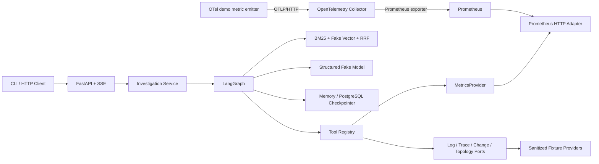

# IncidentCopilot

IncidentCopilot 是一个面向 AI 应用开发岗位面试与作品集展示的多源可观测性故障诊断项目。项目使用 LangGraph 编排有界调查循环，把日志、指标、Trace、变更、拓扑和内部知识统一为可引用 Evidence，并通过 FastAPI、SSE、checkpoint 与人工审核暴露完整调查生命周期。

默认模式无需 API Key、Docker 或网络；可选 Compose 演示把 payment 场景的 synthetic
OpenTelemetry 指标经 OTLP/HTTP 发送到 Collector，由 Prometheus 抓取，再通过真实
`MetricsProvider` 进入同一个 LangGraph。除 metrics 外，其余观测源仍使用脱敏 Fixture，
模型和 embedding 默认仍是确定性 Fake。

## 能力状态

| 状态 | 当前边界 |
| --- | --- |
| **Current** | 调用方提交自然语言故障描述、单个 primary service 和带时区时间窗；Fixture/Fake 默认调查、FastAPI/SSE/HITL、内存任务事件仓储、Memory/PostgreSQL checkpoint |
| **Current（窄场景）** | Prometheus 只验证 payment/database-pool synthetic demo；不代表 checkout DNS 或 inventory cache 的 live 覆盖 |
| **Experimental** | `PgVectorStore` 只有参数化 SQL Adapter 与 recording fake 合同测试；不接入默认 RAG/Compose 链路 |
| **Target** | raw-query 自动解析、真实 LLM/Embedding、完整多服务联合调查、持久 Investigation/Event/Evidence Store、生产鉴权与分布式执行 |

当前 API **不会**从 raw query 自动推断 service 或 time window；只提交描述会返回 422，
而不是猜测调查范围。

## 能力概览

- 七个只读调查工具，共用 Provider Protocol、参数校验、deadline、重试和预算边界。
- BM25 + Fake Vector + RRF 的离线 Hybrid RAG，支持 query rewrite、metadata filter、去重和 citation。
- LangGraph `Send` 并行取证、稳定 reducer、最大轮数/工具/模型/Token/deadline 停止条件。
- Pydantic 结构化模型输出、Provider/模型失败降级和只引用 Evidence ID 的报告。
- 调查任务 API、SSE、PostgreSQL checkpoint 与高风险修复建议的 interrupt/resume。
- 三个已知根因样例的离线 Evaluation，输出逐样例原始结果和 JSON/Markdown 汇总。
- Prometheus HTTP API 真实适配器与 OTLP → Collector → Prometheus → LangGraph 容器演示。

## 架构



完整组件边界见 [docs/ARCHITECTURE.md](docs/ARCHITECTURE.md)，当前源码 Graph 见 [docs/GRAPH_CURRENT.md](docs/GRAPH_CURRENT.md)。

## 环境要求

- Python 3.11–3.13
- [uv](https://docs.astral.sh/uv/)
- 可选：Docker Desktop 与 Docker Compose v2，用于真实 metrics 和 PostgreSQL 演示

## 快速开始：完全离线

```text
uv sync
uv run pytest
uv run uvicorn incident_copilot.main:app --reload
```

服务启动后访问：

```text
http://127.0.0.1:8000/health
http://127.0.0.1:8000/docs
```

`/health` 不访问数据库、网络或付费 API。另开终端可运行完整离线调查：

```text
uv run python scripts/run_investigation.py
```

## 一键真实可观测性演示

下面的命令构建项目镜像，启动 OpenTelemetry Collector、Prometheus 和指标发生器，并在
`demo` 容器中执行一次 payment-only 混合数据源调查：

```text
docker compose --profile demo up --build --abort-on-container-exit --exit-code-from demo demo
```

成功输出必须包含：

- `status: ok`
- `telemetry_path: OTLP HTTP -> OpenTelemetry Collector -> Prometheus -> Provider -> LangGraph`
- 非空 `prometheus_probe_evidence_ids` 与 `graph_prometheus_evidence_ids`
- `stop_reason: evidence_sufficient`

演示指标是明确标记的 synthetic incident signal；“真实”指它确实通过 OTLP、Collector、Prometheus HTTP API 和 Provider 契约，不表示来自生产业务。清理命令：

```text
docker compose --profile demo down -v --remove-orphans
```

## 完整 API、Checkpoint 与人工审核演示

```text
docker compose up -d --build api
uv run python scripts/run_api_demo.py --live-window
```

脚本会创建调查、读取 SSE、等待高风险建议暂停、提交 `accept` 并输出完成报告。真实 metrics 链路成功时，`prometheus_citation_count` 大于 0。Compose 中 PostgreSQL 绑定 `127.0.0.1:55432`，避免与常见本机 `5432` 冲突。

```text
docker compose --profile demo down -v --remove-orphans
```

更完整的演示步骤、故障场景和排错方式见 [docs/DEMO_GUIDE.md](docs/DEMO_GUIDE.md)。

## 调查工具

payment-service 基准场景位于 `data/incidents/payment-service-pool-exhaustion.json`。工具包括：

- `search_logs`
- `query_metrics`
- `query_traces`
- `get_service_topology`
- `get_recent_changes`
- `search_runbooks`
- `search_similar_incidents`

工具输入使用严格 Pydantic Schema。Registry 统一执行 allow-list、服务/时间/结果数限制、deadline、有限重试、调用预算和错误归一化。Prometheus Adapter 不接收任意 PromQL，而是把受支持的领域指标和聚合映射为固定模板。

## RAG

知识库使用带 TOML frontmatter 的 Markdown：

```text
DocumentLoader → heading-aware splitter → Fake Embedding + BM25
               → vector search → RRF → content-hash dedupe → citation
```

```text
uv run python scripts/ingest_knowledge.py
uv run python scripts/search_knowledge.py --query "database connection pool timeout" --service payment-service --top-k 3
```

Fake Embedding 只验证确定性管线，不代表在线 embedding 的语义质量。`PgVectorStore` 标为
**Experimental**：它只有参数化 SQL Adapter 与 recording fake 合同测试，默认 RAG 和
Compose 均使用内存索引，不能描述成 live pgvector 集成。

## LangGraph 与 API

Graph 通过动态 `Send` 并行收集证据，并用稳定 Evidence ID reducer 合并。研究轮数、工具调用、模型调用、估算 Token 和总 deadline 都由代码控制；LLM 只返回结构化计划、假设、充分性判断和报告草稿，不能决定任意代码路径。

API 提供：

- `POST /api/v1/investigations`
- `GET /api/v1/investigations/{id}`
- `GET /api/v1/investigations/{id}/events`
- `POST /api/v1/investigations/{id}/resume`

创建请求中的 `query` 是自然语言描述；`services` 当前必须恰好包含一个调用方提供的
primary service，`start_time/end_time` 必须由调用方提供且带时区。`parse_incident` 是
可信 Graph 边界校验节点，不是自然语言字段抽取器。

高风险 remediation 在最终确认前调用 LangGraph `interrupt()`。`thread_id` 关联 checkpoint；当前任务元数据和 SSE 历史仍是进程内 Repository，这一点不应描述成完整高可用持久化。

## 离线 Evaluation

```text
uv run python -m scripts.evaluate_offline --output-dir artifacts/evaluation/manual
```

Evaluation 覆盖服务定位、故障类型、Recall@K、MRR、工具选择与参数、Evidence relevance、
三层 Citation 验证、根因词法准确率、调查轮数、工具次数、wall-clock 和估算 Token。
质量均值只聚合 completed 且指标已定义的样例；失败样例单独计数，不会自动按零进入所有
均值。数据集只有三个同仓脱敏样例，结果不能外推为生产准确率或性能基准。完整分母见
[docs/EVALUATION.md](docs/EVALUATION.md)。

## 质量门禁

```text
uv lock --check
uv run ruff format --check .
uv run ruff check .
uv run mypy src tests scripts
uv run pytest
uv run python scripts/render_graph.py --check docs/GRAPH_CURRENT.md
uv run python scripts/build_learning_guide.py --check
```

默认测试不会访问真实付费 API，也不要求 Compose 正在运行。Prometheus Adapter 测试通过注入 fake HTTP transport 覆盖成功、空结果、参数错误、超时、限流、不可用和畸形响应。

## 已知生产化缺口

- 默认 Fake Model/Fake Embedding 不代表真实模型诊断质量。
- 仅 payment 场景 metrics 接入真实 Prometheus；DNS/cache live mapping、Loki、Tempo 和
  官方 OpenTelemetry Demo 语义映射未实现。
- Investigation/SSE Repository 未持久化，后台任务仍是进程内 `asyncio.Task`。
- 没有鉴权、租户隔离、分布式 worker、外部 Evidence Store、数据库 HA 或负载基准。
- Compose 凭据只用于 localhost 演示，生产必须使用 secret manager、TLS 和最小权限。

## 文档

- [中文教学版完整文档](docs/learning/INCIDENT_COPILOT_LEARNING_GUIDE.md)
- [产品需求](docs/PRD.md)
- [总体架构](docs/ARCHITECTURE.md)
- [Graph 设计](docs/GRAPH_DESIGN.md)
- [当前源码 Graph](docs/GRAPH_CURRENT.md)
- [数据模型](docs/DATA_MODEL.md)
- [Evaluation](docs/EVALUATION.md)
- [演示指南](docs/DEMO_GUIDE.md)
- [面试指南](docs/INTERVIEW_GUIDE.md)
- [路线图](docs/ROADMAP.md)
- [实际进度](docs/PROGRESS.md)
