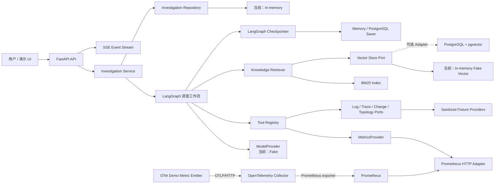

# IncidentCopilot 总体架构

## 1. 架构原则

1. **离线优先**：fixture 模式是完整产品路径，不是绕过业务逻辑的测试捷径。
2. **端口隔离**：Graph 只面向 Provider、Retriever、Model 和 Repository 契约。
3. **证据优先**：LLM 提出与解释假设，事实由带来源的结构化证据承载。
4. **有界自治**：任何循环、工具和模型调用都受显式预算限制。
5. **可恢复**：节点尽量幂等，外部副作用与 checkpoint 边界清晰。
6. **渐进复杂度**：当前只引入能支持验收、测试或替换点的抽象。

## 2. 系统上下文与组件



### 2.1 组件职责

| 组件 | 职责 | 禁止承担 |
| --- | --- | --- |
| API | HTTP/SSE 协议、校验、错误映射、依赖装配 | 根因推理、直接查询数据源 |
| Investigation Service | 启动/恢复图、管理 thread、读取状态/报告 | Provider 细节、Prompt 拼装 |
| LangGraph | 控制流、State、循环、并行、HITL | 存放无界原始证据 |
| ModelProvider | 结构化模型调用、用量返回、厂商隔离 | 业务路由决定 |
| Tool Registry | 工具发现、策略、超时、统计、错误归一化 | 具体厂商查询语法泄漏到图中 |
| Providers | 把统一查询翻译为数据源操作 | 生成根因结论 |
| Retriever | Query rewrite、混合检索、去重、过滤、引用 | Graph 路由 |
| Repository | 领域对象持久化与映射 | API Schema 或 Prompt 逻辑 |
| Checkpointer | 保存可恢复的执行状态 | 代替业务报告存储 |

## 3. 数据流与控制流

### 3.1 数据流

1. API 将输入验证为请求 Schema，生成 `incident_id` 与 `thread_id`。
2. Graph 解析出 `IncidentContext`，计划节点产生有界 `InvestigationStep`。
3. 调度节点用 `Send` 为本轮查询建立并行任务；各 Tool 只返回结构化 `Evidence`。
4. 原始 payload 写入 Evidence Repository/object storage 抽象；State 仅累积 ID 与短摘要。
5. 聚合器归一化、去重、排序、截断，构造给模型的 Evidence Packet。
6. 模型输出经 Pydantic 校验后成为 `Hypothesis`；验证器将双向证据附到假设。
7. 路由器依据充分性与预算进入下一轮或报告节点。
8. 报告、统计和引用被持久化；API 返回快照并通过 SSE 发送进度事件。

### 3.2 控制流

控制流由 Graph 决定，不由模型自由选择任意代码路径。LLM 可以提出调查步骤和查询意图，但路由器会执行白名单、参数边界和预算校验。完整图见 [`GRAPH_DESIGN.md`](GRAPH_DESIGN.md)。

## 4. 端口与适配器

概念端口保持窄接口；具体签名在实现 Phase 定稿：

| 端口 | 输入 | 输出 |
| --- | --- | --- |
| `LogProvider.search` | 服务、时间范围、模式、limit | 日志类 Evidence 列表 |
| `MetricsProvider.query` | 服务、时间范围、指标/聚合 | 指标类 Evidence 列表 |
| `TraceProvider.query` | 服务、时间范围、过滤条件 | Trace 类 Evidence 列表 |
| `ChangeProvider.recent` | 服务集合、时间范围 | 变更类 Evidence 列表 |
| `TopologyProvider.get` | 服务集合、深度限制 | 拓扑类 Evidence 列表 |
| `KnowledgeRetriever.search` | 查询、top_k、metadata filter | 知识类 Evidence 列表 |
| `ModelProvider.structured` | 任务、受限上下文、输出 Schema | 已校验对象 + usage |
| `InvestigationRepository` | 领域对象/ID | 持久化对象 |

所有 Provider 统一接受 `QueryContext`，包含 correlation ID、调用 deadline 和剩余预算；统一抛出可分类异常：`InvalidQuery`、`Unavailable`、`Timeout`、`RateLimited`、`MalformedResponse`。

### 4.1 Phase 7 已实现的真实 Metrics 路径

```text
OTel SDK demo emitter
  → OTLP/HTTP receiver
  → OpenTelemetry Collector prometheus exporter
  → Prometheus scrape + /api/v1/query_range
  → PrometheusMetricsProvider
  → query_metrics
  → EvidenceRef / IncidentReport citation
```

`PrometheusMetricsProvider` 只接受现有 `QueryMetricsInput`。领域指标经固定 mapping 生成 PromQL，调用方不能传入任意表达式；Adapter 限制 HTTP timeout、响应字节、序列数量和每序列样本数，并拒绝非有限数值。HTTP 400/422、429、超时、不可用和畸形响应被转换为统一 Provider 异常。

当前混合运行模式只替换 metrics 端口。日志、Trace、变更和拓扑继续使用 Fixture，知识查询继续使用 Phase 3 RAG。显式选择 Prometheus 后发生失败时，Graph 记录 coverage gap 并继续其他分支，不会暗中返回 Fixture metrics。

## 5. RAG 架构

### 5.1 写入链路

`DocumentLoader → normalizer → semantic splitter → metadata validator → deterministic/real embedding → vector store + BM25 index`

文档以内容 hash 保证幂等。Chunk 保留 `document_id`、标题、类型、服务、版本、时间、路径/URL、段落定位和父文档引用。

### 5.2 查询链路

`query rewrite → metadata filter → BM25 + vector parallel search → reciprocal rank fusion → content-hash dedupe → optional rerank → context compression → citation-preserving result`

Phase 3 默认使用确定性 Fake Embedding 和内存向量/BM25 实现；pgvector 是同一 `VectorStore` 端口的目标适配器。Fake Embedding 只验证数据链路与确定性，不代表语义质量。

## 6. 持久化与运行模式

| 模式 | Provider | Model | Vector/DB | 用途 |
| --- | --- | --- | --- | --- |
| `fixture`（默认） | 本地 JSON/JSONL | Fake Model | 内存/本地测试实现 | 单测、演示、CI |
| `docker` | Prometheus metrics + 其余 Fixture | Fake Model | PostgreSQL checkpoint + 内存 RAG | 集成演示、HITL |
| `external` | 可配置 Prometheus endpoint | Fake Model | 外部 PostgreSQL saver | 受限 Adapter 示例 |

当前 PostgreSQL 只由 LangGraph checkpointer 使用。事故任务元数据、幂等键和 SSE 历史仍由 `InMemoryInvestigationRepository` 保存；pgvector Adapter 存在但默认 RAG 没有切到 PostgreSQL。Redis、持久化 Investigation/Event Repository 和外部 Evidence Store 尚未实现。

## 7. 可靠性、预算与降级

### 7.1 预算层级

- 每调查最大研究轮数，默认建议 3。
- 每调查最多 14 个逻辑工具步骤、28 次物理 Provider 尝试；retry 消耗 attempt，
  不重复计算 logical step。
- 每调查最大模型 Token 预算，由 Provider 统一计量。
- 调查总 deadline 与单节点/单工具 timeout。
- 每查询最大时间窗口、服务数、top_k 与返回字节数。

预算值在 Phase 4 用设置项配置并测试，不写死在节点内。路由顺序是：取消/总 deadline → 工具/Token 预算 → 充分性 → 研究轮数。

### 7.2 失败策略

- 参数错误：不重试，记录错误并请求修正计划。
- 超时/限流/临时不可用：指数退避加抖动，最多有限重试，且不得越过 deadline。
- 数据格式错误：保留脱敏响应摘要，转换为错误，不把脏数据传给模型。
- 单 Provider 失败：其它并行分支继续；聚合器记录 coverage gap。
- 模型结构输出失败：有限修复重试，失败后使用规则降级或产生“不充分”报告。
- checkpoint 后重放：节点使用确定性 ID 或幂等写，避免重复证据和重复计费统计。

## 8. 安全与隐私边界

- MVP 所有诊断工具只读；不提供命令执行或自动修复工具。
- 服务、环境、时间范围、查询表达式模板、结果量均校验；真实 Adapter 使用最小权限凭据。
- Prompt 不直接拼接未转义工具指令；知识内容视为不可信数据并与系统指令隔离。
- 结构化日志默认脱敏 token、密码、支付字段、个人信息；fixture 不含真实客户数据。
- 原始证据与报告设独立保留策略；API 不默认回传完整原始 payload。
- 人工审核意见同样进行 Schema、长度和命令边界校验。

## 9. 可观测性

每次调查携带 `incident_id`、`thread_id`、`run_id`；每次节点/工具携带 `span_id`。记录：

- 节点开始/结束/路由、时延、重试和错误类别；
- 工具名、经过脱敏的参数摘要、结果数和数据时间范围；
- 模型任务类型、模型 Provider、输入/输出 Token 和校验重试；
- 当前轮次、证据覆盖、预算余额、checkpoint 与 interrupt；
- 不记录 API Key、完整 Prompt、未脱敏原始日志。

OpenTelemetry 与 LangSmith 都是可选 exporter；关闭时核心功能不受影响。

## 10. 技术选型与版本策略

### 10.1 2026-07-18 核验基线

| 技术 | 规划范围 | 理由 |
| --- | --- | --- |
| Python | `>=3.11,<3.14` | 满足需求并覆盖本机 3.13；先避开生态对 3.14 的潜在滞后 |
| LangGraph | `>=1.2,<1.3` | Graph API 提供 reducer、`Send`、`Command`、interrupt 和 persistence |
| LangChain | `>=1.3,<1.4` | 模型/消息集成；领域与图不依赖其高层 Agent 封装 |
| FastAPI | `>=0.139,<0.140` | Pydantic v2 API 与异步 HTTP/SSE 基础 |
| Pydantic | `>=2.13,<2.14` | 统一领域边界和不可信结构输出校验 |
| SQLAlchemy | `>=2.0,<2.1` | 选择稳定 2.0 线，避开 2.1 预发布线 |
| Psycopg | `>=3.3,<3.4` | PostgreSQL 异步/连接池驱动 |
| PostgreSQL | 18.x | 当前稳定主版本；同时承载关系数据和向量 |
| pgvector | 0.8.x | 支持 PostgreSQL 18 与 HNSW/过滤检索 |

核验依据：PyPI 的 [LangGraph](https://pypi.org/project/langgraph/)、[LangChain](https://pypi.org/project/langchain/)、[FastAPI](https://pypi.org/project/fastapi/)、[Pydantic](https://pypi.org/project/pydantic/)、[SQLAlchemy](https://pypi.org/project/SQLAlchemy/) 与 [Psycopg](https://pypi.org/project/psycopg/) 发布页，以及 PostgreSQL [当前文档](https://www.postgresql.org/docs/) 和 pgvector [changelog](https://github.com/pgvector/pgvector/blob/master/CHANGELOG.md)。

这只是 Phase 0 的解析输入，不是声称已经安装验证。Phase 1 应创建 `pyproject.toml`，由 uv 解析传递依赖、生成并提交 `uv.lock`，运行导入烟测和完整质量门禁。uv 官方说明锁文件保存精确解析版本且应提交版本控制，见 [项目布局](https://docs.astral.sh/uv/concepts/projects/layout/) 与 [锁定和同步](https://docs.astral.sh/uv/concepts/projects/sync/)。

### 10.2 主要取舍

- 选择 LangGraph Graph API 而非自由工具调用 Agent：调查循环、并行和停止条件更易测试与讲解。
- 选择 Pydantic 领域模型 + TypedDict State：领域不变量与图更新语义分别清晰。
- 选择 PostgreSQL + pgvector：减少演示基础设施数量；BM25 仍由独立端口实现。
- Redis 暂定可选：只有在 Phase 5 的 SSE 跨进程或任务协调确有需要时才成为必需。
- 不在第一版引入消息队列/Celery：LangGraph persistence 与应用任务层足够支持作品集规模。
- SSE 优于 WebSocket：进度主要是服务端单向发送，协议和演示更简单。

## 11. 计划目录结构

目录按实现出现的 Phase 渐进创建，不在 Phase 0 制造空占位文件：

```text
incident-copilot/
├── AGENTS.md
├── README.md                         # Phase 1 初版，Phase 7 完善
├── pyproject.toml                    # Phase 1
├── uv.lock                           # Phase 1，由 uv 生成
├── .env.example                      # Phase 1
├── docker-compose.yml                # Phase 7
├── Makefile                          # Phase 1，可移植命令别名
├── alembic.ini                       # 首次数据库持久化阶段
├── src/incident_copilot/
│   ├── main.py
│   ├── api/{dependencies.py,routes/,schemas.py}
│   ├── core/{config.py,logging.py,exceptions.py,model_factory.py}
│   ├── domain/{incident.py,evidence.py,hypothesis.py,report.py}
│   ├── graph/{state.py,builder.py,routes.py,prompts.py,nodes/}
│   ├── tools/{schemas.py,registry.py,interfaces.py,providers/}
│   ├── rag/{schemas.py,ingestion.py,splitter.py,embeddings.py,
│   │        vector_store.py,bm25.py,retrieval.py,reranker.py}
│   ├── persistence/{database.py,models.py,repositories.py}
│   └── evaluation/{dataset.py,evaluators.py,runner.py}
├── data/{incidents,logs,metrics,traces,changes,topology,knowledge}/
├── tests/{unit,integration,graph,evaluation}/
├── scripts/{seed_data.py,ingest_knowledge.py,run_demo.py,run_evaluation.py}
├── migrations/                       # Alembic migrations
└── docs/{PRD.md,ARCHITECTURE.md,GRAPH_DESIGN.md,DATA_MODEL.md,
          EVALUATION.md,ROADMAP.md,PROGRESS.md,INTERVIEW_GUIDE.md}
```

相对建议结构的调整：增加 `data/topology/` 以免拓扑 fixture 混入其它类型；增加 `migrations/` 作为标准 Alembic 脚本位置；README 在 Phase 1 先提供开发入口、Phase 7 再完成作品集内容。其余保持建议边界，避免过早拆包。

## 12. 架构决策记录候选

后续遇到以下变化时应新增轻量 ADR，而不是悄悄改设计：Graph State/子图共享策略、checkpointer 后端、Redis 是否成为必需、真实 Provider 首选、默认模型策略、向量维度或融合算法变更。
