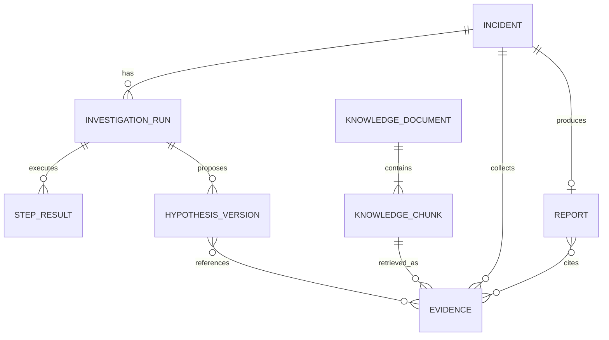

# IncidentCopilot 数据模型设计

## 1. 建模原则

- 领域模型使用 Pydantic v2，负责不变量、序列化和边界校验。
- LangGraph State 使用 TypedDict + reducer，负责增量更新，不替代领域模型。
- ORM 模型只负责持久化；Repository 显式映射领域与数据库对象。
- 所有时间均为 timezone-aware `datetime`；进入持久化层前归一为 UTC。
- ID 使用带类型前缀的 UUID/ULID 字符串，fixture 可使用稳定 ID 便于断言。
- 原始证据与模型可见摘要分开，避免 State、Prompt 和 API 无界增长。

## 2. 核心枚举

| 枚举 | 候选值 |
| --- | --- |
| `Severity` | `unknown`, `sev1`, `sev2`, `sev3`, `sev4` |
| `Environment` | `production`, `staging`, `development`, `unknown` |
| `SourceType` | `log`, `metric`, `trace`, `change`, `topology`, `knowledge` |
| `HypothesisStatus` | `proposed`, `investigating`, `supported`, `rejected`, `inconclusive` |
| `InvestigationStatus` | `pending`, `running`, `waiting_review`, `completed`, `failed`, `cancelled` |
| `ReportDisposition` | `confirmed`, `probable`, `inconclusive` |
| `ReviewAction` | `accept`, `request_more_research` |
| `ErrorCategory` | `validation`, `timeout`, `unavailable`, `rate_limited`, `malformed_response`, `budget`, `internal` |

内部值固定英文；API 可在展示层本地化。未知值显式建模，避免用空字符串混淆“未提供”。

## 3. IncidentContext

| 字段 | 类型 | 规则 |
| --- | --- | --- |
| `incident_id` | string | 非空稳定 ID，前缀 `inc_` |
| `raw_query` | string | 去首尾空白，有最大长度；持久化前脱敏 |
| `services` | list[string] | 规范化、小写、去重、1..N；未知时允许空但产生 gap |
| `start_time` | datetime | 必须带时区，早于 `end_time` |
| `end_time` | datetime | 必须带时区，查询窗口受策略上限 |
| `symptoms` | list[string] | 去重、有界短文本 |
| `severity` | Severity | 无法解析时 `unknown` |
| `environment` | Environment/string | 常见环境用枚举，扩展值经白名单策略 |
| `created_at` | datetime | 系统生成、UTC |
| `timezone_assumption` | string/null | 输入缺时区时记录采用的默认值 |

`raw_query` 是审计输入，不直接在后续每次模型调用中重复传递；模型使用已解析字段与必要片段。

## 4. Evidence 与 EvidenceRef

### 4.1 Evidence

| 字段 | 类型 | 规则 |
| --- | --- | --- |
| `evidence_id` | string | 前缀 `ev_`；对稳定来源可由来源+内容 hash 派生 |
| `source_type` | SourceType | 六类之一 |
| `source_name` | string | 如 `fixture-logs`、`prometheus-prod` |
| `title` | string | 有界、人可读 |
| `content` | string/structured payload | 脱敏后原始或规范化内容；不进入 State |
| `summary` | string | 有界，供 State/LLM 使用 |
| `timestamp` | datetime/null | 单点证据时间；范围数据可为空并使用窗口字段 |
| `start_time` / `end_time` | datetime/null | 指标、Trace 或文档适用 |
| `service` | string/null | 规范化服务名 |
| `relevance_score` | float | `[0,1]`，说明是检索/规则分数而非概率 |
| `reliability_score` | float | `[0,1]`，按来源质量策略产生 |
| `metadata` | dict[string, JSON value] | key/深度/字节数受限，禁止秘密 |
| `citation` | Citation | 必填、可解析 |
| `content_hash` | string | 去重与幂等 |
| `collected_at` | datetime | UTC |

`relevance_score` 与 `reliability_score` 语义分离：前者表示与当前查询的相关程度，后者表示来源可信/完整程度。二者不可直接相加成“真相概率”。

### 4.2 EvidenceRef

Graph State 中的轻量投影：`evidence_id`、`source_type`、`title`、`summary`、`timestamp/window`、`service`、两个分数和 `citation`。不得包含大体积 `content`、完整 span 列表或时间序列。

### 4.3 Citation

| 字段 | 含义 |
| --- | --- |
| `citation_id` | 稳定引用 ID |
| `uri` | `fixture://...`、内部资源 URI 或 HTTPS URL |
| `locator` | 行号、时间窗口、span ID、指标标签或文档 chunk ID |
| `display_name` | 报告显示名称 |
| `retrieved_at` | 获取时间 |
| `content_hash` | 引用时内容版本，用于防止来源漂移 |

引用必须能解析回 Evidence 或知识 Chunk。报告不接受只有自由文本、无法定位的“来源”。

## 5. 调查计划

### 5.1 InvestigationPlan

- `plan_id`
- `round_number`
- `objective`
- `steps: list[InvestigationStep]`
- `coverage_targets: set[SourceType]`
- `created_at`
- `rationale`（有界摘要）

### 5.2 InvestigationStep

| 字段 | 规则 |
| --- | --- |
| `step_id` | 由规范化工具名+参数+轮次派生，便于幂等 |
| `tool_name` | Tool Registry 白名单值 |
| `purpose` | 可验证目标，不是泛泛“调查更多” |
| `parameters` | 对应工具输入 Schema；生成后再次校验 |
| `priority` | 有界整数/枚举 |
| `depends_on` | 仅引用同计划 step ID；MVP 尽量扁平 |
| `status` | pending/running/completed/failed/skipped |

`StepResult` 保存 step ID、状态、Evidence ID、错误 ID、开始/结束时间和重试次数，不复制证据内容。

## 6. Hypothesis

| 字段 | 类型 | 规则 |
| --- | --- | --- |
| `hypothesis_id` | string | 前缀 `hyp_`；跨轮次同一规范化描述尽量稳定 |
| `description` | string | 可证伪、具体、有界 |
| `affected_services` | list[string] | 去重、属于已知/拓扑服务 |
| `supporting_evidence_ids` | list[string] | 现存 Evidence 外键、去重 |
| `contradicting_evidence_ids` | list[string] | 现存 Evidence 外键、与支持集不重叠 |
| `confidence` | float | `[0,1]`，校准判断，非保证 |
| `status` | HypothesisStatus | 状态迁移受规则约束 |
| `verification_queries` | list[QueryIntent] | 结构化、有界、去重 |
| `reasoning_summary` | string | 简短证据解释，不保存隐藏思维链 |
| `version` | int | 每轮更新递增 |

允许的典型迁移：`proposed → investigating → supported/rejected/inconclusive`。已 rejected 的假设如因新证据重开，应创建版本事件并说明原因，不能静默改回。

置信度约束示例：无支持证据不得标记 `supported`；只有单一低可靠来源不得超过策略阈值；存在强反证时必须降权或说明冲突。具体阈值在 Phase 4 测试化。

## 7. IncidentReport

| 字段 | 类型概念 |
| --- | --- |
| `report_id` / `incident_id` | 稳定关联 ID |
| `summary` | 故障摘要 |
| `root_cause` | 根因描述；不充分时明确为最佳假设 |
| `disposition` | confirmed/probable/inconclusive |
| `confidence` | `[0,1]` |
| `confidence_rationale` | 有界解释 |
| `affected_services` | 服务列表 |
| `timeline` | `TimelineEvent[]`，按时间排序 |
| `supporting_evidence` | `EvidenceRef[]` |
| `contradicting_evidence` | `EvidenceRef[]` |
| `rejected_hypotheses` | 假设摘要与排除理由 |
| `remediation_steps` | 有序 `RemediationStep[]` |
| `risks` | 风险与回滚/验证提示 |
| `citations` | 去重 Citation 列表 |
| `investigation_summary` | 节点/轮次/coverage 摘要 |
| `investigation_stats` | `InvestigationStats` |
| `limitations` | 缺失数据源、预算停止、未验证项 |
| `generated_at` / `schema_version` | UTC 时间与版本 |

`RemediationStep` 明确 `action`、`priority`、`risk_level`、`validation`、`rollback`、`requires_human_approval`。MVP 只生成建议，不执行动作。

## 8. 统计、错误与人工反馈

### 8.1 InvestigationStats

- `research_rounds`
- `tool_call_count`
- `tool_success_count` / `tool_failure_count`
- `model_call_count`
- `input_tokens` / `output_tokens` / `total_tokens`
- `started_at` / `completed_at` / `duration_ms`
- `evidence_count_by_source`
- `stop_reason`

Fake Model 若不存在真实 Tokenizer，usage 必须标记 `estimated=true` 或 `unavailable`，不得冒充厂商账单 Token。

### 8.2 InvestigationError

保存 `error_id`、category、component、operation、retryable、脱敏 message、occurred_at、step/tool ID、attempt 和 cause type。State/API 不返回堆栈；服务端日志通过 error ID 关联详细堆栈。

### 8.3 HumanFeedback

包含 `action`、`comment`、可选 `requested_queries`、reviewer 标识（演示可匿名）、时间和 schema version。`requested_queries` 仍需通过 Tool 策略校验，人工输入也不能突破只读边界和预算。

## 9. 知识文档模型

### 9.1 KnowledgeDocument

- `document_id`, `document_type`（runbook/incident/service/error_code/alert/release_policy）
- `title`, `source_uri`, `service_tags`, `environment_tags`
- `version`, `effective_at`, `ingested_at`, `content_hash`
- `content`, `metadata`

### 9.2 KnowledgeChunk

- `chunk_id`, `document_id`, `ordinal`
- `text`, `token_count`, `section_path`
- 继承且规范化后的 metadata
- `embedding`, `embedding_model`, `embedding_version`
- `content_hash`, `citation`

切分不跨越明显标题边界；小节过长时使用受控 overlap。更换 embedding 版本需要新索引/版本字段，不能在同一向量列中无标记混用。

## 10. 关系与存储映射

建议关系表：`incidents`、`investigation_runs`、`evidence`、`step_results`、`hypothesis_versions`、假设/证据关联表、`reports`、报告/证据关联表、`knowledge_documents`、`knowledge_chunks`。Checkpoint 表由 LangGraph 的官方 saver 管理，不和领域迁移混写。

## 11. 索引与保留策略

- `evidence(incident_id, source_type, timestamp)`、`evidence(content_hash)` 唯一/查询索引。
- `investigation_runs(thread_id, created_at)`，thread ID 唯一策略在 Phase 5 定稿。
- 关联表对 `(hypothesis_version_id, evidence_id, relation)` 唯一，防重放重复。
- `knowledge_chunks` 对 metadata 常用过滤字段建普通/GIN 索引，对 embedding 建 HNSW 或按数据规模选择。
- Fixture 永久版本化；真实原始证据采用短保留期，摘要/引用和报告采用较长保留期。具体天数属于部署策略，不在代码硬编码。

## 12. Schema 演进

- API、事件、报告和 fixture 均带 `schema_version`。
- Pydantic 模型变化需提供向后兼容读取或显式迁移；数据库变化只经 Alembic。
- Evaluation 数据集固定版本与预期真相，模型或 Prompt 变更不修改旧 ground truth 来“提高”分数。
- Phase 1 只实现当前阶段需要的领域字段；持久化和 Graph 专用模型在对应 Phase 渐进加入。

