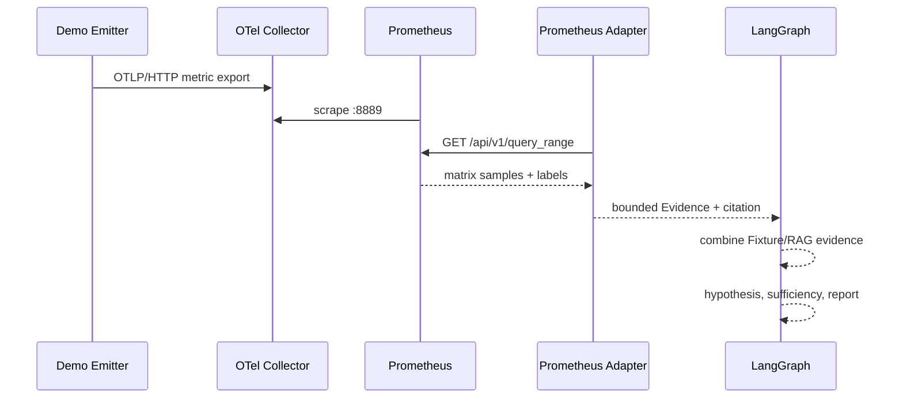

# IncidentCopilot 演示指南

## 1. 演示目标

本指南提供两条可复现路径：

1. **证据链演示**：证明指标实际经过 OTLP/HTTP、OpenTelemetry Collector、Prometheus HTTP API、`MetricsProvider` 和 LangGraph。
2. **产品流程演示**：证明 FastAPI 调查任务、SSE、PostgreSQL checkpoint、高风险 interrupt 和 resume 能协同工作。

默认测试和离线演示不依赖 Docker、在线模型或付费 API。容器演示中的业务指标由仓库内脚本合成并明确标记为 demo signal；它不是生产数据。

## 2. 前置条件

- Docker Desktop 已启动，`docker version` 能同时返回 Client 与 Server。
- Docker Compose v2：`docker compose version`。
- 本机端口 `8000`、`9090`、`14317`、`14318`、`55432` 未被占用。
- 如需在宿主运行辅助脚本，已执行 `uv sync --extra demo --extra postgres`。

本仓库使用固定容器版本：

| 服务 | 镜像 | 用途 |
| --- | --- | --- |
| OpenTelemetry Collector | `otel/opentelemetry-collector-contrib:0.156.0` | 接收 OTLP、暴露 Prometheus exporter |
| Prometheus | `prom/prometheus:v3.12.0` | 抓取并提供 query_range HTTP API |
| PostgreSQL/pgvector | `pgvector/pgvector:0.8.5-pg18-trixie` | LangGraph checkpoint |
| 应用基础镜像 | `ghcr.io/astral-sh/uv:0.11.29-python3.13-trixie-slim` | 构建并运行 Python 项目 |

版本依据可参考 [OpenTelemetry Collector Docker 文档](https://opentelemetry.io/docs/collector/install/docker/)、[Prometheus HTTP API 文档](https://prometheus.io/docs/prometheus/latest/querying/api/) 和 [uv Docker 文档](https://docs.astral.sh/uv/guides/integration/docker/)。

## 3. 故障场景

场景服务是 `payment-service`：

- 事故窗口内数据库连接池利用率维持在 0.99。
- 脱敏变更证据显示发布把 `db.pool.max_connections` 从 50 降到 5。
- Fixture 日志显示连接获取超时，Trace 显示关键路径阻塞在 `db.pool.acquire`。
- Runbook 和历史事故提供处置上下文，但不作为不可验证的事实替代观测证据。
- 建议回滚配置属于高风险动作，必须经过人工审核。

演示使用真实 Prometheus metrics；日志、Trace、变更、拓扑和内部知识仍来自版本化 Fixture/RAG。这是当前实现边界，不是全真实生产接入。

## 4. 一条命令运行真实指标链路

在仓库根目录运行：

```text
docker compose --profile demo up --build --abort-on-container-exit --exit-code-from demo demo
```

链路如下：



成功输出示例字段：

```json
{
  "status": "ok",
  "telemetry_path": "OTLP HTTP -> OpenTelemetry Collector -> Prometheus -> Provider -> LangGraph",
  "prometheus_probe_evidence_ids": ["ev_prom_..."],
  "graph_prometheus_evidence_ids": ["ev_prom_..."],
  "stop_reason": "evidence_sufficient"
}
```

Evidence ID、report ID 和时间每次会变化，不应写死到断言或演示话术中。脚本在 60 秒内等不到真实序列会以非零状态失败，不会伪造回退结果。

清理：

```text
docker compose --profile demo down -v --remove-orphans
```

该命令删除本 Compose 项目的容器、网络和演示数据卷。

## 5. 完整 API、SSE、Checkpoint 与 HITL 演示

启动完整栈：

```text
docker compose up -d --build api
docker compose ps
```

等待 `api`、`postgres` 和 `prometheus` 为 healthy，然后运行：

```text
uv run python scripts/run_api_demo.py --live-window
```

脚本执行：

1. `POST /api/v1/investigations` 创建任务。
2. 轮询状态直到 `waiting_review`。
3. 读取 `/events` SSE 事件。
4. 向 `/resume` 提交 `accept`。
5. 等待 `completed` 并打印报告摘要。

应检查：

- `thread_id` 非空，初始和恢复 `run_id` 不同。
- `paused_for.high_risk_actions` 非空。
- `status` 为 `completed`。
- `prometheus_citation_count` 大于 0。
- API 健康响应：`http://127.0.0.1:8000/health`。
- OpenAPI：`http://127.0.0.1:8000/docs`。

清理：

```text
docker compose --profile demo down -v --remove-orphans
```

## 6. 默认离线回退

真实 Adapter 不可用时，不需要修改代码即可回到 Fixture：

```text
set INCIDENT_COPILOT_METRICS_BACKEND=fixture
uv run uvicorn incident_copilot.main:app --reload
uv run python scripts/run_api_demo.py
```

PowerShell 可使用：

```text
$env:INCIDENT_COPILOT_METRICS_BACKEND="fixture"
```

默认 `Settings` 即为 `fixture`。如果显式选择 `prometheus` 而 Prometheus 不可用，metrics 工具会产生分类后的 coverage gap，Graph 继续处理其他分支；应用不会暗中把真实查询替换为 Fixture 结果。

## 7. 直接检查 Prometheus

健康检查：

```text
http://127.0.0.1:9090/-/healthy
```

在 Prometheus UI 查询：

```text
incident_demo_db_pool_utilization_ratio{service="payment-service"}
incident_demo_http_server_error_rate_ratio{service="payment-service"}
```

Adapter 只允许以下领域映射：

| 领域指标 | Prometheus 指标 | 聚合 |
| --- | --- | --- |
| `db.pool.utilization` | `incident_demo_db_pool_utilization_ratio` | avg/max/min/p95 |
| `http.server.error_rate` | `incident_demo_http_server_error_rate_ratio` | avg/max/rate |

服务名已由共享 Schema 限制；用户不能通过 API 提交任意 PromQL。

## 8. 常见问题

### Docker 报 virtualization support not detected

确认 BIOS/UEFI 中 AMD-V/SVM 或 Intel VT-x 已开启；Windows 中启用 Hyper-V/Virtual Machine Platform/WSL 2 所需组件，重启后检查任务管理器“虚拟化：已启用”和 `docker version` 的 Server 部分。企业设备若策略锁定，需要管理员处理。

### 端口冲突

- API：修改 `compose.yaml` 的宿主 `8000` 映射或停止占用进程。
- Prometheus：修改宿主 `9090`；容器内部 URL 仍为 `http://prometheus:9090`。
- PostgreSQL：可设置 `INCIDENT_COPILOT_POSTGRES_PORT`，默认已使用 `55432`。

### demo 等不到指标

```text
docker compose logs otel-collector
docker compose logs telemetry-emitter
docker compose logs prometheus
```

检查 Collector 配置是否加载、OTLP endpoint 是否为 `http://otel-collector:4318/v1/metrics`，并在 Prometheus `/targets` 确认 Collector target 为 UP。

### API 启动失败

```text
docker compose logs api
docker compose exec postgres pg_isready -U incident_copilot -d incident_copilot
```

Compose 演示凭据只适合 localhost。不要复制到共享或生产环境。

## 9. 本阶段真实验证记录

2026-07-18 在当前 Windows/Docker Desktop 环境执行过：

- Compose 文件解析通过。
- 首次镜像构建发现不存在的 uv `bookworm-slim` 组合标签，未计为成功；修正为官方存在的 `trixie-slim` 标签后重新冷构建通过。
- OTLP → Collector → Prometheus → Provider → LangGraph 演示退出码为 0，报告包含 Prometheus Evidence。
- 完整 API 栈的五个服务处于 running/healthy；一次调查经历 `waiting_review → accept → completed`，并包含 Prometheus citation。
- `docker compose --profile demo down -v --remove-orphans` 后项目容器无残留。

这些是单次功能验证，不是吞吐量、延迟或准确率 benchmark。
