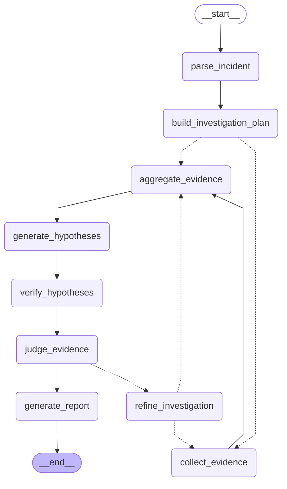

# Phase 4 当前源码 Graph

下图由 `build_offline_investigation_graph().get_graph().draw_mermaid()` 直接生成，
对应当前提交中的实际节点与边。虚线为条件边；从计划/细化节点到 `collect_evidence`
的条件边在运行时返回多个 `Send`，并行分支在 `aggregate_evidence` 汇合。

Phase 5 才会实现的 checkpoint、interrupt、`human_review`、SSE 和调查 API 不在图中。



一致性检查：

```text
uv run python scripts/render_graph.py --check docs/GRAPH_CURRENT.md
```
