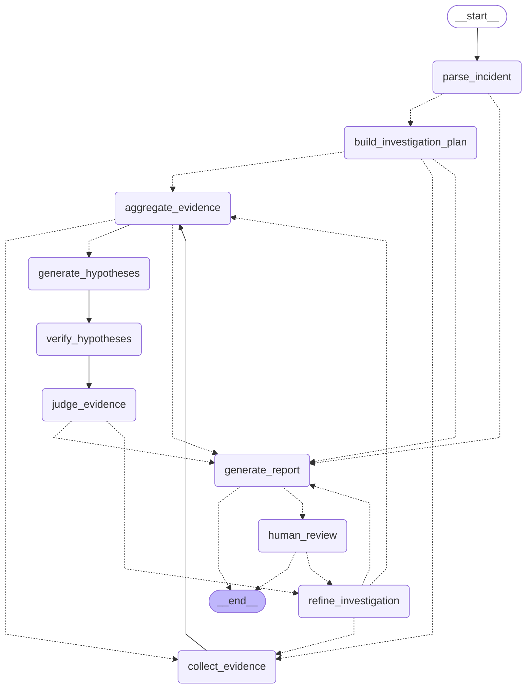

# Phase 5 当前源码 Graph

下图由启用 `require_human_review=True` 的实际离线图通过 `draw_mermaid()` 直接生成，
对应当前工作区中的实际节点与边。虚线为条件边；从计划/细化节点到 `collect_evidence`
的条件边在运行时返回多个 `Send`，并行分支在 `aggregate_evidence` 汇合。若仍有
待执行步骤，聚合节点按并发上限发送下一批。fan-out 同时为每个步骤预留由 Registry
声明的物理 attempt 上限，整批预留之和不超过 State 中剩余的全局 attempt 预算；
checkpoint 保存累计 logical step 与 physical attempt，恢复不会重置。deadline 或硬预算
停止可直接转报告。

`generate_report` 仅在报告包含 high/critical 修复建议时路由到 `human_review`。
该节点执行真实 `interrupt()`；接受反馈后结束，追加调查反馈则回到
`refine_investigation`。Checkpoint、后台任务与 SSE 属于图外应用层，不会伪画成 Graph 节点。



一致性检查：

```text
uv run python scripts/render_graph.py --check docs/GRAPH_CURRENT.md
```
