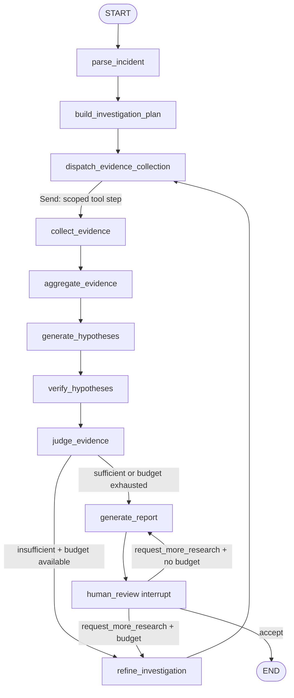

# LangGraph 调查工作流设计

## 1. 设计目标

调查图必须显式表达数据收集的并行性、证据驱动的循环、预算停止、失败降级、checkpoint 和人工审核。模型参与内容决策，但不能绕过工具策略或直接决定无界循环。

本设计基于 LangGraph 1.2 Graph API。官方文档说明 `Send` 可用于动态 map-reduce，`Command` 可把状态更新与跳转合并，并行节点在 superstep 中执行；参见 [Graph API](https://docs.langchain.com/oss/python/langgraph/graph-api) 与 [Use the graph API](https://docs.langchain.com/oss/python/langgraph/use-graph-api)。

## 2. 主流程

## 3. State 设计

### 3.1 逻辑 Schema

`InvestigationState` 使用 `TypedDict` 表达当前图通道；Pydantic Model 表达领域对象。
以下是 Current 字段类别，精确契约以 `graph/state.py` 和
[`GRAPH_CURRENT.md`](GRAPH_CURRENT.md) 为准：

| 字段 | 类型概念 | 更新语义 | 可交给 LLM |
| --- | --- | --- | --- |
| `incident` | `IncidentContext` | 初始化后只读 | 是 |
| `investigation_plan` | `InvestigationPlan` | 每轮覆盖 | 是 |
| `pending_steps` | `InvestigationStep[]` | 覆盖；调度后清空/重建 | 是，字段裁剪 |
| `completed_steps` | `StepResult[]` | reducer：按 step ID 去重追加 | 仅摘要 |
| `evidence` | `EvidenceRef[]` | reducer：按 evidence ID 去重追加、全局有界 | 仅摘要/引用 |
| `hypotheses` | `Hypothesis[]` | 每轮覆盖当前排序版本 | 是 |
| `evidence_sufficient` | `bool` | 覆盖 | 否，路由字段 |
| `sufficiency_reason` | 短文本 | 覆盖 | 可作为报告输入 |
| `next_investigation_queries` | `VerificationQuery[]` | 覆盖 | 是 |
| `research_round` | 非负整数 | 单写节点覆盖为旧值 + 1 | 否 |
| `max_research_rounds` | 正整数 | 初始化后不可由模型修改 | 否 |
| `final_report` | `IncidentReport | None` | 覆盖 | 输出对象 |
| `human_feedback` | `HumanFeedback | None` | 每次恢复覆盖 | 只给 refine 节点 |
| `tool_call_count` | 非负整数 | reducer：逻辑工具步骤增量求和 | 否 |
| `tool_attempt_count` | 非负整数 | reducer：包含重试的物理尝试增量求和 | 否 |
| `model_call_count` / `model_usage` | 计数 / `ModelUsage` | reducer：增量求和 | 否 |
| `started_at` | 时区时间 | 初始化后不变 | 否 |
| `deadline_at` | 时区时间 | 初始化后不变 | 否 |
| `errors` | `InvestigationError[]` | reducer：按 error ID 去重追加、有界 | 仅脱敏摘要 |
| `stop_reason` | `StopReason | None` | 可信路由/节点覆盖 | 否 |

### 3.2 reducer 规则

- **覆盖字段**只允许指定节点写：解析写 `incident`，计划/反思写计划，判断写充分性，报告写最终报告。
- **累积集合**使用稳定 ID 去重，而不是简单 `operator.add`；checkpoint 重放不会产生重复证据。
- **并行计数**节点返回本次增量，reducer 求和；节点不得读取旧值再写总数，否则并行更新会丢失或重复。
- **有界集合**在 reducer 或聚合节点执行上限：每来源保留高相关摘要和少量反证，完整数据通过 ID 查询。
- **不可变配置**在 invocation context/config 中保存更理想；若为路由可见而进入 State，节点 Schema 不暴露其写权限。
- reducer 必须满足尽可能的结合性与交换性，保证并行分支完成顺序不影响结果。

### 3.3 State 大小控制

- State 保存 `EvidenceRef`：ID、标题、短摘要、分数、时间、服务、citation。完整 Evidence
  只存在于当前 Provider/Fixture/RAG 返回边界；Current 没有外部 Evidence Store。
- Provider 在入口限制结果条数和字节；聚合器执行归一化、同源/跨源去重和摘要。
- 模型上下文只包含有界 Evidence 摘要，不回放完整原始对象。
- 假设只保留当前排序版本；SSE 事件是进程内投影，不是持久审计仓储。
- reducer 按显式上限确定性裁剪；报告只能引用仍在 State 中的 EvidenceRef。

### 3.4 父图与子图

Current 主图不为每个 Provider 创建独立持久化子图；动态 `Send` 到同一
`collect_evidence` 节点更适合短生命周期并行查询。

仅当某类数据源本身需要多步、可中断研究时才引入子图。子图拥有私有查询状态，通过输入/输出映射只向父图返回 `EvidenceRef`、计数和错误；不默认共享全部父 State。LangGraph 对子图 checkpointer 有不同的 per-invocation/per-thread 语义，实施前按 [Subgraphs 文档](https://docs.langchain.com/oss/python/langgraph/use-subgraphs) 编写恢复测试。

## 4. 节点契约

| 节点 | 读取 | 写入 | 关键失败行为 |
| --- | --- | --- | --- |
| `parse_incident` | 已校验 IncidentContext、deadline | deadline 状态、可信工具 attempt policy | API 缺 service/time 时在入图前 422；节点不做自然语言抽取 |
| `build_investigation_plan` | incident、预算 | plan、pending steps | 校验/裁剪非法工具与参数 |
| `dispatch_evidence_collection` | pending steps、预算 | `Send` 列表 | 不发送超预算步骤；无步骤转聚合 |
| `collect_evidence` | 单个 scoped step、provider | evidence refs、step result、计数、错误 | 超时转换；不取消同轮其它分支 |
| `aggregate_evidence` | 全部 refs、本轮结果 | 有界/排序 refs、coverage | 去重并记录缺失来源 |
| `generate_hypotheses` | incident、Evidence Packet | hypotheses、usage、errors | Schema 修复后仍失败则规则降级 |
| `verify_hypotheses` | hypotheses、refs | 双向证据、验证查询、usage | 无证据的高置信假设强制降权 |
| `judge_evidence` | 假设、coverage、预算 | sufficient、reason、route reason | 规则先于模型判断，永不自循环 |
| `refine_investigation` | gaps、查询、反馈、历史步骤 | 新 plan/pending、round | 去重已执行查询，增量缩小问题 |
| `generate_report` | incident、假设、refs、错误、stats | report、usage | 缺数据时仍输出带限制的报告 |
| `human_review` | report、预算 | interrupt/feedback | 恢复输入严格校验 |

节点返回最小增量，不返回整个 State 副本。Provider 调用包装器负责 deadline、有限重试、日志和异常转换；节点负责把结果映射到图更新。

## 5. 并行调度

初始计划可为每个来源生成一个或多个 `InvestigationStep`。条件边从 `dispatch_evidence_collection` 返回 `Send(target_node, scoped_state)`，使步骤动态并行。所有分支汇入 `aggregate_evidence`，目标字段必须声明 reducer。

为避免并发扇出失控：

- 同一 superstep 最多发送 `max_parallel_tools` 个任务；余下步骤留到后续批次或裁剪。
- 相同 provider + 规范化参数的查询按稳定 hash 去重。
- fan-out 前按工具 retry policy 保守预留 physical attempts，分支完成后按真实 logical
  result/attempt 增量累计，防止并发越过全局上限。
- 分支仅收到该 step、incident 的必要字段和只读 QueryContext，不复制整个证据历史。

## 6. 充分性与路由

### 6.1 充分性规则

`judge_evidence` 组合确定性规则与可选模型评价：

- 至少一个可操作假设有支持证据，且支持来自至少两种独立来源；
- 根因关键因果链至少包含异常信号和时间/变更或依赖关联；
- 已检查明显替代假设，或明确说明无法检查；
- 引用均指向现有 Evidence；
- 置信度与支持/反对证据数量、质量不矛盾。

这些是默认策略，不应把“两个来源”误作所有事故的真理。若只剩单一数据源但预算耗尽，报告状态是 `inconclusive` 或低置信，而不是无限循环。

### 6.2 路由优先级

1. 已取消、超过总 deadline 或严重内部错误 → 生成受限报告。
2. 逻辑工具步骤、物理工具尝试或 Token 预算耗尽 → 生成报告。
3. `evidence_sufficient is True` → 生成报告。
4. `research_round >= max_research_rounds` → 生成报告。
5. 否则 → `refine_investigation`。

该顺序由纯函数路由测试覆盖。模型不得修改预算字段或直接返回节点名。

## 7. `Command`、checkpoint 与 HITL

- 普通条件路由优先使用 conditional edge，方便路由函数单测。
- 当节点必须原子地写入状态并跳转（例如人审恢复后写 feedback 并进入 refine）时使用 `Command(update=..., goto=...)`。
- Graph invocation 必须传稳定 `thread_id`；每次启动另有 `run_id` 用于可观测。
- `human_review` 调用 `interrupt()`，只传可 JSON 序列化的报告摘要、允许动作和剩余预算。
- 恢复使用 `Command(resume=validated_feedback)`；`accept` 结束，`request_more_research` 只有预算允许才进入 refine。
- interrupt 之前的副作用必须幂等，因为恢复会从节点开头重放。官方规则明确要求 interrupt 前副作用幂等且不要把 interrupt 包在捕获它的 `try/except` 中，见 [Interrupts](https://docs.langchain.com/oss/python/langgraph/interrupts)。

## 8. 流式事件

Current 应用层把 Graph streaming 映射为稳定事件，而不直接泄露内部 State：

- `investigation.started`
- `node.completed`
- `tool.completed` / `tool.failed`
- `evidence.added`（摘要与 citation）
- `hypothesis.updated`
- `budget.updated`
- `review.required`
- `report.completed`
- `investigation.failed`

每个事件包含 schema version、event ID、incident/thread/run ID、时间和可恢复序号。SSE 重连以 `Last-Event-ID` 获取可用的持久化事件；内存演示允许明确标注“不支持跨进程重放”。

## 9. Graph 测试矩阵

| 场景 | 关键断言 |
| --- | --- |
| 正常路径 | 并行来源汇合、报告带引用、一次审核后结束 |
| 证据不足 | 至少进入一次 refine，查询与已执行步骤不重复 |
| 最大轮数 | 精确在上限停止并报告限制原因 |
| 工具预算 | 并发发送不越过预算，未执行步骤可见 |
| Token 预算 | 停止额外模型调用，使用降级报告 |
| 单 Provider 失败 | 其它证据保留，错误进入报告 coverage gap |
| 结构输出无效 | 有限修复；最终失败走明确降级 |
| HITL 接受 | interrupt checkpoint 可恢复到 END |
| HITL 追加研究 | feedback 进入 refine，受剩余预算限制 |
| checkpoint 重放 | 无重复 Evidence/计数，节点副作用幂等 |
| reducer 并发顺序 | 不同完成顺序得到等价聚合结果 |

## 10. 实施约束

- Current 使用 Fake Model + Fixture Provider 作为确定性默认链路；真实模型属于 Target。
- Graph 结构快照或 Mermaid 图进入测试/文档，防止路由被无意改变。
- 不在 Prompt 中隐藏停止规则；停止逻辑必须是可检查的代码策略。
- `errors` 是一等输出，不允许捕获后只写日志。
- 任何新增循环都必须同时增加最大次数与终止测试。
