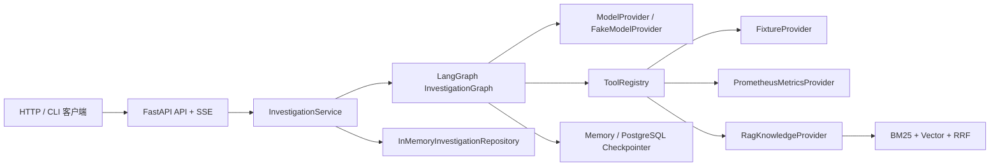

# 01 项目整体介绍

## 项目解决什么问题

微服务故障调查通常要同时查看日志、指标、Trace、配置变更、拓扑、Runbook 和历史事故。IncidentCopilot 把这个过程建模为一个受预算约束、可恢复、带引用的调查工作流。

核心不是“让模型猜根因”, 而是:

- 让模型只产生结构化计划、假设、充分性建议和报告草稿。
- 让 Graph 决定控制流和循环终止。
- 让 Tool Registry 决定哪些只读操作可以执行。
- 让 Evidence 和 Citation 承载可审计事实。
- 让人工审核控制高风险建议的最终确认。

## 当前真实能力

这张图对应当前装配关系:

- `main.create_app()` 创建 Service。
- `graph.bootstrap` 创建离线或混合 Graph。
- `graph.builder` 将节点编译成 `InvestigationGraph`。
- `tools.builtin` 把 Provider 包装成七个工具。
- RAG 只通过 `KnowledgeProvider` 进入工具层, Graph 不直接调用 Retriever。

## 三种运行事实

| 路径 | Metrics | 其他观测源 | 模型 | Checkpoint |
| --- | --- | --- | --- | --- |
| 默认离线 | Fixture | Fixture + 本地 RAG | Fake | Memory |
| Compose API | Prometheus | Fixture + 本地 RAG | Fake | PostgreSQL |
| 单次真实指标演示 | Prometheus | Fixture + 本地 RAG | Fake | 可选 |

Prometheus 指标虽然真实经过 OTLP、Collector、Prometheus 和 HTTP API, 但指标发生器仍是
仓库内 payment-only synthetic demo。DNS/cache live mapping 未实现，项目没有声称接入生产数据。

## 为什么选 LangGraph

普通顺序函数可以完成一次查询, 但本项目还需要:

- 根据计划动态产生多个并行任务。
- 合并并行分支更新。
- 在证据不足时进入有限下一轮。
- 在高风险建议前暂停。
- 使用同一 `thread_id` 恢复执行。
- 对所有路径做确定性测试。

这些需求正好对应 `StateGraph`、`Send`、reducer、conditional edge、checkpointer、`interrupt()` 和 `Command(resume=...)`。

## 关键安全边界

1. 所有工具只读。
2. 模型不能返回任意节点名直接控制跳转。
3. 工具参数必须经过 Pydantic Schema。
4. 研究轮数、工具、模型、Token 和 deadline 都有上限。
5. 最终 Citation 来自已收集 Evidence, 不是模型自由文本。
6. 高风险 remediation 必须进入人工审核。

## 当前没有实现什么

- 真实 LLM 和真实 embedding。
- Loki、Tempo、真实变更和拓扑 Adapter。
- 持久化 Investigation/Event Repository。
- 外部 Evidence Store。
- 自动回滚、扩容、重启或配置写入。
- 鉴权、多租户和分布式 worker。

下一步: [项目目录和模块关系](02-directory-and-modules.md)。
