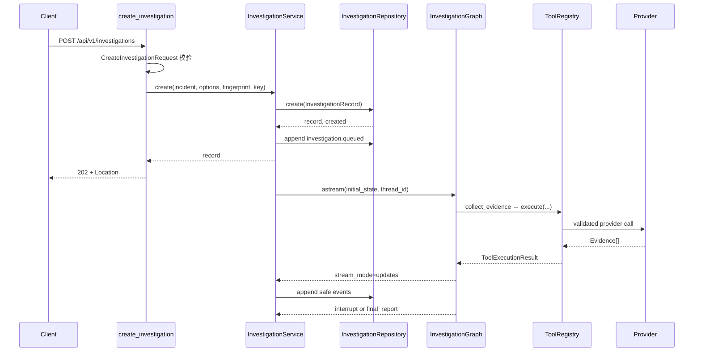

# 03 一次请求的完整生命周期

本章跟踪真实端点 `POST /api/v1/investigations`。函数名和节点名均来自当前源码。

## 总体时序



## 第 1 步: FastAPI 校验

路由函数是 `api.routes.investigations.create_investigation`。

```python
incident = payload.to_incident(f"inc_{uuid4().hex}")
record, created = await _service(request).create(
    incident=incident,
    options=payload.options,
    request_fingerprint=payload.fingerprint(),
    idempotency_key=idempotency_key,
)
```

- 输入来自 HTTP JSON 和可选 `Idempotency-Key` Header。
- `CreateInvestigationRequest` 先完成字段校验。
- `query` 是自然语言故障描述；调用方还必须显式提交恰好一个 `services` primary service
  和带时区 `start_time/end_time`。当前不从 query 自动提取这些字段。
- `to_incident()` 转成领域对象, API 不把原始 dict 传进 Graph。
- 输出交给 `InvestigationService.create()`。
- 这里不直接运行 Graph, 所以响应可以快速返回 202。

## 第 2 步: 创建任务标识

Service 创建三种 ID:

- `investigation_id`: API 资源标识。
- `thread_id`: LangGraph checkpoint 标识。
- `run_id`: 本次初始或恢复执行标识。

当前 `investigation_id` 和 `thread_id` 使用同一个 UUID 后缀。恢复时 thread 不变, run 会更新。

## 第 3 步: 幂等创建和后台任务

Repository 根据 idempotency key 和 request fingerprint 返回新建或重放结果。只有新任务才执行:

```python
await self._append_event(record, EventType.INVESTIGATION_QUEUED, ...)
self._start_task(record.investigation_id, self._run_initial(...))
```

`asyncio.create_task()` 让 HTTP 请求不必等待整张 Graph。后端类比是“进程内任务调度”, 不是 Kafka/Celery 等分布式队列。

删除后台任务层的影响: POST 将阻塞到调查暂停或结束, 客户端超时风险显著增加。

## 第 4 步: 初始化 Graph State

`_run_initial()` 把任务改为 running, 然后调用 `create_initial_state()`。初始 State 包含:

- IncidentContext。
- 空 Evidence、Hypothesis 和错误集合。
- 研究轮数 1。
- 工具、模型、Token、并发和 deadline 预算。

随后 `_execute()` 使用:

```python
config = {"configurable": {"thread_id": record.thread_id}}
async for update in graph.astream(initial, config, stream_mode="updates"):
    ...
```

## 第 5 步: Graph 调查

真实节点顺序为:

```text
parse_incident  # 校验已有 IncidentContext，不是自然语言 parser
→ build_investigation_plan
→ collect_evidence (多个 Send)
→ aggregate_evidence
→ generate_hypotheses
→ verify_hypotheses
→ judge_evidence
→ refine_investigation 或 generate_report
→ human_review 或 END
```

下一节点不是模型自由选择。`routing.py` 返回预声明节点名, `builder.py` 把结果映射到真实 edge。

## 第 6 步: 工具数据流

每个 `collect_evidence` 分支读取 `current_step`, 构造 `QueryContext`, 调用:

```text
ToolRegistry.execute
→ Pydantic input
→ timeout / retry / deadline
→ Provider
→ Evidence boundary validation
→ EvidenceRef
→ State reducer
```

单个 Provider 失败会产生 `StepResult.FAILED` 和 `InvestigationError`, 同一批其他分支仍可完成。

## 第 7 步: Service 投影事件

Graph 的 `stream_mode="updates"` 返回节点增量。Service 将其转换成允许公开的事件:

- `node.completed`
- `tool.completed` / `tool.failed`
- `evidence.added`
- `hypothesis.updated`
- `budget.updated`
- `review.required`
- `report.completed`

原始 Graph State 和工具完整 payload 不直接进入 SSE。

## 第 8 步: 暂停或完成

报告含 high/critical remediation 时进入 `human_review`。`interrupt()` 让 Graph 在该 thread 上暂停, Service 把任务状态改为 `waiting_review`。

客户端随后调用:

```text
POST /api/v1/investigations/{id}/resume
```

- `accept` → `Command(resume=...)` → END → completed。
- `request_more_research` → 预算检查 → refine → 再次调查 → 再次审核。

## 失败路径

| 失败点 | 结果 |
| --- | --- |
| 请求 Schema 非法 | HTTP 422 |
| 幂等键载荷冲突 | HTTP 409 |
| Provider 失败 | Graph 记录错误并降级 |
| 模型输出非法 | 最多有限重试后 Fake fallback |
| deadline/预算耗尽 | 生成受限报告 |
| Graph 完成但无报告 | 任务标记 failed |
| 重复 resume | HTTP 409 |

下一步: [IncidentState 详细解释](04-state-and-reducers.md)。
