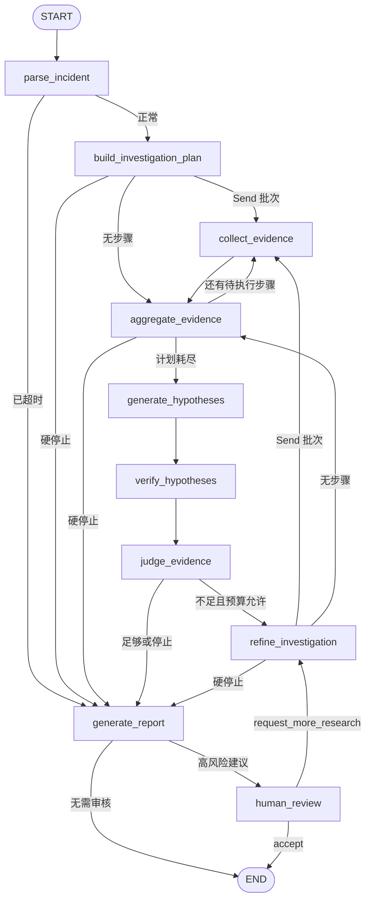

# 05 Graph、Node、Edge 与调查循环

## 当前真实 Graph

下面的节点和连接来自 `graph/builder.py` 与当前编译图, 没有加入 API、SSE 或 Checkpoint 等图外组件。



源码逐字符 Mermaid 仍以 `docs/GRAPH_CURRENT.md` 为准。

## Node 是什么

Node 是接收 State 并返回更新的函数。示例:

```python
async def aggregate_evidence(self, state: InvestigationState) -> InvestigationState:
    update = {"deadline_exceeded": deadline_exceeded}
    if reason is not None:
        update["stop_reason"] = reason
    return update
```

它不返回完整 State 副本, 只返回自己负责的字段。好处是:

- 并行分支可以通过 reducer 合并。
- 每个节点写权限更清晰。
- streaming 可以观察节点增量。

## Edge 与 Conditional Edge

普通 Edge 永远跳到固定下一节点:

```python
builder.add_edge("generate_hypotheses", "verify_hypotheses")
```

Conditional Edge 调用纯函数选择预声明目标:

```python
builder.add_conditional_edges(
    "judge_evidence",
    route_after_judge,
    path_map={
        "refine_investigation": "refine_investigation",
        "generate_report": "generate_report",
    },
)
```

`path_map` 的作用类似后端白名单路由表。即使模型产生恶意文本, 也不能跳到任意 Python 函数。

## Send 动态并行

计划步骤数量在运行前不固定, 所以 builder 使用:

```python
Send(
    "collect_evidence",
    {
        "incident": state["incident"],
        "current_step": step,
        "deadline_at": state["deadline_at"],
    },
)
```

每个 Send 分支只收到执行单个步骤需要的字段。多个分支在同一 superstep 中运行, 然后统一进入 `aggregate_evidence`。

为什么不是 `asyncio.gather()`:

- `Send` 是 Graph 的真实控制流, 能参与 streaming 和 reducer。
- LangGraph 知道每个分支的节点身份。
- Checkpoint 和图可视化保持统一。

相关并行测试使用 barrier: 七个分支必须全部到达才释放。若实际串行, 测试会阻塞。

## 分批并发

```python
remaining_steps = max_tool_calls - tool_call_count
remaining_attempts = max_tool_attempts - tool_attempt_count
limit = min(remaining_steps, remaining_attempts, max_parallel_tools)
# 按工具 attempt limit 逐项预留，整批预留不得超过 remaining_attempts。
```

如果计划有 7 步但 `max_parallel_tools=2`, Graph 会执行:

```text
2 个 collect → aggregate
→ 2 个 collect → aggregate
→ 2 个 collect → aggregate
→ 1 个 collect → aggregate
→ hypotheses
```

删除 aggregate 回边会让并发上限之外的步骤直接丢失。

## 调查循环

`judge_evidence` 之后只有两类目标:

```text
REFINE: 生成增量计划并开始下一轮
REPORT: 生成最终报告
```

停止优先级来自 `routing.decide_after_judge()`:

1. deadline 或硬预算。
2. Evidence sufficient。
3. 最大研究轮数。
4. 否则 refine。

模型只给出 `SufficiencyOutput`, 最终 sufficient 还需要至少一个 supported hypothesis 和至少两种 Evidence source。

## Node 读写速查

| Node | 关键读取 | 关键写入 |
| --- | --- | --- |
| `parse_incident` | incident、deadline | deadline flag、stop reason |
| `build_investigation_plan` | incident、round、budget | plan、pending、model usage |
| `collect_evidence` | current step、deadline | step result、evidence/error、counter |
| `aggregate_evidence` | merged counters、budget | deadline、stop reason |
| `generate_hypotheses` | evidence、incident | hypotheses、model usage |
| `verify_hypotheses` | evidence、hypotheses | calibrated hypotheses |
| `judge_evidence` | hypotheses、sources、budget | sufficient、next queries、stop |
| `refine_investigation` | gaps、feedback、history | new plan、round + 1 |
| `generate_report` | 全部调查结果 | final report |
| `human_review` | report remediation | feedback、review state、Command |

下一步: [Provider、Tool 和 Evidence](06-providers-and-tools.md)。
