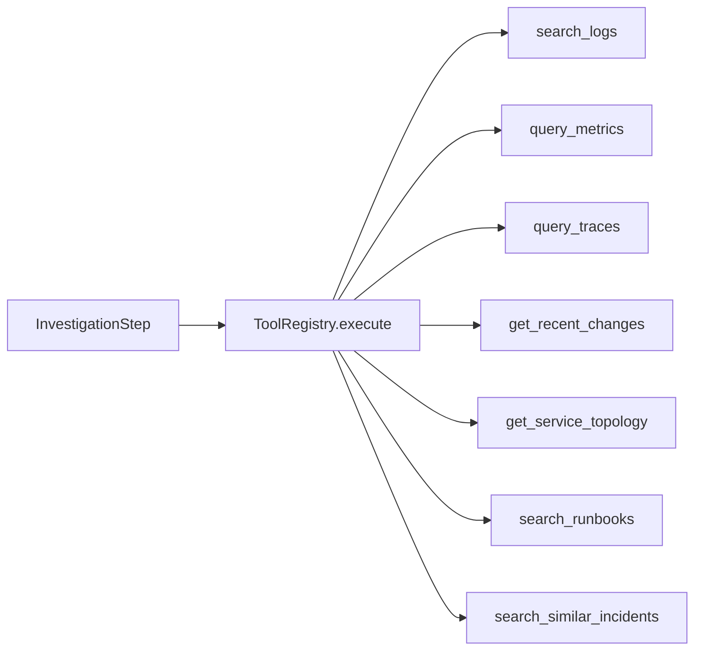

# 06 Provider、Tool 和 Evidence 数据流

## 三层职责

```text
Graph Node
  决定何时执行调查步骤
      ↓
ToolRegistry
  校验工具名、参数、预算、timeout、retry 和输出
      ↓
Provider Adapter
  查询 Fixture、Prometheus 或本地 RAG
```

Provider 不生成根因, Tool 不决定下一节点, Graph 不理解 PromQL 或 Fixture 文件格式。

## Provider Protocol

`tools/interfaces.py` 定义六个端口:

- `LogProvider.search`
- `MetricsProvider.query`
- `TraceProvider.query`
- `ChangeProvider.recent`
- `TopologyProvider.get`
- `KnowledgeProvider.search_runbooks/search_similar_incidents`

Protocol 是 Python 的结构化类型约束。实现类不必继承 Protocol, 只要方法签名兼容即可。后端类比是 Ports and Adapters 中的端口接口。

## 七个 Tool

`build_tool_registry()` 把 Provider 方法包装为七个稳定工具名。Graph 计划引用工具名, 而不是 Provider 类名。



## 一次工具执行

```text
tool name allow-list
→ remaining_tool_attempts
→ input_model.model_validate(arguments)
→ deadline 和单次 timeout
→ Provider handler
→ Evidence source/service/time/limit 校验
→ ToolExecutionResult
```

关键输入 `QueryContext` 包含:

- `correlation_id`: 关联一次步骤。
- `deadline`: 不允许 Provider 越过调查总时间。
- `remaining_tool_attempts`: Graph fan-out 为当前逻辑步骤预留的物理尝试数。

## Timeout 和 Retry

Registry 计算:

```python
max_attempts = min(max_retries + 1, remaining_tool_attempts)
attempt_timeout = min(tool_timeout, remaining_deadline)
```

只有 retryable ProviderError 才会重试。永久参数错误和畸形响应不会通过重复调用解决。

退避前还会检查剩余 deadline。删除这一检查可能让 retry sleep 本身越过调查截止时间。

## Evidence 契约

Provider 返回完整 `Evidence`, 包含:

- 来源类型和名称。
- 服务与时间点/窗口。
- 原始或结构化 content。
- 有界 summary。
- relevance/reliability score。
- Citation 和 content hash。

Registry 会再次校验:

- source type 属于工具声明范围。
- service 与请求一致。
- Evidence 时间与查询窗口重叠。
- 类似事故位于 lookback 范围内。
- 返回数量不超过 limit。

这体现“Adapter 也是不可信输入边界”。

## EvidenceRef 为什么存在

`collect_evidence` 将每个 Evidence 转为 `EvidenceRef` 后写入 State。Ref 保留:

- ID、来源、标题、摘要。
- 服务和时间。
- 分数。
- Citation。

它不保留大体积 content。后端类比是把大对象转成工作流 DTO, 避免每个 checkpoint 复制原始日志和 span。

## Fixture 与 Prometheus 的替换关系

默认 Graph 使用一个 `FixtureProvider` 实现所有观测端口。混合 Graph 只替换 metrics:

```text
query_metrics → PrometheusMetricsProvider
其他工具 → FixtureProvider / RagKnowledgeProvider
```

显式选择 Prometheus 后若远端失败, 系统记录 metrics coverage gap, 不会暗中返回 Fixture metrics。

## Prometheus 安全边界

Adapter 不接受用户提供的任意 PromQL。它只把受支持领域指标映射为固定模板, 并限制:

- base URL。
- HTTP timeout 和响应字节。
- 序列数与样本数。
- service label 和请求时间窗。
- 非有限数值和错误 result type。

下一步: [RAG 索引和检索](07-rag-pipeline.md)。
