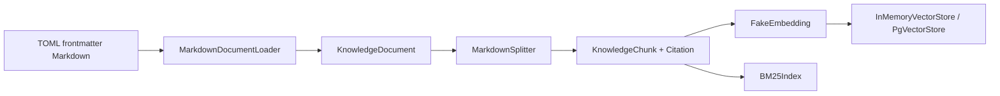
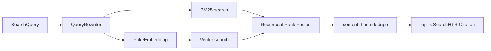

# 07 RAG 索引和检索

## 当前 RAG 用途

RAG 为两个知识工具提供数据:

- `search_runbooks`
- `search_similar_incidents`

它不直接控制 Graph。`RagKnowledgeProvider` 把 RetrievalResult 转成共享 Evidence 契约。

## 索引链路



### Loader

Loader 只读取配置根目录中的 UTF-8 Markdown, 并在完整读取前限制文件大小。frontmatter 被 Pydantic 校验为 `KnowledgeDocument`。

删除路径 containment 检查会允许错误配置读取知识目录之外的文件。

### Splitter

Splitter 先按 Markdown heading 分节, 只在超长小节内部执行 overlap。每个 Chunk 继承:

- document ID/type/title。
- service/environment tags。
- version/effective time。
- section path。
- content hash 和 Citation。

Citation locator 包含 section path 和 chunk ordinal, 能回到文档位置。

### Fake Embedding

当前 embedding 是固定维度 signed-hash 向量。它用于验证:

- 相同输入产生相同向量。
- 向量存储和版本隔离可运行。
- 默认测试不访问在线 embedding。

它不是语义质量模型。

## 幂等写入

`HybridRetriever.ingest()` 的顺序是:

```text
检查重复 document ID
→ split 全部输入
→ embed 全部新 Chunk
→ 构造更新后的 document/chunk 映射
→ VectorStore.replace_documents
→ BM25 rebuild
→ 提交 Retriever 内部状态
```

相同 document ID 会替换旧 Chunk, 不会无限追加。新 embedding 失败发生在内部状态提交之前, 原索引仍可使用。

## 查询链路



### Query Rewrite

当前 rewrite 是透明规则表, 扩展 `db/postgresql/timeout/pool/checkout` 和少量中文短语。输出保留原词并追加去重别名。

### Metadata Filter

BM25 和 VectorStore 使用同一个 `chunk_matches_filter()`。支持 service、environment、document type 和 effective time。

若两个后端使用不同 filter 语义, RRF 会混入本应不可见的候选。

### BM25 与 Vector

- BM25 擅长错误码、配置名和精确术语。
- Vector 分支提供不同的相似度召回路径。
- 当前 Fake Vector 的语义能力有限, 不能夸大。

### RRF

每个候选的融合分数:

```text
score(chunk) += 1 / (rrf_k + rank)
```

RRF 使用排名而非原始分数, 避免直接比较 BM25 分数和 cosine 相似度。相同融合分数使用稳定 `chunk_id` 打破平局。

### 去重与引用

融合后按 `content_hash` 去重。保留排名最高 Chunk 的完整 Citation。`RagKnowledgeProvider` 再将命中转换为 Evidence, Citation 不会被模型重写。

## Experimental：PgVectorStore 的真实边界

`PgVectorStore` 已实现参数化 SQL Adapter 和事务式 replace, 但只有 recording fake 合同
测试；默认 RAG 没有连接 Compose PostgreSQL，也没有 live 数据库 RAG 验收。它不会在
运行时隐式建表，不能描述成 Current 默认能力。

后端类比:

- `VectorStore` 是 Repository port。
- `InMemoryVectorStore` 是测试 Adapter。
- `PgVectorStore` 是数据库 Adapter, 仍需要外部 migration 和 session 实现。

下一步: [调查循环与假设](08-investigation-loop-and-hypotheses.md)。
