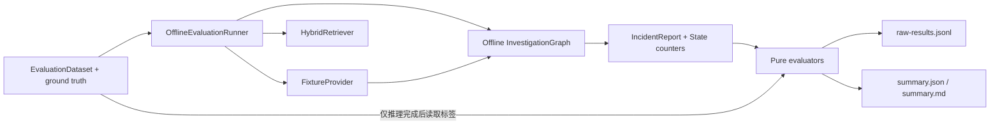

# 11 Evaluation 与测试

## 测试和 Evaluation 的区别

```text
测试
  验证代码契约是否按预期工作

Evaluation
  在版本化事故样例上衡量 Agent 输出质量和资源使用
```

`194 passed` 不能解释为 194 个事故都诊断正确。它只表示当前自动化测试全部通过。

## 离线 Evaluation 数据流



## Ground truth 隔离

每个 EvaluationSample 同时包含 fixture 路径、retrieval query 和 ground truth。Runner 的正确顺序是:

1. 从 Fixture 读取 `IncidentContext`。
2. 用 Incident 的 services 构造检索 filter。
3. 执行 Graph。
4. Graph 完成后才读取 ground truth 计算指标。

如果使用 `ground_truth.affected_services` 作为检索 filter, 就会把答案标签泄漏给 Agent。集成测试专门用错误标签验证这一点。

## 当前数据集

版本 `1.0.0` 包含三个脱敏样例:

- payment-service 数据库连接池上限回归。
- checkout-service DNS resolver 配置错误。
- inventory-service cache TTL 回归。

数据集与 Fake Model、知识库同仓, 所以它是回归集, 不是生产泛化集。

## 指标

| 指标 | 当前实现 |
| --- | --- |
| 服务定位 | 服务集合 exact match + precision/recall/F1 |
| 故障类型 | 透明词法 taxonomy |
| Recall@K | 前 K 个去重文档覆盖率 |
| MRR | 第一个相关文档倒数排名 |
| 工具选择 | 工具名集合 F1 |
| 工具参数 | 只比较标签指定字段, 同名多轮调用取最佳匹配 |
| Evidence relevance | supporting Evidence ID 集合 F1 |
| Citation reference consistency | EvidenceRef 与报告 Citation 的 ID、URI、locator、算法和 hash 一致 |
| Citation locator resolvability | Repository resolver 能按 locator 取回 fixture/knowledge 内容 |
| Citation content integrity | 对成功解析的内容按版本化 canonical hashing 复算 |
| 根因准确率 | 版本化根因词项覆盖阈值 |
| 调查资源 | 轮数、工具、模型、wall-clock、Token |

根因准确率不是 LLM judge, 对同义表达能力有限。Fake Token 是字符估算, 成本没有定价时明确为 unavailable。

## 为什么保留 raw-results.jsonl

聚合平均值可能隐藏:

- 某个失败样例。
- 某类工具参数持续错误。
- 任一 Citation 验证层的分母为空。
- 某样例使用异常多轮次。

Runner 因此先写逐样例结果, 再写 summary。单样例异常会成为 `SampleStatus.FAILED`, 仍计入 sample/failed count。

## 测试分层

### 领域单元测试

验证时间带时区、ID、分数、Evidence 外键和报告一致性。

### Graph 单元测试

验证 reducer 性质、路由优先级和 Fake Model Schema。

### 组件测试

验证 Registry、Provider、RAG loader/splitter/vector store 和 evaluator。

### 集成测试

验证完整 Graph、HITL、Service、HTTP/SSE、Prometheus Adapter 边界和 Evaluation Runner。

## 关键测试为什么有价值

| 测试设计 | 能证明什么 |
| --- | --- |
| 并行 barrier | Send 分支确实同时启动 |
| maximum rounds | 循环精确停止 |
| expired deadline | 不调用工具和外部模型 |
| invalid structured output | 有限重试后降级 |
| one provider failure | 兄弟分支不被取消 |
| rebuilt graph resume | 同一 saver/thread 可恢复 |
| duplicate resume | HITL 只能被认领一次 |
| network socket rejection | 默认 Evaluation 不联网 |

## 运行命令

```text
uv run pytest
uv run python -m scripts.evaluate_offline --output-dir artifacts/evaluation/manual
```

历史 Phase 6 数值记录在 `docs/EVALUATION.md`; 其中时延只代表当时单机三样例运行, 不能作为稳定 benchmark。

下一步: [本地运行和演示](12-local-run-and-demo.md)。
