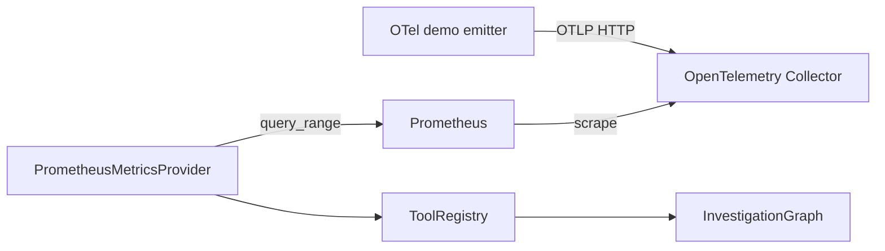

# 12 本地运行和演示

## 最小环境

- Python 3.11–3.13。
- uv。
- Docker Desktop 仅用于 Prometheus/PostgreSQL 演示。

## 完全离线路径

```text
uv sync
uv run pytest
uv run python scripts/run_investigation.py
```

这条路径使用:

- Fixture Provider。
- 本地 Hybrid RAG。
- Fake Model 和 Fake Embedding。
- 无 Checkpointer 的单次 Graph invoke。

它不需要 API Key、数据库或网络。

## 启动 API

```text
uv run uvicorn incident_copilot.main:app --reload
```

检查:

```text
http://127.0.0.1:8000/health
http://127.0.0.1:8000/docs
```

另一个终端执行:

```text
uv run python scripts/run_api_demo.py
```

脚本会创建调查、等待 `waiting_review`、读取 SSE、提交 accept 并等待 completed。

## RAG 演示

```text
uv run python scripts/ingest_knowledge.py
uv run python scripts/search_knowledge.py --query "database connection pool timeout" --service payment-service --top-k 3
```

观察输出中的:

- original/rewritten query。
- document ID 和 type。
- `matched_by` 是否包含 bm25/vector。
- section path 和 Citation。

## Evaluation

```text
uv run python -m scripts.evaluate_offline --output-dir artifacts/evaluation/manual
```

检查三个文件:

- `raw-results.jsonl`
- `summary.json`
- `summary.md`

不要只看 summary; 逐样例结果才包含真实工具调用和完整报告。

## 真实指标链路

```text
docker compose --profile demo up --build --abort-on-container-exit --exit-code-from demo demo
```

真实数据路径:



注意 Prometheus 抓取 Collector exporter, 图中的 scrape 箭头方向表示 Prometheus 主动读取 Collector。

成功时输出包含 `ev_prom_*` Evidence。失败时脚本非零退出, 不回退伪造 metrics。

清理:

```text
docker compose --profile demo down -v --remove-orphans
```

该命令会删除本 Compose 项目的演示卷。执行前确认没有需要保留的本地演示数据。

## Compose API 与 PostgreSQL Checkpoint

```text
docker compose up -d --build api
uv run python scripts/run_api_demo.py --live-window
docker compose --profile demo down -v --remove-orphans
```

该路径使用 PostgreSQL Checkpointer, 但任务和 SSE Repository 仍在 API 进程内存中。

## 常见排错

### uv 无法执行

确认新终端中的 `uv --version` 和 PATH。项目也可以使用已创建的 `.venv`, 但受支持命令仍以 uv 为准。

### Docker 虚拟化错误

检查 BIOS/UEFI AMD-V/SVM 或 Intel VT-x、Windows Hypervisor、Virtual Machine Platform 和 WSL2, 重启后确认 `docker version` 有 Server 输出。

### demo 等不到指标

```text
docker compose logs otel-collector
docker compose logs telemetry-emitter
docker compose logs prometheus
```

### API 一直 running

查看 API 日志和 `/events`, 判断卡在 Provider、模型 deadline 还是 Repository 状态。默认 Fixture 调查应很快到 waiting_review。

下一步: [常见问题和面试问答](13-faq-and-interview.md)。
