# IncidentCopilot 中文教学版

> 本文档由分章教学文件自动合并生成。需要维护内容时请修改分章文件,然后运行
> `uv run python scripts/build_learning_guide.py` 重新生成。

## 目录

- [IncidentCopilot 中文学习中心](#learning-home)
- [00 学习路线](#chapter-00)
- [01 项目整体介绍](#chapter-01)
- [02 项目目录和模块关系](#chapter-02)
- [03 一次请求的完整生命周期](#chapter-03)
- [04 IncidentState 与 Reducer](#chapter-04)
- [05 Graph、Node、Edge 与调查循环](#chapter-05)
- [06 Provider、Tool 和 Evidence 数据流](#chapter-06)
- [07 RAG 索引和检索](#chapter-07)
- [08 调查循环与假设](#chapter-08)
- [09 FastAPI 与异步任务](#chapter-09)
- [10 Checkpoint、Streaming 与 Human-in-the-loop](#chapter-10)
- [11 Evaluation 与测试](#chapter-11)
- [12 本地运行和演示](#chapter-12)
- [13 常见问题和面试问答](#chapter-13)
- [14 术语表](#chapter-14)
- [核心源码阅读索引](#core-reading-index)
- [01 `main.py`：应用组合根](#walkthrough-01)
- [02 `investigations.py`：HTTP 与 SSE 适配层](#walkthrough-02)
- [03 `service.py`：任务生命周期与 Graph 桥梁](#walkthrough-03)
- [04 `checkpoint.py`：可恢复执行资源](#walkthrough-04)
- [05 `state.py`：State 与 Reducer](#walkthrough-05)
- [06 `builder.py`：真实 Graph、边与并行分发](#walkthrough-06)
- [07 `nodes.py`：十个核心 Node](#walkthrough-07)
- [08 `routing.py`：确定性停止与下一节点](#walkthrough-08)
- [09 `model.py`：模型端口与确定性 Fake](#walkthrough-09)
- [10 `registry.py`：工具白名单与执行边界](#walkthrough-10)
- [11 `retrieval.py`：幂等索引与 Hybrid Search](#walkthrough-11)
- [12 `runner.py`：离线 Evaluation 编排](#walkthrough-12)

---

<a id="learning-home"></a>

## IncidentCopilot 中文学习中心

这套文档面向已经理解 LangGraph 基本概念、但还不熟悉完整 AI 后端工程的读者。文档解释的是当前仓库真实实现, 不是理想化架构。

建议直接阅读合并后的完整文档：[IncidentCopilot 中文教学版完整文档](INCIDENT_COPILOT_LEARNING_GUIDE.md)。

当前目录中的分章文件是完整文档的维护源。修改分章后执行：

```text
uv run python scripts/build_learning_guide.py
```

业务实现基线为 `26f6130`。后续只调整了教学注释和文档组织;Graph 结构、函数签名和业务逻辑没有变化。

### 推荐入口

1. [学习路线](#chapter-00)
2. [项目整体介绍](#chapter-01)
3. [目录和模块关系](#chapter-02)
4. [一次请求的完整生命周期](#chapter-03)
5. [State 和 Reducer](#chapter-04)
6. [Graph、Node、Edge 与调查循环](#chapter-05)
7. [Provider、Tool 和 Evidence](#chapter-06)
8. [RAG 索引和检索](#chapter-07)
9. [调查循环与假设](#chapter-08)
10. [FastAPI 与异步任务](#chapter-09)
11. [Checkpoint、Streaming 与 HITL](#chapter-10)
12. [Evaluation 与测试](#chapter-11)
13. [本地运行和演示](#chapter-12)
14. [常见问题和面试问答](#chapter-13)
15. [术语表](#chapter-14)

需要直接读代码时, 使用[核心源码阅读索引](#core-reading-index)进入逐文件源码解读。

### 阅读约定

- “State 读取/写入”专指 LangGraph `InvestigationState`。
- “任务状态”专指 `InvestigationRecord.status`。
- “Checkpoint”保存 Graph 执行快照, 不等于业务 Repository。
- “真实 Prometheus”表示真实经过 HTTP API 的指标链路; 其他数据源仍可能来自 Fixture。
- 文档中的流程图只展示源码中存在的节点、函数和依赖。

### 当前生产化边界

当前实现没有真实 LLM、持久化 Investigation/Event Repository、外部 Evidence Store、Loki/Tempo Adapter、分布式 worker 或自动修复能力。教学文档会明确这些边界, 不把作品集实现描述成完整生产系统。

---

<a id="chapter-00"></a>

## 00 学习路线

### 学习目标

完成这套文档后, 你应能回答四个问题:

1. 一次 HTTP 请求如何变成可恢复的 LangGraph 调查。
2. 并行工具结果为什么不会互相覆盖。
3. 模型为什么不能决定无限循环或执行任意工具。
4. 报告中的 Evidence ID 和 Citation 如何一路保留下来。

### 三条阅读路线

#### 路线 A: 先跑起来

适合第一次接触仓库的读者。

```text
01 项目介绍
→ 02 目录关系
→ 12 本地运行
→ 03 请求生命周期
→ 14 术语表
```

完成标志: 能启动 API、运行离线调查, 并知道输出来自 Fixture/Fake Model 而非在线服务。

#### 路线 B: 学 LangGraph 工程化

```text
03 请求生命周期
→ 04 State 与 Reducer
→ 05 Graph 与 Node
→ 08 调查循环与假设
→ 10 Checkpoint 与 HITL
→ graph/state.py、builder.py、nodes.py walkthrough
```

完成标志: 能解释 `Send`、superstep、reducer、conditional edge、interrupt 和 `thread_id`。

#### 路线 C: 学 AI 后端边界

```text
06 Provider 与 Tool
→ 07 RAG
→ 09 FastAPI 与异步任务
→ 11 Evaluation 与测试
→ tools/registry.py、rag/retrieval.py、evaluation/runner.py walkthrough
```

完成标志: 能解释输入校验、超时重试、引用保留、离线评估和标签隔离。

### 推荐实践节奏

每读完一个专题, 按以下顺序练习:

1. 找到文档列出的真实文件和函数。
2. 先读函数 docstring, 再看对应 walkthrough。
3. 运行该模块的定向测试。
4. 修改一个 Fixture 参数并观察测试为什么失败。
5. 不要一开始就接真实 LLM; 先保持控制流可复现。

### 关键检查点

| 阶段 | 你应该能解释 | 对应测试 |
| --- | --- | --- |
| 请求入口 | 202 为什么不是完成 | `test_investigation_api_phase5.py` |
| State | 并行计数为何返回增量 | `test_reducers.py` |
| Graph | 7 个工具如何真正并行 | `test_investigation_graph.py` |
| Tool | Provider 越界结果为何被拒绝 | `test_registry.py` |
| RAG | BM25 和向量分数为何不直接相加 | `test_retrieval.py` |
| HITL | 重复恢复为什么返回冲突 | `test_investigation_service.py` |
| Evaluation | ground truth 为什么不进入 Graph | `test_offline_evaluation.py` |

### 不建议的阅读方式

- 不要只读 `nodes.py` 而跳过 `state.py` 和 `routing.py`。
- 不要把 `FakeModelProvider` 的规则输出理解为真实模型能力。
- 不要把 PostgreSQL Checkpointer 理解为完整任务持久化。
- 不要把测试通过数当作诊断准确率。

下一步: [项目整体介绍](#chapter-01)。

---

<a id="chapter-01"></a>

## 01 项目整体介绍

### 项目解决什么问题

微服务故障调查通常要同时查看日志、指标、Trace、配置变更、拓扑、Runbook 和历史事故。IncidentCopilot 把这个过程建模为一个受预算约束、可恢复、带引用的调查工作流。

核心不是“让模型猜根因”, 而是:

- 让模型只产生结构化计划、假设、充分性建议和报告草稿。
- 让 Graph 决定控制流和循环终止。
- 让 Tool Registry 决定哪些只读操作可以执行。
- 让 Evidence 和 Citation 承载可审计事实。
- 让人工审核控制高风险建议的最终确认。

### 当前真实能力

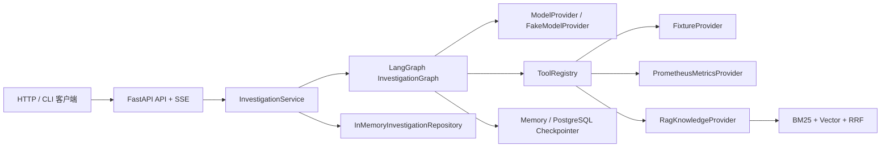

这张图对应当前装配关系:

- `main.create_app()` 创建 Service。
- `graph.bootstrap` 创建离线或混合 Graph。
- `graph.builder` 将节点编译成 `InvestigationGraph`。
- `tools.builtin` 把 Provider 包装成七个工具。
- RAG 只通过 `KnowledgeProvider` 进入工具层, Graph 不直接调用 Retriever。

### 三种运行事实

| 路径 | Metrics | 其他观测源 | 模型 | Checkpoint |
| --- | --- | --- | --- | --- |
| 默认离线 | Fixture | Fixture + 本地 RAG | Fake | Memory |
| Compose API | Prometheus | Fixture + 本地 RAG | Fake | PostgreSQL |
| 单次真实指标演示 | Prometheus | Fixture + 本地 RAG | Fake | 可选 |

Prometheus 指标虽然真实经过 OTLP、Collector、Prometheus 和 HTTP API, 但指标发生器仍是仓库内 synthetic demo。项目没有声称接入生产数据。

### 为什么选 LangGraph

普通顺序函数可以完成一次查询, 但本项目还需要:

- 根据计划动态产生多个并行任务。
- 合并并行分支更新。
- 在证据不足时进入有限下一轮。
- 在高风险建议前暂停。
- 使用同一 `thread_id` 恢复执行。
- 对所有路径做确定性测试。

这些需求正好对应 `StateGraph`、`Send`、reducer、conditional edge、checkpointer、`interrupt()` 和 `Command(resume=...)`。

### 关键安全边界

1. 所有工具只读。
2. 模型不能返回任意节点名直接控制跳转。
3. 工具参数必须经过 Pydantic Schema。
4. 研究轮数、工具、模型、Token 和 deadline 都有上限。
5. 最终 Citation 来自已收集 Evidence, 不是模型自由文本。
6. 高风险 remediation 必须进入人工审核。

### 当前没有实现什么

- 真实 LLM 和真实 embedding。
- Loki、Tempo、真实变更和拓扑 Adapter。
- 持久化 Investigation/Event Repository。
- 外部 Evidence Store。
- 自动回滚、扩容、重启或配置写入。
- 鉴权、多租户和分布式 worker。

下一步: [项目目录和模块关系](#chapter-02)。

---

<a id="chapter-02"></a>

## 02 项目目录和模块关系

### 顶层目录

```text
incident-copilot/
├── src/incident_copilot/   Python 应用源码
├── tests/                  单元与集成测试
├── data/                   Fixture、知识库和评估集
├── scripts/                演示、索引、评估和图检查入口
├── docs/                   产品、架构、进度和教学文档
├── artifacts/              已提交的离线评估基线
├── deploy/                 Collector 与 Prometheus 配置
├── compose.yaml            本地容器编排
├── Dockerfile              应用镜像
├── pyproject.toml          依赖和质量工具配置
└── uv.lock                 精确依赖锁
```

项目采用 `src` layout。可导入包名仍是 `incident_copilot`, 而不是 `src.incident_copilot`。

### 源码模块职责

| 模块 | 主要职责 | 不应承担 |
| --- | --- | --- |
| `api/` | HTTP/SSE 协议转换 | 根因推理和 Provider 查询 |
| `core/` | 配置、日志、异常、Telemetry | Graph 控制流 |
| `domain/` | 领域值对象和不变量 | FastAPI/LangGraph 依赖 |
| `graph/` | State、节点、边、循环和模型端口 | 直接读文件或厂商 SDK |
| `tools/` | 工具 Schema、Registry、Provider 端口和 Adapter | 决定 Graph 路由 |
| `rag/` | 文档加载、切分、索引和检索 | 调查任务状态管理 |
| `investigations/` | 任务生命周期、事件、Repository、Checkpoint 装配 | Evidence 推理 |
| `evaluation/` | 数据集和离线指标 | 把标签注入 Graph |
| `fixtures/` | Fixture 外层 Schema | 真实数据访问 |

### 依赖方向

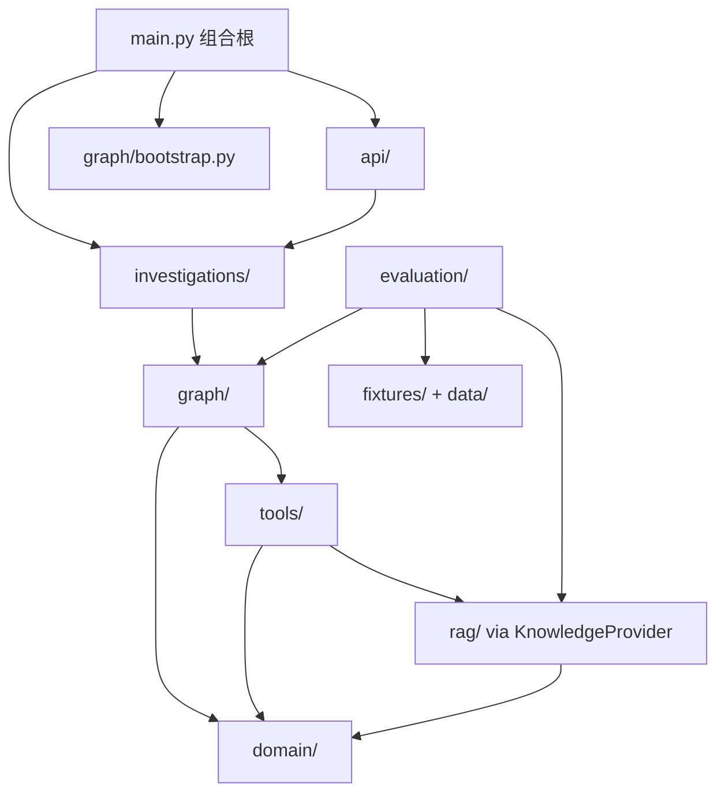

注意实际方向:

- `domain/` 不导入 FastAPI、LangGraph 或具体 Provider。
- `graph/nodes.py` 只调用注入的 `ToolRegistry` 和 `ModelProvider`。
- `rag/provider.py` 适配 `KnowledgeProvider`, 所以工具名不因 RAG 实现改变。
- `investigations/service.py` 可以启动 Graph, 但不实现节点推理。

### 数据分别放在哪里

| 数据 | 当前位置 |
| --- | --- |
| HTTP 请求 | Pydantic API Schema |
| 事故上下文 | `IncidentContext` |
| Graph 执行状态 | `InvestigationState` + Checkpointer |
| 任务状态 | `InvestigationRecord` + 当前内存 Repository |
| SSE 事件 | `InvestigationEvent` + 当前内存 Repository |
| 工具原始结果 | `Evidence`, 随后投影为 `EvidenceRef` |
| 知识文档 | `data/knowledge/*.md` |
| 评估标签 | `data/evaluation/incidents-v1.json` |

当前没有独立 Evidence Store。Graph State 保存有界 `EvidenceRef`, 并非只保存 Evidence ID。

### 测试目录怎么读

- `tests/unit/domain`: 验证领域不变量。
- `tests/unit/graph`: 验证 reducer、路由和 Fake Model。
- `tests/unit/tools`: 验证 Registry 和 Provider 边界。
- `tests/unit/rag`: 验证加载、切分、检索和向量 Adapter。
- `tests/integration/test_investigation_graph.py`: 验证完整 Graph 路径。
- `tests/integration/test_investigation_service.py`: 验证任务生命周期。
- `tests/integration/test_investigation_api_phase5.py`: 验证 HTTP/SSE/HITL。
- `tests/integration/test_offline_evaluation.py`: 验证评估隔离和产物。

下一步: [一次请求的完整生命周期](#chapter-03)。

---

<a id="chapter-03"></a>

## 03 一次请求的完整生命周期

本章跟踪真实端点 `POST /api/v1/investigations`。函数名和节点名均来自当前源码。

### 总体时序

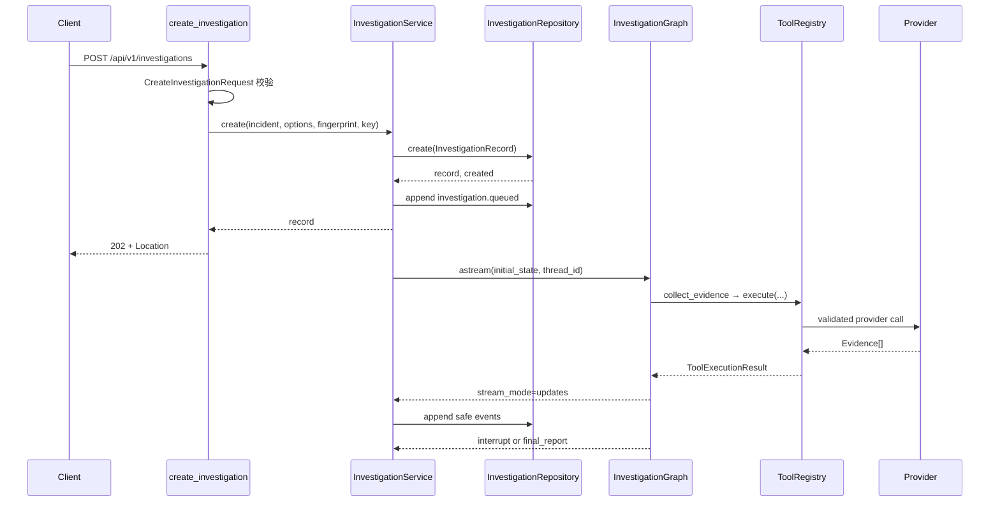

### 第 1 步: FastAPI 校验

路由函数是 `api.routes.investigations.create_investigation`。

```python
incident = payload.to_incident(f"inc_{uuid4().hex}")
record, created = await _service(request).create(
    incident=incident,
    options=payload.options,
    request_fingerprint=payload.fingerprint(),
    idempotency_key=idempotency_key,
)
```

- 输入来自 HTTP JSON 和可选 `Idempotency-Key` Header。
- `CreateInvestigationRequest` 先完成字段校验。
- `to_incident()` 转成领域对象, API 不把原始 dict 传进 Graph。
- 输出交给 `InvestigationService.create()`。
- 这里不直接运行 Graph, 所以响应可以快速返回 202。

### 第 2 步: 创建任务标识

Service 创建三种 ID:

- `investigation_id`: API 资源标识。
- `thread_id`: LangGraph checkpoint 标识。
- `run_id`: 本次初始或恢复执行标识。

当前 `investigation_id` 和 `thread_id` 使用同一个 UUID 后缀。恢复时 thread 不变, run 会更新。

### 第 3 步: 幂等创建和后台任务

Repository 根据 idempotency key 和 request fingerprint 返回新建或重放结果。只有新任务才执行:

```python
await self._append_event(record, EventType.INVESTIGATION_QUEUED, ...)
self._start_task(record.investigation_id, self._run_initial(...))
```

`asyncio.create_task()` 让 HTTP 请求不必等待整张 Graph。后端类比是“进程内任务调度”, 不是 Kafka/Celery 等分布式队列。

删除后台任务层的影响: POST 将阻塞到调查暂停或结束, 客户端超时风险显著增加。

### 第 4 步: 初始化 Graph State

`_run_initial()` 把任务改为 running, 然后调用 `create_initial_state()`。初始 State 包含:

- IncidentContext。
- 空 Evidence、Hypothesis 和错误集合。
- 研究轮数 1。
- 工具、模型、Token、并发和 deadline 预算。

随后 `_execute()` 使用:

```python
config = {"configurable": {"thread_id": record.thread_id}}
async for update in graph.astream(initial, config, stream_mode="updates"):
    ...
```

### 第 5 步: Graph 调查

真实节点顺序为:

```text
parse_incident
→ build_investigation_plan
→ collect_evidence (多个 Send)
→ aggregate_evidence
→ generate_hypotheses
→ verify_hypotheses
→ judge_evidence
→ refine_investigation 或 generate_report
→ human_review 或 END
```

下一节点不是模型自由选择。`routing.py` 返回预声明节点名, `builder.py` 把结果映射到真实 edge。

### 第 6 步: 工具数据流

每个 `collect_evidence` 分支读取 `current_step`, 构造 `QueryContext`, 调用:

```text
ToolRegistry.execute
→ Pydantic input
→ timeout / retry / deadline
→ Provider
→ Evidence boundary validation
→ EvidenceRef
→ State reducer
```

单个 Provider 失败会产生 `StepResult.FAILED` 和 `InvestigationError`, 同一批其他分支仍可完成。

### 第 7 步: Service 投影事件

Graph 的 `stream_mode="updates"` 返回节点增量。Service 将其转换成允许公开的事件:

- `node.completed`
- `tool.completed` / `tool.failed`
- `evidence.added`
- `hypothesis.updated`
- `budget.updated`
- `review.required`
- `report.completed`

原始 Graph State 和工具完整 payload 不直接进入 SSE。

### 第 8 步: 暂停或完成

报告含 high/critical remediation 时进入 `human_review`。`interrupt()` 让 Graph 在该 thread 上暂停, Service 把任务状态改为 `waiting_review`。

客户端随后调用:

```text
POST /api/v1/investigations/{id}/resume
```

- `accept` → `Command(resume=...)` → END → completed。
- `request_more_research` → 预算检查 → refine → 再次调查 → 再次审核。

### 失败路径

| 失败点 | 结果 |
| --- | --- |
| 请求 Schema 非法 | HTTP 422 |
| 幂等键载荷冲突 | HTTP 409 |
| Provider 失败 | Graph 记录错误并降级 |
| 模型输出非法 | 最多有限重试后 Fake fallback |
| deadline/预算耗尽 | 生成受限报告 |
| Graph 完成但无报告 | 任务标记 failed |
| 重复 resume | HTTP 409 |

下一步: [IncidentState 详细解释](#chapter-04)。

---

<a id="chapter-04"></a>

## 04 IncidentState 与 Reducer

### State 的角色

`InvestigationState` 位于 `graph/state.py`, 是 LangGraph 节点之间共享的通道定义。它使用 `TypedDict(total=False)`, 允许节点只返回最小字段增量。

```python
class InvestigationState(TypedDict, total=False):
    incident: IncidentContext
    completed_steps: Annotated[tuple[StepResult, ...], merge_step_results]
    evidence: Annotated[tuple[EvidenceRef, ...], merge_evidence]
    tool_call_count: Annotated[int, add_count]
    ...
```

这里有两类更新语义:

- 普通字段: 新值覆盖旧值。
- `Annotated[T, reducer]`: LangGraph 用 reducer 合并多个更新。

如果把 `evidence` 的 reducer 删除, 多个并行 `collect_evidence` 分支会互相覆盖, 最终通常只剩一个分支的结果。

### 字段分组

#### 输入和计划

| 字段 | 类型 | 主要写入者 | 主要读取者 |
| --- | --- | --- | --- |
| `incident` | `IncidentContext` | `create_initial_state` | 几乎所有节点 |
| `investigation_plan` | `InvestigationPlan` | plan/refine | dispatch、事件投影 |
| `pending_steps` | tuple | plan/refine | dispatch |
| `current_step` | `InvestigationStep` | `Send` scoped state | collect |
| `completed_steps` | reducer tuple | collect | dispatch、Evaluation |

`current_step` 只存在于单个 `Send` 分支的最小 State 中。它不是所有并行步骤共享的全局游标。

#### 证据和假设

| 字段 | 更新方式 | 说明 |
| --- | --- | --- |
| `evidence` | `merge_evidence` | 按 Evidence ID 去重, 全局 top 100 |
| `hypotheses` | 覆盖 | 每轮保存当前校验后版本 |
| `evidence_sufficient` | 覆盖 | judge 的结构化结果与确定性规则共同决定 |
| `sufficiency_reason` | 覆盖 | 当前充分性解释 |
| `next_investigation_queries` | 覆盖 | 下一轮结构化查询意图 |

State 保存 `EvidenceRef`, 不保存 `Evidence.content`。这是为了控制 checkpoint 和模型上下文大小。

#### 预算和停止

| 字段 | 意义 |
| --- | --- |
| `research_round` / `max_research_rounds` | 当前轮与最大轮数 |
| `tool_call_count` / `max_tool_calls` | 工具实际尝试与上限 |
| `max_parallel_tools` | 单批最大并发分支 |
| `model_call_count` / `max_model_calls` | 模型调用与上限 |
| `model_usage` / `max_estimated_tokens` | Token usage 与预算 |
| `deadline_at` / `deadline_exceeded` | 调查总时间边界 |
| `stop_reason` | 最终停止原因 |

计数字段的节点输出是“本节点增量”, 不是累计总数。例如每个 collect 分支返回 `tool_call_count=1`, `add_count` 才负责合并。

#### 输出、错误和审核

- `errors`: `merge_errors` 去重并限制为 100。
- `final_report`: `generate_report` 覆盖写入。
- `human_feedback`: `human_review` 恢复后写入。
- `review_completed`: 接受审核时为 true。

### Reducer 为什么必须确定性

```python
def add_count(left: int, right: int) -> int:
    return left + right
```

并行分支 A、B 无论谁先完成, `1 + 1` 都是 2。若节点读取旧总数并返回 `old + 1`, 两个分支可能都读到 0 并各写 1, 造成丢失更新。

集合 reducer 更复杂:

```text
left + right
→ 按稳定 ID 建表
→ 同 ID 冲突使用 rank + canonical JSON 决定胜者
→ 稳定排序
→ 上限裁剪
```

这让 reducer 具备以下性质:

- 幂等: `merge(x, x) == x`。
- 交换等价: `merge(a, b) == merge(b, a)`。
- 结合等价: 分批合并与一次合并一致。

相关测试位于 `tests/unit/graph/test_reducers.py`。

### 初始 State

`create_initial_state()` 是预算字段的可信写入者。它接收经过领域校验的 Incident 和 `InvestigationOptions`, 计算:

```python
started_at = clock()
deadline_at = started_at + timedelta(seconds=policy.timeout_seconds)
```

模型不会得到修改最大轮数或 deadline 的权限。删除这个集中初始化会让不同入口产生不一致默认值。

### State 与任务状态不是一回事

```text
InvestigationState
  LangGraph 节点数据和 checkpoint

InvestigationRecord
  API 任务资源和 pending/running/waiting_review 等状态
```

后端工程类比:

- `InvestigationState` 类似工作流引擎实例变量。
- `InvestigationRecord` 类似业务任务表。
- `InvestigationEvent` 类似面向客户端的事件日志。

下一步: [Graph、Node 与调查循环](#chapter-05)。

---

<a id="chapter-05"></a>

## 05 Graph、Node、Edge 与调查循环

### 当前真实 Graph

下面的节点和连接来自 `graph/builder.py` 与当前编译图, 没有加入 API、SSE 或 Checkpoint 等图外组件。

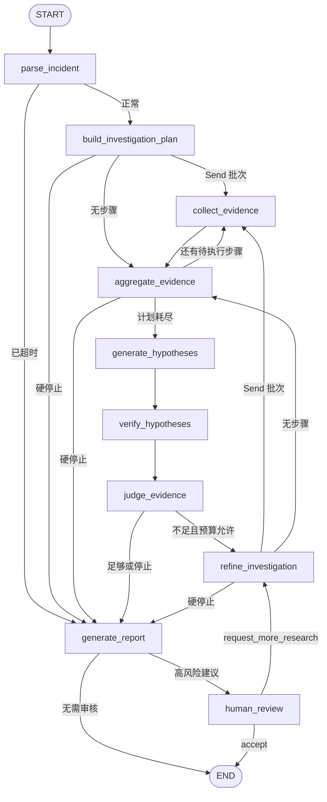

源码逐字符 Mermaid 仍以 `docs/GRAPH_CURRENT.md` 为准。

### Node 是什么

Node 是接收 State 并返回更新的函数。示例:

```python
async def aggregate_evidence(self, state: InvestigationState) -> InvestigationState:
    update = {"deadline_exceeded": deadline_exceeded}
    if reason is not None:
        update["stop_reason"] = reason
    return update
```

它不返回完整 State 副本, 只返回自己负责的字段。好处是:

- 并行分支可以通过 reducer 合并。
- 每个节点写权限更清晰。
- streaming 可以观察节点增量。

### Edge 与 Conditional Edge

普通 Edge 永远跳到固定下一节点:

```python
builder.add_edge("generate_hypotheses", "verify_hypotheses")
```

Conditional Edge 调用纯函数选择预声明目标:

```python
builder.add_conditional_edges(
    "judge_evidence",
    route_after_judge,
    path_map={
        "refine_investigation": "refine_investigation",
        "generate_report": "generate_report",
    },
)
```

`path_map` 的作用类似后端白名单路由表。即使模型产生恶意文本, 也不能跳到任意 Python 函数。

### Send 动态并行

计划步骤数量在运行前不固定, 所以 builder 使用:

```python
Send(
    "collect_evidence",
    {
        "incident": state["incident"],
        "current_step": step,
        "deadline_at": state["deadline_at"],
    },
)
```

每个 Send 分支只收到执行单个步骤需要的字段。多个分支在同一 superstep 中运行, 然后统一进入 `aggregate_evidence`。

为什么不是 `asyncio.gather()`:

- `Send` 是 Graph 的真实控制流, 能参与 streaming 和 reducer。
- LangGraph 知道每个分支的节点身份。
- Checkpoint 和图可视化保持统一。

相关并行测试使用 barrier: 七个分支必须全部到达才释放。若实际串行, 测试会阻塞。

### 分批并发

```python
remaining = max_tool_calls - tool_call_count
limit = min(remaining, max_parallel_tools)
selected = candidates[:limit]
```

如果计划有 7 步但 `max_parallel_tools=2`, Graph 会执行:

```text
2 个 collect → aggregate
→ 2 个 collect → aggregate
→ 2 个 collect → aggregate
→ 1 个 collect → aggregate
→ hypotheses
```

删除 aggregate 回边会让并发上限之外的步骤直接丢失。

### 调查循环

`judge_evidence` 之后只有两类目标:

```text
REFINE: 生成增量计划并开始下一轮
REPORT: 生成最终报告
```

停止优先级来自 `routing.decide_after_judge()`:

1. deadline 或硬预算。
2. Evidence sufficient。
3. 最大研究轮数。
4. 否则 refine。

模型只给出 `SufficiencyOutput`, 最终 sufficient 还需要至少一个 supported hypothesis 和至少两种 Evidence source。

### Node 读写速查

| Node | 关键读取 | 关键写入 |
| --- | --- | --- |
| `parse_incident` | incident、deadline | deadline flag、stop reason |
| `build_investigation_plan` | incident、round、budget | plan、pending、model usage |
| `collect_evidence` | current step、deadline | step result、evidence/error、counter |
| `aggregate_evidence` | merged counters、budget | deadline、stop reason |
| `generate_hypotheses` | evidence、incident | hypotheses、model usage |
| `verify_hypotheses` | evidence、hypotheses | calibrated hypotheses |
| `judge_evidence` | hypotheses、sources、budget | sufficient、next queries、stop |
| `refine_investigation` | gaps、feedback、history | new plan、round + 1 |
| `generate_report` | 全部调查结果 | final report |
| `human_review` | report remediation | feedback、review state、Command |

下一步: [Provider、Tool 和 Evidence](#chapter-06)。

---

<a id="chapter-06"></a>

## 06 Provider、Tool 和 Evidence 数据流

### 三层职责

```text
Graph Node
  决定何时执行调查步骤
      ↓
ToolRegistry
  校验工具名、参数、预算、timeout、retry 和输出
      ↓
Provider Adapter
  查询 Fixture、Prometheus 或本地 RAG
```

Provider 不生成根因, Tool 不决定下一节点, Graph 不理解 PromQL 或 Fixture 文件格式。

### Provider Protocol

`tools/interfaces.py` 定义六个端口:

- `LogProvider.search`
- `MetricsProvider.query`
- `TraceProvider.query`
- `ChangeProvider.recent`
- `TopologyProvider.get`
- `KnowledgeProvider.search_runbooks/search_similar_incidents`

Protocol 是 Python 的结构化类型约束。实现类不必继承 Protocol, 只要方法签名兼容即可。后端类比是 Ports and Adapters 中的端口接口。

### 七个 Tool

`build_tool_registry()` 把 Provider 方法包装为七个稳定工具名。Graph 计划引用工具名, 而不是 Provider 类名。

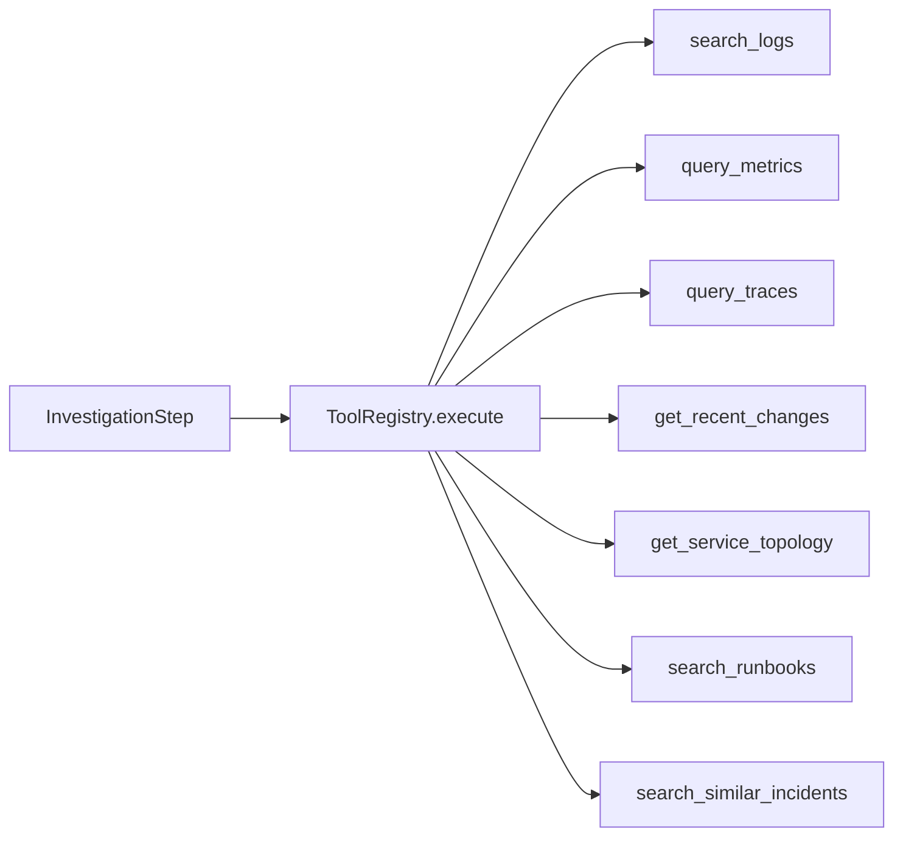

### 一次工具执行

```text
tool name allow-list
→ remaining_tool_calls
→ input_model.model_validate(arguments)
→ deadline 和单次 timeout
→ Provider handler
→ Evidence source/service/time/limit 校验
→ ToolExecutionResult
```

关键输入 `QueryContext` 包含:

- `correlation_id`: 关联一次步骤。
- `deadline`: 不允许 Provider 越过调查总时间。
- `remaining_tool_calls`: 限制本次包装器可使用的尝试数。

### Timeout 和 Retry

Registry 计算:

```python
max_attempts = min(max_retries + 1, remaining_tool_calls)
attempt_timeout = min(tool_timeout, remaining_deadline)
```

只有 retryable ProviderError 才会重试。永久参数错误和畸形响应不会通过重复调用解决。

退避前还会检查剩余 deadline。删除这一检查可能让 retry sleep 本身越过调查截止时间。

### Evidence 契约

Provider 返回完整 `Evidence`, 包含:

- 来源类型和名称。
- 服务与时间点/窗口。
- 原始或结构化 content。
- 有界 summary。
- relevance/reliability score。
- Citation 和 content hash。

Registry 会再次校验:

- source type 属于工具声明范围。
- service 与请求一致。
- Evidence 时间与查询窗口重叠。
- 类似事故位于 lookback 范围内。
- 返回数量不超过 limit。

这体现“Adapter 也是不可信输入边界”。

### EvidenceRef 为什么存在

`collect_evidence` 将每个 Evidence 转为 `EvidenceRef` 后写入 State。Ref 保留:

- ID、来源、标题、摘要。
- 服务和时间。
- 分数。
- Citation。

它不保留大体积 content。后端类比是把大对象转成工作流 DTO, 避免每个 checkpoint 复制原始日志和 span。

### Fixture 与 Prometheus 的替换关系

默认 Graph 使用一个 `FixtureProvider` 实现所有观测端口。混合 Graph 只替换 metrics:

```text
query_metrics → PrometheusMetricsProvider
其他工具 → FixtureProvider / RagKnowledgeProvider
```

显式选择 Prometheus 后若远端失败, 系统记录 metrics coverage gap, 不会暗中返回 Fixture metrics。

### Prometheus 安全边界

Adapter 不接受用户提供的任意 PromQL。它只把受支持领域指标映射为固定模板, 并限制:

- base URL。
- HTTP timeout 和响应字节。
- 序列数与样本数。
- service label 和请求时间窗。
- 非有限数值和错误 result type。

下一步: [RAG 索引和检索](#chapter-07)。

---

<a id="chapter-07"></a>

## 07 RAG 索引和检索

### 当前 RAG 用途

RAG 为两个知识工具提供数据:

- `search_runbooks`
- `search_similar_incidents`

它不直接控制 Graph。`RagKnowledgeProvider` 把 RetrievalResult 转成共享 Evidence 契约。

### 索引链路

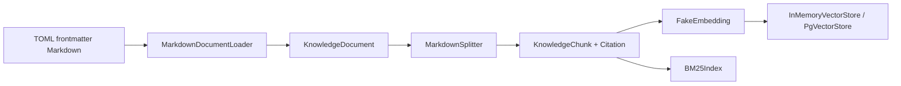

#### Loader

Loader 只读取配置根目录中的 UTF-8 Markdown, 并在完整读取前限制文件大小。frontmatter 被 Pydantic 校验为 `KnowledgeDocument`。

删除路径 containment 检查会允许错误配置读取知识目录之外的文件。

#### Splitter

Splitter 先按 Markdown heading 分节, 只在超长小节内部执行 overlap。每个 Chunk 继承:

- document ID/type/title。
- service/environment tags。
- version/effective time。
- section path。
- content hash 和 Citation。

Citation locator 包含 section path 和 chunk ordinal, 能回到文档位置。

#### Fake Embedding

当前 embedding 是固定维度 signed-hash 向量。它用于验证:

- 相同输入产生相同向量。
- 向量存储和版本隔离可运行。
- 默认测试不访问在线 embedding。

它不是语义质量模型。

### 幂等写入

`HybridRetriever.ingest()` 的顺序是:

```text
检查重复 document ID
→ split 全部输入
→ embed 全部新 Chunk
→ 构造更新后的 document/chunk 映射
→ VectorStore.replace_documents
→ BM25 rebuild
→ 提交 Retriever 内部状态
```

相同 document ID 会替换旧 Chunk, 不会无限追加。新 embedding 失败发生在内部状态提交之前, 原索引仍可使用。

### 查询链路

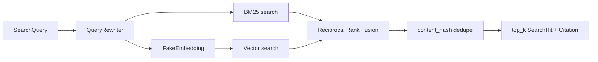

#### Query Rewrite

当前 rewrite 是透明规则表, 扩展 `db/postgresql/timeout/pool/checkout` 和少量中文短语。输出保留原词并追加去重别名。

#### Metadata Filter

BM25 和 VectorStore 使用同一个 `chunk_matches_filter()`。支持 service、environment、document type 和 effective time。

若两个后端使用不同 filter 语义, RRF 会混入本应不可见的候选。

#### BM25 与 Vector

- BM25 擅长错误码、配置名和精确术语。
- Vector 分支提供不同的相似度召回路径。
- 当前 Fake Vector 的语义能力有限, 不能夸大。

#### RRF

每个候选的融合分数:

```text
score(chunk) += 1 / (rrf_k + rank)
```

RRF 使用排名而非原始分数, 避免直接比较 BM25 分数和 cosine 相似度。相同融合分数使用稳定 `chunk_id` 打破平局。

#### 去重与引用

融合后按 `content_hash` 去重。保留排名最高 Chunk 的完整 Citation。`RagKnowledgeProvider` 再将命中转换为 Evidence, Citation 不会被模型重写。

### PgVectorStore 的真实边界

`PgVectorStore` 已实现参数化 SQL Adapter 和事务式 replace, 但默认 RAG 没有连接 Compose PostgreSQL。它也不会在运行时隐式建表。

后端类比:

- `VectorStore` 是 Repository port。
- `InMemoryVectorStore` 是测试 Adapter。
- `PgVectorStore` 是数据库 Adapter, 仍需要外部 migration 和 session 实现。

下一步: [调查循环与假设](#chapter-08)。

---

<a id="chapter-08"></a>

## 08 调查循环与假设

### 为什么需要循环

第一轮调查可能只得到症状, 没有足够独立来源支持根因。系统因此执行:

```text
计划 → 取证 → 假设 → 验证 → 充分性判断
                     ├─ 不足且预算允许 → refine
                     └─ 足够或预算停止 → report
```

循环不是“让模型继续想”, 而是产生新的结构化 VerificationQuery 和不重复工具步骤。

### 假设生成

`generate_hypotheses` 构造 `ModelContext`, 只放入有界 Evidence 摘要。Fake Model 生成 `HypothesesOutput`, 每个 Hypothesis 包含:

- description。
- affected services。
- supporting/contradicting Evidence IDs。
- confidence。
- verification queries。
- reasoning summary。

模型输出随后经过 Pydantic Schema。隐藏思维链不进入 State, 只保存短 reasoning summary。

### 确定性验证

`verify_hypotheses` 不信任模型提供的 Evidence 外键:

1. 删除 State 中不存在的 ID。
2. 避免同一 Evidence 同时支持和反对。
3. 统计 supporting evidence 的独立 source type。
4. 无支持证据时 confidence 上限为 0.2。
5. 只有单一来源时 confidence 上限为 0.55。
6. 至少两个来源才允许标记 supported。

删除这一步会让模型可以引用不存在的 Evidence, 或用单条日志给出高置信结论。

### 充分性判断

模型返回 `SufficiencyOutput`, 但最终 sufficient 还需要:

```python
sufficient = output.sufficient and supported and len(sources) >= 2
```

输入来自当前 State 的 verified hypotheses 和 Evidence source coverage。输出写入:

- `evidence_sufficient`
- `sufficiency_reason`
- `next_investigation_queries`
- 模型 usage/errors

下一节点由 `route_after_judge`, 不是由 `output.reason` 文本决定。

### Refine 如何避免重复

`_plan_update()` 对模型计划做三层限制:

1. 工具名必须存在于 Registry。
2. 使用实际 tool name + arguments 重算 `query_key`。
3. 过滤 completed query 和当前计划内重复 query。

step ID、query key 和 round 都由可信代码重建。修改为直接信任模型 ID 会破坏幂等和跨轮去重。

### 预算矩阵

| 预算 | 检查位置 | 耗尽结果 |
| --- | --- | --- |
| 总 deadline | parse、aggregate、model call | report |
| 工具总调用 | dispatch、routing | report |
| 最大并发 | dispatch batch | 分批继续 |
| 模型调用 | structured call、routing | fallback/report |
| 估算 Token | structured call、routing | fallback/report |
| 最大研究轮数 | judge route | report |

模型结构修复最多尝试两次。第二次尝试之前重新估算 Token, 防止“为了修 JSON”突破预算。

### 报告为什么可能 inconclusive

报告 disposition 不是模型草稿字段。可信节点根据:

- stop reason 是否为 evidence sufficient。
- 是否存在 supporting Evidence。

决定 probable 或 inconclusive。预算耗尽时即使有一个领先假设, root cause 也可能不写入最终报告, confidence 被限制。

### Human feedback 如何进入下一轮

`request_more_research` 中的 `requested_queries` 写入 `human_feedback`。Fake Model 的 follow-up 逻辑把这些意图映射为现有只读工具 Schema。

人工输入仍不能:

- 增加预算上限。
- 创建未知工具。
- 执行写操作。
- 绕过服务和时间范围校验。

下一步: [FastAPI 与异步任务](#chapter-09)。

---

<a id="chapter-09"></a>

## 09 FastAPI 与异步任务

### FastAPI 在项目中的边界

API 层只负责:

- Pydantic 请求/响应转换。
- Header 和路径参数。
- HTTP 状态码和错误 envelope。
- SSE StreamingResponse。
- 从 `app.state` 获取 Service。

它不直接调用 Provider, 也不实现 Graph 节点。

### 应用工厂

```python
def create_app(settings=None, investigation_service=None) -> FastAPI:
    ...
```

可选参数用于测试依赖注入。生产路径使用 `get_settings()`, 测试可传独立 Settings 或 Service, 避免修改全局环境。

### Lifespan

```text
应用启动
→ open_checkpointer
→ build graph
→ create InvestigationService
→ 写入 app.state
→ 接收请求
→ 应用关闭
→ service.aclose
→ close checkpointer
```

资源顺序很重要。若先关闭 Checkpointer 再取消后台 Graph, 正在执行的任务可能访问失效连接。

### 为什么 POST 返回 202

创建调查后, Service 使用 `asyncio.create_task()` 启动 `_run_initial()`。因此:

- HTTP 请求只确认“任务已接受”。
- 客户端通过 GET 或 SSE 观察进度。
- 高风险审核可能持续等待人工输入。

202 比 200 更准确, 因为报告尚未完成。

### async/await 的作用

Provider、Graph streaming、Repository 和 SSE 都使用 async API。`await` 会把控制权还给事件循环, 让同一进程处理其他请求。

但 async 不自动保证任何函数都非阻塞。RAG 的 BM25/向量查询是同步 CPU 工作, `RagKnowledgeProvider` 使用 `asyncio.to_thread()` 避免直接阻塞事件循环。

### 进程内 Task 的限制

`InvestigationService._tasks` 保存当前进程创建的任务。它具备:

- 任务命名。
- 完成后清理引用。
- 观察后台异常。
- 应用关闭时 cancel + gather。

它不具备:

- 跨进程 worker。
- lease 或抢占。
- 任务持久化。
- 自动重试整个调查。

后端类比: 这是应用内 background job, 不是消息队列。

### 幂等 POST

相同 Idempotency-Key 和 fingerprint 返回同一任务。相同 key 但 payload 不同返回 409。

Fingerprint 来自规范化请求, 不是直接比较原始 JSON 字节。删除指纹校验会让一个 key 意外代表两个不同调查。

### 错误处理

FastAPI exception handler 把:

- 应用异常映射为稳定业务错误。
- RequestValidationError 映射为 422。
- 未知异常映射为安全 500。

错误消息和 details 在返回前再次脱敏。完整 traceback 只进入服务端日志。

下一步: [Checkpoint、Streaming 与 HITL](#chapter-10)。

---

<a id="chapter-10"></a>

## 10 Checkpoint、Streaming 与 Human-in-the-loop

### 三个容易混淆的概念

| 概念 | 保存什么 | 当前后端 |
| --- | --- | --- |
| Checkpointer | Graph State 和执行位置 | Memory / PostgreSQL |
| InvestigationRepository | 任务记录和幂等关系 | In-memory |
| Event Repository | SSE 历史事件 | In-memory, 与任务 Repository 同实现 |

PostgreSQL Checkpointer 能恢复 Graph, 但不能自动恢复旧 SSE 历史或持久化幂等键。

### thread_id 与 run_id

```text
一个 investigation
└── 一个稳定 thread_id
    ├── initial run_id
    └── resume run_id
```

`thread_id` 是 checkpoint key。每次恢复使用同一个 thread, 但生成新的 run ID 供事件和可观测性区分。

### Checkpointer 装配

`open_checkpointer()` 在 FastAPI lifespan 中打开 saver:

- Memory: 无外部依赖, 进程结束即丢失。
- PostgreSQL: 动态导入可选 extra, 验证 DSN, 调用官方 saver `setup()`。

Graph 在 compile 时接收 saver。执行时还必须传:

```python
{"configurable": {"thread_id": thread_id}}
```

缺少 thread ID 会失去稳定恢复语义。

### HITL 暂停

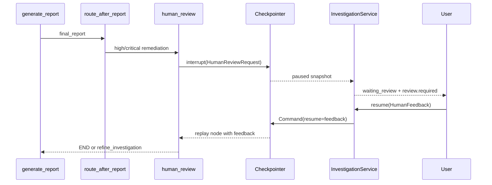

`interrupt()` 之前不能执行不可重放副作用, 因为恢复会从节点开头重新执行。当前节点只构造审核请求, 没有发送邮件或执行修复。

### 接受与追加研究

#### Accept

`human_review` 返回 Command:

```text
update human_feedback/review_completed
goto END
```

#### Request more research

Service 先读取 checkpoint State 并检查剩余预算, 然后刷新 deadline, 通过 `Command(resume=feedback)` 恢复。节点写入反馈并跳转 `refine_investigation`。

同一调查有锁保护。第一次 resume 把状态从 waiting_review 改为 running, 第二次并发或重复请求会得到 409。

### Streaming

Service 使用 `graph.astream(..., stream_mode="updates")` 观察节点增量, 再投影为安全事件。SSE 路由不会直接输出这些内部 update。

事件具有:

- 稳定 event ID。
- 调查内单调 sequence。
- investigation/thread/run ID。
- occurred_at。
- 脱敏 data。

### Last-Event-ID

客户端断开后可发送最后 event ID。API 校验该 ID 必须属于当前 investigation, 再从其 sequence 之后读取。

当前事件在内存中, 所以只支持同一进程生命周期内重放。进程重建后 Graph checkpoint 可能存在, 旧事件列表仍会丢失。

### Heartbeat 和流结束

无新事件时 SSE 输出注释 heartbeat。以下状态关闭当前连接:

- waiting_review
- completed
- failed

waiting_review 只表示本次连接结束。人工恢复后, 客户端用最后 event ID 建立新连接即可继续。

### 生产化需要补什么

- 持久化 Investigation/Event Repository。
- 多实例事件广播。
- worker lease 和任务抢占。
- 慢消费者与事件保留策略。
- Checkpoint 连接池、断线和 HA 验证。

下一步: [Evaluation 与测试](#chapter-11)。

---

<a id="chapter-11"></a>

## 11 Evaluation 与测试

### 测试和 Evaluation 的区别

```text
测试
  验证代码契约是否按预期工作

Evaluation
  在版本化事故样例上衡量 Agent 输出质量和资源使用
```

`194 passed` 不能解释为 194 个事故都诊断正确。它只表示当前自动化测试全部通过。

### 离线 Evaluation 数据流

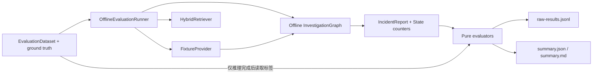

### Ground truth 隔离

每个 EvaluationSample 同时包含 fixture 路径、retrieval query 和 ground truth。Runner 的正确顺序是:

1. 从 Fixture 读取 `IncidentContext`。
2. 用 Incident 的 services 构造检索 filter。
3. 执行 Graph。
4. Graph 完成后才读取 ground truth 计算指标。

如果使用 `ground_truth.affected_services` 作为检索 filter, 就会把答案标签泄漏给 Agent。集成测试专门用错误标签验证这一点。

### 当前数据集

版本 `1.0.0` 包含三个脱敏样例:

- payment-service 数据库连接池上限回归。
- checkout-service DNS resolver 配置错误。
- inventory-service cache TTL 回归。

数据集与 Fake Model、知识库同仓, 所以它是回归集, 不是生产泛化集。

### 指标

| 指标 | 当前实现 |
| --- | --- |
| 服务定位 | 服务集合 exact match + precision/recall/F1 |
| 故障类型 | 透明词法 taxonomy |
| Recall@K | 前 K 个去重文档覆盖率 |
| MRR | 第一个相关文档倒数排名 |
| 工具选择 | 工具名集合 F1 |
| 工具参数 | 只比较标签指定字段, 同名多轮调用取最佳匹配 |
| Evidence relevance | supporting Evidence ID 集合 F1 |
| Citation correctness | ID、URI、locator、hash 精确一致 |
| 根因准确率 | 版本化根因词项覆盖阈值 |
| 调查资源 | 轮数、工具、模型、wall-clock、Token |

根因准确率不是 LLM judge, 对同义表达能力有限。Fake Token 是字符估算, 成本没有定价时明确为 unavailable。

### 为什么保留 raw-results.jsonl

聚合平均值可能隐藏:

- 某个失败样例。
- 某类工具参数持续错误。
- Citation 分母为空。
- 某样例使用异常多轮次。

Runner 因此先写逐样例结果, 再写 summary。单样例异常会成为 `SampleStatus.FAILED`, 仍计入 sample/failed count。

### 测试分层

#### 领域单元测试

验证时间带时区、ID、分数、Evidence 外键和报告一致性。

#### Graph 单元测试

验证 reducer 性质、路由优先级和 Fake Model Schema。

#### 组件测试

验证 Registry、Provider、RAG loader/splitter/vector store 和 evaluator。

#### 集成测试

验证完整 Graph、HITL、Service、HTTP/SSE、Prometheus Adapter 边界和 Evaluation Runner。

### 关键测试为什么有价值

| 测试设计 | 能证明什么 |
| --- | --- |
| 并行 barrier | Send 分支确实同时启动 |
| maximum rounds | 循环精确停止 |
| expired deadline | 不调用工具和外部模型 |
| invalid structured output | 有限重试后降级 |
| one provider failure | 兄弟分支不被取消 |
| rebuilt graph resume | 同一 saver/thread 可恢复 |
| duplicate resume | HITL 只能被认领一次 |
| network socket rejection | 默认 Evaluation 不联网 |

### 运行命令

```text
uv run pytest
uv run python -m scripts.evaluate_offline --output-dir artifacts/evaluation/manual
```

历史 Phase 6 数值记录在 `docs/EVALUATION.md`; 其中时延只代表当时单机三样例运行, 不能作为稳定 benchmark。

下一步: [本地运行和演示](#chapter-12)。

---

<a id="chapter-12"></a>

## 12 本地运行和演示

### 最小环境

- Python 3.11–3.13。
- uv。
- Docker Desktop 仅用于 Prometheus/PostgreSQL 演示。

### 完全离线路径

```text
uv sync
uv run pytest
uv run python scripts/run_investigation.py
```

这条路径使用:

- Fixture Provider。
- 本地 Hybrid RAG。
- Fake Model 和 Fake Embedding。
- 无 Checkpointer 的单次 Graph invoke。

它不需要 API Key、数据库或网络。

### 启动 API

```text
uv run uvicorn incident_copilot.main:app --reload
```

检查:

```text
http://127.0.0.1:8000/health
http://127.0.0.1:8000/docs
```

另一个终端执行:

```text
uv run python scripts/run_api_demo.py
```

脚本会创建调查、等待 `waiting_review`、读取 SSE、提交 accept 并等待 completed。

### RAG 演示

```text
uv run python scripts/ingest_knowledge.py
uv run python scripts/search_knowledge.py --query "database connection pool timeout" --service payment-service --top-k 3
```

观察输出中的:

- original/rewritten query。
- document ID 和 type。
- `matched_by` 是否包含 bm25/vector。
- section path 和 Citation。

### Evaluation

```text
uv run python -m scripts.evaluate_offline --output-dir artifacts/evaluation/manual
```

检查三个文件:

- `raw-results.jsonl`
- `summary.json`
- `summary.md`

不要只看 summary; 逐样例结果才包含真实工具调用和完整报告。

### 真实指标链路

```text
docker compose --profile demo up --build --abort-on-container-exit --exit-code-from demo demo
```

真实数据路径:

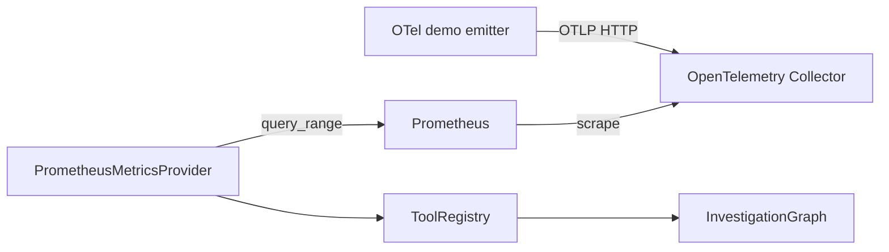

注意 Prometheus 抓取 Collector exporter, 图中的 scrape 箭头方向表示 Prometheus 主动读取 Collector。

成功时输出包含 `ev_prom_*` Evidence。失败时脚本非零退出, 不回退伪造 metrics。

清理:

```text
docker compose --profile demo down -v --remove-orphans
```

该命令会删除本 Compose 项目的演示卷。执行前确认没有需要保留的本地演示数据。

### Compose API 与 PostgreSQL Checkpoint

```text
docker compose up -d --build api
uv run python scripts/run_api_demo.py --live-window
docker compose --profile demo down -v --remove-orphans
```

该路径使用 PostgreSQL Checkpointer, 但任务和 SSE Repository 仍在 API 进程内存中。

### 常见排错

#### uv 无法执行

确认新终端中的 `uv --version` 和 PATH。项目也可以使用已创建的 `.venv`, 但受支持命令仍以 uv 为准。

#### Docker 虚拟化错误

检查 BIOS/UEFI AMD-V/SVM 或 Intel VT-x、Windows Hypervisor、Virtual Machine Platform 和 WSL2, 重启后确认 `docker version` 有 Server 输出。

#### demo 等不到指标

```text
docker compose logs otel-collector
docker compose logs telemetry-emitter
docker compose logs prometheus
```

#### API 一直 running

查看 API 日志和 `/events`, 判断卡在 Provider、模型 deadline 还是 Repository 状态。默认 Fixture 调查应很快到 waiting_review。

下一步: [常见问题和面试问答](#chapter-13)。

---

<a id="chapter-13"></a>

## 13 常见问题和面试问答

### 为什么不是普通 ReAct Agent

事故调查需要可预测循环、工具白名单、预算、恢复和人工审批。这里让模型提供结构化内容建议, Graph 和 Registry 掌握执行权。开放式 ReAct 更灵活, 但更难证明不会无限调用或执行高风险动作。

### 并行工具调用是真的并行吗

是。`dispatch_evidence_collection` 返回多个 `Send("collect_evidence", scoped_state)`, 测试中的 barrier 要求七个初始分支全部开始后才能释放。串行实现会超时。

### 为什么还需要 aggregate 节点

它是并行汇合屏障, 也是分批并发的循环点。Reducer 在进入 aggregate 前合并证据、步骤和计数; aggregate 再检查 deadline/预算, 并决定是否发送下一批。

### 为什么 State 用 TypedDict 而不是全 Pydantic

Pydantic 用于边界和领域不变量, TypedDict + `Annotated` 更直接表达 LangGraph 通道和 reducer。两者职责不同, 不是二选一。

### 如何防止模型伪造 Citation

模型只返回假设中的 Evidence ID 和报告叙事草稿。`verify_hypotheses` 删除不存在的 ID, `generate_report` 从 State 中的 EvidenceRef 收集 Citation。模型不能直接写最终 Citation 对象。

### Provider 返回 Evidence 后为什么还要校验

Provider 可能是外部系统 Adapter, 可能返回错服务、越界时间、错误来源或超量结果。Registry 是第二道边界, 不因对象已经通过一次构造就默认其业务范围正确。

### 为什么 RAG 用 RRF

BM25 和 cosine 原始分数不在同一量纲。RRF 只依赖排名, 小型基线更容易解释和稳定复现。真实生产数据仍需调参或 reranker。

### Fake Model 是否硬编码根因

它使用当前 Evidence 摘要生成规则化输出, 不读取 Evaluation ground truth。它确实是面向演示的确定性规则实现, 因而不能代表真实 LLM 泛化能力。

### Checkpoint 是否等于任务不会丢

不是。Checkpoint 保存 Graph State。当前任务元数据、幂等键、SSE 历史和后台 Task 仍在内存。完整高可用需要持久化业务 Repository 和分布式 worker。

### request_more_research 如何生效

人工反馈先通过 Schema, Service 检查剩余预算, `Command(resume=...)` 恢复 human_review。反馈写入 State 后跳到 refine, Fake Model 把 requested queries 映射为允许的工具步骤。

### 为什么 waiting_review 会关闭 SSE

此时 Graph 已暂停, 在人工操作前不会产生新事件。关闭连接能避免客户端无限等待。恢复后用 `Last-Event-ID` 重新连接即可。

### Evaluation 的 1.0 指标说明什么

只说明当前确定性管线在三个同仓版本化 Fixture 上与词法标签一致, 不说明生产准确率。数据量、模型类型、标签方法和时延环境都限制了结论。

### 如果要接真实 LLM, 最先改哪里

实现 `ModelProvider.complete()`, 返回 `ModelResponse(payload, usage)`, 然后通过现有注入点传给 Graph。不要先改节点签名或绕过 Pydantic 结构输出。

### 如果要接 Loki 或 Tempo

分别实现 `LogProvider` 或 `TraceProvider`, 复用现有 Tool Schema 和 Registry。新增 Adapter contract tests, 再在 bootstrap 选择性注入。

### 下一步生产化优先级

1. 持久化 Investigation/Event Repository 和 Evidence Store。
2. 真实 LLM/embedding 与更大的人工评审集。
3. Loki/Tempo Adapter。
4. 鉴权、租户、审计和 secret manager。
5. 分布式 worker、lease 和取消。

下一步: [术语表](#chapter-14)。

---

<a id="chapter-14"></a>

## 14 术语表

| 术语 | 本项目中的含义 |
| --- | --- |
| Adapter | 把统一端口翻译为 Fixture、Prometheus 或数据库操作的实现 |
| Aggregate | 并行 collect 分支汇合并检查预算的节点 |
| BM25 | 基于词频和文档频率的词法检索算法 |
| Checkpoint | LangGraph 某个 thread 的 State 和执行位置快照 |
| Checkpointer | 保存和读取 checkpoint 的组件 |
| Citation | 可解析来源, 包含 URI、locator、hash 和获取时间 |
| Conditional Edge | 通过路由函数选择预声明目标的边 |
| Correlation ID | 关联一次工具步骤及其日志/Telemetry 的标识 |
| Deadline | 整次调查允许执行到的绝对时间 |
| Domain Model | 与 FastAPI/LangGraph 解耦的领域值对象 |
| Edge | Graph 中从一个节点到下一个节点的连接 |
| Embedding | 把文本映射为向量; 当前默认是确定性 Fake |
| Evidence | Provider 返回的完整、带来源证据对象 |
| EvidenceRef | 写入 Graph State 的轻量 Evidence 投影 |
| Fake Model | 无网络确定性 ModelProvider, 用于测试控制流 |
| Fixture | 版本化、脱敏、可复现的本地事故数据 |
| Ground truth | Evaluation 使用的已知根因和相关证据标签 |
| HITL | Human-in-the-loop, 在高风险建议前暂停等待人审 |
| Idempotency | 重复请求或重放不会产生重复副作用 |
| IncidentContext | 规范化事故服务、时间、症状和环境 |
| InvestigationRecord | API 任务元数据和任务状态 |
| InvestigationState | LangGraph 节点共享的有界状态通道 |
| Interrupt | LangGraph 暂停当前 thread 并等待 resume 的机制 |
| ModelContext | 发送给 ModelProvider 的裁剪、结构化上下文 |
| ModelProvider | 隔离具体模型厂商的协议端口 |
| Node | 读取 State 并返回最小更新的 Graph 函数 |
| Port / Protocol | 业务层依赖的窄接口, 与具体 Adapter 解耦 |
| Provider | 从某一数据源查询并返回 Evidence 的实现 |
| Pydantic Schema | 外部输入、模型输出和领域不变量的运行时校验 |
| Query Rewrite | 保留原词并增加受审别名的查询扩展 |
| Reducer | 合并同一 State 通道多个更新的函数 |
| Repository | 读写任务记录和事件的持久化端口 |
| Rerank | 对候选重新排序; 当前没有额外模型 reranker |
| RRF | Reciprocal Rank Fusion, 按各检索器排名融合 |
| Run ID | 一次初始或恢复执行的标识 |
| Send | LangGraph 根据运行时步骤动态分发节点任务的机制 |
| SSE | Server-Sent Events, 服务端单向事件流 |
| StepResult | 一次真实工具步骤的状态、参数和 Evidence ID |
| StopReason | evidence sufficient 或预算停止的可审计原因 |
| Structured Output | 必须通过任务 Pydantic Schema 的模型 JSON 输出 |
| Superstep | LangGraph 中可并行运行并在结束后合并更新的一轮 |
| Thread ID | LangGraph checkpoint 的稳定工作流实例标识 |
| Tool | 暴露给调查计划的只读、强 Schema 操作 |
| ToolRegistry | 工具白名单、执行策略和 Evidence 校验边界 |
| Usage | 模型输入/输出 Token; Fake Model 标记为估算 |
| VectorStore | 存储和搜索版本化 embedding 的端口 |

返回[学习中心](#learning-home)或进入[核心源码阅读索引](#core-reading-index)。

---

<a id="core-reading-index"></a>

## 核心源码阅读索引

### 推荐阅读顺序

| 顺序 | A 级文件 | 先读专题 | 重点入口 |
| ---: | --- | --- | --- |
| 1 | `main.py` | 02、09 | `create_app`, `_build_runtime_graph` |
| 2 | `api/routes/investigations.py` | 03、09、10 | 四个 API endpoint, `_event_stream` |
| 3 | `investigations/service.py` | 03、09、10 | `create`, `resume`, `_execute` |
| 4 | `investigations/checkpoint.py` | 10 | `open_checkpointer` |
| 5 | `graph/state.py` | 04 | reducers, `InvestigationState` |
| 6 | `graph/builder.py` | 05 | `_dispatch_batch`, `build_investigation_graph` |
| 7 | `graph/nodes.py` | 05、08 | 十个核心 Node, `_call_structured` |
| 8 | `graph/routing.py` | 05、08 | `budget_stop_reason`, `decide_after_judge` |
| 9 | `graph/model.py` | 08 | `ModelProvider`, `FakeModelProvider` |
| 10 | `tools/registry.py` | 06 | `execute`, `_validate_evidence` |
| 11 | `rag/retrieval.py` | 07 | `ingest`, `search` |
| 12 | `evaluation/runner.py` | 11 | `run`, `_run_sample` |

### 对应 walkthrough

- [main.py](#walkthrough-01)
- [调查 API](#walkthrough-02)
- [InvestigationService](#walkthrough-03)
- [Checkpoint](#walkthrough-04)
- [Graph State](#walkthrough-05)
- [Graph Builder](#walkthrough-06)
- [Graph Nodes](#walkthrough-07)
- [Graph Routing](#walkthrough-08)
- [ModelProvider](#walkthrough-09)
- [ToolRegistry](#walkthrough-10)
- [HybridRetriever](#walkthrough-11)
- [OfflineEvaluationRunner](#walkthrough-12)

### 阅读方法

每个 walkthrough 都按同一问题集解释关键代码:

1. 做什么。
2. 为什么这样写。
3. 输入从哪里来。
4. 输出到哪里去。
5. State 如何变化。
6. 下一节点如何确定。
7. 相关 Python 语法。
8. 后端工程类比。
9. 删除或修改的影响。

不涉及 Graph State 的文件会明确标记“State 不直接变化”, 而不会强行编造状态更新。

---

<a id="walkthrough-01"></a>

## 01 `main.py`：应用组合根

源码：[src/incident_copilot/main.py](../../src/incident_copilot/main.py)

### 先看职责

这个文件不做故障诊断。它只完成三件事：读取配置、选择运行时 Adapter、把 Checkpointer、Graph、Repository 和 Service 组装进 FastAPI。后端工程里通常把这种入口称为 **composition root**。

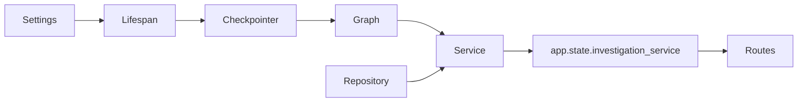

### `_build_runtime_graph`

```python
if settings.metrics_backend is MetricsBackend.PROMETHEUS:
    return build_mixed_investigation_graph(
        metrics_provider=PrometheusMetricsProvider(
            settings.prometheus_base_url,
            timeout_seconds=settings.prometheus_timeout_seconds,
        ),
        checkpointer=checkpointer,
        require_human_review=True,
    )
return build_offline_investigation_graph(
    checkpointer=checkpointer,
    require_human_review=True,
)
```

逐行理解：

1. `is` 比较枚举成员，配置为 `PROMETHEUS` 时选择混合 Graph。
2. `PrometheusMetricsProvider(...)` 只构造 Adapter，不在启动时探测网络。
3. `checkpointer=checkpointer` 让编译后的 Graph 能按 `thread_id` 保存执行位置。
4. `require_human_review=True` 保证高风险建议进入 HITL。
5. 其他配置返回全 Fixture 的离线 Graph，测试和演示不需要付费 API。

解读卡片：

| 问题 | 答案 |
| --- | --- |
| 代码做什么 | 根据配置选择 Prometheus 指标或纯 Fixture Graph |
| 为什么这样写 | Adapter 选择集中在组合根，业务节点不感知环境 |
| 输入从哪里来 | `create_app` 解析后的 `Settings` 和 lifespan 打开的 saver |
| 输出到哪里去 | 返回 `InvestigationGraph`，随后注入 `InvestigationService` |
| State 如何变化 | 此处不读写 `InvestigationState`；只决定以后由哪个 Graph 处理 State |
| 下一节点如何确定 | 不在本文件决定；边由 `graph/builder.py` 注册 |
| Python 语法 | `*` 后参数只能以关键字传入；枚举用 `is` 比较 |
| 后端类比 | Spring Boot 的配置类或依赖注入容器装配 |
| 修改影响 | 启动期探测 Prometheus 会把数据源暂时故障升级为应用无法启动 |

### `create_app` 与 lifespan

```python
@asynccontextmanager
async def lifespan(application: FastAPI) -> AsyncIterator[None]:
    if investigation_service is not None:
        application.state.investigation_service = investigation_service
        try:
            yield
        finally:
            await investigation_service.aclose()
        return
    async with open_checkpointer(resolved_settings) as checkpointer:
        service = InvestigationService(
            graph=_build_runtime_graph(resolved_settings, checkpointer=checkpointer),
            repository=InMemoryInvestigationRepository(),
        )
        application.state.investigation_service = service
        try:
            yield
        finally:
            await service.aclose()
```

这里最重要的是 `yield`：它之前是启动阶段，之后是关闭阶段。`@asynccontextmanager` 把异步生成器包装成上下文管理器。

- 测试注入 Service 时，直接放入 `app.state`，仍统一回收后台任务。
- 正常路径中，`open_checkpointer` 必须包住应用整个生命周期。
- `finally` 即使应用异常退出也会调用 `aclose()`。
- Repository 当前是内存实现，所以任务和 SSE 历史并不会随 PostgreSQL checkpoint 一起持久化。

解读卡片：

| 问题 | 答案 |
| --- | --- |
| 输入 | 可选测试 Service，或由 Settings 构造的依赖 |
| 输出 | 写入 `application.state.investigation_service` |
| State | 不直接变化；Graph 执行时才创建和更新 State |
| 下一步 | FastAPI 启动完成后由 investigations 路由取出 Service |
| 类比 | 数据库连接池随 Web 应用启动打开、关机关闭 |
| 删除影响 | 去掉 lifespan 会泄漏后台 Task；提前关闭 saver 会使暂停/恢复失效 |

### 路由和默认 ASGI 对象

```python
app.include_router(health_router)
app.include_router(investigations_router, prefix=resolved_settings.api_prefix)
return app

app = create_app()
```

模块级 `app` 是 `uvicorn incident_copilot.main:app` 查找的 ASGI 对象。`include_router` 只注册协议入口，不启动 Graph。

删除 `app = create_app()` 后，当前 README 中的 Uvicorn 命令会导入失败；修改 API prefix 会同时影响 Location 响应头和所有客户端路径。

下一篇：[调查 API](#walkthrough-02)。

---

<a id="walkthrough-02"></a>

## 02 `investigations.py`：HTTP 与 SSE 适配层

源码：[src/incident_copilot/api/routes/investigations.py](../../src/incident_copilot/api/routes/investigations.py)

### 四个公开入口

| 方法 | 路径 | 函数 | 作用 |
| --- | --- | --- | --- |
| POST | `/v1/investigations` | `create_investigation` | 创建异步调查 |
| GET | `/v1/investigations/{id}` | `get_investigation` | 读取安全任务投影 |
| GET | `/v1/investigations/{id}/events` | `stream_investigation_events` | 输出 SSE |
| POST | `/v1/investigations/{id}/resume` | `resume_investigation` | 接受或追加研究 |

路由只做协议转换。它不直接访问 Graph State，也不选择 Tool。

### 创建调查

```python
incident = payload.to_incident(f"inc_{uuid4().hex}")
record, created = await _service(request).create(
    incident=incident,
    options=payload.options,
    request_fingerprint=payload.fingerprint(),
    idempotency_key=idempotency_key,
)
response.headers["Location"] = (
    f"{settings.api_prefix}/v1/investigations/{record.investigation_id}"
)
return InvestigationResponse.from_record(record, replayed=not created)
```

逐行理解：

1. Pydantic 请求对象先转换为 `IncidentContext`，随机 ID 只标识事故。
2. `await` 暂停当前协程而不阻塞事件循环；Service 返回任务记录和是否新建。
3. 请求指纹和 `Idempotency-Key` 一起区分“安全重放”和“同键不同请求”。
4. `Location` 指向状态资源，符合异步任务的 `202 Accepted` 语义。
5. `replayed=not created` 告诉客户端这次是否复用了已有任务。

| 观察项 | 说明 |
| --- | --- |
| 输入来源 | HTTP JSON、Header 和 `request.app.state` 中的 Service |
| 输出去向 | HTTP 202、Location Header、`InvestigationResponse` |
| State 变化 | API 不直接改 State；Service 后台调用 `create_initial_state` |
| 下一节点 | Service 首次执行 Graph 后，从 `START` 进入 `parse_incident` |
| 后端类比 | Controller 接受 DTO，再调用 Application Service |
| 修改风险 | 改成同步等待会占用长连接并混淆 202 与完成语义 |

### 查询和恢复

```python
record = await _service(request).get(investigation_id)
return InvestigationResponse.from_record(record)
```

查询只返回任务投影，不暴露 checkpoint 原始 State 和完整工具载荷。

```python
record = await _service(request).resume(investigation_id, payload)
return InvestigationResponse.from_record(record)
```

`ResumeInvestigationRequest` 继承/符合 `HumanFeedback` 契约，只允许 Schema 声明的动作。锁、预算检查和 `Command(resume=...)` 都在 Service，避免 Controller 复制并发规则。

| 观察项 | 说明 |
| --- | --- |
| 输入来源 | URL 中的调查 ID、校验后的反馈 JSON |
| 输出去向 | 最新 `InvestigationRecord` 的响应投影 |
| State 变化 | 间接：反馈在 `human_review` 恢复点写入 `human_feedback` |
| 下一节点 | `accept` 后到 `END`；`request_more_research` 后到 `refine` |
| Python 语法 | `async def` 返回 awaitable；类型标注约束返回 DTO |
| 删除影响 | 绕过 Service 会丢失重复恢复保护和预算门禁 |

### SSE 建立与重连

```python
after_sequence = _parse_last_event_id(investigation_id, last_event_id)
return StreamingResponse(
    _event_stream(
        service,
        investigation_id,
        request,
        after_sequence=after_sequence,
        heartbeat_seconds=settings.sse_heartbeat_seconds,
    ),
    media_type="text/event-stream",
    headers={"Cache-Control": "no-cache", "X-Accel-Buffering": "no"},
)
```

- `StreamingResponse` 消费异步迭代器，不会一次性构造完整响应体。
- `Last-Event-ID` 被解析为单调序号，只能属于当前调查。
- `X-Accel-Buffering: no` 避免代理把实时事件攒成大块。

### `_event_stream` 逐步执行

```python
while True:
    events = await service.repository.list_events(
        investigation_id, after_sequence=sequence
    )
    for event in events:
        yield _format_sse(event)
        sequence = event.sequence
    record = await service.get(investigation_id)
    if record.status in _STREAM_END_STATUSES:
        return
    if await request.is_disconnected():
        return
    events = await service.repository.wait_for_events(
        investigation_id,
        after_sequence=sequence,
        timeout_seconds=heartbeat_seconds,
    )
    if not events:
        yield ": heartbeat\n\n"
```

重要行解释：先补发已有事件，更新游标，再检查暂停/终态和客户端断开；没有新事件时输出 SSE 注释作为 heartbeat。`yield` 使函数成为异步生成器。

State 不在此处变化。输入是应用事件 Repository，输出是格式为 `id/event/data` 的文本。`waiting_review` 只结束本次流，不结束调查；恢复后客户端携带最后 ID 重连。若删除游标校验，客户端可能串读别的调查；若不在暂停时结束流，客户端会无限等待。

下一篇：[InvestigationService](#walkthrough-03)。

---

<a id="walkthrough-03"></a>

## 03 `service.py`：任务生命周期与 Graph 桥梁

源码：[src/incident_copilot/investigations/service.py](../../src/incident_copilot/investigations/service.py)

### 三种状态不要混淆

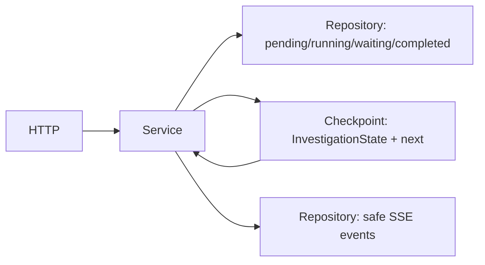

- Repository 状态回答“任务现在对客户端是什么状态”。
- Graph State 回答“调查有哪些证据、预算以及下一个节点”。
- SSE Event 是对 Graph 增量的脱敏投影。

### `create`：幂等创建和后台执行

```python
stored, created = await self._repository.create(record)
if not created:
    return stored, False
await self._append_event(stored, EventType.INVESTIGATION_QUEUED, {"status": "pending"})
self._start_task(stored.investigation_id, self._run_initial(stored.investigation_id))
return stored, True
```

Repository 原子判断幂等键和指纹。只有新记录写 queued 事件并创建 `asyncio.Task`。输入来自 API 的 Incident、Options 和幂等信息，输出回 API；此刻 Graph State 尚未创建。删除 `if not created` 会让同一请求重复执行。

Python 重点：`tuple[InvestigationRecord, bool]` 同时返回值与创建标志；`asyncio.create_task` 把协程调度到同一事件循环，类似轻量后台 job，但不是分布式任务队列。

### `_run_initial`：构造首个 State

```python
initial = create_initial_state(
    running.incident, options=running.options, clock=self._clock
)
await self._execute(investigation_id, initial)
```

这两行把任务状态机交接给 Graph。`create_initial_state` 写入 `incident`、计数器、预算和 deadline；`_execute` 使用同一 `thread_id` 运行。下一节点由 Builder 中 `START -> parse_incident` 决定。

若初始化异常，Service 调 `_mark_failed`，不会伪造 completed。这里捕获后端依赖错误，但 `CancelledError` 必须继续抛出，让应用关闭可以取消任务。

### `resume`：只认领一次暂停点

```python
lock = self._locks.setdefault(investigation_id, asyncio.Lock())
async with lock:
    record = await self.get(investigation_id)
    if record.status is not InvestigationStatus.WAITING_REVIEW:
        raise ResourceConflictError(...)
    config = self._config(record.thread_id)
    snapshot = await self._graph.aget_state(config)
    state = cast(InvestigationState, snapshot.values)
    if feedback.action is ReviewAction.REQUEST_MORE_RESEARCH:
        self._ensure_research_budget(state)
```

逐行理解：

1. `setdefault` 为每个调查复用同一个进程内锁。
2. `async with` 保证并发恢复请求串行进入临界区。
3. 只有 `waiting_review` 能被认领，第二个请求得到 409。
4. `thread_id` 读取准确 checkpoint，而不是使用客户端提交的 State。
5. 追加研究先检查轮数、工具、模型和 Token 预算。

```python
command: Command[Any] = Command(
    resume=feedback.model_dump(mode="json"),
    update=update,
)
self._start_task(
    investigation_id,
    self._execute(investigation_id, command),
)
```

`Command.resume` 的值会成为 `interrupt()` 的返回值；追加研究还刷新 deadline。State 在恢复时由 `human_review` 写入 `human_feedback`，然后条件边按 action 选择 `refine` 或 `END`。删除锁会产生双重认领；换一个 `thread_id` 会启动新工作流而不是恢复原暂停点。

### `_execute`：流式运行、暂停或完成

```python
async for update in self._graph.astream(
    graph_input,
    config,
    stream_mode="updates",
):
    if isinstance(update, Mapping):
        await self._project_graph_update(record, cast(Mapping[object, object], update))
```

`async for` 逐个消费节点更新。`stream_mode="updates"` 返回最小增量，而非每次复制完整 State。输入既可能是初始 `InvestigationState`，也可能是恢复 `Command`；输出先进入事件投影。

```python
snapshot = await self._graph.aget_state(config)
interrupt_value = self._interrupt_value(snapshot.tasks)
values = cast(InvestigationState, snapshot.values)
report = values.get("final_report")
```

流结束不一定代表 Graph 到 `END`，也可能代表 `interrupt`。所以必须读取快照的 tasks 和 values：

- 有 interrupt：Repository 写 `WAITING_REVIEW`，保存 `review_request`。
- 无 interrupt 且有报告：写 `COMPLETED`。
- 无报告：抛错并进入 failed，防止假成功。

Graph 的下一节点仍由 checkpoint 中的 `next` 和 Builder 边决定，Service 不重算路由。

### `_project_graph_update`：State 增量到安全事件

```python
for step in self._models(node_update.get("completed_steps"), StepResult):
    ...
for evidence in self._models(node_update.get("evidence"), EvidenceRef):
    ...
if "hypotheses" in node_update:
    ...
if budget_keys.intersection(node_update):
    ...
```

这不是再次修改 Graph State，而是观察更新中的允许字段：Step 变成 tool 事件，EvidenceRef 变成 evidence 事件，Hypothesis 只输出数量，预算只输出发生更新的节点。完整 prompt、秘密和原始大对象不会进入 SSE。

后端类比是把领域事件投影为 read model。删除字段白名单而直接序列化 State，可能泄漏工具参数和内部模型上下文。

### `_config` 和预算门禁

```python
return {"configurable": {"thread_id": thread_id}}
```

这是 LangGraph saver 查找 checkpoint 的稳定键。`run_id` 每次恢复会变化，不能代替 `thread_id`。

`_ensure_research_budget` 使用确定性计数器，而不是询问模型“还能不能继续”。修改其中任一比较符会改变边界行为；例如把 `>=` 改成 `>` 会允许多执行一次。

### 九问总结

| 问题 | 答案 |
| --- | --- |
| 做什么 | 协调任务状态、后台 Task、checkpoint 恢复和 SSE 投影 |
| 为什么 | HTTP 生命周期与 Graph 生命周期不同，需要应用服务连接 |
| 输入 | API DTO、Repository 记录、Graph update/snapshot |
| 输出 | Repository 状态与事件、Graph 初始 State 或 resume Command |
| State | 初次构造；恢复时写反馈/deadline；节点实际更新由 Graph 完成 |
| 下一节点 | Service 不决定，读取并继续 checkpoint 中的 Graph 路由 |
| Python | async/await、Task、Lock、Mapping、cast、model_copy |
| 类比 | 任务编排 Application Service + Outbox/read-model projector |
| 修改风险 | 锁、thread_id、预算或投影边界错误会造成重复执行、串线或泄密 |

下一篇：[Checkpoint](#walkthrough-04)。

---

<a id="walkthrough-04"></a>

## 04 `checkpoint.py`：可恢复执行资源

源码：[src/incident_copilot/investigations/checkpoint.py](../../src/incident_copilot/investigations/checkpoint.py)

### Checkpointer 保存什么

它保存 LangGraph 的 State、待执行位置和 interrupt 信息，并用 `thread_id` 区分工作流。它不保存 Investigation API 记录和 SSE 历史。

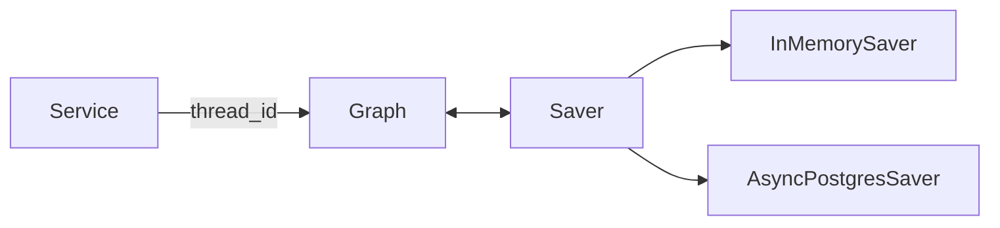

### `open_checkpointer`

```python
@asynccontextmanager
async def open_checkpointer(
    settings: Settings,
) -> AsyncIterator[BaseCheckpointSaver[str]]:
    if settings.checkpoint_backend is CheckpointBackend.MEMORY:
        yield InMemorySaver()
        return
```

逐行理解：

1. `@asynccontextmanager` 把带 `yield` 的异步生成器变成 `async with` 可用资源。
2. 返回类型声明调用方在上下文内获得统一 Saver 端口。
3. Memory 分支无需网络，适合默认测试。
4. `return` 阻止执行继续落入 PostgreSQL 分支。

此函数不直接读写 InvestigationState；Graph 编译和运行后才通过 saver 写 State。下一节点信息也由 LangGraph 存入 checkpoint，而不是这里计算。

### PostgreSQL 分支

```python
if settings.postgres_dsn is None:
    raise ConfigurationError("PostgreSQL checkpoint backend requires postgres_dsn")
try:
    module = importlib.import_module("langgraph.checkpoint.postgres.aio")
except ImportError as exc:
    raise ConfigurationError(
        "PostgreSQL checkpoint backend requires the 'postgres' project extra"
    ) from exc
```

只有显式选择 PostgreSQL 时才动态导入可选依赖。`raise ... from exc` 保留异常原因链，既给用户可理解配置错误，也方便日志定位原始 ImportError。

```python
saver_type = cast(Any, module).AsyncPostgresSaver
manager = saver_type.from_conn_string(settings.postgres_dsn.get_secret_value())
async with manager as saver:
    await saver.setup()
    yield cast(BaseCheckpointSaver[str], saver)
```

- `get_secret_value()` 只在建立连接的边界解包 Secret，不输出日志。
- `async with` 负责连接资源的打开和关闭。
- `setup()` 创建 saver 自己的表，不创建项目业务表。
- `cast` 只帮助静态类型检查，不会在运行时转换对象。

### 九问总结

| 问题 | 答案 |
| --- | --- |
| 代码做什么 | 按配置打开内存或 PostgreSQL saver |
| 为什么这样写 | 默认零依赖，可选生产式恢复，生命周期统一 |
| 输入来源 | `main.create_app` 解析的 Settings |
| 输出去向 | 交给 Graph Builder 的 `checkpointer` 参数 |
| State 变化 | 本函数无直接变化；Saver 持久化 Graph 随后产生的 State |
| 下一节点 | Saver记录执行位置；路由仍由 Graph conditional edge 决定 |
| Python 语法 | async context manager、动态导入、异常链、Protocol 型基类 |
| 后端类比 | 可切换的 Session/transaction resource factory |
| 删除或修改影响 | saver 生命周期太短会导致恢复失败；误把 run_id 当 thread_id 会找不到历史 |

下一篇：[Graph State](#walkthrough-05)。

---

<a id="walkthrough-05"></a>

## 05 `state.py`：State 与 Reducer

源码：[src/incident_copilot/graph/state.py](../../src/incident_copilot/graph/state.py)

### State 是通道契约

`InvestigationState` 是 `TypedDict(total=False)`。它描述所有可能出现的通道，但节点可以只返回自己负责的最小更新。没有 reducer 的字段采用覆盖语义，带 `Annotated` 的字段按绑定函数合并。

```python
class InvestigationState(TypedDict, total=False):
    completed_steps: Annotated[tuple[StepResult, ...], merge_step_results]
    evidence: Annotated[tuple[EvidenceRef, ...], merge_evidence]
    tool_call_count: Annotated[int, add_count]
    model_usage: Annotated[ModelUsage, add_usage]
```

逐行理解：

1. `TypedDict` 只提供字典键的静态类型信息，不会像 Pydantic 一样运行时校验。
2. `total=False` 允许 Node 返回 `{"evidence": refs}`，不用复制完整 State。
3. `Annotated[T, reducer]` 同时告诉类型检查器值是 `T`，告诉 LangGraph 如何合并并行更新。
4. `tuple` 避免节点原地修改共享列表。

后端类比是带合并策略的事件流物化视图。删除 `Annotated` 后，多个 `collect_evidence` 分支会互相覆盖。

### `_merge_bounded_by_id` 逐行解释

```python
merged: dict[str, ItemT] = {}
for item in (*left, *right):
    item_id = identity(item)
    current = merged.get(item_id)
    if current is None or (rank(item), _canonical_model(item)) < (
        rank(current),
        _canonical_model(current),
    ):
        merged[item_id] = item
```

- `ItemT` 绑定 `BaseModel`，所以泛型元素都能稳定序列化。
- `(*left, *right)` 新建元组并遍历两个输入。
- `identity` 提供业务幂等键，例如 `evidence_id`。
- 同 ID 不同载荷时，以 rank 加规范 JSON 选择固定胜者，而不是“最后完成的分支获胜”。

```python
return tuple(
    sorted(
        merged.values(),
        key=lambda item: (rank(item), identity(item), _canonical_model(item)),
    )[:limit]
)
```

统一排序后再裁剪，保证 `merge(a, b)` 与 `merge(b, a)` 结果相同。`lambda` 是小型匿名函数。若先按每个分支裁剪再合并，全局高质量证据可能被错误丢弃；若没有 `limit`，State 会随循环无限膨胀。

### 三个集合 reducer

| Reducer | ID | 排序/上限 | 输入和输出 |
| --- | --- | --- | --- |
| `merge_evidence` | `evidence_id` | 相关度、可靠度降序，100 | 多分支 EvidenceRef 增量 → 有界证据集 |
| `merge_step_results` | `step_id` | step ID，200 | 重放/分支 StepResult → 幂等执行历史 |
| `merge_errors` | `error_id` | error ID，100 | 脱敏错误增量 → 有界错误集 |

这些函数只合并传入值，不读取网络或时钟。它们没有“下一节点”概念，但结果会被 aggregate、judge 和 report 读取。

### 计数和 Token reducer

```python
def add_count(left: int, right: int) -> int:
    return left + right
```

每个并行分支只返回增量 `1`。若分支读取旧总数再写 `old + 1`，两个分支都可能写同一个结果。

```python
return ModelUsage(
    input_tokens=left.input_tokens + right.input_tokens,
    output_tokens=left.output_tokens + right.output_tokens,
    estimated=left.estimated or right.estimated,
)
```

输入/输出 Token 分别相加；任一数据是估算值，聚合结果也必须诚实标记 estimated。把 `or` 改成 `and` 会错误声称混合结果是精确值。

### 字段按生命周期分组

| 阶段 | 主要字段 | 主要写入者 |
| --- | --- | --- |
| 初始 | `incident`、预算、时间、空集合 | `create_initial_state` |
| 计划 | `investigation_plan`、`pending_steps` | plan/refine Node |
| 并行收集 | `completed_steps`、`evidence`、工具计数、`errors` | collect Node + reducer |
| 推理 | `hypotheses`、充分性、下一查询 | hypotheses/verify/judge |
| 终止 | `stop_reason`、`final_report` | aggregate/judge/report |
| 审核 | `human_feedback`、`review_completed` | human_review |

### 九问总结

| 问题 | 答案 |
| --- | --- |
| 做什么 | 定义 Graph 通道和并行合并语义 |
| 为什么 | 并行完成顺序和 checkpoint 重放不应改变结果 |
| 输入 | Node 返回的局部 State 更新 |
| 输出 | 下一 superstep 可见的合并 State |
| State | reducer 是 State 真正发生合并的位置 |
| 下一节点 | Builder 的边决定；routing 读取合并后的 State |
| Python | TypedDict、Annotated、TypeVar、Callable、lambda |
| 类比 | Event sourcing 中可交换、幂等的聚合器 |
| 修改风险 | 非确定 reducer 会产生难复现并发 bug；无上限会膨胀 checkpoint |

下一篇：[Graph Builder](#walkthrough-06)。

---

<a id="walkthrough-06"></a>

## 06 `builder.py`：真实 Graph、边与并行分发

源码：[src/incident_copilot/graph/builder.py](../../src/incident_copilot/graph/builder.py)

### 当前源码的完整 Graph

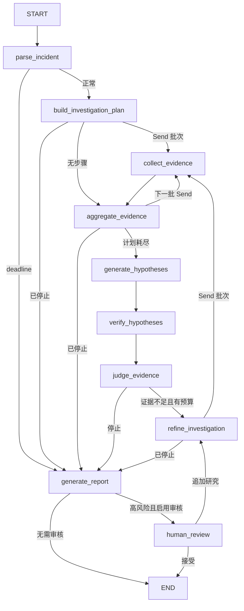

### `create_initial_state`

```python
policy = options or InvestigationOptions()
started_at = clock()
return InvestigationState(
    incident=incident,
    research_round=1,
    max_tool_calls=policy.max_tool_calls,
    max_parallel_tools=policy.max_parallel_tools,
    model_usage=ModelUsage(),
    deadline_at=started_at + timedelta(seconds=policy.timeout_seconds),
    errors=(),
)
```

它把 API 已校验 Incident 和 Options 转成完整初值。时钟可注入使 deadline 测试确定。State 从这里开始存在；下一节点固定是 `parse_incident`。若省略 reducer 字段的零值，后续合并语义更难推理；若使用模型输出覆盖预算，就失去安全边界。

### `dispatch_evidence_collection`、`dispatch_after_aggregate` 与 `_dispatch_batch`

`dispatch_evidence_collection` 是 plan/refine 后的入口：已有 `stop_reason` 时直接去报告，否则调用 `_dispatch_batch(..., empty_target="aggregate_evidence")`。`dispatch_after_aggregate` 是批次 barrier 后的入口：仍有步骤就继续发 Send，计划耗尽时以 `generate_hypotheses` 为 empty target。两者复用下面的预算预留逻辑。

```python
remaining = max(0, state["max_tool_calls"] - state.get("tool_call_count", 0))
limit = min(remaining, state["max_parallel_tools"])
completed_queries = {item.query_key for item in state.get("completed_steps", ())}
```

逐行解释：

1. 剩余工具数不会小于零。
2. 批次大小同时受全局余额和并发上限约束。
3. 已完成 `query_key` 用于过滤 checkpoint 重放和跨轮重复查询。

```python
candidates = sorted(
    (
        step
        for step in state.get("pending_steps", ())
        if step.query_key not in completed_queries
    ),
    key=lambda step: (-step.priority, step.step_id),
)
selected = candidates[:limit]
if not selected:
    return empty_target
```

生成器表达式避免先构造中间列表；负 priority 实现降序，再用 ID 保证稳定顺序。没有候选时返回调用方指定的汇合/推理目标。若把预算检查放入每个分支，分支会同时看到相同余额并越界。

### `Send` 的最小 scoped State

```python
return [
    Send(
        "collect_evidence",
        {
            "incident": state["incident"],
            "current_step": step,
            "deadline_at": state["deadline_at"],
        },
    )
    for step in selected
]
```

每个 Send 都调用同一个通用 Node，但携带不同 `current_step`。输入来自 plan 的 pending steps，输出是运行时分发指令，不直接修改 State。各分支完成后，Reducer 合并 `completed_steps/evidence/errors/counts`，再进入 `aggregate_evidence`。

后端类比是把一个批处理拆成多个带最小消息体的 worker job，然后在 barrier 汇合。复制完整证据历史会放大 checkpoint 和序列化成本。

### `build_investigation_graph`：节点注册与普通边

```python
builder = StateGraph(InvestigationState)
builder.add_node("parse_incident", nodes.parse_incident)
...
builder.add_edge(START, "parse_incident")
builder.add_edge("collect_evidence", "aggregate_evidence")
builder.add_edge("generate_hypotheses", "verify_hypotheses")
```

字符串名称是 streaming、测试和 Mermaid 共用的稳定标识。普通边表示目标固定；conditional edge 表示由纯函数选择。改名必须同时更新 path map、事件消费者、测试和文档。

### Conditional Edge

```python
builder.add_conditional_edges(
    "judge_evidence",
    route_after_judge,
    path_map={
        "refine_investigation": "refine_investigation",
        "generate_report": "generate_report",
    },
)
```

`route_after_judge` 只可能返回白名单中的两个名字。模型没有返回任意节点名的权限。State 在路由函数中不变化；下一节点由充分性、轮次和硬预算决定。

### Checkpoint 与 HITL 编译

```python
if require_human_review:
    builder.add_node(
        "human_review",
        nodes.human_review,
        destinations=("refine_investigation", END),
    )
...
return builder.compile(checkpointer=checkpointer, name=...)
```

`destinations` 声明 `Command.goto` 的合法目标。Checkpointer 在编译时注入，而稳定 `thread_id` 在每次 invoke 配置中传入。只添加 human_review 而不配置 saver，单次内存调用可以暂停，但跨请求可靠恢复没有保障。

### 九问总结

| 问题 | 答案 |
| --- | --- |
| 做什么 | 注册真实 Node、Edge、Send 分发和 saver |
| 为什么 | 控制流集中、可画图、可测试、模型不可越权 |
| 输入 | Registry、ModelProvider、Clock、Checkpointer |
| 输出 | 编译后的 `InvestigationGraph` |
| State | 初始化 State；Send 触发分支增量并由 reducer 汇合 |
| 下一节点 | 普通边、conditional edge 或 Command.goto |
| Python | overload、Literal、list comprehension、泛型别名 |
| 类比 | 有状态 DAG 编排器 + 有界 worker fan-out |
| 修改风险 | 分发前不预留预算会超额；错连边会跳过验证或形成无限循环 |

下一篇：[Graph Nodes](#walkthrough-07)。

---

<a id="walkthrough-07"></a>

## 07 `nodes.py`：十个核心 Node

源码：[src/incident_copilot/graph/nodes.py](../../src/incident_copilot/graph/nodes.py)

### Node 总表

| Node | 主要读取 | 主要写入 | 下一步由谁确定 |
| --- | --- | --- | --- |
| `parse_incident` | incident、deadline | deadline/stop reason | `route_after_parse` |
| `build_investigation_plan` | incident、预算、历史查询 | plan、pending、model 增量 | `dispatch_evidence_collection` |
| `collect_evidence` | current step、incident、deadline | step、evidence/error、tool 增量 | 固定到 aggregate |
| `aggregate_evidence` | reducer 后计数、预算 | deadline/stop reason | `dispatch_after_aggregate` |
| `generate_hypotheses` | evidence、incident | hypotheses、model 增量 | 固定到 verify |
| `verify_hypotheses` | evidence、hypotheses | 校验后的 hypotheses | 固定到 judge |
| `judge_evidence` | 来源、假设、预算 | sufficiency、queries、stop | `route_after_judge` |
| `refine_investigation` | gap、feedback、历史 | 新 plan、round、model 增量 | Send dispatch |
| `generate_report` | 全部调查结果 | final report、model 增量 | `route_after_report` |
| `human_review` | report | feedback、review、重置字段 | `Command.goto` |

### 边界 Node：`parse_incident`

```python
deadline_exceeded = self._clock() >= state["deadline_at"]
update: InvestigationState = {"deadline_exceeded": deadline_exceeded}
if deadline_exceeded:
    update["stop_reason"] = StopReason.DEADLINE_EXCEEDED
return update
```

Incident 已在 API/领域层校验，此处只检查 Graph 必需服务和 deadline。输入来自初始 State，输出最小增量。路由随后选择 plan 或直接生成受限报告。删除 deadline 检查会让过期请求仍调用工具和模型。

### 计划和追加研究

`build_investigation_plan` 与 `refine_investigation` 复用 `_plan_update`。后者先计算 `next_round`，再由单一 writer 写轮次，避免并行分支竞争。

```python
if step.tool_name not in allowed:
    continue
query_key = stable_query_key(step.tool_name, step.arguments)
if query_key in completed_queries or query_key in seen_queries:
    continue
...
"step_id": f"step_r{round_number}_{ordinal}_{query_key[:12]}",
"query_key": query_key,
"round_number": round_number,
```

模型只建议工具和参数，可信代码重新计算 identity、过滤未知工具和重复查询。输入是结构化 `PlanOutput`，输出是 plan/pending steps。下一步由 Builder 的 Send dispatcher 决定。若信任模型提供的 step ID，重放幂等和 Evaluation 工具匹配都会失真。

### `collect_evidence`：一个分支只执行一步

```python
context = QueryContext(
    correlation_id=f"{state['incident'].incident_id}:{step.step_id}",
    deadline=state["deadline_at"],
    remaining_tool_calls=1,
)
result = await self._registry.execute(step.tool_name, step.arguments, context)
```

`current_step` 由 Send scoped State 注入。Registry 再执行 Schema、白名单、timeout、retry 和输出校验。成功时完整 Evidence 转为轻量 `EvidenceRef`；分支只返回计数增量 `1`。

```python
return {
    "completed_steps": (step_result,),
    "evidence": refs,
    "tool_call_count": 1,
    "tool_success_count": 1,
}
```

失败不是吞掉异常：它转换成 `InvestigationError` 和 FAILED StepResult，并写 failure 增量。Reducer 在 barrier 前合并所有分支。下一节点固定是 aggregate。后端类比是 worker 将成功/失败都写成可审计结果；若让 ToolError 冒泡，单一 Provider 失败会取消整批调查。

### `aggregate_evidence`：并行汇合后的预算检查

```python
projected = state.copy()
projected["deadline_exceeded"] = deadline_exceeded
reason = budget_stop_reason(projected)
if reason is not None:
    update["stop_reason"] = reason
```

进入该节点前 Reducer 已合并 evidence、steps 和计数。`copy()` 构造“如果写入 deadline 后”的投影，用同一纯预算函数计算停止原因。输出只含 deadline/stop。下一步可能发送下一批、生成假设或报告。

### 生成与验证 Hypothesis

`generate_hypotheses` 只接受通过 `HypothesesOutput` 的模型结果；失败时使用确定性 Fake fallback。`verify_hypotheses` 才是可信外键和置信度门禁：

```python
supporting_ids = tuple(
    item for item in hypothesis.supporting_evidence_ids if item in evidence_by_id
)
supporting_sources = {evidence_by_id[item].source_type for item in supporting_ids}
status = (
    HypothesisStatus.SUPPORTED
    if supporting_ids and len(supporting_sources) >= 2
    else HypothesisStatus.INCONCLUSIVE
)
```

模型伪造的 Evidence ID 被删除；至少两个独立来源才能标记 SUPPORTED，否则置信度上限为 0.55，无支持证据则上限 0.2。输出覆盖 `hypotheses`，下一节点固定 judge。删除 verify 会让模型自由文本越过证据完整性约束。

### `judge_evidence`：模型意见与确定性规则相交

```python
supported = any(
    item.status is HypothesisStatus.SUPPORTED for item in state.get("hypotheses", ())
)
sources = {item.source_type for item in state.get("evidence", ())}
sufficient = output.sufficient and supported and len(sources) >= 2
```

即使模型说 sufficient，也必须存在已验证假设和至少两类来源。Node 写充分性、原因、下一查询、模型用量和 stop reason；它只“准备”路由条件，真正下一节点仍由 `route_after_judge` 决定。

### `_call_structured`：有界模型调用

```python
max_attempts = 0 if tokens_exhausted or deadline_exceeded else min(2, remaining)
for attempt in range(1, max_attempts + 1):
    response = await asyncio.wait_for(
        self._model.complete(context), timeout=remaining_seconds
    )
    usage = add_usage(usage, response.usage)
    value = schema.model_validate(response.payload)
```

逐行解释：

1. deadline/Token 已耗尽时零调用，否则最多两次且不超过模型余额。
2. 每次重试前再次估算 Token 和剩余秒数。
3. `asyncio.wait_for` 把全局剩余时间变成本次调用上限。
4. usage 无论成功与否都累计。
5. Pydantic Schema 阻止未经校验 payload 进入 Node。

验证错误允许有限修复；timeout 立即停止；连接类错误归一化为 unavailable。返回的 `StructuredCall` 携带本 Node 的增量计数/usage/errors，Reducer 再合并。去掉 `min(2, remaining)` 可能形成无界修复循环。

### `generate_report`：Citation 不交给模型创造

```python
supporting = tuple(
    evidence_by_id[item] for item in supporting_ids if item in evidence_by_id
)
citations = tuple(
    {item.citation.citation_id: item.citation for item in (*supporting, *contradicting)}.values()
)
```

模型只生成报告草稿。最终 supporting/contradicting EvidenceRef 从 State 的已验证 ID 回查，Citation 从这些对象提取并按 ID 去重。只有 `EVIDENCE_SUFFICIENT` 且有 supporting evidence 才给 `PROBABLE`，其他情况诚实输出 `INCONCLUSIVE`。

输出 `final_report` 和模型用量；下一步按高风险建议进入 review 或 END。若直接使用模型 Citation，引用正确性无法保证。

### `human_review`：真实 interrupt

```python
raw_feedback = interrupt(request.model_dump(mode="json"))
feedback = HumanFeedback.model_validate(raw_feedback)
if feedback.action is ReviewAction.ACCEPT:
    return Command(
        update={"human_feedback": feedback, "review_completed": True},
        goto="__end__",
    )
```

`interrupt` 把请求写入 checkpoint 并暂停；恢复时函数从头重放，所以 interrupt 前不能放非幂等副作用。反馈再次通过 Pydantic 校验。accept 结束；request more research 重置充分性/停止原因并 goto refine。删除 `Command.goto` 的白名单声明会削弱控制流可验证性。

### 九问总结

| 问题 | 答案 |
| --- | --- |
| 做什么 | 承载调查业务步骤和降级路径 |
| 为什么 | 每个 Node 单一职责、最小 State 更新、便于 checkpoint |
| 输入 | 初始/合并/Send scoped State、Provider/Model 返回 |
| 输出 | State 增量或 human-review Command |
| State | 上表逐节点列出；并行字段由 reducer 合并 |
| 下一节点 | Builder 普通边、纯路由函数或 Command.goto |
| Python | async、泛型 Schema、tuple comprehension、dict unpack、dataclass |
| 类比 | 有状态工作流中的 activities + policy gates |
| 修改风险 | 跳过结构校验、证据外键或预算会造成幻觉引用和失控循环 |

下一篇：[Graph Routing](#walkthrough-08)。

---

<a id="walkthrough-08"></a>

## 08 `routing.py`：确定性停止与下一节点

源码：[src/incident_copilot/graph/routing.py](../../src/incident_copilot/graph/routing.py)

### 为什么路由必须是纯函数

路由只读取 State 并返回预声明节点名：不访问网络、不调模型、不写 State。相同输入永远得到相同目标，测试可以覆盖全部分支。

### `budget_stop_reason` 的优先级

```python
existing = state.get("stop_reason")
if existing in {
    StopReason.DEADLINE_EXCEEDED,
    StopReason.TOOL_BUDGET_EXHAUSTED,
    StopReason.MODEL_BUDGET_EXHAUSTED,
    StopReason.TOKEN_BUDGET_EXHAUSTED,
}:
    return existing
```

已经写入的硬停止原因优先保留，避免后续节点把 deadline 改写成较弱原因。

```python
if state.get("deadline_exceeded", False):
    return StopReason.DEADLINE_EXCEEDED
if state.get("tool_call_count", 0) >= state["max_tool_calls"]:
    return StopReason.TOOL_BUDGET_EXHAUSTED
if state.get("model_call_count", 0) >= state["max_model_calls"]:
    return StopReason.MODEL_BUDGET_EXHAUSTED
...
return None
```

使用 `>=` 是边界关键：达到预算即停止。输入是合并后的计数和 usage，输出是可审计枚举，不改变 State。各 Node 可以把返回值写入 `stop_reason`。

### `decide_after_judge`

```python
budget_reason = budget_stop_reason(state)
if budget_reason is not None:
    return RouteDecision(RouteTarget.REPORT, budget_reason)
if state.get("evidence_sufficient", False):
    return RouteDecision(RouteTarget.REPORT, StopReason.EVIDENCE_SUFFICIENT)
if state["research_round"] >= state["max_research_rounds"]:
    return RouteDecision(RouteTarget.REPORT, StopReason.MAX_RESEARCH_ROUNDS)
return RouteDecision(RouteTarget.REFINE, None)
```

逐行代表固定优先级：硬预算 → 证据充分 → 最大轮数 → 才能 refine。`@dataclass(frozen=True, slots=True)` 让决策不可变且字段明确。Node 使用 stop reason 写报告，conditional edge 使用 target 选择下一节点。

若先判断 evidence sufficient，刚好超时的调查可能被错误记录为“证据充分停止”；若移除最大轮数，证据持续不足时会无限循环。

### 三个路由适配器

| 函数 | 读取 | 返回 | 影响 |
| --- | --- | --- | --- |
| `route_after_parse` | deadline stop | plan/report | 过期请求跳过所有外部调用 |
| `route_after_judge` | `decide_after_judge` | refine/report | 控制调查循环 |
| `route_after_report` | remediation risk | human_review/END | 高风险建议必须审核 |

```python
if any(
    step.risk_level in {RiskLevel.HIGH, RiskLevel.CRITICAL}
    for step in report.remediation_steps
):
    return "human_review"
return "__end__"
```

生成器表达式让 `any` 遇到首个高风险步骤即可停止。输入是已构造领域报告，State 不变化。删除这一边会让高风险动作未经确认直接结束；把所有报告都送 review 会增加不必要人工阻塞。

### 九问总结

| 问题 | 答案 |
| --- | --- |
| 做什么 | 把 State 映射到有限节点名和停止原因 |
| 为什么 | 终止权由可信代码掌握，模型不可自由跳转 |
| 输入 | reducer 合并后的 InvestigationState |
| 输出 | Literal 节点名或 RouteDecision |
| State | 路由不写 State；Node 写入决定所需字段 |
| 下一节点 | 返回值经 Builder path_map 映射到真实 Node/END |
| Python | frozen dataclass、Literal、Enum、generator/any |
| 类比 | 状态机 guard condition 或 policy engine |
| 修改风险 | 优先级和边界错误会错误归因停止原因或造成无界循环 |

下一篇：[ModelProvider](#walkthrough-09)。

---

<a id="walkthrough-09"></a>

## 09 `model.py`：模型端口与确定性 Fake

源码：[src/incident_copilot/graph/model.py](../../src/incident_copilot/graph/model.py)

### `ModelProvider` Protocol

```python
class ModelProvider(Protocol):
    async def complete(self, context: ModelContext) -> ModelResponse:
        ...
```

`Protocol` 是结构化子类型：实现类不必继承它，只要提供同签名 `complete` 就能注入 Graph。输入是裁剪后的 `ModelContext`，输出是 JSON-like payload 和 usage；具体 SDK、模型名和 API Key 不进入 Node。

该模块不直接读写 `InvestigationState`。Node 从 State 构造 Context，调用 Provider，再用 Pydantic Schema 校验输出并把增量写回 State。下一节点也由 Builder/Routing 决定。

后端类比是六边形架构的 outbound port。删除 Protocol 会让 Graph 更容易耦合厂商 SDK；把 Schema 校验放进某一家 Provider 会使不同实现行为不一致。

### `FakeModelProvider.complete`

```python
if context.task is ModelTask.PLAN:
    output = self._plan(context)
elif context.task is ModelTask.HYPOTHESES:
    output = self._hypotheses(context)
elif context.task is ModelTask.JUDGE:
    output = self._judge(context)
else:
    output = self._report(context)
```

任务是枚举白名单，不是任意 prompt。Fake 按 task 生成 Pydantic 输出，随后序列化为不可信 payload，刻意走与真实 Provider 相同的 Node 校验路径。

```python
return ModelResponse(
    payload=payload,
    usage=ModelUsage(
        input_tokens=max(1, len(serialized_context) // 4),
        output_tokens=max(1, len(serialized_output) // 4),
        estimated=True,
    ),
)
```

Token 用字符数近似，必须标记 `estimated=True`。输入来自 Node 的 Context，输出回 `_call_structured`。若把 estimated 改为 false，Evaluation 会虚构精确 Token。

### Plan：只生成有界只读步骤

`_plan` 首轮产生七类工具计划；后续轮调用 `_follow_up_specs`，把 judge 或人工反馈的 `VerificationQuery` 映射为已有 Tool Schema。

```python
queries = (
    feedback.requested_queries
    if feedback is not None and feedback.requested_queries
    else context.next_investigation_queries
)
...
if len(specs) == 20:
    return tuple(specs)
```

人工反馈不能注入任意可执行代码，只能变成来源类型允许的查询，并有 20 步上限。Node 随后还会检查 Registry allow-list、重算 query key。修改这个映射会改变下一轮 pending steps，但不会直接选择下一节点。

### Hypothesis：只引用当前证据摘要

```python
for item in context.evidence_summaries:
    score = item.get("relevance_score", 0.0)
    if isinstance(score, (int, float)) and not isinstance(score, bool) and score >= 0.75:
        relevant.append(item)
supporting_ids = tuple(str(item["evidence_id"]) for item in relevant[:20])
```

Fake 只读取 Context 中高相关 Evidence 摘要，不读 Evaluation ground truth。`bool` 在 Python 是 `int` 子类，所以显式排除，防止 `True` 被当作分数。输出的 Evidence ID 仍由 verify Node 做外键检查。

### Judge 与 Report 草稿

`_judge` 根据来源种类、最小轮数和是否存在假设给出“建议充分性”；Node 还会与 verified hypothesis 条件相交。`_report` 只写叙事、根因草稿、动作和风险，不创建最终 Citation、risk level 或 disposition。

这相当于“模型负责建议，可信代码负责授权与完整性”。若让 `_report` 直接构造 `IncidentReport`，模型会越过 Citation 外键和停止原因规则。

### 九问总结

| 问题 | 答案 |
| --- | --- |
| 做什么 | 定义模型端口和零网络确定性实现 |
| 为什么 | 默认可运行、测试可复现、厂商可替换 |
| 输入 | Node 从 State 裁剪出的 ModelContext |
| 输出 | ModelResponse payload + usage |
| State | 不直接变化；Node 校验后写模型增量 |
| 下一节点 | Provider 不决定；judge 结果只是路由输入 |
| Python | Protocol、async、Enum dispatch、staticmethod、类型收窄 |
| 类比 | AI gateway port + deterministic test double |
| 修改风险 | 读取 ground truth 会造成评估泄漏；自由任务会扩大模型权限 |

下一篇：[ToolRegistry](#walkthrough-10)。

---

<a id="walkthrough-10"></a>

## 10 `registry.py`：工具白名单与执行边界

源码：[src/incident_copilot/tools/registry.py](../../src/incident_copilot/tools/registry.py)

### `ToolDefinition`

```python
@dataclass(frozen=True, slots=True)
class ToolDefinition(Generic[InputT]):
    name: str
    input_model: type[InputT]
    handler: ToolHandler[InputT]
    expected_sources: frozenset[SourceType]
    timeout_seconds: float = 2.0
    max_retries: int = 1
```

一个定义把名称、Pydantic 输入、异步 handler、允许证据来源和执行策略绑定在一起。`frozen` 防止注册后被改写，`Generic` 保持 input model 与 handler 参数类型一致，`slots` 限制实例字段。

`__post_init__` 校验名称、来源、timeout 和重试上限。删除这些边界可能注册无限超时或无限重试工具。

### `ToolRegistry` 注册与发现

```python
if definition.name in self._tools:
    raise ToolRegistrationError(f"tool already registered: {definition.name}")
self._tools[definition.name] = cast(ToolDefinition[ToolInput], definition)
```

禁止静默覆盖同名工具，避免装配顺序改变真实 Provider。`tool_names` 返回排序 tuple，供 plan Node 建立 allow-list。Registry 本身不直接改变 Graph State；collect Node 将执行结果转为 EvidenceRef/StepResult 增量。

### `execute` 的真实顺序

```text
allow-list
  → 当前调用预算
  → Pydantic 参数
  → 全局 deadline / 单次 timeout
  → Provider handler
  → Evidence 边界校验
  → ToolExecutionResult
```

#### 1. 白名单、预算、参数

```python
definition = self._tools.get(name)
if definition is None:
    raise ToolNotFoundError(f"unknown tool: {name}")
if context.remaining_tool_calls < 1:
    raise ToolBudgetExceededError("tool call budget exhausted")
tool_input = definition.input_model.model_validate(arguments)
```

输入来自模型计划但不能被信任。Pydantic 把字典收敛到具体 ToolInput。调查级总计数由 Graph State 管理，Registry 只看当前调用剩余预算。

#### 2. deadline、timeout 和 retry

```python
max_attempts = min(definition.max_retries + 1, context.remaining_tool_calls)
while attempts < max_attempts:
    remaining_seconds = (context.deadline - datetime.now(UTC)).total_seconds()
    attempt_timeout = min(definition.timeout_seconds, remaining_seconds)
    evidence = await asyncio.wait_for(
        definition.handler(tool_input, context),
        timeout=attempt_timeout,
    )
```

重试次数也占调用余额；单次 timeout 不能超过全局剩余时间。`asyncio.wait_for` 超时会取消等待。只有 `failure.retryable` 才指数退避，退避也必须装得进 deadline。

若固定等待完整 backoff，调查可能在明知过期时继续睡眠；若所有异常都重试，参数/格式错误会浪费预算。

#### 3. 统一错误

Provider timeout、ProviderError 和未知异常分别归一化，最终抛 `ToolExecutionError ... from failure`，保留原因链。collect Node 把它转成失败 Step 和 InvestigationError；兄弟 Send 分支仍可成功。下一节点固定 aggregate。

### `_validate_evidence`

```python
if len(evidence) > result_limit:
    raise ProviderMalformedResponseError(...)
for item in evidence:
    if item.source_type not in definition.expected_sources:
        raise ProviderMalformedResponseError(...)
    if item.service != tool_input.service:
        raise ProviderMalformedResponseError(...)
```

即使对象已是 `Evidence` 也不能默认业务范围正确。后续还检查：

- 必须有时间点或时间窗；
- TimeRange 证据必须与请求窗口相交；
- topology 证据不能晚于 `at_time`；
- similar incident 必须位于 lookback 内；
- 结果数不能超过请求 limit。

输入来自 Provider，输出 tuple 回 collect Node。State 只接收通过检查的 EvidenceRef。删除服务/时间检查会把别的事故证据混入当前报告和 Citation。

### 九问总结

| 问题 | 答案 |
| --- | --- |
| 做什么 | 注册、校验、限时、重试并验证工具结果 |
| 为什么 | Provider 和模型参数都是不可信边界 |
| 输入 | tool name、arguments、QueryContext |
| 输出 | ToolExecutionResult 或归一化 ToolError |
| State | 不直接变；collect Node 写 evidence/step/count/error |
| 下一节点 | Registry 不决定；collect 固定进入 aggregate |
| Python | frozen generic dataclass、Awaitable、cast、异常链 |
| 类比 | API gateway + circuit policy + response contract validator |
| 修改风险 | 取消白名单/范围校验会越权；不受限重试会消耗 deadline |

下一篇：[HybridRetriever](#walkthrough-11)。

---

<a id="walkthrough-11"></a>

## 11 `retrieval.py`：幂等索引与 Hybrid Search

源码：[src/incident_copilot/rag/retrieval.py](../../src/incident_copilot/rag/retrieval.py)

### 组件关系

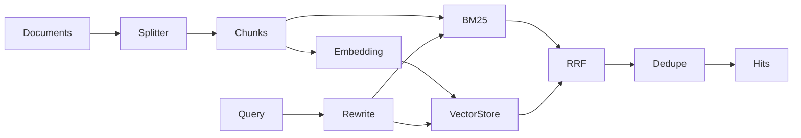

`HybridRetriever` 不直接修改 Graph State。它返回 `RetrievalResult`，当前用于知识工具和 Evaluation；工具路径再把检索命中转换为 Evidence。

### `ingest`：先准备，后替换

```python
new_chunks = self._splitter.split_documents(tuple(documents))
embeddings = self._embedding.embed_many([chunk.text for chunk in new_chunks])
embedded_records = tuple(
    EmbeddedChunk(...)
    for chunk, vector in zip(new_chunks, embeddings, strict=True)
)
```

文档先切分并全部 embedding。`zip(..., strict=True)` 在长度不等时抛错，防止 chunk 与向量静默错位。FakeEmbedding 默认确定且离线。

```python
updated_chunks = {
    chunk_id: chunk
    for chunk_id, chunk in self._chunks.items()
    if chunk.document_id not in document_ids
}
...
self._vector_store.replace_documents(document_ids, embedded_records)
self._lexical_index.rebuild(all_chunks)
self._documents = updated_documents
self._chunks = updated_chunks
```

同 document ID 的旧 chunks 全部移除，新记录准备完后才替换 store 和内存视图。输入来自 loader 的 `KnowledgeDocument`，输出 `IngestResult`。这是按 document ID 的幂等覆盖，类似数据库“先构造新版本再提交”。若只 upsert 新 chunk 不删旧版本，搜索会返回过期内容。

### `search`：rewrite 和两路召回

```python
rewritten = self._rewriter.rewrite(request.query)
candidate_k = min(200, max(request.top_k * self._candidate_multiplier, 20))
lexical = self._lexical_index.search(
    rewritten,
    top_k=candidate_k,
    metadata_filter=request.metadata_filter,
)
query_embedding = self._embedding.embed(rewritten)
vector = self._vector_store.search(...)
```

原 query 被保留，rewrite 增加规范别名。两路使用同一 rewritten query 和同一 metadata filter。先扩大候选池，融合后仍裁剪到 top_k；上限 200 防止请求放大。

### RRF 逐行解释

```python
for source_name, candidates in (("bm25", lexical), ("vector", vector)):
    for rank, candidate in enumerate(candidates, start=1):
        chunk_id = candidate.chunk.chunk_id
        fused_scores[chunk_id] += 1.0 / (self._rrf_k + rank)
        sources[chunk_id].add(source_name)
        chunks[chunk_id] = candidate.chunk
```

BM25 与 cosine 分数不在同一量纲，所以只使用排名。`defaultdict` 自动提供 0 分和空集合；`enumerate(start=1)` 让第一名贡献 `1/(k+1)`。两路都命中的 chunk 获得两次贡献。

若直接相加原始分数，某一检索器会因量纲而支配结果。修改 `rrf_k` 会改变头部排名权重，应通过 Evaluation 回归验证。

### 稳定排序、内容去重、Citation 保留

```python
ordered_ids = sorted(fused_scores, key=lambda item: (-fused_scores[item], item))
...
content_hash = chunks[chunk_id].content_hash
if content_hash in seen_hashes:
    continue
```

同分以 chunk ID 打破平局，使结果可复现。不同 ID 但相同正文只保留排名更高者。`SearchHit.chunk` 是原始 KnowledgeChunk，因此 metadata、section 和 Citation 原样保留，不由检索器重建。

输出还包含 original/rewritten query、索引规模和检索时间。它没有“下一 Graph 节点”；调用它的 Tool 完成后由 collect → aggregate 推进。

### 九问总结

| 问题 | 答案 |
| --- | --- |
| 做什么 | 索引文档并执行 BM25 + vector + RRF |
| 为什么 | 同时覆盖精确词和语义近似，默认离线可复现 |
| 输入 | KnowledgeDocument 或 SearchQuery |
| 输出 | IngestResult 或 citation-preserving RetrievalResult |
| State | 不直接变；知识 Tool 可把命中转为 Evidence |
| 下一节点 | Retriever 不路由；Tool 所在 collect 分支去 aggregate |
| Python | Sequence、zip strict、defaultdict、comprehension、稳定 sort |
| 类比 | 搜索服务的双索引写入和 federated ranking |
| 修改风险 | 不删除旧 chunk 会污染索引；不统一 filter 会产生越界召回 |

下一篇：[OfflineEvaluationRunner](#walkthrough-12)。

---

<a id="walkthrough-12"></a>

## 12 `runner.py`：离线 Evaluation 编排

源码：[src/incident_copilot/evaluation/runner.py](../../src/incident_copilot/evaluation/runner.py)

### 真实数据流

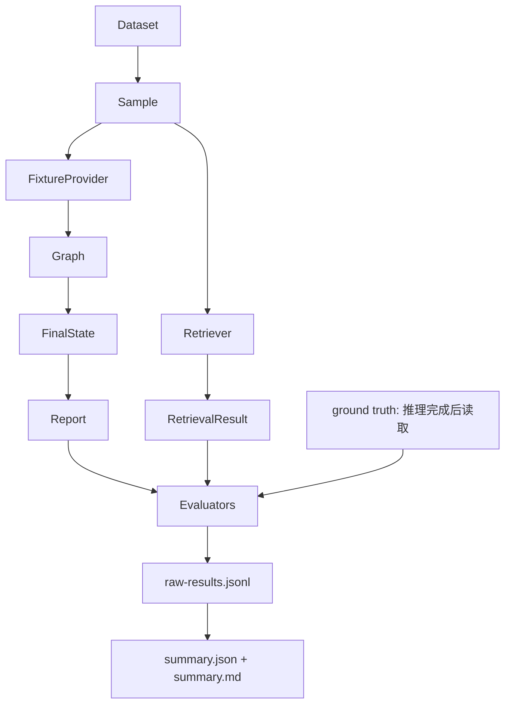

`OfflineEvaluationRunner` 负责下面的整条执行链；它不把标签暴露给 Graph。

### `run`：失败也进入分母

```python
for sample in dataset.samples:
    try:
        result = await self._run_sample(sample, retriever=retriever, run_id=run_id)
    except Exception as exc:
        result = EvaluationSampleResult(
            sample_id=sample.sample_id,
            status=SampleStatus.FAILED,
            error=f"{type(exc).__name__}: {exc}",
        )
    results.append(result)
```

样例顺序执行，便于复现和读取原始轨迹。单样例异常转成 FAILED 数据，不能被静默排除。这里宽捕获是 Evaluation 边界的刻意设计，并保留异常类型/消息；不是业务代码吞异常。

Runner 不直接改变 Graph State；它构造初值、等待 Graph 返回最终 State，再读取计数和报告。Graph 下一节点完全按 Builder 执行。

### 原始结果先落盘

```python
raw_path.write_text(
    "".join(
        json.dumps(result.model_dump(mode="json"), ensure_ascii=False, sort_keys=True) + "\n"
        for result in results
    ),
    encoding="utf-8",
)
```

每行一个完整 JSON 结果，`sort_keys=True` 便于 diff。随后才聚合并写 summary JSON/Markdown。输入是所有完成/失败结果，输出到调用者指定目录。删除 raw 文件会让平均指标无法追溯具体错误样例。

### `_run_sample`：先无标签推理，后评分

```python
incident = fixture_provider.fixture.incident
retrieval = retriever.search(
    SearchQuery(
        query=sample.retrieval_query,
        top_k=sample.retrieval_top_k,
        metadata_filter=MetadataFilter(services=incident.services),
    )
)
```

Filter 来自事故输入，而非 `ground_truth.affected_services`。否则答案服务会泄漏给检索器。

```python
state = cast(
    InvestigationState,
    await graph.ainvoke(
        create_initial_state(incident),
        config={
            "run_name": f"offline-evaluation:{sample.sample_id}",
            "tags": ["offline-evaluation", dataset_tag(run_id)],
            "metadata": {"dataset_ground_truth_exposed": False, ...},
        },
    ),
)
```

输入只有 Fixture Incident、离线 Provider/Fake Model 和运行 metadata。`cast` 不改变运行值，只告诉 mypy 这是最终 State。Graph 从 parse 一直执行到 report/END；Evaluation 不插手下一节点。

```python
report = state["final_report"]
    # 从这里开始才读取 ground truth 计算质量指标
actual_calls = self._actual_tool_calls(state)
root_recall = root_cause_term_recall(
    report.root_cause, sample.ground_truth.root_cause_terms
)
```

标签只在 Graph 完整结束后进入纯 evaluator。这个顺序是防止硬编码好看结果的关键。

### 评价内容

| 结果字段 | 实际来源 |
| --- | --- |
| 服务定位/故障类型 | IncidentReport 与标签比较 |
| Recall@K/MRR | Hybrid retrieval 排名 |
| 工具选择/参数 | `completed_steps` 重建的真实调用 |
| Evidence relevance | 报告 supporting Evidence ID |
| Citation correctness | 报告 Citation 与 EvidenceRef 一致性 |
| 根因准确 | 版本化词项 recall 达阈值 0.75 |
| 轮数/工具/Token | `investigation_stats` |
| 延迟 | 当前进程 `perf_counter` wall-clock |

`_actual_tool_calls` 从所有 `completed_steps` 重建跨轮记录，而不是只看最后 plan。若改看 pending steps，会评估“计划调用”而不是真实执行。

### `_tracing_context`：可选 LangSmith

```python
if self._enable_langsmith:
    ...
return tracing_context(
    enabled=self._enable_langsmith,
    project_name=self._project_name if self._enable_langsmith else None,
)
```

默认关闭，环境中即使安装 SDK 也不自动联网；显式启用但 SDK 不存在时清晰失败。删除显式开关可能让离线评估意外发送 trace。

### 九问总结

| 问题 | 答案 |
| --- | --- |
| 做什么 | 运行版本化样例，输出逐样例和聚合评估 |
| 为什么 | 让质量、资源与失败都可复现、可审计 |
| 输入 | EvaluationDataset、输出目录、可选 tracing |
| 输出 | raw JSONL、summary JSON/Markdown、EvaluationSummary |
| State | 不写 Node State；读取 Graph 最终 State 做评分 |
| 下一节点 | Evaluation 不控制 Graph 路由 |
| Python | async loop、Path、context manager、generator、cast |
| 类比 | 离线 ML test harness + regression report generator |
| 修改风险 | 标签提前进入 filter/context 会数据泄漏；丢弃失败会选择偏差 |

返回[核心源码阅读索引](#core-reading-index)或[学习中心](#learning-home)。
