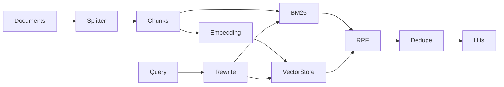
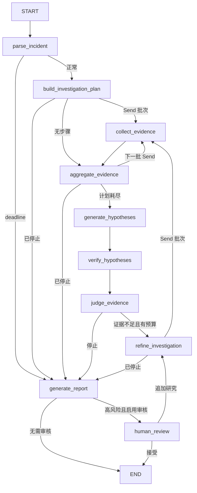
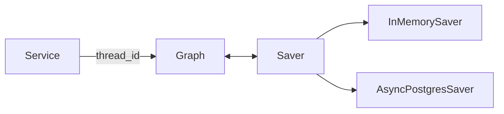
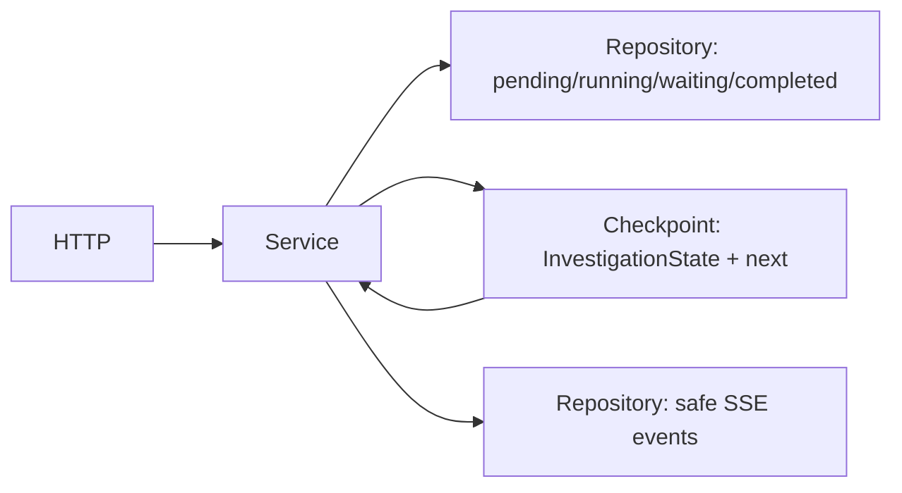
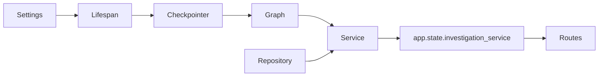
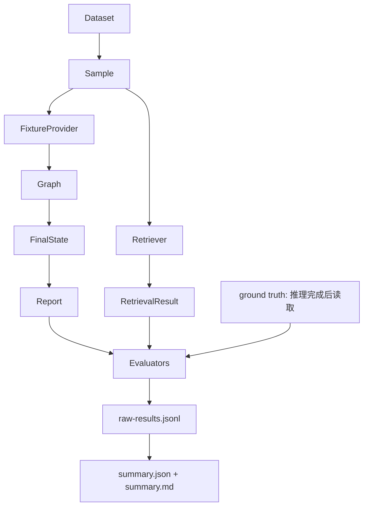

<a id="source-top"></a>

<div align="center">

# 🧩 IncidentCopilot 源码解析版

<p><strong>先认识常量、类型和数据关系, 再进入真实业务控制流</strong></p>

<p><span style="color:#2563EB"><strong>定义优先</strong></span> · <span style="color:#059669"><strong>依赖顺序</strong></span> · <span style="color:#7C3AED"><strong>逐段对照源码</strong></span></p>

</div>

> [!TIP]
> 第一次阅读先完成 **🧱 源码阅读基础**, 不要直接跳到 Graph Node。
> 已经熟悉定义时, 可以使用 **🧩 完整源码阅读索引** 按问题跳转。

> [!NOTE]
> 本文档复用仓库中的真实源码精读并按依赖重新排序。维护分章后运行
> `uv run python scripts/build_learning_guide.py` 可同时重新生成两份大文档。

## 📚 定义优先阅读目录


### 🧱 阅读前的基础定义

- 🧱 [源码阅读基础：先认识常量、类型和数据关系](#source-foundations)
- 🧱 [完整源码阅读索引](#core-reading-index)

### 📐 类型、契约与数据结构

- 📐 [15 全部领域模型源码](#walkthrough-15)
- 📐 [14 配置、异常、日志与遥测](#walkthrough-14)
- 📐 [17 Graph 装配、Schema 与可视化](#walkthrough-17)
- 📐 [20 Tool 接口、Schema、异常与内置工具](#walkthrough-20)
- 📐 [19 RAG Schema 与向量存储](#walkthrough-19)
- 📐 [16 任务模型、Repository 与 Fixture](#walkthrough-16)
- 📐 [22 Evaluation 数据集、Schema 与指标计算](#walkthrough-22)

### 🔌 数据获取与检索

- 🔌 [18 RAG 加载、切分、嵌入与词法检索](#walkthrough-18)
- 🔌 [11 `retrieval.py`：幂等索引与 Hybrid Search](#walkthrough-11)
- 🔌 [21 Fixture 与 Prometheus Provider](#walkthrough-21)
- 🔌 [10 `registry.py`：工具白名单与执行边界](#walkthrough-10)

### 🕸️ Graph 控制流

- 🕸️ [09 `model.py`：模型端口与确定性 Fake](#walkthrough-09)
- 🕸️ [05 `state.py`：State 与 Reducer](#walkthrough-05)
- 🕸️ [07 `nodes.py`：十个核心 Node](#walkthrough-07)
- 🕸️ [08 `routing.py`：确定性停止与下一节点](#walkthrough-08)
- 🕸️ [06 `builder.py`：真实 Graph、边与并行分发](#walkthrough-06)

### ⚡ 任务、API 与启动

- ⚡ [04 `checkpoint.py`：可恢复执行资源](#walkthrough-04)
- ⚡ [03 `service.py`：任务生命周期与 Graph 桥梁](#walkthrough-03)
- ⚡ [02 `investigations.py`：HTTP 与 SSE 适配层](#walkthrough-02)
- ⚡ [01 `main.py`：应用组合根](#walkthrough-01)
- ⚡ [13 应用入口与 API 辅助源码](#walkthrough-13)

### 📊 离线评估编排

- 📊 [12 `runner.py`：离线 Evaluation 编排](#walkthrough-12)

<div align="right"><a href="#source-top">⬆️ 返回源码目录</a></div>

---

<a id="source-foundations"></a>

## 🧱 源码阅读基础：先认识常量、类型和数据关系

这一篇不要急着追业务流程。目标是先认识源码反复使用的“积木”：常量、枚举、ID、领域模型、接口、State 字段和 Python 语法。后面看到业务函数时, 你就能把注意力放在控制流上。

### 1. 先区分五种定义

| 写法 | 例子 | 它解决什么问题 |
| --- | --- | --- |
| 模块常量 | `MAX_QUERY_WINDOW = timedelta(hours=24)` | 给整个模块一个统一且可搜索的限制 |
| 枚举 | `class SourceType(StrEnum)` | 把任意字符串缩成有限白名单 |
| 数据模型 | `class Evidence(DomainModel)` | 定义数据有哪些字段以及字段之间的约束 |
| Protocol | `class MetricsProvider(Protocol)` | 只规定组件必须提供哪些方法, 不绑定具体实现 |
| 业务函数/方法 | `collect_evidence_node(...)` | 读取已有对象, 执行流程并产生新结果 |

源码阅读时先判断当前看到的是哪一种。前三种主要回答“系统里有什么”；Protocol 回答“组件如何连接”；最后一种才回答“系统如何运行”。

### 2. 项目最外层常量

#### 版本和 ASGI 对象

| 定义 | 位置 | 含义 |
| --- | --- | --- |
| `__version__ = "0.1.0"` | `incident_copilot/__init__.py` | 应用自身版本, health API 和 Settings 默认读取它 |
| `app = create_app()` | `main.py` | Uvicorn 导入的模块级 ASGI 应用对象 |
| `router = APIRouter(...)` | API route 文件 | 收集一组 HTTP 路由, 最后由 `main.py` 注册 |
| `logger = logging.getLogger(__name__)` | 多个模块 | 使用当前模块名创建日志记录器, 不立即写日志 |

`app`、`router` 和 `logger` 虽然名字不是全大写, 但它们也是模块加载后复用的单例对象。导入 `main.py` 会创建 FastAPI app；导入普通领域模块不会连接外部系统。

### 3. 配置枚举和默认值

位置：[src/incident_copilot/core/config.py](../../src/incident_copilot/core/config.py)

#### 四组配置枚举

| 枚举 | 可选值 | 中文理解 |
| --- | --- | --- |
| `RuntimeEnvironment` | development/test/staging/production | 当前部署环境 |
| `LogLevel` | DEBUG/INFO/WARNING/ERROR/CRITICAL | 最低日志级别 |
| `CheckpointBackend` | memory/postgres | Graph 快照放内存还是 PostgreSQL |
| `MetricsBackend` | fixture/prometheus | 指标从本地样例还是真实 Prometheus 获取 |

#### Settings 默认值

| 字段 | 默认值 | 为什么存在 |
| --- | ---: | --- |
| `api_prefix` | `/api` | 统一 API 路径前缀 |
| `sse_heartbeat_seconds` | `15.0` | SSE 没有新事件时多久发一次心跳 |
| `checkpoint_backend` | memory | 默认无需数据库即可运行 |
| `metrics_backend` | fixture | 默认无需真实可观测性系统 |
| `prometheus_base_url` | `http://127.0.0.1:9090` | 本地 Prometheus 默认地址 |
| `prometheus_timeout_seconds` | `2.0` | 单次 Prometheus 调用上限 |

环境变量统一添加 `INCIDENT_COPILOT_` 前缀。例如 `metrics_backend` 对应 `INCIDENT_COPILOT_METRICS_BACKEND`。`postgres_dsn` 和 `model_api_key` 使用 `SecretStr`, 打印 Settings 时不会显示明文。

### 4. 领域枚举：报告里反复出现的词

位置：[src/incident_copilot/domain/common.py](../../src/incident_copilot/domain/common.py)

#### 事故与环境

| 枚举 | 值 | 含义 |
| --- | --- | --- |
| `Severity` | unknown、sev1..sev4 | 故障严重度, sev1 最严重 |
| `Environment` | production、staging、development、unknown | 故障发生环境 |

#### 证据来源 `SourceType`

| 值 | 中文含义 | 对应工具 |
| --- | --- | --- |
| `log` | 日志 | `search_logs` |
| `metric` | 数值指标 | `query_metrics` |
| `trace` | 分布式调用链 | `query_traces` |
| `change` | 发布或配置变更 | `get_recent_changes` |
| `topology` | 服务依赖拓扑 | `get_service_topology` |
| `knowledge` | Runbook 或历史故障 | 两个知识搜索工具 |

#### 推理与报告状态

| 枚举 | 主要值 | 判断对象 |
| --- | --- | --- |
| `HypothesisStatus` | proposed/investigating/supported/rejected/inconclusive | 一条根因假设目前处于什么阶段 |
| `ReportDisposition` | confirmed/probable/inconclusive | 最终报告对根因有多确定 |
| `RiskLevel` | low/medium/high/critical | 修复建议的操作风险 |

不要把 `HypothesisStatus.SUPPORTED` 理解成已确认事故根因。它只表示某条假设有支持证据；最终报告还要结合反证、充分性和停止原因。

### 5. ID 前缀：看到 ID 就知道对象类型

项目使用正则限制 ID。下面这张表可以当作源码阅读图例。

| 前缀 | 对象 | 示例 |
| --- | --- | --- |
| `inc_` | `IncidentContext` 故障 | `inc_payment_...` |
| `inv_` | API 调查任务 | `inv_` + 32 位十六进制 |
| `thread_` | LangGraph Checkpoint 线程 | 恢复执行时保持不变 |
| `run_` | 一次任务运行 | 新一轮运行的关联 ID |
| `plan_` | 一轮调查计划 | 由计划 Node 产生 |
| `step_` | 单次工具步骤 | 每个 `InvestigationStep` 一个 |
| `ev_` | Evidence | Provider 返回的完整证据 |
| `cit_` | Citation | 证据出处和定位信息 |
| `hyp_` | Hypothesis | 一条可证伪根因假设 |
| `err_` | InvestigationError | Graph State 中的安全错误 |
| `rpt_` | IncidentReport | 最终报告 |
| `evt_` | InvestigationEvent | SSE 可重放事件 |
| `doc_` | KnowledgeDocument | RAG 原始知识文档 |
| `chunk_` | KnowledgeChunk | 文档切分后的小块 |
| `eval_` / `evalrun_` | 评估样例 / 评估运行 | 离线 Evaluation 使用 |

这些前缀不是装饰。Pydantic 会拒绝错误类型的 ID；日志、报告和事件也能仅凭前缀快速识别对象。

### 6. 调查预算与停止常量

位置：[src/incident_copilot/graph/schemas.py](../../src/incident_copilot/graph/schemas.py)

#### `InvestigationOptions` 默认预算

| 字段 | 默认值 | 上限作用 |
| --- | ---: | --- |
| `max_research_rounds` | 2 | 最多进行几轮“证据不足 → 再调查” |
| `max_tool_calls` | 14 | 全部工具调用总数 |
| `max_parallel_tools` | 7 | 一个批次最多并行多少工具 |
| `max_model_calls` | 20 | 结构化模型调用总数 |
| `max_estimated_tokens` | 20000 | 输入和输出 Token 总预算 |
| `timeout_seconds` | 30 | 整次 Graph 调查 deadline |

#### `StopReason`

| 值 | 为什么停止 |
| --- | --- |
| `evidence_sufficient` | 证据已经足够 |
| `max_research_rounds` | 达到调查轮数上限 |
| `tool_budget_exhausted` | 工具预算耗尽 |
| `model_budget_exhausted` | 模型调用预算耗尽 |
| `token_budget_exhausted` | Token 预算耗尽 |
| `deadline_exceeded` | 总时间截止 |

模型不能自由发明停止原因。`routing.py` 只会从这组六个枚举中选择。

#### 工具步骤相关枚举

- `StepStatus`：completed、failed、skipped。
- `ErrorCategory`：validation、timeout、unavailable、malformed_response、budget、internal。
- `ModelTask`：plan、hypotheses、judge、report。
- `RouteTarget`：只允许 `refine_investigation` 或 `generate_report`。

`ModelTask` 表示“要求模型返回哪一种结构”；`RouteTarget` 才是 Graph 下一节点。两者不要混在一起。

### 7. 工具和 Provider 的固定限制

位置：[src/incident_copilot/tools/schemas.py](../../src/incident_copilot/tools/schemas.py) · [src/incident_copilot/tools/providers/prometheus.py](../../src/incident_copilot/tools/providers/prometheus.py)

| 常量 | 值 | 作用 |
| --- | ---: | --- |
| `MAX_QUERY_WINDOW` | 24 小时 | 单次日志/指标/Trace/变更查询最大窗口 |
| Tool `limit` | 通常最多 50 | 防止 Provider 返回无界 Evidence |
| `PROVIDER_NAME` | `prometheus-http` | Prometheus Evidence 和错误的稳定来源名 |
| `MAX_RESPONSE_BYTES` | 1,000,000 | Prometheus HTTP body 最大 1 MB |
| `MAX_POINTS_PER_SERIES` | 240 | 单条指标序列最多采样点 |

#### Prometheus 指标白名单

| 领域指标名 | Prometheus 指标 | 单位 | 聚合 |
| --- | --- | --- | --- |
| `db.pool.utilization` | `incident_demo_db_pool_utilization_ratio` | ratio | avg/max/min/p95 |
| `http.server.error_rate` | `incident_demo_http_server_error_rate_ratio` | ratio | avg/max/rate |

Graph 和模型只能请求左侧领域指标名，Adapter 再转换成右侧 Prometheus 指标。这样模型不能直接生成任意 PromQL。

#### Provider 错误类别

`ProviderErrorCategory` 包含 invalid_query、timeout、unavailable、rate_limited、malformed_response 和 internal。只有 timeout、unavailable、rate_limited 默认可重试；参数错误和错误响应重复执行通常不会变好。

### 8. RAG 常量和检索参数

位置：`rag/loader.py`、`rag/splitter.py`、`rag/retrieval.py`

| 定义 | 默认值 | 含义 |
| --- | ---: | --- |
| `FRONTMATTER_DELIMITER` | `+++` | 知识 Markdown 的 TOML metadata 边界 |
| `MAX_KNOWLEDGE_FILE_BYTES` | 1,000,000 | 单份知识文件最大尺寸 |
| `MarkdownSplitter.max_tokens` | 120 | 离线组合根中的 Chunk 最大近似 Token 数 |
| `MarkdownSplitter.overlap_tokens` | 20 | 相邻 Chunk 重叠大小 |
| `FakeEmbedding.dimension` | 64 | 离线假向量维度 |
| `BM25Index.k1` | 1.5 | 词频饱和参数 |
| `BM25Index.b` | 0.75 | 文档长度归一化参数 |
| `HybridRetriever.rrf_k` | 60 | RRF 排名融合平滑常数 |
| `candidate_multiplier` | 4 | 融合前每路候选池放大倍数 |

`SEARCH_TOKEN_PATTERN` 同时识别英文技术标识和单个中文字符；`HEADING_PATTERN` 识别一到六级 Markdown 标题。它们决定“如何切分和检索文本”，不是业务故障规则。

QueryRewriter 的别名表是经过审核的确定性映射。例如“连接池”扩展为 `connection pool database`。原始词始终保留，不使用在线模型改写。

### 9. 其他模块级常量和类型别名

| 定义 | 位置 | 含义 |
| --- | --- | --- |
| `REDACTED = "***REDACTED***"` | `core/logging.py` | 日志发现密钥或 Token 后使用的统一替换文本 |
| `_SENSITIVE_KEYS` | `core/logging.py` | api_key、password、secret、token 等敏感键白名单 |
| `OTEL_ENABLED_ENV` | `core/telemetry.py` | 控制可选 OpenTelemetry 的环境变量名 |
| `FENCE_START` / `FENCE_END` | `graph/visualization.py` | 从 Markdown 中定位 Mermaid 代码块的边界 |
| `FAILURE_TYPE_PATTERNS` | `evaluation/evaluators.py` | 离线故障类型分类使用的透明关键词表 |
| `ROOT_CAUSE_ACCURACY_THRESHOLD` | `evaluation/runner.py` | 根因关键词召回率达到 `0.75` 才记为准确 |
| `ReportStatus` | `graph/schemas.py` | 只允许 complete 或 limited 的类型别名 |

以下写法看起来像常量, 实际主要服务静态类型检查：

- `InvestigationGraph`：编译后 Graph 的复杂泛型类型别名。
- `Clock`：返回 `datetime` 的可注入时钟函数类型。
- `ToolHandler`：工具异步处理器的统一 Callable 类型。
- `ParamT`、`ReturnT`、`ItemT`、`OutputT`：让装饰器、Reducer 和结构化模型 helper 保留输入输出类型的 `TypeVar/ParamSpec`。

名字以下划线开头, 例如 `_SENSITIVE_KEYS`，表示模块内部实现细节；普通调用方不应把它当稳定公共 API。

### 10. 任务状态和事件名称

位置：[src/incident_copilot/investigations/models.py](../../src/incident_copilot/investigations/models.py)

#### `InvestigationStatus`

```text
pending → running → waiting_review → completed
                  └──────────────→ failed
```

- `pending`：任务已创建, 后台 Graph 尚未开始。
- `running`：Graph 正在执行。
- `waiting_review`：Graph 在 HITL interrupt 暂停。
- `completed`：报告已完成并通过需要的人工确认。
- `failed`：任务执行失败。

这是 API 任务状态；Graph 内部是否到某个 Node 由 Checkpoint 的执行位置描述。

#### `EventType`

SSE 事件分为四组：任务级 queued/started/failed；节点和工具级 completed/failed；数据级 evidence/hypothesis/budget updated；终点级 review required/report completed。每条事件有严格递增 `sequence`，客户端才能从 `Last-Event-ID` 继续读取。

### 11. 先认识核心数据模型

#### 调查主链路

```text
CreateInvestigationRequest
    ↓ to_incident
IncidentContext
    ↓ plan Node
InvestigationPlan → InvestigationStep
    ↓ collect Node + ToolRegistry
Evidence → EvidenceRef + StepResult
    ↓ hypothesis / verify Node
Hypothesis + VerificationQuery
    ↓ judge / route
StopReason 或下一轮计划
    ↓ report Node
IncidentReport
    ↓ Service 投影
InvestigationRecord + InvestigationEvent
```

#### 为什么 Evidence 有两个版本

| 类型 | 保存什么 | 放在哪里 |
| --- | --- | --- |
| `Evidence` | 原始 content、metadata、摘要、Citation | Provider/Tool 边界 |
| `EvidenceRef` | ID、摘要、评分、时间和 Citation | Graph State 与报告 |

State 不存原始大对象，避免 Checkpoint 不断膨胀。Citation 始终保留，因此最终报告仍能定位来源。

#### 为什么模型输出还有一层 Schema

`ModelResponse.payload` 只是未可信 dict。Node 会按 `ModelTask` 再校验为 `PlanOutput`、`HypothesesOutput`、`SufficiencyOutput` 或 `ReportDraftOutput`。模型报告草稿不能直接提供 Citation；引用由代码从已验证 EvidenceRef 附加。

### 12. Protocol、Adapter、Provider、Tool 的关系

```text
Protocol（规定方法签名）
    ↑
Provider / Adapter（真正读取 Fixture、Prometheus 或 RAG）
    ↑
ToolDefinition（绑定工具名、参数 Schema、来源白名单、超时重试）
    ↑
ToolRegistry（统一执行安全策略）
    ↑
Graph collect Node（只按计划调用工具）
```

以指标为例：

- `MetricsProvider`：只规定 `query(...) -> Sequence[Evidence]`。
- `FixtureProvider`：离线实现。
- `PrometheusMetricsProvider`：真实 HTTP 实现。
- `query_metrics`：Graph 看到的稳定工具名。
- `ToolRegistry`：验证参数、预算、超时、重试和 Evidence 来源。

替换数据源时改 Adapter 装配，不改 Graph Node。

### 13. State 字段先分组再记

位置：[src/incident_copilot/graph/state.py](../../src/incident_copilot/graph/state.py)

| 分组 | 字段 |
| --- | --- |
| 输入 | `incident` |
| 当前计划 | `investigation_plan`, `pending_steps`, `current_step` |
| 并行产物 | `completed_steps`, `evidence`, `errors` |
| 推理 | `hypotheses`, `evidence_sufficient`, `sufficiency_reason`, `next_investigation_queries` |
| 轮数和预算 | `research_round`, 各种 max 字段、调用计数、`model_usage` |
| 时间 | `started_at`, `deadline_at`, `deadline_exceeded` |
| 终点 | `stop_reason`, `final_report` |
| HITL | `human_feedback`, `review_completed` |

#### 哪些字段有 Reducer

- `completed_steps` → `merge_step_results`
- `evidence` → `merge_evidence`
- `errors` → `merge_errors`
- 调用计数 → `add_count`
- `model_usage` → `add_usage`

有 Reducer 的并行节点应返回“本分支增量”；没有 Reducer 的字段采用覆盖语义。理解这一点后再读 `collect_evidence_node`，就不会疑惑为什么计数返回 `1` 而不是总数。

### 14. 常见 Python/Pydantic 写法

| 写法 | 先这样理解 |
| --- | --- |
| `tuple[str, ...]` | 任意长度、元素都是 str 的不可变序列 |
| `X | None` | 这个值可以不存在 |
| `Annotated[T, reducer]` | T 类型 State 通道额外绑定合并函数 |
| `Protocol` | 只要方法签名相同就算实现该接口 |
| `@dataclass(frozen=True, slots=True)` | 小型、不可变、字段固定的数据对象 |
| `Field(ge=1, le=50)` | Pydantic 运行时数值边界 |
| `@field_validator` | 校验或规范一个字段 |
| `@model_validator(mode="after")` | 字段解析后检查多个字段关系 |
| `model_copy(update={...})` | 从冻结模型复制一个修改后的新对象 |
| `async def` / `await` | 协程在 I/O 等待时把控制权交还事件循环 |
| `asyncio.to_thread` | 把阻塞同步函数移出事件循环线程 |
| `asynccontextmanager` | `yield` 前启动资源, `yield` 后释放资源 |
| `raise NewError(...) from exc` | 转换异常类型但保留原始原因链 |

### 15. 推荐的“定义优先”源码顺序

第一轮只读定义：

```text
domain/common.py
→ domain/evidence.py、incident.py、hypothesis.py、report.py
→ graph/schemas.py、state.py
→ tools/interfaces.py、schemas.py、exceptions.py
→ rag/schemas.py
→ investigations/models.py
```

第二轮读数据如何被取得和处理：

```text
rag loader/splitter/vector/retrieval
→ Fixture/Prometheus Provider
→ builtin tools
→ ToolRegistry
```

第三轮才读主业务控制流：

```text
ModelProvider
→ Graph Nodes
→ Routing
→ Builder
→ Checkpoint
→ InvestigationService
→ API routes
→ main.py
```

第四轮读验证系统：

```text
evaluation schemas/evaluators
→ OfflineEvaluationRunner
```

完成本篇后, 继续阅读后面的源码精读时先查看每章“职责”和“输入输出”，再进入代码块。遇到陌生类型可以回到本篇对应表格，而不需要在业务函数中猜它的含义。

> **➡️ 按本导读顺序, 下一篇:** [完整源码阅读索引](#core-reading-index)

<div align="right"><a href="#source-top">⬆️ 返回源码目录</a></div>

---

<a id="core-reading-index"></a>

## 🧱 完整源码阅读索引

`src/incident_copilot/` 当前 64 个 Python 文件已经全部纳入源码精读。建议先读 A 级控制流，再按兴趣进入 B 级支撑模块；逐行阅读不等于从第一个文件机械读到最后一个文件。

### A 级：先理解主控制流

| 顺序 | 核心文件 | 先读专题 | Walkthrough |
| ---: | --- | --- | --- |
| 1 | `main.py` | 02、09 | [应用组合根](#walkthrough-01) |
| 2 | `api/routes/investigations.py` | 03、09、10 | [调查 API 与 SSE](#walkthrough-02) |
| 3 | `investigations/service.py` | 03、09、10 | [任务生命周期与 Graph 桥梁](#walkthrough-03) |
| 4 | `investigations/checkpoint.py` | 10 | [Checkpoint](#walkthrough-04) |
| 5 | `graph/state.py` | 04 | [State 与 Reducer](#walkthrough-05) |
| 6 | `graph/builder.py` | 05 | [Graph、边与并行分发](#walkthrough-06) |
| 7 | `graph/nodes.py` | 05、08 | [十个核心 Node](#walkthrough-07) |
| 8 | `graph/routing.py` | 05、08 | [停止条件与路由](#walkthrough-08) |
| 9 | `graph/model.py` | 08 | [ModelProvider 与 Fake](#walkthrough-09) |
| 10 | `tools/registry.py` | 06 | [工具执行安全边界](#walkthrough-10) |
| 11 | `rag/retrieval.py` | 07 | [Hybrid Retriever](#walkthrough-11) |
| 12 | `evaluation/runner.py` | 11 | [离线 Evaluation 编排](#walkthrough-12) |

### B 级：补齐完整工程实现

| 顺序 | 模块范围 | 覆盖文件 | Walkthrough |
| ---: | --- | ---: | --- |
| 13 | 应用入口与 API 辅助 | 9 | [demo、server、错误、Schema、health](#walkthrough-13) |
| 14 | 核心基础设施 | 5 | [配置、异常、日志、遥测](#walkthrough-14) |
| 15 | 领域层 | 7 | [Incident、Evidence、Hypothesis、Report、Review](#walkthrough-15) |
| 16 | 任务存储与 Fixture | 5 | [任务模型、Repository、Fixture Schema](#walkthrough-16) |
| 17 | Graph 辅助 | 4 | [装配、Schema、可视化、公共门面](#walkthrough-17) |
| 18 | RAG 摄取 | 7 | [加载、切分、嵌入、BM25、改写、Provider](#walkthrough-18) |
| 19 | RAG 数据与存储 | 3 | [RAG Schema、内存向量库、pgvector](#walkthrough-19) |
| 20 | Tool 契约 | 6 | [Protocol、参数、异常、内置工具](#walkthrough-20) |
| 21 | Tool Provider | 2 | [Fixture 与 Prometheus Adapter](#walkthrough-21) |
| 22 | Evaluation 辅助 | 4 | [数据集、Schema、纯指标函数](#walkthrough-22) |

表中的覆盖文件数包含所属包的 `__init__.py`。单行初始化文件会解释导出和导入副作用，不重复粘贴没有业务逻辑的代码。

### 按问题选择源码

| 你想弄懂的问题 | 建议顺序 |
| --- | --- |
| HTTP 请求如何启动调查 | 01 → 02 → 03 → 06 |
| 并行证据如何合并 | 05 → 06 → 07 → 08 |
| 工具为什么不能任意调用 | 20 → 10 → 21 |
| Evidence/Citation 如何保留 | 15 → 20 → 10 → 07 |
| RAG 如何从文档变成 Evidence | 18 → 19 → 11 → 21 |
| 暂停恢复如何工作 | 04 → 03 → 02 |
| 评估数字如何计算 | 22 → 12 |
| 配置、日志和遥测如何装配 | 14 → 01 |

### 对照源码的阅读方法

1. 在 IDE 中打开 walkthrough 顶部的源码链接。
2. 同时打开文档和源码，按照文档小节从上向下移动光标。
3. 看到代码块时逐行对照；看到字段表时逐字段查看 Pydantic 约束。
4. 每读完一个函数，回答它的输入、输出、State 影响和失败路径。
5. 跳到文档末尾的测试，观察这些约束如何被断言。
6. 尝试只修改一个 Fixture 或配置值，不要先改业务逻辑。

### 文档解释约定

每份 walkthrough 都回答：

- 代码做什么、为什么这样写。
- 输入从哪里来、输出到哪里去。
- 是否改变 `InvestigationState`。
- 下一节点由谁决定。
- 相关 Python/Pydantic/异步语法。
- 后端工程类比。
- 删除或修改后的真实影响。

不涉及 State 的文件会明确写“不直接读写 State”。简单导出文件按每条导入/导出解释，不用重复内容制造虚假的复杂度。

### 覆盖门禁

`scripts/build_learning_guide.py` 在合并前会扫描全部源码链接。新增 `.py` 文件却没有加入 walkthrough 时，文档构建会直接失败并列出缺失路径。这个门禁保证“64/64”不是手工声明的数字。

> **➡️ 按本导读顺序, 下一篇:** [15 全部领域模型源码](#walkthrough-15)

<div align="right"><a href="#source-top">⬆️ 返回源码目录</a></div>

---

<a id="walkthrough-15"></a>

## 📐 15 全部领域模型源码

本篇覆盖 `domain/` 的公共类型、Incident、Evidence、Hypothesis、Report、人工审核和包导出。领域层不导入 FastAPI、LangGraph、数据库或具体 Provider。

### `domain/common.py`：共同不变量

源码：[src/incident_copilot/domain/common.py](../../src/incident_copilot/domain/common.py)

#### 时区与严格基类

```python
def require_timezone(value: datetime) -> datetime:
    if value.tzinfo is None or value.utcoffset() is None:
        raise ValueError(...)
    return value

AwareDatetime = Annotated[datetime, AfterValidator(require_timezone)]
```

第一行检查是否声明时区，第二个条件还防止无有效 UTC offset 的伪时区对象。`Annotated` 把校验器绑定到类型，之后所有模型复用 `AwareDatetime` 就自动执行同一规则。

`DomainModel` 的三个配置逐行含义：`extra="forbid"` 拒绝未知字段；`frozen=True` 防止创建后原地修改；`str_strip_whitespace=True` 自动清理字段首尾空格。冻结值对象使并行 Graph 分支不会共享可变领域实体。

六组 `StrEnum` 统一严重度、环境、来源、假设状态、报告确定度和修复风险。它们是跨 Graph、Tool、API 的领域词汇表。

#### 三个规范化函数

- `normalize_services`：逐项 `strip().lower()`；检查长度和允许字符；用 `seen` 去重但保留输入顺序；返回不可变 tuple。
- `normalize_optional_service`：把 `None` 原样返回，否则复用单元素服务校验。
- `unique_non_empty`：用于普通字符串集合，只去首尾空格、拒绝空值、稳定去重。
- `unique_evidence_ids`：先复用普通集合规则，再用完整正则验证 `ev_...` 格式。

如果直接用 `set(values)`，顺序会丢失，报告和测试输出将不稳定。

### `domain/incident.py`：调查边界

源码：[src/incident_copilot/domain/incident.py](../../src/incident_copilot/domain/incident.py)

`IncidentContext` 的字段按职责分为：唯一 ID；原始用户问题；服务和时间范围；症状/严重度/环境；创建时间和时区假设。字段校验先规范化 services/symptoms，模型校验最后保证 `start_time < end_time`。

它是 Graph State 的只读输入之一。修改时间窗口会改变所有工具查询；删除 `raw_query` 会让计划和模型上下文失去原始意图。

### `domain/evidence.py`：Evidence 与 Citation

源码：[src/incident_copilot/domain/evidence.py](../../src/incident_copilot/domain/evidence.py)

#### `Citation`

字段从“身份”到“定位”依次是 citation ID、URI、locator、展示名、抓取时间和内容哈希。`validate_uri()` 逐层防御：只允许四种 scheme；拒绝 URL 用户名/密码；HTTP 必须有 host；内部 URI 也必须有实际位置。

#### `Evidence`

完整 Evidence 包含原始 `content`、摘要、单点或区间时间、服务、相关性/可靠性、metadata、Citation 和哈希。`validate_time_range()` 按顺序确保：

1. 起止时间必须成对出现。
2. 起点严格早于终点。
3. Citation 的内容哈希必须与 Evidence 相同。

第三条把“证据内容”和“证据出处”绑定起来，防止报告引用另一份内容。

#### `EvidenceRef`

它删除了完整 content 和任意 metadata，只保留 State/报告真正需要的摘要和引用。`from_evidence()` 显式逐字段复制，而不是 `model_dump` 后全量透传，因此 Evidence 新增大字段时不会自动膨胀 State。

| 对比 | Evidence | EvidenceRef |
| --- | --- | --- |
| 位置 | Provider/工具边界 | Graph State 与报告 |
| 原始 content | 有 | 无 |
| metadata | 有 | 无 |
| Citation | 有 | 有 |

### `domain/hypothesis.py`：可证伪假设

源码：[src/incident_copilot/domain/hypothesis.py](../../src/incident_copilot/domain/hypothesis.py)

`VerificationQuery` 描述“查什么来源、针对哪个服务”，不包含厂商查询语言。来源 tuple 通过 `dict.fromkeys` 稳定去重。

`Hypothesis` 把陈述、影响服务、支持/反对 Evidence ID、置信度、状态、下一步查询、推理摘要和版本放在一起。最终模型校验先求支持与反对集合交集，再要求 `SUPPORTED` 状态至少有一条支持证据。这样模型不能只输出高置信文字而不给证据。

Graph 的 `generate_hypotheses`/`verify_hypotheses` 会更新这些对象；路由代码只读取验证后的结果。

### `domain/report.py`：可审计输出

源码：[src/incident_copilot/domain/report.py](../../src/incident_copilot/domain/report.py)

辅助值对象按报告顺序排列：

- `TimelineEvent`：时间、描述和 Evidence ID。
- `RejectedHypothesis`：被排除的假设、原因和证据。
- `RemediationStep`：建议、优先级、风险、验证和回滚；它只是数据，不是可执行命令。
- `InvestigationStats`：真实轮数、调用数、Token、时间、来源计数和停止原因。

`InvestigationStats.evidence_count_by_source` 使用 `MappingProxyType` 防止字典被原地修改；自定义 serializer 在输出 JSON 时再转回普通 dict。`validate_totals()` 检查 Token 加法、工具结果不超过调用数、完成时间顺序以及完成时间/耗时必须同时出现。

`IncidentReport` 的模型级校验逐条执行：

1. 非 `INCONCLUSIVE` 报告必须有 root cause。
2. Timeline 必须已经按时间排序，模型不会在校验器里偷偷重排。
3. 支持与反对 EvidenceRef 合并后 ID 不得重复。
4. Citation ID 不得重复。

报告由 Graph `generate_report` 写入 State；最终节点只能引用已收集 EvidenceRef。删掉一致性校验会允许“确认根因但无根因文本”或重复引用进入 API。

### `domain/review.py`：HITL 白名单

源码：[src/incident_copilot/domain/review.py](../../src/incident_copilot/domain/review.py)

`ReviewAction` 只允许接受或追加研究。`HumanFeedback.validate_action_payload()` 把 action 与 payload 绑定：接受时禁止查询；追加研究时至少需要一条查询。调用方不能提交任意 Graph 节点名或 Command。

`HumanReviewRequest` 是暂停时公开的小载荷：报告 ID、原因、高风险动作和允许决策。`high_risk_actions` 至少一项，说明系统不会对无风险报告无故中断。

### `domain/__init__.py`：公共门面

[`domain/__init__.py`](../../src/incident_copilot/domain/__init__.py) 从各子模块导入稳定类型，再用 `__all__` 声明 `from incident_copilot.domain import *` 的公开集合。它没有包含 HumanFeedback/ReviewAction，因此审核模块当前要求显式导入。删除 `__all__` 不会破坏显式导入，但会让包的公共边界不清晰。

### 阅读卡片

| 问题 | 答案 |
| --- | --- |
| 输入 | API、Provider、模型结构化输出和代码生成值 |
| 输出 | 冻结、已校验的领域对象 |
| State | Incident、EvidenceRef、Hypothesis、Report 等会进入 State；模型本身不知道 Reducer |
| 下一节点 | 领域模型不路由；`routing.py` 读取其状态后决定 |
| Python 重点 | `Annotated`、`StrEnum`、Pydantic validator、冻结模型、`MappingProxyType` |
| 后端类比 | DDD Value Object 与 Aggregate 内部不变量 |
| 修改风险 | 放宽字段或删除交叉校验会把不一致数据传播到 Graph、API 和 Evaluation |

### 对照测试

- `tests/unit/domain/`
- `tests/unit/fixtures/test_schemas.py`
- `tests/integration/test_investigation_graph.py`

> **➡️ 按本导读顺序, 下一篇:** [14 配置、异常、日志与遥测](#walkthrough-14)

<div align="right"><a href="#source-top">⬆️ 返回源码目录</a></div>

---

<a id="walkthrough-14"></a>

## 📐 14 配置、异常、日志与遥测

本篇按源码顺序解释 `core/` 下全部文件。它们为其他模块提供横切能力，但不承载调查业务。

### `core/config.py`

源码：[src/incident_copilot/core/config.py](../../src/incident_copilot/core/config.py)

#### 枚举为什么不直接用字符串

`RuntimeEnvironment`、`LogLevel`、`CheckpointBackend` 和 `MetricsBackend` 都继承 `StrEnum`。它们既能像字符串一样进入 JSON/环境配置，又把允许值限制为白名单。调用处可以写 `backend is MetricsBackend.PROMETHEUS`，避免拼写错误散落在业务代码中。

#### `Settings` 逐项阅读

```python
model_config = SettingsConfigDict(
    env_prefix="INCIDENT_COPILOT_",
    env_file=".env",
    env_file_encoding="utf-8",
    case_sensitive=False,
    extra="ignore",
)
```

1. 所有环境变量加统一前缀，防止与系统变量冲突。
2. 本地可从 `.env` 读取，但生产仍可直接注入环境变量。
3. 键名不区分大小写；未知配置被忽略，便于同一 `.env` 放置其他组件变量。

字段分三类：应用元数据与日志；SSE 和 Checkpoint；指标 Provider 与可选凭据。数值字段用 `gt/le` 限制，`SecretStr` 的 `repr` 不显示明文，且字段额外声明 `repr=False`。

`validate_api_prefix()` 依次执行 `strip`、检查前导 `/`、拒绝根路径和尾随 `/`。因此路由拼接只有一种规范形式。`@cache` 让 `get_settings()` 每进程只解析一次；测试若改变环境变量，需要调用 `get_settings.cache_clear()`。

| 项目 | 说明 |
| --- | --- |
| 输入 | 环境变量、`.env` 和安全默认值 |
| 输出 | 冻结前的强类型 `Settings` 实例 |
| State | 不影响 Graph State，只决定组合根选择哪个 Adapter |
| 类比 | Spring `@ConfigurationProperties` |
| 修改风险 | 缓存前读取环境会导致测试不稳定；把密钥改为普通 `str` 容易在日志中泄漏 |

### `core/exceptions.py`

源码：[src/incident_copilot/core/exceptions.py](../../src/incident_copilot/core/exceptions.py)

`ErrorCode` 是对外稳定机器码；异常类名可以重构，但客户端依赖的 code 不应随意改变。`IncidentCopilotError` 把三类信息分开：

```python
code: ClassVar[ErrorCode] = ErrorCode.INTERNAL
status_code: ClassVar[int] = 500

def __init__(self, message: str, *, details: dict[str, JsonValue] | None = None):
    super().__init__(message)
    self.message = message
    self.details = details or {}
```

- `ClassVar` 表示 code/status 属于异常类型，不是每个实例的 Pydantic 字段。
- `super().__init__` 保留标准异常行为；额外属性供 API Adapter 映射。
- `details or {}` 给每个实例独立字典。
- 四个子类只覆盖 code 和 HTTP status，实现领域校验 400、配置 500、资源不存在 404、状态冲突 409。

这些异常不导入 FastAPI，使 Service 和 Repository 可在 CLI、测试或其他协议中复用。

### `core/logging.py`

源码：[src/incident_copilot/core/logging.py](../../src/incident_copilot/core/logging.py)

#### 脱敏的三层防线

1. `_SENSITIVE_KEYS` 识别结构化字典中的敏感键。
2. `_KEY_VALUE_PATTERN` 识别嵌在自由文本里的 `password=...`、`token:...` 等格式。
3. `_AUTHORIZATION_PATTERN` 和 `_BEARER_PATTERN` 专门覆盖认证头与 Bearer Token。

`redact_text()` 按认证头、Bearer、普通键值的顺序替换。`redact_value()` 再递归处理 Mapping 和 Sequence：若当前 key 敏感，整项直接替换；字符串进入正则；集合递归复制；数字和布尔值原样返回。先判断字符串再判断 Sequence 很重要，因为 `str` 本身也是字符序列。

#### `JsonFormatter.format`

```python
payload = {
    "timestamp": datetime.now(UTC).isoformat(),
    "level": record.levelname,
    "logger": record.name,
    "message": redact_text(record.getMessage()),
}
```

基础字段先固定为 UTC JSON。随后遍历 `record.__dict__`，只加入不属于标准 `LogRecord` 的 `extra` 字段，并再次按 key 脱敏。存在异常时，`formatException` 的堆栈也进入文本脱敏。最后 `json.dumps(..., default=str)` 确保时间等扩展对象可序列化。

`configure_logging()` 把枚举或字符串统一成级别文本，通过 `dictConfig` 幂等安装 JSON formatter、console handler 和 root logger；`disable_existing_loggers=False` 保留 Uvicorn 等库日志。

删除递归脱敏会让结构化 extra 泄密；只脱敏 message 远远不够。反过来把所有值都替换会失去排障上下文。

### `core/telemetry.py`

源码：[src/incident_copilot/core/telemetry.py](../../src/incident_copilot/core/telemetry.py)

`telemetry_enabled()` 只有在环境变量显式属于 `1/true/yes/on` 时返回真，默认导入应用不会启动 exporter。

`trace_async(name, component=...)` 是“返回装饰器的函数”：

1. 外层接收 span 名和组件名。
2. `decorator(function)` 接收被装饰的异步函数。
3. `@wraps(function)` 保留原函数名、docstring 和签名元数据。
4. 每次调用先用 `nullcontext()`，关闭遥测时几乎只多一个普通上下文。
5. 启用时才 `import_module("opentelemetry.trace")`，因此默认依赖不必安装 OTel。
6. 缺少可选依赖时明确抛错，不静默假装已经追踪。
7. `start_as_current_span` 写入组件和真实函数限定名。
8. `with context: return await function(...)` 保证异常也会由 span 记录并正确结束。

`ParamSpec` 保留原异步函数的参数类型，`TypeVar` 保留返回类型；否则装饰后 mypy 只能看到 `Callable[..., Any]`。

### `core/__init__.py`

[`core/__init__.py`](../../src/incident_copilot/core/__init__.py) 只有包说明，没有重新导出或启动逻辑。调用方显式从 `core.config`、`core.logging` 等子模块导入，依赖方向更容易搜索。

### State、路由和工程影响

四个模块都不直接读写 `InvestigationState`，也不决定下一节点。它们分别类似配置中心、统一异常基类、结构化日志中间件和 AOP tracing。错误地让 `core/` 导入 Graph 或 FastAPI 会形成反向依赖，破坏其跨协议复用能力。

### 对照测试

- `tests/unit/core/test_config.py`
- `tests/unit/core/test_logging.py`
- `tests/unit/core/test_telemetry.py`
- `tests/integration/test_api.py`

> **➡️ 按本导读顺序, 下一篇:** [17 Graph 装配、Schema 与可视化](#walkthrough-17)

<div align="right"><a href="#source-top">⬆️ 返回源码目录</a></div>

---

<a id="walkthrough-17"></a>

## 📐 17 Graph 装配、Schema 与可视化

本篇覆盖 `graph/bootstrap.py`、`graph/schemas.py`、`graph/visualization.py` 和包导出。Graph Builder、Node、Routing、State、Model 已分别有独立核心精读。

### `graph/bootstrap.py`：组合根

源码：[src/incident_copilot/graph/bootstrap.py](../../src/incident_copilot/graph/bootstrap.py)

#### 离线 Graph

```python
fixture = fixture_provider or FixtureProvider.payment_service()
return build_mixed_investigation_graph(
    metrics_provider=fixture,
    model=model,
    fixture_provider=fixture,
    ...,
)
```

第一行允许测试注入自定义 Fixture，否则加载规范 payment-service 场景。第二步复用 mixed builder，并把同一 Fixture 同时作为指标和其他来源，避免离线/混合两套装配逻辑漂移。

#### 混合 Graph

逐行数据流如下：

1. 准备 Fixture 作为日志、Trace、变更和拓扑来源。
2. `build_fixture_retriever(clock=clock)` 加载本地知识文档并建立离线混合索引。
3. `ProviderBundle` 把真实 `metrics_provider` 与其他本地 Provider 组合。
4. `RagKnowledgeProvider(retriever)` 把 RAG 命中转换为统一 Evidence。
5. `build_tool_registry(..., retry_backoff_seconds=0)` 注册七个只读工具；离线测试不真实等待重试退避。
6. `model or FakeModelProvider()` 保证默认无网络。
7. 最终调用 `build_investigation_graph` 编译节点、边和可选 Checkpointer/HITL。

本文件不更新 State，但它决定运行时有哪些数据源、模型和持久化能力。错误地让失败的真实 Prometheus 静默回退 Fixture 会让报告混淆真实与模拟证据，所以 mixed 模式只替换 metrics 端口。

### `graph/schemas.py`：节点交换契约

源码：[src/incident_copilot/graph/schemas.py](../../src/incident_copilot/graph/schemas.py)

#### 稳定查询键

`stable_query_key()` 把 tool name 和 arguments 用排序键、紧凑 JSON 序列化，再算 SHA-256。ID 由可信代码计算而非模型提供，所以同一查询能跨轮次去重。

#### 枚举和预算

- `StepStatus`：完成、失败或跳过。
- `ErrorCategory`：Graph 可公开的归一化失败类型。
- `StopReason`：六种明确循环终止原因。
- `InvestigationOptions`：轮数、工具、并行度、模型、Token 和总时间上限。
- `ModelTask`：模型只允许执行计划、假设、判断、报告四类结构化任务。

这些字段进入初始 State 后由代码控制，模型输出不能改预算。

#### 计划与步骤

`InvestigationStep` 是单个白名单工具意图；`InvestigationPlan` 是一轮计划。计划 validator 逐步检查所有 step 的 round 与 plan 一致、step ID 唯一、query key 唯一。重复查询因此在进入并行 `Send` 前就被拒绝。

`StepResult` 只记录参数、状态、Evidence ID、错误 ID、次数和时间，不复制完整 Evidence。它要求完成时间不早于开始；失败必须有 error ID；成功不得引用 error。

#### 错误、模型用量和结构化输出

`InvestigationError` 是经过脱敏、可放入 State 的错误。`ModelUsage` 明确输入/输出 Token 和是否估算。`ModelResponse.payload` 仍是不可信 dict，Node 会根据 task 再用以下专属模型校验：

- `PlanOutput`：目标、步骤和理由。
- `HypothesesOutput`：至少一个有界 Hypothesis。
- `SufficiencyOutput`：是否充分、理由和下一步查询。
- `ReportDraftOutput`：只有叙事和建议，不允许模型直接创建 Citation。

`ModelContext` 是发送给 Provider 的裁剪输入包；它只包含摘要、假设和人工反馈，不包含原始大 Evidence。`RouteTarget` 限制判断后只能去 refine 或 report；最终实际选择仍在路由函数中完成。

| Schema | 谁写入 | 谁读取 | State 影响 |
| --- | --- | --- | --- |
| InvestigationPlan | plan/refine Node | dispatch | 替换当前计划 |
| StepResult | collect Node | aggregate/Event projector | reducer 追加 |
| InvestigationError | 模型/工具降级路径 | report/Service | reducer 追加 |
| ModelUsage | 每次模型调用 | budget/report | reducer 累加 |
| HumanFeedback | resume API | refine/human review | 受控写入 |

### `graph/visualization.py`

源码：[src/incident_copilot/graph/visualization.py](../../src/incident_copilot/graph/visualization.py)

`extract_documented_mermaid(path)` 统一换行后定位唯一 Mermaid 围栏，返回其中内容。若文档缺少围栏会立即抛 `ValueError`，不会误判为通过。

`current_mermaid()` 使用内存 saver 和 HITL 构建真实 Graph，然后调用 LangGraph 自带 `draw_mermaid()`。所以 `docs/GRAPH_CURRENT.md` 描述的是编译源码，而非手动画的理想流程。

### `graph/__init__.py`

[`graph/__init__.py`](../../src/incident_copilot/graph/__init__.py) 重新导出构建函数、Graph 类型、模型端口、核心 Schema、State 和初始状态函数。`__all__` 是稳定教学/API 表面；实际内部 helper 不在其中。导入包不会编译 Graph，只有调用 build 函数才装配依赖。

### 修改风险与测试

- 放宽 `ModelResponse` 并跳过 task Schema 会让 LLM 任意字段进入 State。
- 删除稳定 query key 会重复调用工具并浪费预算。
- 在 bootstrap 中直接读取远程系统会让测试默认访问网络。
- 手写 Mermaid 会与真实边漂移。

对照测试：`tests/unit/graph/`、`tests/integration/test_investigation_graph.py`、`tests/integration/test_graph_mermaid.py`。

> **➡️ 按本导读顺序, 下一篇:** [20 Tool 接口、Schema、异常与内置工具](#walkthrough-20)

<div align="right"><a href="#source-top">⬆️ 返回源码目录</a></div>

---

<a id="walkthrough-20"></a>

## 📐 20 Tool 接口、Schema、异常与内置工具

本篇覆盖 Tool Registry 周围的全部辅助源码。Registry 自身见 [10 ToolRegistry](#walkthrough-10)。

### `tools/interfaces.py`：Provider 端口

源码：[src/incident_copilot/tools/interfaces.py](../../src/incident_copilot/tools/interfaces.py)

六个 `@runtime_checkable Protocol` 分别描述日志、指标、Trace、变更、拓扑和知识查询。每个方法都接收“特定查询 Schema + QueryContext”，异步返回 `Sequence[Evidence]`。

逐个映射：

| Protocol | 方法 | Tool |
| --- | --- | --- |
| `LogProvider` | `search` | `search_logs` |
| `MetricsProvider` | `query` | `query_metrics` |
| `TraceProvider` | `query` | `query_traces` |
| `ChangeProvider` | `recent` | `get_recent_changes` |
| `TopologyProvider` | `get` | `get_service_topology` |
| `KnowledgeProvider` | 两个 search | runbook / similar incident |

Protocol 使用结构类型：实现类无需继承，只要签名兼容。`runtime_checkable` 允许必要时 `isinstance(provider, MetricsProvider)`，但主要价值仍是 mypy 静态约束。

### `tools/schemas.py`：调用边界

源码：[src/incident_copilot/tools/schemas.py](../../src/incident_copilot/tools/schemas.py)

`QueryContext` 由 Graph 创建，提供 correlation ID、绝对 deadline 和剩余调用数，不暴露完整 State。

`ToolInput` 统一规范化必填 service；注释中的 pragma 分支理论上被 Pydantic 必填约束挡住，仍保留防御。`TimeRangeToolInput` 在此基础上加入起止时间和 limit，最终 validator 要求正向窗口且不超过 24 小时。

七类参数再添加各自白名单：

- logs：可选文本 query。
- metrics：受正则限制的指标名和五种 aggregation。
- traces：可选 operation 与三种 status。
- topology：时间点、深度 1..3、结果上限。
- changes：四种 change type。
- runbooks：查询文本与较小 limit。
- similar incidents：截止时间、1..365 天回溯。

`ToolExecutionResult` 是 Registry 的统一成功返回，包含工具名、最多 50 条完整 Evidence、真实 attempts 和 duration。

### `tools/exceptions.py`：双层失败

源码：[src/incident_copilot/tools/exceptions.py](../../src/incident_copilot/tools/exceptions.py)

Provider 层的 `ProviderErrorCategory` 区分非法查询、超时、不可用、限流、错误响应和内部错误。每个 ProviderError 保存安全 message、provider name 和 operation；timeout/unavailable/rate-limited 子类把 `retryable=True`。

Tool 层再定义注册冲突、未知工具、参数错误、预算耗尽和执行失败。`ToolExecutionError` 把具体 Provider 异常规范成 tool name、category、attempts 和 retryable，Graph 不需要依赖具体 Adapter 异常类。

不要把所有失败都设为可重试：非法参数和 malformed response 重试不会改变结果，只会浪费预算。

### `tools/builtin.py`：七个工具的装配

源码：[src/incident_copilot/tools/builtin.py](../../src/incident_copilot/tools/builtin.py)

`ProviderBundle` 是冻结 slots dataclass，六个字段显式列出全部依赖。与 `dict[str, Any]` 相比，缺少 Provider 会在构造阶段暴露。

`build_tool_registry()` 先创建 Registry，再定义七个薄异步函数。例如：

```python
async def query_metrics(query, context):
    return await providers.metrics.query(query, context)
```

这层没有业务逻辑，只把统一工具名称桥接到各 Provider 方法。随后每次 `register(ToolDefinition(...))` 按固定顺序提供：工具名、参数 Pydantic 模型、handler、允许的 Evidence source type、timeout、max retries。

来源白名单很重要：即使 MetricsProvider 错误返回 LOG Evidence，Registry 也会拒绝。七个工具共享 Registry 的参数校验、预算、超时、重试、日志和 Evidence 校验，不在每个 wrapper 重复实现。

### `tools/__init__.py` 与 providers 包

[`tools/__init__.py`](../../src/incident_copilot/tools/__init__.py) 只重新导出 `ProviderBundle`、Registry 相关类型和 `build_tool_registry`。[`tools/providers/__init__.py`](../../src/incident_copilot/tools/providers/__init__.py) 重新导出 Fixture 与 Prometheus Provider。两者都不实例化远程客户端，实际选择发生在组合根。

### State、下一节点和类比

Provider/Tool Schema 本身不写 State。collect Node 从计划取 arguments，Registry 成功后才把 EvidenceRef 和 StepResult 作为增量返回；下一节点由 Graph barrier/edge 决定，不由 Provider 决定。

后端类比是 Ports and Adapters + Command Bus：Protocol 是端口，Provider 是 Adapter，ToolDefinition 是受控 command handler 描述，Registry 是总线和策略边界。

### 对照测试

- `tests/unit/tools/test_registry.py`
- `tests/integration/test_fixture_tools.py`
- `tests/integration/test_investigation_graph.py`

> **➡️ 按本导读顺序, 下一篇:** [19 RAG Schema 与向量存储](#walkthrough-19)

<div align="right"><a href="#source-top">⬆️ 返回源码目录</a></div>

---

<a id="walkthrough-19"></a>

## 📐 19 RAG Schema 与向量存储

本篇解释 RAG 的全部值对象、统一元数据过滤，以及内存/pgvector 两个 VectorStore Adapter。

### `rag/schemas.py`

源码：[src/incident_copilot/rag/schemas.py](../../src/incident_copilot/rag/schemas.py)

#### 文本规范化和哈希

`normalize_document_text()` 统一三种换行、去掉每行尾部空白、去掉全文首尾空白并拒绝空内容。`content_sha256()` 只对规范化结果计算哈希，所以 Windows/Linux 换行差异不会制造新文档版本。

`SEARCH_TOKEN_PATTERN` 同时识别英文技术标识和单个中文字符，是 Splitter、BM25 与 SearchQuery 的共享可搜索定义。

#### 从 Document 到 RetrievalResult

| 模型 | 代码中的位置 | 关键不变量 |
| --- | --- | --- |
| `KnowledgeDocument` | Loader 输出 | URI 安全、标签规范、正文哈希匹配 |
| `KnowledgeChunk` | Splitter 输出 | 稳定 ID、正文哈希、Citation 哈希一致 |
| `EmbeddedChunk` | 向量入库值 | 向量有限且非全零，记录模型版本 |
| `ScoredChunk` | 单个后端候选 | score 非负 |
| `IngestResult` | 摄取统计 | 四个真实非负计数 |
| `MetadataFilter` | 两个检索后端共同输入 | 服务/环境/类型/有效时间白名单 |
| `SearchQuery` | Retriever 输入 | 查询有可搜索 token，top_k 有界 |
| `SearchHit` | 融合后命中 | score 归一化到 0..1，rank 有界 |
| `RetrievalResult` | 完整输出 | 同时保留原查询、改写查询、索引规模和时间 |

`KnowledgeDocument.validate_content_hash()` 重新计算正文哈希；`KnowledgeChunk.validate_hash_and_citation()` 再验证 Chunk 哈希与 Citation。即使 Loader/Splitter 有 bug，模型边界仍会拒绝不一致数据。

`EmbeddedChunk.validate_embedding()` 使用 `math.isfinite` 拒绝 NaN/Infinity，并拒绝全零向量，避免余弦相似度无定义。

#### `MetadataFilter`

服务和环境 validator 负责规范化。模型 validator 要求 `effective_after < effective_before`。命名表示文档必须晚于 after 且早于 before。

`chunk_matches_filter()` 对每个约束采用“过滤器为空则不过滤”：服务/环境要求集合有交集；类型要求成员包含；时间边界使用严格 `<`/`>`，等于截止点的文档不算历史文档。BM25 与 VectorStore 都调用这个函数，避免两路候选语义不同。

### `rag/vector_store.py` 的端口

源码：[src/incident_copilot/rag/vector_store.py](../../src/incident_copilot/rag/vector_store.py)

`VectorStore` Protocol 只声明 delete、upsert、原子 replace 和 search。HybridRetriever 依赖该端口，不依赖内存字典或 SQL。

### `InMemoryVectorStore`

#### 写入采用复制后替换

`upsert()` 先把 records 固化为 tuple 并全部校验，再复制 `_records`，应用修改，最后一次性替换引用。若中途某向量非法，旧索引完全不变。

`replace_documents()` 同样先验证全部记录，再从副本排除目标 document ID、写入新 chunk、最后替换。这模拟数据库事务的 all-or-nothing 语义。

#### 查询逐行理解

1. 校验 top_k 和查询向量。
2. 计算查询 L2 norm。
3. 遍历记录，只接受相同 embedding model/version。
4. 应用共享 metadata filter。
5. `zip(..., strict=True)` 计算点积，维度不同会立即报错。
6. 点积除以两端 norm 得 cosine。
7. 只保留正相似度，按负分数和 chunk ID 稳定排序。

### `PgVectorSession` 与 `PgVectorStore`

`PgVectorSession` 把 execute、transaction、fetch_all 缩成最小 SQL 端口，可由 psycopg 或 SQLAlchemy wrapper 实现。项目不因此把任一客户端变成默认依赖。

构造器验证维度和表名安全正则。表名无法使用 SQL 参数占位符，所以只允许安全标识符；所有数据值仍参数化。

#### upsert 与 replace

`upsert()` 为每个 EmbeddedChunk 执行 `INSERT ... ON CONFLICT (chunk_id) DO UPDATE`。payload 保存完整经过验证的 JSON，独立列保存常用过滤字段和 vector。`replace_documents()` 用 session transaction 包住 delete + upsert，任一步失败都应回滚。

#### search 动态条件

代码先固定 model/version 条件，再按非空 metadata filter 追加 SQL 和参数。`WHERE` 只由代码生成的白名单片段组成，用户值全部进入 parameter tuple。查询使用 `<=>` cosine distance，`1 - distance` 转相似度，并以同一 query vector 排序。

返回行逐项经过 `EmbeddedChunk.model_validate`，随后再次检查模型身份和 score 的类型/有限性。注意 `bool` 是 `int` 子类，所以代码显式排除 bool。只有正 score 转成 ScoredChunk。

`_vector_literal()` 用 17 位有效数字序列化 float，既可往返双精度，又不拼接用户文本。

### 初始化文件与 State

[`rag/__init__.py`](../../src/incident_copilot/rag/__init__.py) 重新导出端口、Schema、Loader、Splitter、Retriever 和 Adapter，构成 RAG 公共门面。它不自动加载知识库或连接 PostgreSQL。

RAG Schema 和 VectorStore 都不直接接触 Graph State；RagKnowledgeProvider 是进入 Tool/Evidence 契约的唯一桥梁。

### 修改风险与测试

- 去掉 embedding version 过滤会混合不同向量空间。
- delete 后不加事务就 upsert，失败时会丢失旧索引。
- 把表名直接接受用户输入会产生 SQL 注入风险。
- 两个后端采用不同 metadata 边界会让融合结果不可解释。

对照测试：`tests/unit/rag/test_vector_store.py`、`tests/unit/rag/test_retrieval.py`、`tests/integration/test_rag_pipeline.py`。

> **➡️ 按本导读顺序, 下一篇:** [16 任务模型、Repository 与 Fixture](#walkthrough-16)

<div align="right"><a href="#source-top">⬆️ 返回源码目录</a></div>

---

<a id="walkthrough-16"></a>

## 📐 16 任务模型、Repository 与 Fixture

本篇解释 Graph State 之外的任务元数据、SSE 事件存储和离线事故样例。Checkpoint 已在 [04 Checkpoint](#walkthrough-04) 中讲解。

### `investigations/models.py`

源码：[src/incident_copilot/investigations/models.py](../../src/incident_copilot/investigations/models.py)

#### 两组状态不要混淆

`InvestigationStatus` 是 API 任务生命周期：`PENDING → RUNNING → WAITING_REVIEW/COMPLETED/FAILED`。它不是 Graph 节点，也不保存在 `InvestigationState` 中。

`EventType` 是公开 SSE 事件白名单。它从排队、启动、节点/工具完成、证据/假设/预算更新，一直到审核、报告或失败。使用枚举让前端可以按稳定机器值分支。

#### `InvestigationRecord`

字段按源码顺序理解：

| 字段组 | 来源与用途 |
| --- | --- |
| `investigation_id` | API 任务 ID，由 Service 生成 |
| `incident_id`, `thread_id`, `run_id` | 分别关联事故、Checkpoint 线程和一次运行 |
| `status` | 当前公开生命周期状态 |
| `incident`, `options` | 重新执行所需的规范输入和预算 |
| `request_fingerprint`, `idempotency_key` | 幂等创建判断 |
| `report`, `review_request`, `error_message` | 三种终态/暂停投影 |
| `created_at`, `updated_at`, `version` | 审计时间和乐观锁版本 |

它刻意不包含完整 State。把 State 再复制到 Record 会制造两个真相来源，并可能让大证据对象进入业务表。

#### `InvestigationEvent`

`event_id` 同时编码随机任务前缀和 sequence；`sequence >= 1` 保证客户端能用 `Last-Event-ID` 重放。事件携带四个关联 ID 和小型 `data`，不携带 checkpoint 原始值。

### `investigations/repository.py`

源码：[src/incident_copilot/investigations/repository.py](../../src/incident_copilot/investigations/repository.py)

#### Protocol 端口

`InvestigationRepository` 只规定 create/get/update、追加/列出/等待事件。所有方法异步，因此当前内存实现可以替换为数据库而不修改 Service 调用方式。`...` 表示 Protocol 只声明签名。

#### 内存 Adapter 的四张表

```python
self._records: dict[str, InvestigationRecord] = {}
self._idempotency: dict[str, str] = {}
self._events: dict[str, list[InvestigationEvent]] = {}
self._condition = asyncio.Condition()
```

前三项分别保存任务、幂等键到任务 ID 的映射、仅追加事件；Condition 同时充当互斥锁和新事件通知机制。

#### `create` 逐步执行

1. `async with self._condition` 保证检查和写入是同一临界区。
2. 有幂等键时查 `_idempotency`。
3. 找到旧任务后比较 request fingerprint；不同请求复用同一键返回 409。
4. 相同请求返回旧 Record 和 `False`，Service 不会重复启动 Graph。
5. 新请求写入 record、空事件列表和可选幂等映射。
6. `notify_all()` 唤醒可能等待资源的协程。
7. 返回 `(record, True)`。

#### 乐观更新与事件单调性

`update()` 同时要求数据库当前版本等于 `expected_version`，新对象版本等于 `expected_version + 1`。两个条件缺一不可：前者发现并发写，后者发现调用方忘记递增。

`append_event()` 计算 `len(events) + 1`，拒绝跳号或重复 sequence。`list_events()` 返回 tuple 快照，防止调用方修改内部 list。

#### 长轮询 `wait_for_events`

内部 `available()` 闭包读取目标事件长度。`Condition.wait_for` 会释放锁等待，收到通知后重新获取锁并再次检查谓词；`asyncio.wait_for` 再加超时上限。超时返回空 tuple，不当作系统错误。SSE 层据此发送 heartbeat。

| 阅读问题 | 答案 |
| --- | --- |
| State | Repository 不保存 Graph State；State 由 Checkpointer 负责 |
| 输入/输出 | Service 提交 Record/Event，API 获取稳定快照 |
| Python 重点 | Protocol、Condition、闭包、乐观锁 |
| 类比 | 任务表 + append-only outbox/event log |
| 修改风险 | 去掉 Condition 会产生重复 sequence；把超时当异常会频繁断开 SSE |

### `fixtures/schemas.py`

源码：[src/incident_copilot/fixtures/schemas.py](../../src/incident_copilot/fixtures/schemas.py)

`FixtureGroundTruth` 保存已知根因、服务和证据 ID，只供 Evaluation 使用。字段 validator 复用领域服务与 Evidence ID 规则。

`IncidentFixture` 固定 `schema_version="1.0"` 和 `contains_sensitive_data=False`，后者使用 `Literal[False]`，意味着包含敏感数据的文件根本无法通过模型校验。它组合 Incident、最多 1000 条 Evidence、可选 ground truth 和标签。

最终校验先检查 Evidence ID 全局唯一，再验证 ground truth 引用的 Evidence 全部存在。这样评估标签不会指向不存在的数据。

### 初始化文件

[`investigations/__init__.py`](../../src/incident_copilot/investigations/__init__.py) 只有包说明；[`fixtures/__init__.py`](../../src/incident_copilot/fixtures/__init__.py) 重新导出 `FixtureGroundTruth` 和 `IncidentFixture`，`__all__` 明确公共集合。它们都不创建 Repository 或加载文件，导入包没有 I/O 副作用。

### 对照测试

- `tests/unit/investigations/test_checkpoint.py`
- `tests/integration/test_investigation_service.py`
- `tests/unit/fixtures/test_schemas.py`
- `tests/integration/test_investigation_api_phase5.py`

> **➡️ 按本导读顺序, 下一篇:** [22 Evaluation 数据集、Schema 与指标计算](#walkthrough-22)

<div align="right"><a href="#source-top">⬆️ 返回源码目录</a></div>

---

<a id="walkthrough-22"></a>

## 📐 22 Evaluation 数据集、Schema 与指标计算

本篇解释 Evaluation Runner 周围的输入加载、纯指标函数和全部结果 Schema。运行编排见 [12 OfflineEvaluationRunner](#walkthrough-12)。

### `evaluation/dataset.py`

源码：[src/incident_copilot/evaluation/dataset.py](../../src/incident_copilot/evaluation/dataset.py)

`repository_root()` 从当前文件向上三级定位项目根，不依赖 shell 当前目录。`default_dataset_path()` 在根下拼出版本化 JSON。

`load_evaluation_dataset()` 选择传入或默认路径，resolve 后按 UTF-8 读取，并在执行任何 Graph 前通过 `EvaluationDataset.model_validate_json` 完整校验。

`resolve_fixture_path()` 先解析仓库根和候选路径，再要求 root 出现在 candidate.parents。即使数据集绕过前面的 `..` 校验，也不能读取仓库外文件。

### `evaluation/schemas.py`：标签和产物契约

源码：[src/incident_copilot/evaluation/schemas.py](../../src/incident_copilot/evaluation/schemas.py)

#### 输入侧

- `SampleStatus`：样例完成或失败。
- `ExpectedToolCall`：只标注与评价有关的工具参数子集。
- `EvaluationGroundTruth`：服务、故障类型、根因关键词、相关证据/文档和预期工具。
- `EvaluationSample`：Fixture 路径、检索问题、top_k、标签和 tags。
- `EvaluationDataset`：版本化样例集合。

GroundTruth 的 validator 规范化服务和集合，并拒绝同一样例重复预期 tool name。`EvaluationSample.validate_relative_fixture_path()` 使用 `Path` 拒绝绝对路径和任意 `..` path part，再统一成 POSIX 字符串。Dataset 最后检查 sample ID 唯一。

这些标签只传给评估器，不进入 Graph。若把 ground truth 拼进 ModelContext，得到的准确率就是数据泄漏。

#### 单样例指标模型

| 模型 | 表示什么 |
| --- | --- |
| `SetMetrics` | 集合 precision/recall/F1/exact match 与原始计数 |
| `ToolArgumentMetrics` | 标签指定字段中匹配多少 |
| `RetrievalMetrics` | 排名列表、Recall@K 和 reciprocal rank |
| `CitationMetrics` | 报告 EvidenceRef 中正确引用的数量 |
| `ActualToolCall` | 从真实 StepResult 重建的工具调用 |
| `SampleUsage` | Graph 轮数、调用、延迟和 Token |

`SampleUsage.estimated_cost_usd` 的类型固定为 `None`，`cost_status` 固定为无定价。项目不会在没有真实模型价格时伪造成本。

`EvaluationSampleResult.validate_status()` 要求 completed 必须有 report 且无 error，failed 必须有 error。失败样例仍保留在原始输出，而不是被统计代码丢弃。

#### 汇总模型

`AggregateMetrics` 的每个质量指标都可选，因为某些样例的分母可能未定义；计数/延迟/Token 也保留真实值。`EvaluationSummary.validate_counts()` 检查完成数 + 失败数 = 总数，以及完成时间不早于开始时间。

### `evaluation/evaluators.py`：纯函数指标

源码：[src/incident_copilot/evaluation/evaluators.py](../../src/incident_copilot/evaluation/evaluators.py)

#### 文本规则

`FAILURE_TYPE_PATTERNS` 是透明、与 sample ID 无关的故障类型词表。`_normalized_text()` 统一大小写并只保留可比较 token。

`classify_failure_type()` 对每类统计命中 pattern 数，最高分为零返回 None；并列时按 label 排序选第一个，保证确定性。`root_cause_term_recall()` 统计标签关键词在 root cause 中的覆盖比例，不调用在线 LLM 裁判。

#### `set_metrics`

1. expected/actual 转 set 去重。
2. 交集是真阳性。
3. actual 为空时，若 expected 也空则 precision=1，否则 0。
4. expected 为空时 recall=1。
5. precision+recall 为零时 F1=0，否则用调和平均。
6. 同时返回计数和 exact match，结果可手算审计。

#### `retrieval_metrics`

先用 `dict.fromkeys` 对排名稳定去重，只看 top_k。Recall@K 是相关文档在窗口内的覆盖率；MRR 找到第一个相关文档后返回 `1/rank`，没有则 0。

#### `tool_argument_metrics`

actual calls 先按 tool name 分组。每个 expected call 只比较标签列出的字段，并在所有同名真实调用中取匹配字段数最大者；运行时额外的时间范围、limit 等未标注字段不扣分。最终 score 是匹配字段总数/预期字段总数。

#### `citation_metrics`

报告 Citation 先按 ID 建索引。对每个支持/反对 EvidenceRef，不只比较 citation ID，还比较 URI、locator 和不区分大小写的 content hash。没有 Evidence 时 score 为 None，而不是虚构满分。

#### 聚合 helper

`_defined_mean()` 排除 None 后用 `fmean`，全未定义则 None。`_percentile()` 排序后计算位置，落在两个索引之间时线性插值。

`aggregate_metrics()` 只对 completed 样例计算质量均值，但总结果仍另有 failed count。每个字段都从对应单样例指标映射；Token 先求和再算均值；只有所有 usage 都标为估算时，汇总 estimated 才为真。

`json_argument_value()` 递归把通过 Pydantic 的对象收窄为 JsonValue。先接受 None/标量，再处理 list/dict，其他类型明确抛错，避免 `cast` 掩盖运行时非法值。

### `evaluation/__init__.py`

[`evaluation/__init__.py`](../../src/incident_copilot/evaluation/__init__.py) 导出 Dataset loader、Runner、artifacts 和核心 Schema。它不会在 import 时运行评估或写 artifacts。

### State、类比和修改风险

Evaluation 读取最终 State/Report/StepResult 并产生外部结果，不反向更新调查 State，也不决定下一节点。工程类比是离线 benchmark harness 与纯统计库。

- 把失败样例从分母和计数中完全删除会掩盖可靠性问题。
- 用 sample ID 硬编码故障类型会变成答案泄漏。
- Citation 只比 ID 会漏掉 ID 相同但内容/位置被替换的错误。
- 把 None 当 0 或 1 会改变未定义指标语义。

### 对照测试

- `tests/unit/evaluation/test_dataset.py`
- `tests/unit/evaluation/test_evaluators.py`
- `tests/integration/test_offline_evaluation.py`

> **➡️ 按本导读顺序, 下一篇:** [18 RAG 加载、切分、嵌入与词法检索](#walkthrough-18)

<div align="right"><a href="#source-top">⬆️ 返回源码目录</a></div>

---

<a id="walkthrough-18"></a>

## 🔌 18 RAG 加载、切分、嵌入与词法检索

本篇沿真实摄取顺序解释 loader、splitter、FakeEmbedding、BM25、查询改写、离线装配和 KnowledgeProvider Adapter。HybridRetriever 的融合流程见 [11 Hybrid Retrieval](#walkthrough-11)。

### `rag/loader.py`

源码：[src/incident_copilot/rag/loader.py](../../src/incident_copilot/rag/loader.py)

`MarkdownDocumentLoader.__init__` 立即 `resolve()` 根目录。`load()` 随后按以下顺序防御：根必须是目录；`rglob("*.md")` 后排序；每个 resolved path 必须仍在根内；每个文件解析为 `KnowledgeDocument`；document ID 不得重复；最终返回 tuple。

`_load_file()` 的逐语句流程：

1. 先用 stat 拒绝超过 1 MB 的文件，避免无界读取。
2. 按 UTF-8 读取并统一 CRLF/CR 换行。
3. 第一行必须是 `+++`。
4. `next(...)` 找结束分隔符；找不到时把 `StopIteration` 转成带路径的 `KnowledgeLoadError`。
5. `tomllib.loads` 只解析 frontmatter，正文不当 TOML。
6. 正文计算规范 SHA-256，与 metadata 合并。
7. 最后 Pydantic 校验 URI、标签、时间、内容和哈希；错误统一转换并保留原因链。

### `rag/splitter.py`

源码：[src/incident_copilot/rag/splitter.py](../../src/incident_copilot/rag/splitter.py)

`tokenize()` 用共享正则提取英文标识符或单个中日韩字符并 `casefold()`。这不是模型 tokenizer，只用于确定性切分和 BM25。

构造器限制 `max_tokens` 在 20..2000，overlap 非负且小于窗口一半，保证滑窗 `step` 永远为正。

#### `split` 的两阶段设计

第一阶段 `_sections()` 用标题栈把 Markdown 划成章节：普通行进入 body；遇到标题先 flush 旧正文；标题级别决定截断栈的位置；文件结束再次 flush。切分绝不跨显式标题。

第二阶段 `_split_section()`：先构造 `Section: ...` 前缀并扣除其 Token；短正文一次返回；长正文按 `available - overlap` 滑动。通过正则 match 的字符 offset 从原文截片，而不是把 token 用空格重新拼接，因此标点和格式仍保留。

`split()` 最后为每块生成 `document_id + ordinal + hash` 稳定 ID，并创建带 section/ordinal locator 的 Citation。相同输入重复摄取会得到相同 Chunk ID。

### `rag/embeddings.py`

源码：[src/incident_copilot/rag/embeddings.py](../../src/incident_copilot/rag/embeddings.py)

`FakeEmbedding.embed()` 逐行执行：分词；建立固定维度零向量；每个 token 用 BLAKE2b 生成稳定 digest；前 8 字节选择 bucket；第 9 字节选择正负号；同 bucket 累加；最后除以 L2 norm 得单位向量。空文本和零向量明确报错。

它只验证向量检索的数据流和接口，不代表真实语义质量。`embed_many()` 简单按输入顺序调用 `embed`，不隐藏批处理或网络行为。

### `rag/bm25.py`

源码：[src/incident_copilot/rag/bm25.py](../../src/incident_copilot/rag/bm25.py)

`rebuild()` 用 chunk ID 构造去重字典，逐块保存词频 Counter、文档长度，并按每个词是否出现更新 document frequency，最后计算平均长度。

`search()` 先限制 top_k，查询词稳定去重，随后对每个通过 metadata filter 的 Chunk：读取词频；对每个查询词计算平滑 IDF；用 k1/b 做文档长度归一化；只保留正分；最终按 `(-score, chunk_id)` 排序。同分时 ID 提供确定性结果。

BM25 的“文档”在这里实际是一条 KnowledgeChunk。删除 metadata filter 会让别的服务或未来文档进入结果。

### `rag/rewrite.py`

源码：[src/incident_copilot/rag/rewrite.py](../../src/incident_copilot/rag/rewrite.py)

两个 `ClassVar` 词表分别处理中文短语和英文 token。`rewrite()` 规范化大小写/空白，用正则提词，内部 `append()` 保持顺序去重；先保留原词并扩展 token，再扫描中文短语扩展。它不调用 LLM，词表可审计，且绝不删除原查询词。

### `rag/bootstrap.py`

源码：[src/incident_copilot/rag/bootstrap.py](../../src/incident_copilot/rag/bootstrap.py)

`repository_knowledge_root()` 从当前文件向上三级定位仓库，不依赖运行目录。`build_fixture_retriever()` 按顺序创建 64 维 FakeEmbedding、Splitter、BM25、内存向量库、Rewriter 和 HybridRetriever；接着加载文档并立即 `ingest`；返回 retriever 与实际计数结果。

### `rag/provider.py`

源码：[src/incident_copilot/rag/provider.py](../../src/incident_copilot/rag/provider.py)

两种查询都先构造 `SearchQuery`：Runbook 固定 `DocumentType.RUNBOOK`；历史故障固定 INCIDENT，并用 before/lookback 组成有效时间过滤。同步检索通过 `asyncio.to_thread` 移出事件循环。

`_to_evidence()` 对每个 SearchHit：用内容哈希生成稳定 Evidence ID；来源固定 KNOWLEDGE；原 chunk 文本作为 content 和截断摘要；RAG score 作为 relevance；Runbook reliability 0.9、历史故障 0.85；保留 document/chunk/matched_by metadata；最关键的是直接复用 `chunk.citation`，模型不能改写出处。

### State 与工程类比

这些模块不直接写 State。只有 Tool Registry 收到 RagKnowledgeProvider 返回的 Evidence 后，collect Node 才把 `EvidenceRef` 追加进 State。整条链路类似搜索系统的 ETL + 双索引 + 查询 Adapter。

### 对照测试

- `tests/unit/rag/test_loader_splitter.py`
- `tests/unit/rag/test_embeddings_bm25.py`
- `tests/integration/test_rag_pipeline.py`

> **➡️ 按本导读顺序, 下一篇:** [11 `retrieval.py`：幂等索引与 Hybrid Search](#walkthrough-11)

<div align="right"><a href="#source-top">⬆️ 返回源码目录</a></div>

---

<a id="walkthrough-11"></a>

## 🔌 11 `retrieval.py`：幂等索引与 Hybrid Search

源码：[src/incident_copilot/rag/retrieval.py](../../src/incident_copilot/rag/retrieval.py)

### 组件关系



`HybridRetriever` 不直接修改 Graph State。它返回 `RetrievalResult`，当前用于知识工具和 Evaluation；工具路径再把检索命中转换为 Evidence。

### `ingest`：先准备，后替换

```python
new_chunks = self._splitter.split_documents(tuple(documents))
embeddings = self._embedding.embed_many([chunk.text for chunk in new_chunks])
embedded_records = tuple(
    EmbeddedChunk(...)
    for chunk, vector in zip(new_chunks, embeddings, strict=True)
)
```

文档先切分并全部 embedding。`zip(..., strict=True)` 在长度不等时抛错，防止 chunk 与向量静默错位。FakeEmbedding 默认确定且离线。

```python
updated_chunks = {
    chunk_id: chunk
    for chunk_id, chunk in self._chunks.items()
    if chunk.document_id not in document_ids
}
...
self._vector_store.replace_documents(document_ids, embedded_records)
self._lexical_index.rebuild(all_chunks)
self._documents = updated_documents
self._chunks = updated_chunks
```

同 document ID 的旧 chunks 全部移除，新记录准备完后才替换 store 和内存视图。输入来自 loader 的 `KnowledgeDocument`，输出 `IngestResult`。这是按 document ID 的幂等覆盖，类似数据库“先构造新版本再提交”。若只 upsert 新 chunk 不删旧版本，搜索会返回过期内容。

### `search`：rewrite 和两路召回

```python
rewritten = self._rewriter.rewrite(request.query)
candidate_k = min(200, max(request.top_k * self._candidate_multiplier, 20))
lexical = self._lexical_index.search(
    rewritten,
    top_k=candidate_k,
    metadata_filter=request.metadata_filter,
)
query_embedding = self._embedding.embed(rewritten)
vector = self._vector_store.search(...)
```

原 query 被保留，rewrite 增加规范别名。两路使用同一 rewritten query 和同一 metadata filter。先扩大候选池，融合后仍裁剪到 top_k；上限 200 防止请求放大。

### RRF 逐行解释

```python
for source_name, candidates in (("bm25", lexical), ("vector", vector)):
    for rank, candidate in enumerate(candidates, start=1):
        chunk_id = candidate.chunk.chunk_id
        fused_scores[chunk_id] += 1.0 / (self._rrf_k + rank)
        sources[chunk_id].add(source_name)
        chunks[chunk_id] = candidate.chunk
```

BM25 与 cosine 分数不在同一量纲，所以只使用排名。`defaultdict` 自动提供 0 分和空集合；`enumerate(start=1)` 让第一名贡献 `1/(k+1)`。两路都命中的 chunk 获得两次贡献。

若直接相加原始分数，某一检索器会因量纲而支配结果。修改 `rrf_k` 会改变头部排名权重，应通过 Evaluation 回归验证。

### 稳定排序、内容去重、Citation 保留

```python
ordered_ids = sorted(fused_scores, key=lambda item: (-fused_scores[item], item))
...
content_hash = chunks[chunk_id].content_hash
if content_hash in seen_hashes:
    continue
```

同分以 chunk ID 打破平局，使结果可复现。不同 ID 但相同正文只保留排名更高者。`SearchHit.chunk` 是原始 KnowledgeChunk，因此 metadata、section 和 Citation 原样保留，不由检索器重建。

输出还包含 original/rewritten query、索引规模和检索时间。它没有“下一 Graph 节点”；调用它的 Tool 完成后由 collect → aggregate 推进。

### 九问总结

| 问题 | 答案 |
| --- | --- |
| 做什么 | 索引文档并执行 BM25 + vector + RRF |
| 为什么 | 同时覆盖精确词和语义近似，默认离线可复现 |
| 输入 | KnowledgeDocument 或 SearchQuery |
| 输出 | IngestResult 或 citation-preserving RetrievalResult |
| State | 不直接变；知识 Tool 可把命中转为 Evidence |
| 下一节点 | Retriever 不路由；Tool 所在 collect 分支去 aggregate |
| Python | Sequence、zip strict、defaultdict、comprehension、稳定 sort |
| 类比 | 搜索服务的双索引写入和 federated ranking |
| 修改风险 | 不删除旧 chunk 会污染索引；不统一 filter 会产生越界召回 |

> **➡️ 按本导读顺序, 下一篇:** [21 Fixture 与 Prometheus Provider](#walkthrough-21)

<div align="right"><a href="#source-top">⬆️ 返回源码目录</a></div>

---

<a id="walkthrough-21"></a>

## 🔌 21 Fixture 与 Prometheus Provider

本篇解释两个真正取数的 Tool Adapter：一个从版本化本地事故数据过滤，另一个通过 HTTP 查询 Prometheus。

### `tools/providers/fixture.py`

源码：[src/incident_copilot/tools/providers/fixture.py](../../src/incident_copilot/tools/providers/fixture.py)

#### 构造与加载

`__init__` 保存已经校验的不可变 Fixture 和 Evidence tuple。`from_path()` 用 UTF-8 读取 JSON 后直接交给 `IncidentFixture.model_validate_json`；`payment_service()` 从源码文件向上定位仓库，加载规范故障文件。

#### 七种查询的共同模式

每个异步方法都 `del context`，说明 Fixture 无 I/O、无需 deadline，但签名仍兼容 Protocol。查询按“来源/服务 → 时间 → 专属字段 → 稳定排序 → limit”执行。

- `search`：LOG + 时间重叠 + 可选全文词项。
- `query(QueryMetricsInput)`：METRIC + 窗口 + metadata 中 metric/aggregation。
- `query(QueryTracesInput)`：TRACE + 窗口 + operation/status。
- `recent`：CHANGE + 窗口 + change type，最新优先。
- `get`：TOPOLOGY + timestamp 不晚于 at_time + depth。
- `search_runbooks`：KNOWLEDGE + kind=runbook + 文本。
- `search_similar_incidents`：KNOWLEDGE + kind=incident + 有界历史窗口。

同名 `query` 通过 `isinstance` 对两个 Pydantic 输入类型分发，这是为了让一个 FixtureProvider 同时满足 MetricsProvider 和 TraceProvider。

#### 过滤 helper 逐句理解

`_by_source_service` 返回 generator，直到最终排序才实际遍历。`_within_window` 调 `_overlaps`：单点证据使用闭区间；区间证据判断两个区间相交。`_within_depth` 显式排除 bool，因为 Python 中 `True` 也是 int。

`_text_matches` 用正则提取英文词项，把标题、摘要、content JSON 和 metadata JSON 合并为 haystack，要求所有 term 都出现。它是确定性 Fixture 搜索，不宣称语义能力。

`_ordered` 以 timestamp、start_time 或 UTC 最小值排序，再用 evidence ID 破同分；`newest_first` 反转整个复合键。稳定顺序使测试可复现。

### `tools/providers/prometheus.py`

源码：[src/incident_copilot/tools/providers/prometheus.py](../../src/incident_copilot/tools/providers/prometheus.py)

#### 传输边界

`HttpResponse` 只含 status/body。`PrometheusTransport` Protocol 让单测注入 fake transport。`UrllibPrometheusTransport.get()` 用 `asyncio.to_thread` 把阻塞 urllib 移出事件循环。

`_get_sync()` 设置 Accept/User-Agent，正常响应与 HTTPError 都读取有界 body；`_read_bounded()` 只多读一个字节，超限立即抛内部异常。网络库细节不会泄漏到 Provider 调用方。

#### 响应 Schema 与指标白名单

三个私有 Pydantic 模型只接受 Prometheus matrix success 结构，额外字段忽略。`_MetricMapping` 把领域指标映射到真实 metric、单位和允许 aggregation。`METRIC_MAPPINGS` 是安全白名单，用户不能提交任意 PromQL。

#### `query` 完整顺序

1. 从 mapping 查领域 metric 和 aggregation，不支持则抛 invalid query。
2. `_build_promql` 只拼接白名单 metric/aggregation，service 已由 ToolInput 正则规范化。
3. `_build_request_url` 根据窗口计算 step，最多约 240 点，并 urlencode 所有参数。
4. 用 `context.deadline - now` 算剩余时间，取 Adapter timeout 与剩余时间较小值。
5. 调 transport，把 timeout、响应过大、OS/URL 错误分别归一化。
6. `_raise_for_status` 把 400/422、429、其他非 2xx 分类。
7. `_parse_response` 做 Pydantic matrix 校验。
8. 拒绝超过 query.limit 的 series。
9. 每个 series 进入 `_series_to_evidence`。

#### `_series_to_evidence` 逐点校验

函数先限制点数和 service label。随后逐点把字符串值转 float，并依次拒绝：非数字、NaN/Infinity、窗口外 timestamp、非严格递增时间。空序列也拒绝。

通过后构造 canonical content：领域 metric、真实 Prometheus metric、aggregation、unit、排序 labels 和 points。紧凑排序 JSON 计算内容哈希；查询身份与 hash 再产生稳定 Evidence/Citation ID。

Citation 的 URI 是实际 query_range URL，locator 指向 matrix 下标；Evidence 保存完整点、最大值/最新值摘要、窗口、服务、0.9 相关性/可靠性和采样数 metadata。

#### 安全边界

- base URL 只允许绝对 HTTP(S)，拒绝凭据、query 和 fragment。
- timeout 最大 30 秒，响应最大 1 MB，每序列最大 240 点。
- 不接受任意 PromQL，不跟随模型生成查询语句。
- 不信任远端 service、顺序、数值和结果数量。

### State 与降级

两个 Provider 只返回 Evidence，不决定 Graph 路由。Registry 转成统一结果，collect Node 投影为 EvidenceRef。真实 Prometheus 失败时 Graph 记录 coverage gap；它不会暗中用 Fixture 指标冒充真实结果。

### 对照测试

- `tests/unit/tools/test_fixture_provider.py`
- `tests/unit/tools/test_prometheus_provider.py`
- `tests/integration/test_fixture_tools.py`
- `tests/integration/test_prometheus_graph.py`

> **➡️ 按本导读顺序, 下一篇:** [10 `registry.py`：工具白名单与执行边界](#walkthrough-10)

<div align="right"><a href="#source-top">⬆️ 返回源码目录</a></div>

---

<a id="walkthrough-10"></a>

## 🔌 10 `registry.py`：工具白名单与执行边界

源码：[src/incident_copilot/tools/registry.py](../../src/incident_copilot/tools/registry.py)

### `ToolDefinition`

```python
@dataclass(frozen=True, slots=True)
class ToolDefinition(Generic[InputT]):
    name: str
    input_model: type[InputT]
    handler: ToolHandler[InputT]
    expected_sources: frozenset[SourceType]
    timeout_seconds: float = 2.0
    max_retries: int = 1
```

一个定义把名称、Pydantic 输入、异步 handler、允许证据来源和执行策略绑定在一起。`frozen` 防止注册后被改写，`Generic` 保持 input model 与 handler 参数类型一致，`slots` 限制实例字段。

`__post_init__` 校验名称、来源、timeout 和重试上限。删除这些边界可能注册无限超时或无限重试工具。

### `ToolRegistry` 注册与发现

```python
if definition.name in self._tools:
    raise ToolRegistrationError(f"tool already registered: {definition.name}")
self._tools[definition.name] = cast(ToolDefinition[ToolInput], definition)
```

禁止静默覆盖同名工具，避免装配顺序改变真实 Provider。`tool_names` 返回排序 tuple，供 plan Node 建立 allow-list。Registry 本身不直接改变 Graph State；collect Node 将执行结果转为 EvidenceRef/StepResult 增量。

### `execute` 的真实顺序

```text
allow-list
  → 当前调用预算
  → Pydantic 参数
  → 全局 deadline / 单次 timeout
  → Provider handler
  → Evidence 边界校验
  → ToolExecutionResult
```

#### 1. 白名单、预算、参数

```python
definition = self._tools.get(name)
if definition is None:
    raise ToolNotFoundError(f"unknown tool: {name}")
if context.remaining_tool_calls < 1:
    raise ToolBudgetExceededError("tool call budget exhausted")
tool_input = definition.input_model.model_validate(arguments)
```

输入来自模型计划但不能被信任。Pydantic 把字典收敛到具体 ToolInput。调查级总计数由 Graph State 管理，Registry 只看当前调用剩余预算。

#### 2. deadline、timeout 和 retry

```python
max_attempts = min(definition.max_retries + 1, context.remaining_tool_calls)
while attempts < max_attempts:
    remaining_seconds = (context.deadline - datetime.now(UTC)).total_seconds()
    attempt_timeout = min(definition.timeout_seconds, remaining_seconds)
    evidence = await asyncio.wait_for(
        definition.handler(tool_input, context),
        timeout=attempt_timeout,
    )
```

重试次数也占调用余额；单次 timeout 不能超过全局剩余时间。`asyncio.wait_for` 超时会取消等待。只有 `failure.retryable` 才指数退避，退避也必须装得进 deadline。

若固定等待完整 backoff，调查可能在明知过期时继续睡眠；若所有异常都重试，参数/格式错误会浪费预算。

#### 3. 统一错误

Provider timeout、ProviderError 和未知异常分别归一化，最终抛 `ToolExecutionError ... from failure`，保留原因链。collect Node 把它转成失败 Step 和 InvestigationError；兄弟 Send 分支仍可成功。下一节点固定 aggregate。

### `_validate_evidence`

```python
if len(evidence) > result_limit:
    raise ProviderMalformedResponseError(...)
for item in evidence:
    if item.source_type not in definition.expected_sources:
        raise ProviderMalformedResponseError(...)
    if item.service != tool_input.service:
        raise ProviderMalformedResponseError(...)
```

即使对象已是 `Evidence` 也不能默认业务范围正确。后续还检查：

- 必须有时间点或时间窗；
- TimeRange 证据必须与请求窗口相交；
- topology 证据不能晚于 `at_time`；
- similar incident 必须位于 lookback 内；
- 结果数不能超过请求 limit。

输入来自 Provider，输出 tuple 回 collect Node。State 只接收通过检查的 EvidenceRef。删除服务/时间检查会把别的事故证据混入当前报告和 Citation。

### 九问总结

| 问题 | 答案 |
| --- | --- |
| 做什么 | 注册、校验、限时、重试并验证工具结果 |
| 为什么 | Provider 和模型参数都是不可信边界 |
| 输入 | tool name、arguments、QueryContext |
| 输出 | ToolExecutionResult 或归一化 ToolError |
| State | 不直接变；collect Node 写 evidence/step/count/error |
| 下一节点 | Registry 不决定；collect 固定进入 aggregate |
| Python | frozen generic dataclass、Awaitable、cast、异常链 |
| 类比 | API gateway + circuit policy + response contract validator |
| 修改风险 | 取消白名单/范围校验会越权；不受限重试会消耗 deadline |

> **➡️ 按本导读顺序, 下一篇:** [09 `model.py`：模型端口与确定性 Fake](#walkthrough-09)

<div align="right"><a href="#source-top">⬆️ 返回源码目录</a></div>

---

<a id="walkthrough-09"></a>

## 🕸️ 09 `model.py`：模型端口与确定性 Fake

源码：[src/incident_copilot/graph/model.py](../../src/incident_copilot/graph/model.py)

### `ModelProvider` Protocol

```python
class ModelProvider(Protocol):
    async def complete(self, context: ModelContext) -> ModelResponse:
        ...
```

`Protocol` 是结构化子类型：实现类不必继承它，只要提供同签名 `complete` 就能注入 Graph。输入是裁剪后的 `ModelContext`，输出是 JSON-like payload 和 usage；具体 SDK、模型名和 API Key 不进入 Node。

该模块不直接读写 `InvestigationState`。Node 从 State 构造 Context，调用 Provider，再用 Pydantic Schema 校验输出并把增量写回 State。下一节点也由 Builder/Routing 决定。

后端类比是六边形架构的 outbound port。删除 Protocol 会让 Graph 更容易耦合厂商 SDK；把 Schema 校验放进某一家 Provider 会使不同实现行为不一致。

### `FakeModelProvider.complete`

```python
if context.task is ModelTask.PLAN:
    output = self._plan(context)
elif context.task is ModelTask.HYPOTHESES:
    output = self._hypotheses(context)
elif context.task is ModelTask.JUDGE:
    output = self._judge(context)
else:
    output = self._report(context)
```

任务是枚举白名单，不是任意 prompt。Fake 按 task 生成 Pydantic 输出，随后序列化为不可信 payload，刻意走与真实 Provider 相同的 Node 校验路径。

```python
return ModelResponse(
    payload=payload,
    usage=ModelUsage(
        input_tokens=max(1, len(serialized_context) // 4),
        output_tokens=max(1, len(serialized_output) // 4),
        estimated=True,
    ),
)
```

Token 用字符数近似，必须标记 `estimated=True`。输入来自 Node 的 Context，输出回 `_call_structured`。若把 estimated 改为 false，Evaluation 会虚构精确 Token。

### Plan：只生成有界只读步骤

`_plan` 首轮产生七类工具计划；后续轮调用 `_follow_up_specs`，把 judge 或人工反馈的 `VerificationQuery` 映射为已有 Tool Schema。

```python
queries = (
    feedback.requested_queries
    if feedback is not None and feedback.requested_queries
    else context.next_investigation_queries
)
...
if len(specs) == 20:
    return tuple(specs)
```

人工反馈不能注入任意可执行代码，只能变成来源类型允许的查询，并有 20 步上限。Node 随后还会检查 Registry allow-list、重算 query key。修改这个映射会改变下一轮 pending steps，但不会直接选择下一节点。

### Hypothesis：只引用当前证据摘要

```python
for item in context.evidence_summaries:
    score = item.get("relevance_score", 0.0)
    if isinstance(score, (int, float)) and not isinstance(score, bool) and score >= 0.75:
        relevant.append(item)
supporting_ids = tuple(str(item["evidence_id"]) for item in relevant[:20])
```

Fake 只读取 Context 中高相关 Evidence 摘要，不读 Evaluation ground truth。`bool` 在 Python 是 `int` 子类，所以显式排除，防止 `True` 被当作分数。输出的 Evidence ID 仍由 verify Node 做外键检查。

### Judge 与 Report 草稿

`_judge` 根据来源种类、最小轮数和是否存在假设给出“建议充分性”；Node 还会与 verified hypothesis 条件相交。`_report` 只写叙事、根因草稿、动作和风险，不创建最终 Citation、risk level 或 disposition。

这相当于“模型负责建议，可信代码负责授权与完整性”。若让 `_report` 直接构造 `IncidentReport`，模型会越过 Citation 外键和停止原因规则。

### 九问总结

| 问题 | 答案 |
| --- | --- |
| 做什么 | 定义模型端口和零网络确定性实现 |
| 为什么 | 默认可运行、测试可复现、厂商可替换 |
| 输入 | Node 从 State 裁剪出的 ModelContext |
| 输出 | ModelResponse payload + usage |
| State | 不直接变化；Node 校验后写模型增量 |
| 下一节点 | Provider 不决定；judge 结果只是路由输入 |
| Python | Protocol、async、Enum dispatch、staticmethod、类型收窄 |
| 类比 | AI gateway port + deterministic test double |
| 修改风险 | 读取 ground truth 会造成评估泄漏；自由任务会扩大模型权限 |

> **➡️ 按本导读顺序, 下一篇:** [05 `state.py`：State 与 Reducer](#walkthrough-05)

<div align="right"><a href="#source-top">⬆️ 返回源码目录</a></div>

---

<a id="walkthrough-05"></a>

## 🕸️ 05 `state.py`：State 与 Reducer

源码：[src/incident_copilot/graph/state.py](../../src/incident_copilot/graph/state.py)

### State 是通道契约

`InvestigationState` 是 `TypedDict(total=False)`。它描述所有可能出现的通道，但节点可以只返回自己负责的最小更新。没有 reducer 的字段采用覆盖语义，带 `Annotated` 的字段按绑定函数合并。

```python
class InvestigationState(TypedDict, total=False):
    completed_steps: Annotated[tuple[StepResult, ...], merge_step_results]
    evidence: Annotated[tuple[EvidenceRef, ...], merge_evidence]
    tool_call_count: Annotated[int, add_count]
    model_usage: Annotated[ModelUsage, add_usage]
```

逐行理解：

1. `TypedDict` 只提供字典键的静态类型信息，不会像 Pydantic 一样运行时校验。
2. `total=False` 允许 Node 返回 `{"evidence": refs}`，不用复制完整 State。
3. `Annotated[T, reducer]` 同时告诉类型检查器值是 `T`，告诉 LangGraph 如何合并并行更新。
4. `tuple` 避免节点原地修改共享列表。

后端类比是带合并策略的事件流物化视图。删除 `Annotated` 后，多个 `collect_evidence` 分支会互相覆盖。

### `_merge_bounded_by_id` 逐行解释

```python
merged: dict[str, ItemT] = {}
for item in (*left, *right):
    item_id = identity(item)
    current = merged.get(item_id)
    if current is None or (rank(item), _canonical_model(item)) < (
        rank(current),
        _canonical_model(current),
    ):
        merged[item_id] = item
```

- `ItemT` 绑定 `BaseModel`，所以泛型元素都能稳定序列化。
- `(*left, *right)` 新建元组并遍历两个输入。
- `identity` 提供业务幂等键，例如 `evidence_id`。
- 同 ID 不同载荷时，以 rank 加规范 JSON 选择固定胜者，而不是“最后完成的分支获胜”。

```python
return tuple(
    sorted(
        merged.values(),
        key=lambda item: (rank(item), identity(item), _canonical_model(item)),
    )[:limit]
)
```

统一排序后再裁剪，保证 `merge(a, b)` 与 `merge(b, a)` 结果相同。`lambda` 是小型匿名函数。若先按每个分支裁剪再合并，全局高质量证据可能被错误丢弃；若没有 `limit`，State 会随循环无限膨胀。

### 三个集合 reducer

| Reducer | ID | 排序/上限 | 输入和输出 |
| --- | --- | --- | --- |
| `merge_evidence` | `evidence_id` | 相关度、可靠度降序，100 | 多分支 EvidenceRef 增量 → 有界证据集 |
| `merge_step_results` | `step_id` | step ID，200 | 重放/分支 StepResult → 幂等执行历史 |
| `merge_errors` | `error_id` | error ID，100 | 脱敏错误增量 → 有界错误集 |

这些函数只合并传入值，不读取网络或时钟。它们没有“下一节点”概念，但结果会被 aggregate、judge 和 report 读取。

### 计数和 Token reducer

```python
def add_count(left: int, right: int) -> int:
    return left + right
```

每个并行分支只返回增量 `1`。若分支读取旧总数再写 `old + 1`，两个分支都可能写同一个结果。

```python
return ModelUsage(
    input_tokens=left.input_tokens + right.input_tokens,
    output_tokens=left.output_tokens + right.output_tokens,
    estimated=left.estimated or right.estimated,
)
```

输入/输出 Token 分别相加；任一数据是估算值，聚合结果也必须诚实标记 estimated。把 `or` 改成 `and` 会错误声称混合结果是精确值。

### 字段按生命周期分组

| 阶段 | 主要字段 | 主要写入者 |
| --- | --- | --- |
| 初始 | `incident`、预算、时间、空集合 | `create_initial_state` |
| 计划 | `investigation_plan`、`pending_steps` | plan/refine Node |
| 并行收集 | `completed_steps`、`evidence`、工具计数、`errors` | collect Node + reducer |
| 推理 | `hypotheses`、充分性、下一查询 | hypotheses/verify/judge |
| 终止 | `stop_reason`、`final_report` | aggregate/judge/report |
| 审核 | `human_feedback`、`review_completed` | human_review |

### 九问总结

| 问题 | 答案 |
| --- | --- |
| 做什么 | 定义 Graph 通道和并行合并语义 |
| 为什么 | 并行完成顺序和 checkpoint 重放不应改变结果 |
| 输入 | Node 返回的局部 State 更新 |
| 输出 | 下一 superstep 可见的合并 State |
| State | reducer 是 State 真正发生合并的位置 |
| 下一节点 | Builder 的边决定；routing 读取合并后的 State |
| Python | TypedDict、Annotated、TypeVar、Callable、lambda |
| 类比 | Event sourcing 中可交换、幂等的聚合器 |
| 修改风险 | 非确定 reducer 会产生难复现并发 bug；无上限会膨胀 checkpoint |

> **➡️ 按本导读顺序, 下一篇:** [07 `nodes.py`：十个核心 Node](#walkthrough-07)

<div align="right"><a href="#source-top">⬆️ 返回源码目录</a></div>

---

<a id="walkthrough-07"></a>

## 🕸️ 07 `nodes.py`：十个核心 Node

源码：[src/incident_copilot/graph/nodes.py](../../src/incident_copilot/graph/nodes.py)

### Node 总表

| Node | 主要读取 | 主要写入 | 下一步由谁确定 |
| --- | --- | --- | --- |
| `parse_incident` | incident、deadline | deadline/stop reason | `route_after_parse` |
| `build_investigation_plan` | incident、预算、历史查询 | plan、pending、model 增量 | `dispatch_evidence_collection` |
| `collect_evidence` | current step、incident、deadline | step、evidence/error、tool 增量 | 固定到 aggregate |
| `aggregate_evidence` | reducer 后计数、预算 | deadline/stop reason | `dispatch_after_aggregate` |
| `generate_hypotheses` | evidence、incident | hypotheses、model 增量 | 固定到 verify |
| `verify_hypotheses` | evidence、hypotheses | 校验后的 hypotheses | 固定到 judge |
| `judge_evidence` | 来源、假设、预算 | sufficiency、queries、stop | `route_after_judge` |
| `refine_investigation` | gap、feedback、历史 | 新 plan、round、model 增量 | Send dispatch |
| `generate_report` | 全部调查结果 | final report、model 增量 | `route_after_report` |
| `human_review` | report | feedback、review、重置字段 | `Command.goto` |

### 边界 Node：`parse_incident`

```python
deadline_exceeded = self._clock() >= state["deadline_at"]
update: InvestigationState = {"deadline_exceeded": deadline_exceeded}
if deadline_exceeded:
    update["stop_reason"] = StopReason.DEADLINE_EXCEEDED
return update
```

Incident 已在 API/领域层校验，此处只检查 Graph 必需服务和 deadline。输入来自初始 State，输出最小增量。路由随后选择 plan 或直接生成受限报告。删除 deadline 检查会让过期请求仍调用工具和模型。

### 计划和追加研究

`build_investigation_plan` 与 `refine_investigation` 复用 `_plan_update`。后者先计算 `next_round`，再由单一 writer 写轮次，避免并行分支竞争。

```python
if step.tool_name not in allowed:
    continue
query_key = stable_query_key(step.tool_name, step.arguments)
if query_key in completed_queries or query_key in seen_queries:
    continue
...
"step_id": f"step_r{round_number}_{ordinal}_{query_key[:12]}",
"query_key": query_key,
"round_number": round_number,
```

模型只建议工具和参数，可信代码重新计算 identity、过滤未知工具和重复查询。输入是结构化 `PlanOutput`，输出是 plan/pending steps。下一步由 Builder 的 Send dispatcher 决定。若信任模型提供的 step ID，重放幂等和 Evaluation 工具匹配都会失真。

### `collect_evidence`：一个分支只执行一步

```python
context = QueryContext(
    correlation_id=f"{state['incident'].incident_id}:{step.step_id}",
    deadline=state["deadline_at"],
    remaining_tool_calls=1,
)
result = await self._registry.execute(step.tool_name, step.arguments, context)
```

`current_step` 由 Send scoped State 注入。Registry 再执行 Schema、白名单、timeout、retry 和输出校验。成功时完整 Evidence 转为轻量 `EvidenceRef`；分支只返回计数增量 `1`。

```python
return {
    "completed_steps": (step_result,),
    "evidence": refs,
    "tool_call_count": 1,
    "tool_success_count": 1,
}
```

失败不是吞掉异常：它转换成 `InvestigationError` 和 FAILED StepResult，并写 failure 增量。Reducer 在 barrier 前合并所有分支。下一节点固定是 aggregate。后端类比是 worker 将成功/失败都写成可审计结果；若让 ToolError 冒泡，单一 Provider 失败会取消整批调查。

### `aggregate_evidence`：并行汇合后的预算检查

```python
projected = state.copy()
projected["deadline_exceeded"] = deadline_exceeded
reason = budget_stop_reason(projected)
if reason is not None:
    update["stop_reason"] = reason
```

进入该节点前 Reducer 已合并 evidence、steps 和计数。`copy()` 构造“如果写入 deadline 后”的投影，用同一纯预算函数计算停止原因。输出只含 deadline/stop。下一步可能发送下一批、生成假设或报告。

### 生成与验证 Hypothesis

`generate_hypotheses` 只接受通过 `HypothesesOutput` 的模型结果；失败时使用确定性 Fake fallback。`verify_hypotheses` 才是可信外键和置信度门禁：

```python
supporting_ids = tuple(
    item for item in hypothesis.supporting_evidence_ids if item in evidence_by_id
)
supporting_sources = {evidence_by_id[item].source_type for item in supporting_ids}
status = (
    HypothesisStatus.SUPPORTED
    if supporting_ids and len(supporting_sources) >= 2
    else HypothesisStatus.INCONCLUSIVE
)
```

模型伪造的 Evidence ID 被删除；至少两个独立来源才能标记 SUPPORTED，否则置信度上限为 0.55，无支持证据则上限 0.2。输出覆盖 `hypotheses`，下一节点固定 judge。删除 verify 会让模型自由文本越过证据完整性约束。

### `judge_evidence`：模型意见与确定性规则相交

```python
supported = any(
    item.status is HypothesisStatus.SUPPORTED for item in state.get("hypotheses", ())
)
sources = {item.source_type for item in state.get("evidence", ())}
sufficient = output.sufficient and supported and len(sources) >= 2
```

即使模型说 sufficient，也必须存在已验证假设和至少两类来源。Node 写充分性、原因、下一查询、模型用量和 stop reason；它只“准备”路由条件，真正下一节点仍由 `route_after_judge` 决定。

### `_call_structured`：有界模型调用

```python
max_attempts = 0 if tokens_exhausted or deadline_exceeded else min(2, remaining)
for attempt in range(1, max_attempts + 1):
    response = await asyncio.wait_for(
        self._model.complete(context), timeout=remaining_seconds
    )
    usage = add_usage(usage, response.usage)
    value = schema.model_validate(response.payload)
```

逐行解释：

1. deadline/Token 已耗尽时零调用，否则最多两次且不超过模型余额。
2. 每次重试前再次估算 Token 和剩余秒数。
3. `asyncio.wait_for` 把全局剩余时间变成本次调用上限。
4. usage 无论成功与否都累计。
5. Pydantic Schema 阻止未经校验 payload 进入 Node。

验证错误允许有限修复；timeout 立即停止；连接类错误归一化为 unavailable。返回的 `StructuredCall` 携带本 Node 的增量计数/usage/errors，Reducer 再合并。去掉 `min(2, remaining)` 可能形成无界修复循环。

### `generate_report`：Citation 不交给模型创造

```python
supporting = tuple(
    evidence_by_id[item] for item in supporting_ids if item in evidence_by_id
)
citations = tuple(
    {item.citation.citation_id: item.citation for item in (*supporting, *contradicting)}.values()
)
```

模型只生成报告草稿。最终 supporting/contradicting EvidenceRef 从 State 的已验证 ID 回查，Citation 从这些对象提取并按 ID 去重。只有 `EVIDENCE_SUFFICIENT` 且有 supporting evidence 才给 `PROBABLE`，其他情况诚实输出 `INCONCLUSIVE`。

输出 `final_report` 和模型用量；下一步按高风险建议进入 review 或 END。若直接使用模型 Citation，引用正确性无法保证。

### `human_review`：真实 interrupt

```python
raw_feedback = interrupt(request.model_dump(mode="json"))
feedback = HumanFeedback.model_validate(raw_feedback)
if feedback.action is ReviewAction.ACCEPT:
    return Command(
        update={"human_feedback": feedback, "review_completed": True},
        goto="__end__",
    )
```

`interrupt` 把请求写入 checkpoint 并暂停；恢复时函数从头重放，所以 interrupt 前不能放非幂等副作用。反馈再次通过 Pydantic 校验。accept 结束；request more research 重置充分性/停止原因并 goto refine。删除 `Command.goto` 的白名单声明会削弱控制流可验证性。

### 九问总结

| 问题 | 答案 |
| --- | --- |
| 做什么 | 承载调查业务步骤和降级路径 |
| 为什么 | 每个 Node 单一职责、最小 State 更新、便于 checkpoint |
| 输入 | 初始/合并/Send scoped State、Provider/Model 返回 |
| 输出 | State 增量或 human-review Command |
| State | 上表逐节点列出；并行字段由 reducer 合并 |
| 下一节点 | Builder 普通边、纯路由函数或 Command.goto |
| Python | async、泛型 Schema、tuple comprehension、dict unpack、dataclass |
| 类比 | 有状态工作流中的 activities + policy gates |
| 修改风险 | 跳过结构校验、证据外键或预算会造成幻觉引用和失控循环 |

> **➡️ 按本导读顺序, 下一篇:** [08 `routing.py`：确定性停止与下一节点](#walkthrough-08)

<div align="right"><a href="#source-top">⬆️ 返回源码目录</a></div>

---

<a id="walkthrough-08"></a>

## 🕸️ 08 `routing.py`：确定性停止与下一节点

源码：[src/incident_copilot/graph/routing.py](../../src/incident_copilot/graph/routing.py)

### 为什么路由必须是纯函数

路由只读取 State 并返回预声明节点名：不访问网络、不调模型、不写 State。相同输入永远得到相同目标，测试可以覆盖全部分支。

### `budget_stop_reason` 的优先级

```python
existing = state.get("stop_reason")
if existing in {
    StopReason.DEADLINE_EXCEEDED,
    StopReason.TOOL_BUDGET_EXHAUSTED,
    StopReason.MODEL_BUDGET_EXHAUSTED,
    StopReason.TOKEN_BUDGET_EXHAUSTED,
}:
    return existing
```

已经写入的硬停止原因优先保留，避免后续节点把 deadline 改写成较弱原因。

```python
if state.get("deadline_exceeded", False):
    return StopReason.DEADLINE_EXCEEDED
if state.get("tool_call_count", 0) >= state["max_tool_calls"]:
    return StopReason.TOOL_BUDGET_EXHAUSTED
if state.get("model_call_count", 0) >= state["max_model_calls"]:
    return StopReason.MODEL_BUDGET_EXHAUSTED
...
return None
```

使用 `>=` 是边界关键：达到预算即停止。输入是合并后的计数和 usage，输出是可审计枚举，不改变 State。各 Node 可以把返回值写入 `stop_reason`。

### `decide_after_judge`

```python
budget_reason = budget_stop_reason(state)
if budget_reason is not None:
    return RouteDecision(RouteTarget.REPORT, budget_reason)
if state.get("evidence_sufficient", False):
    return RouteDecision(RouteTarget.REPORT, StopReason.EVIDENCE_SUFFICIENT)
if state["research_round"] >= state["max_research_rounds"]:
    return RouteDecision(RouteTarget.REPORT, StopReason.MAX_RESEARCH_ROUNDS)
return RouteDecision(RouteTarget.REFINE, None)
```

逐行代表固定优先级：硬预算 → 证据充分 → 最大轮数 → 才能 refine。`@dataclass(frozen=True, slots=True)` 让决策不可变且字段明确。Node 使用 stop reason 写报告，conditional edge 使用 target 选择下一节点。

若先判断 evidence sufficient，刚好超时的调查可能被错误记录为“证据充分停止”；若移除最大轮数，证据持续不足时会无限循环。

### 三个路由适配器

| 函数 | 读取 | 返回 | 影响 |
| --- | --- | --- | --- |
| `route_after_parse` | deadline stop | plan/report | 过期请求跳过所有外部调用 |
| `route_after_judge` | `decide_after_judge` | refine/report | 控制调查循环 |
| `route_after_report` | remediation risk | human_review/END | 高风险建议必须审核 |

```python
if any(
    step.risk_level in {RiskLevel.HIGH, RiskLevel.CRITICAL}
    for step in report.remediation_steps
):
    return "human_review"
return "__end__"
```

生成器表达式让 `any` 遇到首个高风险步骤即可停止。输入是已构造领域报告，State 不变化。删除这一边会让高风险动作未经确认直接结束；把所有报告都送 review 会增加不必要人工阻塞。

### 九问总结

| 问题 | 答案 |
| --- | --- |
| 做什么 | 把 State 映射到有限节点名和停止原因 |
| 为什么 | 终止权由可信代码掌握，模型不可自由跳转 |
| 输入 | reducer 合并后的 InvestigationState |
| 输出 | Literal 节点名或 RouteDecision |
| State | 路由不写 State；Node 写入决定所需字段 |
| 下一节点 | 返回值经 Builder path_map 映射到真实 Node/END |
| Python | frozen dataclass、Literal、Enum、generator/any |
| 类比 | 状态机 guard condition 或 policy engine |
| 修改风险 | 优先级和边界错误会错误归因停止原因或造成无界循环 |

> **➡️ 按本导读顺序, 下一篇:** [06 `builder.py`：真实 Graph、边与并行分发](#walkthrough-06)

<div align="right"><a href="#source-top">⬆️ 返回源码目录</a></div>

---

<a id="walkthrough-06"></a>

## 🕸️ 06 `builder.py`：真实 Graph、边与并行分发

源码：[src/incident_copilot/graph/builder.py](../../src/incident_copilot/graph/builder.py)

### 当前源码的完整 Graph



### `create_initial_state`

```python
policy = options or InvestigationOptions()
started_at = clock()
return InvestigationState(
    incident=incident,
    research_round=1,
    max_tool_calls=policy.max_tool_calls,
    max_parallel_tools=policy.max_parallel_tools,
    model_usage=ModelUsage(),
    deadline_at=started_at + timedelta(seconds=policy.timeout_seconds),
    errors=(),
)
```

它把 API 已校验 Incident 和 Options 转成完整初值。时钟可注入使 deadline 测试确定。State 从这里开始存在；下一节点固定是 `parse_incident`。若省略 reducer 字段的零值，后续合并语义更难推理；若使用模型输出覆盖预算，就失去安全边界。

### `dispatch_evidence_collection`、`dispatch_after_aggregate` 与 `_dispatch_batch`

`dispatch_evidence_collection` 是 plan/refine 后的入口：已有 `stop_reason` 时直接去报告，否则调用 `_dispatch_batch(..., empty_target="aggregate_evidence")`。`dispatch_after_aggregate` 是批次 barrier 后的入口：仍有步骤就继续发 Send，计划耗尽时以 `generate_hypotheses` 为 empty target。两者复用下面的预算预留逻辑。

```python
remaining = max(0, state["max_tool_calls"] - state.get("tool_call_count", 0))
limit = min(remaining, state["max_parallel_tools"])
completed_queries = {item.query_key for item in state.get("completed_steps", ())}
```

逐行解释：

1. 剩余工具数不会小于零。
2. 批次大小同时受全局余额和并发上限约束。
3. 已完成 `query_key` 用于过滤 checkpoint 重放和跨轮重复查询。

```python
candidates = sorted(
    (
        step
        for step in state.get("pending_steps", ())
        if step.query_key not in completed_queries
    ),
    key=lambda step: (-step.priority, step.step_id),
)
selected = candidates[:limit]
if not selected:
    return empty_target
```

生成器表达式避免先构造中间列表；负 priority 实现降序，再用 ID 保证稳定顺序。没有候选时返回调用方指定的汇合/推理目标。若把预算检查放入每个分支，分支会同时看到相同余额并越界。

### `Send` 的最小 scoped State

```python
return [
    Send(
        "collect_evidence",
        {
            "incident": state["incident"],
            "current_step": step,
            "deadline_at": state["deadline_at"],
        },
    )
    for step in selected
]
```

每个 Send 都调用同一个通用 Node，但携带不同 `current_step`。输入来自 plan 的 pending steps，输出是运行时分发指令，不直接修改 State。各分支完成后，Reducer 合并 `completed_steps/evidence/errors/counts`，再进入 `aggregate_evidence`。

后端类比是把一个批处理拆成多个带最小消息体的 worker job，然后在 barrier 汇合。复制完整证据历史会放大 checkpoint 和序列化成本。

### `build_investigation_graph`：节点注册与普通边

```python
builder = StateGraph(InvestigationState)
builder.add_node("parse_incident", nodes.parse_incident)
...
builder.add_edge(START, "parse_incident")
builder.add_edge("collect_evidence", "aggregate_evidence")
builder.add_edge("generate_hypotheses", "verify_hypotheses")
```

字符串名称是 streaming、测试和 Mermaid 共用的稳定标识。普通边表示目标固定；conditional edge 表示由纯函数选择。改名必须同时更新 path map、事件消费者、测试和文档。

### Conditional Edge

```python
builder.add_conditional_edges(
    "judge_evidence",
    route_after_judge,
    path_map={
        "refine_investigation": "refine_investigation",
        "generate_report": "generate_report",
    },
)
```

`route_after_judge` 只可能返回白名单中的两个名字。模型没有返回任意节点名的权限。State 在路由函数中不变化；下一节点由充分性、轮次和硬预算决定。

### Checkpoint 与 HITL 编译

```python
if require_human_review:
    builder.add_node(
        "human_review",
        nodes.human_review,
        destinations=("refine_investigation", END),
    )
...
return builder.compile(checkpointer=checkpointer, name=...)
```

`destinations` 声明 `Command.goto` 的合法目标。Checkpointer 在编译时注入，而稳定 `thread_id` 在每次 invoke 配置中传入。只添加 human_review 而不配置 saver，单次内存调用可以暂停，但跨请求可靠恢复没有保障。

### 九问总结

| 问题 | 答案 |
| --- | --- |
| 做什么 | 注册真实 Node、Edge、Send 分发和 saver |
| 为什么 | 控制流集中、可画图、可测试、模型不可越权 |
| 输入 | Registry、ModelProvider、Clock、Checkpointer |
| 输出 | 编译后的 `InvestigationGraph` |
| State | 初始化 State；Send 触发分支增量并由 reducer 汇合 |
| 下一节点 | 普通边、conditional edge 或 Command.goto |
| Python | overload、Literal、list comprehension、泛型别名 |
| 类比 | 有状态 DAG 编排器 + 有界 worker fan-out |
| 修改风险 | 分发前不预留预算会超额；错连边会跳过验证或形成无限循环 |

> **➡️ 按本导读顺序, 下一篇:** [04 `checkpoint.py`：可恢复执行资源](#walkthrough-04)

<div align="right"><a href="#source-top">⬆️ 返回源码目录</a></div>

---

<a id="walkthrough-04"></a>

## ⚡ 04 `checkpoint.py`：可恢复执行资源

源码：[src/incident_copilot/investigations/checkpoint.py](../../src/incident_copilot/investigations/checkpoint.py)

### Checkpointer 保存什么

它保存 LangGraph 的 State、待执行位置和 interrupt 信息，并用 `thread_id` 区分工作流。它不保存 Investigation API 记录和 SSE 历史。



### `open_checkpointer`

```python
@asynccontextmanager
async def open_checkpointer(
    settings: Settings,
) -> AsyncIterator[BaseCheckpointSaver[str]]:
    if settings.checkpoint_backend is CheckpointBackend.MEMORY:
        yield InMemorySaver()
        return
```

逐行理解：

1. `@asynccontextmanager` 把带 `yield` 的异步生成器变成 `async with` 可用资源。
2. 返回类型声明调用方在上下文内获得统一 Saver 端口。
3. Memory 分支无需网络，适合默认测试。
4. `return` 阻止执行继续落入 PostgreSQL 分支。

此函数不直接读写 InvestigationState；Graph 编译和运行后才通过 saver 写 State。下一节点信息也由 LangGraph 存入 checkpoint，而不是这里计算。

### PostgreSQL 分支

```python
if settings.postgres_dsn is None:
    raise ConfigurationError("PostgreSQL checkpoint backend requires postgres_dsn")
try:
    module = importlib.import_module("langgraph.checkpoint.postgres.aio")
except ImportError as exc:
    raise ConfigurationError(
        "PostgreSQL checkpoint backend requires the 'postgres' project extra"
    ) from exc
```

只有显式选择 PostgreSQL 时才动态导入可选依赖。`raise ... from exc` 保留异常原因链，既给用户可理解配置错误，也方便日志定位原始 ImportError。

```python
saver_type = cast(Any, module).AsyncPostgresSaver
manager = saver_type.from_conn_string(settings.postgres_dsn.get_secret_value())
async with manager as saver:
    await saver.setup()
    yield cast(BaseCheckpointSaver[str], saver)
```

- `get_secret_value()` 只在建立连接的边界解包 Secret，不输出日志。
- `async with` 负责连接资源的打开和关闭。
- `setup()` 创建 saver 自己的表，不创建项目业务表。
- `cast` 只帮助静态类型检查，不会在运行时转换对象。

### 九问总结

| 问题 | 答案 |
| --- | --- |
| 代码做什么 | 按配置打开内存或 PostgreSQL saver |
| 为什么这样写 | 默认零依赖，可选生产式恢复，生命周期统一 |
| 输入来源 | `main.create_app` 解析的 Settings |
| 输出去向 | 交给 Graph Builder 的 `checkpointer` 参数 |
| State 变化 | 本函数无直接变化；Saver 持久化 Graph 随后产生的 State |
| 下一节点 | Saver记录执行位置；路由仍由 Graph conditional edge 决定 |
| Python 语法 | async context manager、动态导入、异常链、Protocol 型基类 |
| 后端类比 | 可切换的 Session/transaction resource factory |
| 删除或修改影响 | saver 生命周期太短会导致恢复失败；误把 run_id 当 thread_id 会找不到历史 |

> **➡️ 按本导读顺序, 下一篇:** [03 `service.py`：任务生命周期与 Graph 桥梁](#walkthrough-03)

<div align="right"><a href="#source-top">⬆️ 返回源码目录</a></div>

---

<a id="walkthrough-03"></a>

## ⚡ 03 `service.py`：任务生命周期与 Graph 桥梁

源码：[src/incident_copilot/investigations/service.py](../../src/incident_copilot/investigations/service.py)

### 三种状态不要混淆



- Repository 状态回答“任务现在对客户端是什么状态”。
- Graph State 回答“调查有哪些证据、预算以及下一个节点”。
- SSE Event 是对 Graph 增量的脱敏投影。

### `create`：幂等创建和后台执行

```python
stored, created = await self._repository.create(record)
if not created:
    return stored, False
await self._append_event(stored, EventType.INVESTIGATION_QUEUED, {"status": "pending"})
self._start_task(stored.investigation_id, self._run_initial(stored.investigation_id))
return stored, True
```

Repository 原子判断幂等键和指纹。只有新记录写 queued 事件并创建 `asyncio.Task`。输入来自 API 的 Incident、Options 和幂等信息，输出回 API；此刻 Graph State 尚未创建。删除 `if not created` 会让同一请求重复执行。

Python 重点：`tuple[InvestigationRecord, bool]` 同时返回值与创建标志；`asyncio.create_task` 把协程调度到同一事件循环，类似轻量后台 job，但不是分布式任务队列。

### `_run_initial`：构造首个 State

```python
initial = create_initial_state(
    running.incident, options=running.options, clock=self._clock
)
await self._execute(investigation_id, initial)
```

这两行把任务状态机交接给 Graph。`create_initial_state` 写入 `incident`、计数器、预算和 deadline；`_execute` 使用同一 `thread_id` 运行。下一节点由 Builder 中 `START -> parse_incident` 决定。

若初始化异常，Service 调 `_mark_failed`，不会伪造 completed。这里捕获后端依赖错误，但 `CancelledError` 必须继续抛出，让应用关闭可以取消任务。

### `resume`：只认领一次暂停点

```python
lock = self._locks.setdefault(investigation_id, asyncio.Lock())
async with lock:
    record = await self.get(investigation_id)
    if record.status is not InvestigationStatus.WAITING_REVIEW:
        raise ResourceConflictError(...)
    config = self._config(record.thread_id)
    snapshot = await self._graph.aget_state(config)
    state = cast(InvestigationState, snapshot.values)
    if feedback.action is ReviewAction.REQUEST_MORE_RESEARCH:
        self._ensure_research_budget(state)
```

逐行理解：

1. `setdefault` 为每个调查复用同一个进程内锁。
2. `async with` 保证并发恢复请求串行进入临界区。
3. 只有 `waiting_review` 能被认领，第二个请求得到 409。
4. `thread_id` 读取准确 checkpoint，而不是使用客户端提交的 State。
5. 追加研究先检查轮数、工具、模型和 Token 预算。

```python
command: Command[Any] = Command(
    resume=feedback.model_dump(mode="json"),
    update=update,
)
self._start_task(
    investigation_id,
    self._execute(investigation_id, command),
)
```

`Command.resume` 的值会成为 `interrupt()` 的返回值；追加研究还刷新 deadline。State 在恢复时由 `human_review` 写入 `human_feedback`，然后条件边按 action 选择 `refine` 或 `END`。删除锁会产生双重认领；换一个 `thread_id` 会启动新工作流而不是恢复原暂停点。

### `_execute`：流式运行、暂停或完成

```python
async for update in self._graph.astream(
    graph_input,
    config,
    stream_mode="updates",
):
    if isinstance(update, Mapping):
        await self._project_graph_update(record, cast(Mapping[object, object], update))
```

`async for` 逐个消费节点更新。`stream_mode="updates"` 返回最小增量，而非每次复制完整 State。输入既可能是初始 `InvestigationState`，也可能是恢复 `Command`；输出先进入事件投影。

```python
snapshot = await self._graph.aget_state(config)
interrupt_value = self._interrupt_value(snapshot.tasks)
values = cast(InvestigationState, snapshot.values)
report = values.get("final_report")
```

流结束不一定代表 Graph 到 `END`，也可能代表 `interrupt`。所以必须读取快照的 tasks 和 values：

- 有 interrupt：Repository 写 `WAITING_REVIEW`，保存 `review_request`。
- 无 interrupt 且有报告：写 `COMPLETED`。
- 无报告：抛错并进入 failed，防止假成功。

Graph 的下一节点仍由 checkpoint 中的 `next` 和 Builder 边决定，Service 不重算路由。

### `_project_graph_update`：State 增量到安全事件

```python
for step in self._models(node_update.get("completed_steps"), StepResult):
    ...
for evidence in self._models(node_update.get("evidence"), EvidenceRef):
    ...
if "hypotheses" in node_update:
    ...
if budget_keys.intersection(node_update):
    ...
```

这不是再次修改 Graph State，而是观察更新中的允许字段：Step 变成 tool 事件，EvidenceRef 变成 evidence 事件，Hypothesis 只输出数量，预算只输出发生更新的节点。完整 prompt、秘密和原始大对象不会进入 SSE。

后端类比是把领域事件投影为 read model。删除字段白名单而直接序列化 State，可能泄漏工具参数和内部模型上下文。

### `_config` 和预算门禁

```python
return {"configurable": {"thread_id": thread_id}}
```

这是 LangGraph saver 查找 checkpoint 的稳定键。`run_id` 每次恢复会变化，不能代替 `thread_id`。

`_ensure_research_budget` 使用确定性计数器，而不是询问模型“还能不能继续”。修改其中任一比较符会改变边界行为；例如把 `>=` 改成 `>` 会允许多执行一次。

### 九问总结

| 问题 | 答案 |
| --- | --- |
| 做什么 | 协调任务状态、后台 Task、checkpoint 恢复和 SSE 投影 |
| 为什么 | HTTP 生命周期与 Graph 生命周期不同，需要应用服务连接 |
| 输入 | API DTO、Repository 记录、Graph update/snapshot |
| 输出 | Repository 状态与事件、Graph 初始 State 或 resume Command |
| State | 初次构造；恢复时写反馈/deadline；节点实际更新由 Graph 完成 |
| 下一节点 | Service 不决定，读取并继续 checkpoint 中的 Graph 路由 |
| Python | async/await、Task、Lock、Mapping、cast、model_copy |
| 类比 | 任务编排 Application Service + Outbox/read-model projector |
| 修改风险 | 锁、thread_id、预算或投影边界错误会造成重复执行、串线或泄密 |

> **➡️ 按本导读顺序, 下一篇:** [02 `investigations.py`：HTTP 与 SSE 适配层](#walkthrough-02)

<div align="right"><a href="#source-top">⬆️ 返回源码目录</a></div>

---

<a id="walkthrough-02"></a>

## ⚡ 02 `investigations.py`：HTTP 与 SSE 适配层

源码：[src/incident_copilot/api/routes/investigations.py](../../src/incident_copilot/api/routes/investigations.py)

### 四个公开入口

| 方法 | 路径 | 函数 | 作用 |
| --- | --- | --- | --- |
| POST | `/v1/investigations` | `create_investigation` | 创建异步调查 |
| GET | `/v1/investigations/{id}` | `get_investigation` | 读取安全任务投影 |
| GET | `/v1/investigations/{id}/events` | `stream_investigation_events` | 输出 SSE |
| POST | `/v1/investigations/{id}/resume` | `resume_investigation` | 接受或追加研究 |

路由只做协议转换。它不直接访问 Graph State，也不选择 Tool。

### 创建调查

```python
incident = payload.to_incident(f"inc_{uuid4().hex}")
record, created = await _service(request).create(
    incident=incident,
    options=payload.options,
    request_fingerprint=payload.fingerprint(),
    idempotency_key=idempotency_key,
)
response.headers["Location"] = (
    f"{settings.api_prefix}/v1/investigations/{record.investigation_id}"
)
return InvestigationResponse.from_record(record, replayed=not created)
```

逐行理解：

1. Pydantic 请求对象先转换为 `IncidentContext`，随机 ID 只标识事故。
2. `await` 暂停当前协程而不阻塞事件循环；Service 返回任务记录和是否新建。
3. 请求指纹和 `Idempotency-Key` 一起区分“安全重放”和“同键不同请求”。
4. `Location` 指向状态资源，符合异步任务的 `202 Accepted` 语义。
5. `replayed=not created` 告诉客户端这次是否复用了已有任务。

| 观察项 | 说明 |
| --- | --- |
| 输入来源 | HTTP JSON、Header 和 `request.app.state` 中的 Service |
| 输出去向 | HTTP 202、Location Header、`InvestigationResponse` |
| State 变化 | API 不直接改 State；Service 后台调用 `create_initial_state` |
| 下一节点 | Service 首次执行 Graph 后，从 `START` 进入 `parse_incident` |
| 后端类比 | Controller 接受 DTO，再调用 Application Service |
| 修改风险 | 改成同步等待会占用长连接并混淆 202 与完成语义 |

### 查询和恢复

```python
record = await _service(request).get(investigation_id)
return InvestigationResponse.from_record(record)
```

查询只返回任务投影，不暴露 checkpoint 原始 State 和完整工具载荷。

```python
record = await _service(request).resume(investigation_id, payload)
return InvestigationResponse.from_record(record)
```

`ResumeInvestigationRequest` 继承/符合 `HumanFeedback` 契约，只允许 Schema 声明的动作。锁、预算检查和 `Command(resume=...)` 都在 Service，避免 Controller 复制并发规则。

| 观察项 | 说明 |
| --- | --- |
| 输入来源 | URL 中的调查 ID、校验后的反馈 JSON |
| 输出去向 | 最新 `InvestigationRecord` 的响应投影 |
| State 变化 | 间接：反馈在 `human_review` 恢复点写入 `human_feedback` |
| 下一节点 | `accept` 后到 `END`；`request_more_research` 后到 `refine` |
| Python 语法 | `async def` 返回 awaitable；类型标注约束返回 DTO |
| 删除影响 | 绕过 Service 会丢失重复恢复保护和预算门禁 |

### SSE 建立与重连

```python
after_sequence = _parse_last_event_id(investigation_id, last_event_id)
return StreamingResponse(
    _event_stream(
        service,
        investigation_id,
        request,
        after_sequence=after_sequence,
        heartbeat_seconds=settings.sse_heartbeat_seconds,
    ),
    media_type="text/event-stream",
    headers={"Cache-Control": "no-cache", "X-Accel-Buffering": "no"},
)
```

- `StreamingResponse` 消费异步迭代器，不会一次性构造完整响应体。
- `Last-Event-ID` 被解析为单调序号，只能属于当前调查。
- `X-Accel-Buffering: no` 避免代理把实时事件攒成大块。

### `_event_stream` 逐步执行

```python
while True:
    events = await service.repository.list_events(
        investigation_id, after_sequence=sequence
    )
    for event in events:
        yield _format_sse(event)
        sequence = event.sequence
    record = await service.get(investigation_id)
    if record.status in _STREAM_END_STATUSES:
        return
    if await request.is_disconnected():
        return
    events = await service.repository.wait_for_events(
        investigation_id,
        after_sequence=sequence,
        timeout_seconds=heartbeat_seconds,
    )
    if not events:
        yield ": heartbeat\n\n"
```

重要行解释：先补发已有事件，更新游标，再检查暂停/终态和客户端断开；没有新事件时输出 SSE 注释作为 heartbeat。`yield` 使函数成为异步生成器。

State 不在此处变化。输入是应用事件 Repository，输出是格式为 `id/event/data` 的文本。`waiting_review` 只结束本次流，不结束调查；恢复后客户端携带最后 ID 重连。若删除游标校验，客户端可能串读别的调查；若不在暂停时结束流，客户端会无限等待。

> **➡️ 按本导读顺序, 下一篇:** [01 `main.py`：应用组合根](#walkthrough-01)

<div align="right"><a href="#source-top">⬆️ 返回源码目录</a></div>

---

<a id="walkthrough-01"></a>

## ⚡ 01 `main.py`：应用组合根

源码：[src/incident_copilot/main.py](../../src/incident_copilot/main.py)

### 先看职责

这个文件不做故障诊断。它只完成三件事：读取配置、选择运行时 Adapter、把 Checkpointer、Graph、Repository 和 Service 组装进 FastAPI。后端工程里通常把这种入口称为 **composition root**。



### `_build_runtime_graph`

```python
if settings.metrics_backend is MetricsBackend.PROMETHEUS:
    return build_mixed_investigation_graph(
        metrics_provider=PrometheusMetricsProvider(
            settings.prometheus_base_url,
            timeout_seconds=settings.prometheus_timeout_seconds,
        ),
        checkpointer=checkpointer,
        require_human_review=True,
    )
return build_offline_investigation_graph(
    checkpointer=checkpointer,
    require_human_review=True,
)
```

逐行理解：

1. `is` 比较枚举成员，配置为 `PROMETHEUS` 时选择混合 Graph。
2. `PrometheusMetricsProvider(...)` 只构造 Adapter，不在启动时探测网络。
3. `checkpointer=checkpointer` 让编译后的 Graph 能按 `thread_id` 保存执行位置。
4. `require_human_review=True` 保证高风险建议进入 HITL。
5. 其他配置返回全 Fixture 的离线 Graph，测试和演示不需要付费 API。

解读卡片：

| 问题 | 答案 |
| --- | --- |
| 代码做什么 | 根据配置选择 Prometheus 指标或纯 Fixture Graph |
| 为什么这样写 | Adapter 选择集中在组合根，业务节点不感知环境 |
| 输入从哪里来 | `create_app` 解析后的 `Settings` 和 lifespan 打开的 saver |
| 输出到哪里去 | 返回 `InvestigationGraph`，随后注入 `InvestigationService` |
| State 如何变化 | 此处不读写 `InvestigationState`；只决定以后由哪个 Graph 处理 State |
| 下一节点如何确定 | 不在本文件决定；边由 `graph/builder.py` 注册 |
| Python 语法 | `*` 后参数只能以关键字传入；枚举用 `is` 比较 |
| 后端类比 | Spring Boot 的配置类或依赖注入容器装配 |
| 修改影响 | 启动期探测 Prometheus 会把数据源暂时故障升级为应用无法启动 |

### `create_app` 与 lifespan

```python
@asynccontextmanager
async def lifespan(application: FastAPI) -> AsyncIterator[None]:
    if investigation_service is not None:
        application.state.investigation_service = investigation_service
        try:
            yield
        finally:
            await investigation_service.aclose()
        return
    async with open_checkpointer(resolved_settings) as checkpointer:
        service = InvestigationService(
            graph=_build_runtime_graph(resolved_settings, checkpointer=checkpointer),
            repository=InMemoryInvestigationRepository(),
        )
        application.state.investigation_service = service
        try:
            yield
        finally:
            await service.aclose()
```

这里最重要的是 `yield`：它之前是启动阶段，之后是关闭阶段。`@asynccontextmanager` 把异步生成器包装成上下文管理器。

- 测试注入 Service 时，直接放入 `app.state`，仍统一回收后台任务。
- 正常路径中，`open_checkpointer` 必须包住应用整个生命周期。
- `finally` 即使应用异常退出也会调用 `aclose()`。
- Repository 当前是内存实现，所以任务和 SSE 历史并不会随 PostgreSQL checkpoint 一起持久化。

解读卡片：

| 问题 | 答案 |
| --- | --- |
| 输入 | 可选测试 Service，或由 Settings 构造的依赖 |
| 输出 | 写入 `application.state.investigation_service` |
| State | 不直接变化；Graph 执行时才创建和更新 State |
| 下一步 | FastAPI 启动完成后由 investigations 路由取出 Service |
| 类比 | 数据库连接池随 Web 应用启动打开、关机关闭 |
| 删除影响 | 去掉 lifespan 会泄漏后台 Task；提前关闭 saver 会使暂停/恢复失效 |

### 路由和默认 ASGI 对象

```python
app.include_router(health_router)
app.include_router(investigations_router, prefix=resolved_settings.api_prefix)
return app

app = create_app()
```

模块级 `app` 是 `uvicorn incident_copilot.main:app` 查找的 ASGI 对象。`include_router` 只注册协议入口，不启动 Graph。

删除 `app = create_app()` 后，当前 README 中的 Uvicorn 命令会导入失败；修改 API prefix 会同时影响 Location 响应头和所有客户端路径。

> **➡️ 按本导读顺序, 下一篇:** [13 应用入口与 API 辅助源码](#walkthrough-13)

<div align="right"><a href="#source-top">⬆️ 返回源码目录</a></div>

---

<a id="walkthrough-13"></a>

## ⚡ 13 应用入口与 API 辅助源码

本篇补齐 `demo.py`、`server.py`、API 错误处理、请求/响应 Schema、健康检查以及对应的 `__init__.py`。调查主路由已经在 [02 调查 API](#walkthrough-02) 中讲解。

### `demo.py`：真实指标演示辅助

源码：[src/incident_copilot/demo.py](../../src/incident_copilot/demo.py)

#### `wait_for_metric`

```python
loop = asyncio.get_running_loop()
deadline = loop.time() + timeout_seconds
consecutive_successes = 0
while loop.time() < deadline:
    now = datetime.now(UTC)
    query = QueryMetricsInput(...)
    context = QueryContext(...)
    evidence = await provider.query(query, context)
```

逐行理解：

1. `get_running_loop()` 取得当前事件循环；`loop.time()` 是单调时钟，不会因系统时间校准而倒退。
2. `deadline` 是整个等待过程的上限，而 `QueryContext.deadline` 是单次 Provider 调用的上限。
3. 每轮都用当前 UTC 时间重新构造最近 20 分钟窗口。
4. `QueryMetricsInput` 在发出 HTTP 前完成服务名、时间和指标白名单校验。
5. `await provider.query(...)` 只调用 Prometheus Adapter，不启动 Graph。
6. 只有连续两次取得非空 Evidence 才返回，避免把刚启动时的一次偶然数据当成稳定就绪。
7. 异常会保存到 `last_error` 并清零连续成功数；循环尾部 `sleep(2)` 避免忙轮询。
8. 最终 `raise ... from last_error` 保留底层失败原因链。

#### `shift_fixture_to_now`

`delta = reference_end - fixture.incident.end_time` 先算统一偏移量。内部 `shifted()` 对可选时间做同样平移；随后用 Pydantic `model_copy(update=...)` 复制 Evidence、Citation 和 Incident，而不是修改冻结领域对象。最终得到新 Fixture，其证据陈述、ID 和内容哈希不变，时间窗口移动到真实 Prometheus 数据附近。

| 阅读问题 | 答案 |
| --- | --- |
| 输入 | `PrometheusMetricsProvider` 或已校验 `IncidentFixture` |
| 输出 | 指标 Evidence，或时间平移后的新 Fixture |
| State | 不直接读写；演示脚本随后才把 Fixture 交给 Graph |
| Python 重点 | 单调时钟、异常链、闭包、不可变模型复制 |
| 工程类比 | 集成测试的 readiness probe 与测试数据时间重定位 |
| 修改风险 | 只成功一次就返回会使演示抖动；只移动 Incident 而不移动 Evidence 会造成时间过滤为空 |

### `server.py`：跨平台 Uvicorn 启动器

源码：[src/incident_copilot/server.py](../../src/incident_copilot/server.py)

```python
parser = argparse.ArgumentParser()
parser.add_argument("--host", default="127.0.0.1")
parser.add_argument("--port", default=8000, type=int)
arguments = parser.parse_args()
config = uvicorn.Config("incident_copilot.main:app", ...)
server = uvicorn.Server(config)
with asyncio.Runner(loop_factory=asyncio.SelectorEventLoop) as runner:
    runner.run(server.serve())
```

- 前三行声明并解析命令行参数，`type=int` 在进入应用前拒绝非法端口。
- 字符串 `incident_copilot.main:app` 表示导入模块并寻找模块级 ASGI 对象。
- 显式创建 `uvicorn.Server`，使事件循环由本项目控制。
- Windows 下使用 `SelectorEventLoop`，兼容异步 psycopg；`Runner` 退出时负责关闭循环资源。
- `if __name__ == "__main__"` 只在直接执行模块时调用 `main()`，被导入时不会启动服务器。

本文件不接触 State。删除自定义 Runner 后，纯内存模式可能仍可运行，但 Windows PostgreSQL Checkpointer 兼容性会退化。

### `api/investigation_schemas.py`：HTTP 与领域对象转换

源码：[src/incident_copilot/api/investigation_schemas.py](../../src/incident_copilot/api/investigation_schemas.py)

#### 请求字段和校验顺序

| 代码 | 含义 |
| --- | --- |
| `query`, `services`, `start_time`, `end_time` | 调查必填范围，长度和集合大小都有上限 |
| `symptoms`, `severity`, `environment` | 可选上下文，使用领域枚举而非任意字符串 |
| `options` | 服务端允许的有界预算配置 |
| `@field_validator("services")` | 复用领域层服务名规范化规则 |
| `@field_validator("symptoms")` | 去空、去重并保留输入顺序 |
| `@model_validator(mode="after")` | 字段都解析后再比较起止时间 |

`fingerprint()` 的代码按以下顺序执行：`model_dump(mode="json")` 把日期和枚举转成 JSON 值；`sort_keys=True` 固定字典顺序；紧凑分隔符避免空白差异；SHA-256 最终产生幂等请求指纹。它在生成服务器 ID 之前计算，因此同一语义请求可被识别。

`to_incident(incident_id)` 把传输层模型转换为 `IncidentContext`，并由服务器填入 ID 和 `created_at`。这条边界阻止 HTTP 专属字段混入领域模型。

`ResumeInvestigationRequest(HumanFeedback)` 没有新字段，作用是让 OpenAPI 显示独立的恢复请求名称，同时完全复用领域审核约束。

`InvestigationResponse.from_record()` 逐步完成：

1. 若有报告或审核请求，先 `model_dump(mode="python")`。
2. `redact_value` 递归脱敏。
3. 再次 `model_validate`，保证脱敏后仍满足公开 Schema。
4. `review_required` 由状态计算，不信任外部输入。
5. 不暴露 Graph 原始 checkpoint，只返回稳定任务投影。

### `api/errors.py`：异常到安全 JSON 的映射

源码：[src/incident_copilot/api/errors.py](../../src/incident_copilot/api/errors.py)

```python
def _request_id(request: Request) -> str:
    return request.headers.get("X-Request-ID") or f"req_{uuid4().hex}"
```

优先沿用调用方关联 ID，没有时生成新 ID。三个异步处理器分别负责：

- `handle_application_error`：把已知 `IncidentCopilotError` 的 code、status 和安全 details 映射出去。
- `handle_request_validation_error`：只保留错误类型、字段位置和消息，刻意不回显用户原始输入。
- `handle_unexpected_error`：用 `exc_info` 记录内部堆栈，对外固定返回 500 和通用消息。

`register_exception_handlers()` 的注册顺序从具体异常到通用 `Exception`。已知处理器先做 `isinstance` 防御，是因为 FastAPI 的回调签名统一为 `Exception`。

本文件不改变 Graph State；它相当于后端的全局异常中间层。若把 `exc.message` 或 Pydantic 的 `input` 原样返回，可能泄漏 API Key、查询内容或内部结构。

### `api/schemas.py` 与健康检查

源码：[src/incident_copilot/api/schemas.py](../../src/incident_copilot/api/schemas.py) · [src/incident_copilot/api/routes/health.py](../../src/incident_copilot/api/routes/health.py)

- `ApiModel.model_config = ConfigDict(extra="forbid")` 让公开响应拒绝未声明字段，避免协议悄悄漂移。
- `HealthResponse.status` 使用 `Literal["ok"]`，调用方不必猜测任意状态文本。
- `ErrorDetail.details` 用 `default_factory=dict`，避免共享可变默认值。
- `health()` 从 `request.app.state.settings` 读取启动时配置；`cast` 只帮助静态类型检查，不执行运行时转换。
- 健康接口只报告进程存活，不探测 PostgreSQL 或 Prometheus，所以外部可选组件故障不会让 Kubernetes 一直重启应用。

### 包初始化文件

[根包 `__init__.py`](../../src/incident_copilot/__init__.py) 只定义 `__version__`；发布版本和 `Settings.app_version` 从这里取得。[`api/__init__.py`](../../src/incident_copilot/api/__init__.py) 与 [`api/routes/__init__.py`](../../src/incident_copilot/api/routes/__init__.py) 目前只有模块说明，不执行注册。路由由 `main.py` 显式导入，避免“导入包就产生副作用”。

### 对照测试

- `tests/integration/test_api.py`
- `tests/integration/test_investigation_api_phase5.py`
- `tests/unit/test_demo_scripts.py`
- `tests/unit/core/test_config.py`

> **➡️ 按本导读顺序, 下一篇:** [12 `runner.py`：离线 Evaluation 编排](#walkthrough-12)

<div align="right"><a href="#source-top">⬆️ 返回源码目录</a></div>

---

<a id="walkthrough-12"></a>

## 📊 12 `runner.py`：离线 Evaluation 编排

源码：[src/incident_copilot/evaluation/runner.py](../../src/incident_copilot/evaluation/runner.py)

### 真实数据流



`OfflineEvaluationRunner` 负责下面的整条执行链；它不把标签暴露给 Graph。

### `run`：失败也进入分母

```python
for sample in dataset.samples:
    try:
        result = await self._run_sample(sample, retriever=retriever, run_id=run_id)
    except Exception as exc:
        result = EvaluationSampleResult(
            sample_id=sample.sample_id,
            status=SampleStatus.FAILED,
            error=f"{type(exc).__name__}: {exc}",
        )
    results.append(result)
```

样例顺序执行，便于复现和读取原始轨迹。单样例异常转成 FAILED 数据，不能被静默排除。这里宽捕获是 Evaluation 边界的刻意设计，并保留异常类型/消息；不是业务代码吞异常。

Runner 不直接改变 Graph State；它构造初值、等待 Graph 返回最终 State，再读取计数和报告。Graph 下一节点完全按 Builder 执行。

### 原始结果先落盘

```python
raw_path.write_text(
    "".join(
        json.dumps(result.model_dump(mode="json"), ensure_ascii=False, sort_keys=True) + "\n"
        for result in results
    ),
    encoding="utf-8",
)
```

每行一个完整 JSON 结果，`sort_keys=True` 便于 diff。随后才聚合并写 summary JSON/Markdown。输入是所有完成/失败结果，输出到调用者指定目录。删除 raw 文件会让平均指标无法追溯具体错误样例。

### `_run_sample`：先无标签推理，后评分

```python
incident = fixture_provider.fixture.incident
retrieval = retriever.search(
    SearchQuery(
        query=sample.retrieval_query,
        top_k=sample.retrieval_top_k,
        metadata_filter=MetadataFilter(services=incident.services),
    )
)
```

Filter 来自事故输入，而非 `ground_truth.affected_services`。否则答案服务会泄漏给检索器。

```python
state = cast(
    InvestigationState,
    await graph.ainvoke(
        create_initial_state(incident),
        config={
            "run_name": f"offline-evaluation:{sample.sample_id}",
            "tags": ["offline-evaluation", dataset_tag(run_id)],
            "metadata": {"dataset_ground_truth_exposed": False, ...},
        },
    ),
)
```

输入只有 Fixture Incident、离线 Provider/Fake Model 和运行 metadata。`cast` 不改变运行值，只告诉 mypy 这是最终 State。Graph 从 parse 一直执行到 report/END；Evaluation 不插手下一节点。

```python
report = state["final_report"]
    # 从这里开始才读取 ground truth 计算质量指标
actual_calls = self._actual_tool_calls(state)
root_recall = root_cause_term_recall(
    report.root_cause, sample.ground_truth.root_cause_terms
)
```

标签只在 Graph 完整结束后进入纯 evaluator。这个顺序是防止硬编码好看结果的关键。

### 评价内容

| 结果字段 | 实际来源 |
| --- | --- |
| 服务定位/故障类型 | IncidentReport 与标签比较 |
| Recall@K/MRR | Hybrid retrieval 排名 |
| 工具选择/参数 | `completed_steps` 重建的真实调用 |
| Evidence relevance | 报告 supporting Evidence ID |
| Citation correctness | 报告 Citation 与 EvidenceRef 一致性 |
| 根因准确 | 版本化词项 recall 达阈值 0.75 |
| 轮数/工具/Token | `investigation_stats` |
| 延迟 | 当前进程 `perf_counter` wall-clock |

`_actual_tool_calls` 从所有 `completed_steps` 重建跨轮记录，而不是只看最后 plan。若改看 pending steps，会评估“计划调用”而不是真实执行。

### `_tracing_context`：可选 LangSmith

```python
if self._enable_langsmith:
    ...
return tracing_context(
    enabled=self._enable_langsmith,
    project_name=self._project_name if self._enable_langsmith else None,
)
```

默认关闭，环境中即使安装 SDK 也不自动联网；显式启用但 SDK 不存在时清晰失败。删除显式开关可能让离线评估意外发送 trace。

### 九问总结

| 问题 | 答案 |
| --- | --- |
| 做什么 | 运行版本化样例，输出逐样例和聚合评估 |
| 为什么 | 让质量、资源与失败都可复现、可审计 |
| 输入 | EvaluationDataset、输出目录、可选 tracing |
| 输出 | raw JSONL、summary JSON/Markdown、EvaluationSummary |
| State | 不写 Node State；读取 Graph 最终 State 做评分 |
| 下一节点 | Evaluation 不控制 Graph 路由 |
| Python | async loop、Path、context manager、generator、cast |
| 类比 | 离线 ML test harness + regression report generator |
| 修改风险 | 标签提前进入 filter/context 会数据泄漏；丢弃失败会选择偏差 |

> **✅ 源码导读完成:** 接下来可运行测试并在 IDE 中设置断点。
