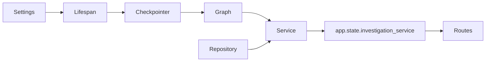

# 01 `main.py`：应用组合根

源码：[src/incident_copilot/main.py](../../../src/incident_copilot/main.py)

## 先看职责

这个文件不做故障诊断。它只完成三件事：读取配置、选择运行时 Adapter、把 Checkpointer、Graph、Repository 和 Service 组装进 FastAPI。后端工程里通常把这种入口称为 **composition root**。



## `_build_runtime_graph`

```python
if settings.metrics_backend is MetricsBackend.PROMETHEUS:
    return build_mixed_investigation_graph(
        metrics_provider=PrometheusMetricsProvider(
            settings.prometheus_base_url,
            timeout_seconds=settings.prometheus_timeout_seconds,
        ),
        checkpointer=checkpointer,
        require_human_review=True,
    )
return build_offline_investigation_graph(
    checkpointer=checkpointer,
    require_human_review=True,
)
```

逐行理解：

1. `is` 比较枚举成员，配置为 `PROMETHEUS` 时选择混合 Graph。
2. `PrometheusMetricsProvider(...)` 只构造 Adapter，不在启动时探测网络。
3. `checkpointer=checkpointer` 让编译后的 Graph 能按 `thread_id` 保存执行位置。
4. `require_human_review=True` 保证高风险建议进入 HITL。
5. 其他配置返回全 Fixture 的离线 Graph，测试和演示不需要付费 API。

解读卡片：

| 问题 | 答案 |
| --- | --- |
| 代码做什么 | 根据配置选择 Prometheus 指标或纯 Fixture Graph |
| 为什么这样写 | Adapter 选择集中在组合根，业务节点不感知环境 |
| 输入从哪里来 | `create_app` 解析后的 `Settings` 和 lifespan 打开的 saver |
| 输出到哪里去 | 返回 `InvestigationGraph`，随后注入 `InvestigationService` |
| State 如何变化 | 此处不读写 `InvestigationState`；只决定以后由哪个 Graph 处理 State |
| 下一节点如何确定 | 不在本文件决定；边由 `graph/builder.py` 注册 |
| Python 语法 | `*` 后参数只能以关键字传入；枚举用 `is` 比较 |
| 后端类比 | Spring Boot 的配置类或依赖注入容器装配 |
| 修改影响 | 启动期探测 Prometheus 会把数据源暂时故障升级为应用无法启动 |

## `create_app` 与 lifespan

```python
@asynccontextmanager
async def lifespan(application: FastAPI) -> AsyncIterator[None]:
    if investigation_service is not None:
        application.state.investigation_service = investigation_service
        try:
            yield
        finally:
            await investigation_service.aclose()
        return
    async with open_checkpointer(resolved_settings) as checkpointer:
        service = InvestigationService(
            graph=_build_runtime_graph(resolved_settings, checkpointer=checkpointer),
            repository=InMemoryInvestigationRepository(),
        )
        application.state.investigation_service = service
        try:
            yield
        finally:
            await service.aclose()
```

这里最重要的是 `yield`：它之前是启动阶段，之后是关闭阶段。`@asynccontextmanager` 把异步生成器包装成上下文管理器。

- 测试注入 Service 时，直接放入 `app.state`，仍统一回收后台任务。
- 正常路径中，`open_checkpointer` 必须包住应用整个生命周期。
- `finally` 即使应用异常退出也会调用 `aclose()`。
- Repository 当前是内存实现，所以任务和 SSE 历史并不会随 PostgreSQL checkpoint 一起持久化。

解读卡片：

| 问题 | 答案 |
| --- | --- |
| 输入 | 可选测试 Service，或由 Settings 构造的依赖 |
| 输出 | 写入 `application.state.investigation_service` |
| State | 不直接变化；Graph 执行时才创建和更新 State |
| 下一步 | FastAPI 启动完成后由 investigations 路由取出 Service |
| 类比 | 数据库连接池随 Web 应用启动打开、关机关闭 |
| 删除影响 | 去掉 lifespan 会泄漏后台 Task；提前关闭 saver 会使暂停/恢复失效 |

## 路由和默认 ASGI 对象

```python
app.include_router(health_router)
app.include_router(investigations_router, prefix=resolved_settings.api_prefix)
return app

app = create_app()
```

模块级 `app` 是 `uvicorn incident_copilot.main:app` 查找的 ASGI 对象。`include_router` 只注册协议入口，不启动 Graph。

删除 `app = create_app()` 后，当前 README 中的 Uvicorn 命令会导入失败；修改 API prefix 会同时影响 Location 响应头和所有客户端路径。

下一篇：[调查 API](02-investigation-api.md)。
