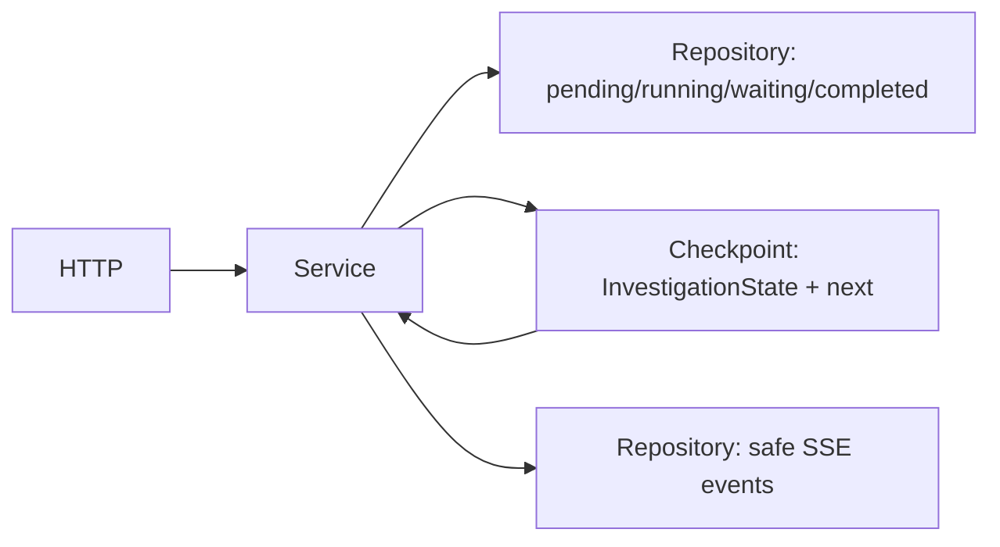

# 03 `service.py`：任务生命周期与 Graph 桥梁

源码：[src/incident_copilot/investigations/service.py](../../../src/incident_copilot/investigations/service.py)

## 三种状态不要混淆



- Repository 状态回答“任务现在对客户端是什么状态”。
- Graph State 回答“调查有哪些证据、预算以及下一个节点”。
- SSE Event 是对 Graph 增量的脱敏投影。

## `create`：幂等创建和后台执行

```python
stored, created = await self._repository.create(record)
if not created:
    return stored, False
await self._append_event(stored, EventType.INVESTIGATION_QUEUED, {"status": "pending"})
self._start_task(stored.investigation_id, self._run_initial(stored.investigation_id))
return stored, True
```

Repository 原子判断幂等键和指纹。只有新记录写 queued 事件并创建 `asyncio.Task`。输入来自 API 的 Incident、Options 和幂等信息，输出回 API；此刻 Graph State 尚未创建。删除 `if not created` 会让同一请求重复执行。

Python 重点：`tuple[InvestigationRecord, bool]` 同时返回值与创建标志；`asyncio.create_task` 把协程调度到同一事件循环，类似轻量后台 job，但不是分布式任务队列。

## `_run_initial`：构造首个 State

```python
initial = create_initial_state(
    running.incident, options=running.options, clock=self._clock
)
await self._execute(investigation_id, initial)
```

这两行把任务状态机交接给 Graph。`create_initial_state` 写入 `incident`、计数器、预算和 deadline；`_execute` 使用同一 `thread_id` 运行。下一节点由 Builder 中 `START -> parse_incident` 决定。

若初始化异常，Service 调 `_mark_failed`，不会伪造 completed。这里捕获后端依赖错误，但 `CancelledError` 必须继续抛出，让应用关闭可以取消任务。

## `resume`：只认领一次暂停点

```python
lock = self._locks.setdefault(investigation_id, asyncio.Lock())
async with lock:
    record = await self.get(investigation_id)
    if record.status is not InvestigationStatus.WAITING_REVIEW:
        raise ResourceConflictError(...)
    config = self._config(record.thread_id)
    snapshot = await self._graph.aget_state(config)
    state = cast(InvestigationState, snapshot.values)
    if feedback.action is ReviewAction.REQUEST_MORE_RESEARCH:
        self._ensure_research_budget(state)
```

逐行理解：

1. `setdefault` 为每个调查复用同一个进程内锁。
2. `async with` 保证并发恢复请求串行进入临界区。
3. 只有 `waiting_review` 能被认领，第二个请求得到 409。
4. `thread_id` 读取准确 checkpoint，而不是使用客户端提交的 State。
5. 追加研究先检查轮数、工具、模型和 Token 预算。

```python
command: Command[Any] = Command(
    resume=feedback.model_dump(mode="json"),
    update=update,
)
self._start_task(
    investigation_id,
    self._execute(investigation_id, command),
)
```

`Command.resume` 的值会成为 `interrupt()` 的返回值；追加研究还刷新 deadline。State 在恢复时由 `human_review` 写入 `human_feedback`，然后条件边按 action 选择 `refine` 或 `END`。删除锁会产生双重认领；换一个 `thread_id` 会启动新工作流而不是恢复原暂停点。

## `_execute`：流式运行、暂停或完成

```python
async for update in self._graph.astream(
    graph_input,
    config,
    stream_mode="updates",
):
    if isinstance(update, Mapping):
        await self._project_graph_update(record, cast(Mapping[object, object], update))
```

`async for` 逐个消费节点更新。`stream_mode="updates"` 返回最小增量，而非每次复制完整 State。输入既可能是初始 `InvestigationState`，也可能是恢复 `Command`；输出先进入事件投影。

```python
snapshot = await self._graph.aget_state(config)
interrupt_value = self._interrupt_value(snapshot.tasks)
values = cast(InvestigationState, snapshot.values)
report = values.get("final_report")
```

流结束不一定代表 Graph 到 `END`，也可能代表 `interrupt`。所以必须读取快照的 tasks 和 values：

- 有 interrupt：Repository 写 `WAITING_REVIEW`，保存 `review_request`。
- 无 interrupt 且有报告：写 `COMPLETED`。
- 无报告：抛错并进入 failed，防止假成功。

Graph 的下一节点仍由 checkpoint 中的 `next` 和 Builder 边决定，Service 不重算路由。

## `_project_graph_update`：State 增量到安全事件

```python
for step in self._models(node_update.get("completed_steps"), StepResult):
    ...
for evidence in self._models(node_update.get("evidence"), EvidenceRef):
    ...
if "hypotheses" in node_update:
    ...
if budget_keys.intersection(node_update):
    ...
```

这不是再次修改 Graph State，而是观察更新中的允许字段：Step 变成 tool 事件，EvidenceRef 变成 evidence 事件，Hypothesis 只输出数量，预算只输出发生更新的节点。完整 prompt、秘密和原始大对象不会进入 SSE。

后端类比是把领域事件投影为 read model。删除字段白名单而直接序列化 State，可能泄漏工具参数和内部模型上下文。

## `_config` 和预算门禁

```python
return {"configurable": {"thread_id": thread_id}}
```

这是 LangGraph saver 查找 checkpoint 的稳定键。`run_id` 每次恢复会变化，不能代替 `thread_id`。

`_ensure_research_budget` 使用确定性计数器，而不是询问模型“还能不能继续”。修改其中任一比较符会改变边界行为；例如把 `>=` 改成 `>` 会允许多执行一次。

## 九问总结

| 问题 | 答案 |
| --- | --- |
| 做什么 | 协调任务状态、后台 Task、checkpoint 恢复和 SSE 投影 |
| 为什么 | HTTP 生命周期与 Graph 生命周期不同，需要应用服务连接 |
| 输入 | API DTO、Repository 记录、Graph update/snapshot |
| 输出 | Repository 状态与事件、Graph 初始 State 或 resume Command |
| State | 初次构造；恢复时写反馈/deadline；节点实际更新由 Graph 完成 |
| 下一节点 | Service 不决定，读取并继续 checkpoint 中的 Graph 路由 |
| Python | async/await、Task、Lock、Mapping、cast、model_copy |
| 类比 | 任务编排 Application Service + Outbox/read-model projector |
| 修改风险 | 锁、thread_id、预算或投影边界错误会造成重复执行、串线或泄密 |

下一篇：[Checkpoint](04-checkpoint.md)。
