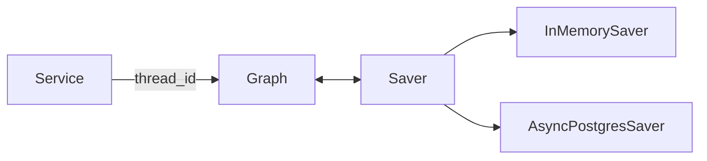

# 04 `checkpoint.py`：可恢复执行资源

源码：[src/incident_copilot/investigations/checkpoint.py](../../../src/incident_copilot/investigations/checkpoint.py)

## Checkpointer 保存什么

它保存 LangGraph 的 State、待执行位置和 interrupt 信息，并用 `thread_id` 区分工作流。它不保存 Investigation API 记录和 SSE 历史。



## `open_checkpointer`

```python
@asynccontextmanager
async def open_checkpointer(
    settings: Settings,
) -> AsyncIterator[BaseCheckpointSaver[str]]:
    if settings.checkpoint_backend is CheckpointBackend.MEMORY:
        yield InMemorySaver()
        return
```

逐行理解：

1. `@asynccontextmanager` 把带 `yield` 的异步生成器变成 `async with` 可用资源。
2. 返回类型声明调用方在上下文内获得统一 Saver 端口。
3. Memory 分支无需网络，适合默认测试。
4. `return` 阻止执行继续落入 PostgreSQL 分支。

此函数不直接读写 InvestigationState；Graph 编译和运行后才通过 saver 写 State。下一节点信息也由 LangGraph 存入 checkpoint，而不是这里计算。

## PostgreSQL 分支

```python
if settings.postgres_dsn is None:
    raise ConfigurationError("PostgreSQL checkpoint backend requires postgres_dsn")
try:
    module = importlib.import_module("langgraph.checkpoint.postgres.aio")
except ImportError as exc:
    raise ConfigurationError(
        "PostgreSQL checkpoint backend requires the 'postgres' project extra"
    ) from exc
```

只有显式选择 PostgreSQL 时才动态导入可选依赖。`raise ... from exc` 保留异常原因链，既给用户可理解配置错误，也方便日志定位原始 ImportError。

```python
saver_type = cast(Any, module).AsyncPostgresSaver
manager = saver_type.from_conn_string(settings.postgres_dsn.get_secret_value())
async with manager as saver:
    await saver.setup()
    yield cast(BaseCheckpointSaver[str], saver)
```

- `get_secret_value()` 只在建立连接的边界解包 Secret，不输出日志。
- `async with` 负责连接资源的打开和关闭。
- `setup()` 创建 saver 自己的表，不创建项目业务表。
- `cast` 只帮助静态类型检查，不会在运行时转换对象。

## 九问总结

| 问题 | 答案 |
| --- | --- |
| 代码做什么 | 按配置打开内存或 PostgreSQL saver |
| 为什么这样写 | 默认零依赖，可选生产式恢复，生命周期统一 |
| 输入来源 | `main.create_app` 解析的 Settings |
| 输出去向 | 交给 Graph Builder 的 `checkpointer` 参数 |
| State 变化 | 本函数无直接变化；Saver 持久化 Graph 随后产生的 State |
| 下一节点 | Saver记录执行位置；路由仍由 Graph conditional edge 决定 |
| Python 语法 | async context manager、动态导入、异常链、Protocol 型基类 |
| 后端类比 | 可切换的 Session/transaction resource factory |
| 删除或修改影响 | saver 生命周期太短会导致恢复失败；误把 run_id 当 thread_id 会找不到历史 |

下一篇：[Graph State](05-graph-state.md)。
