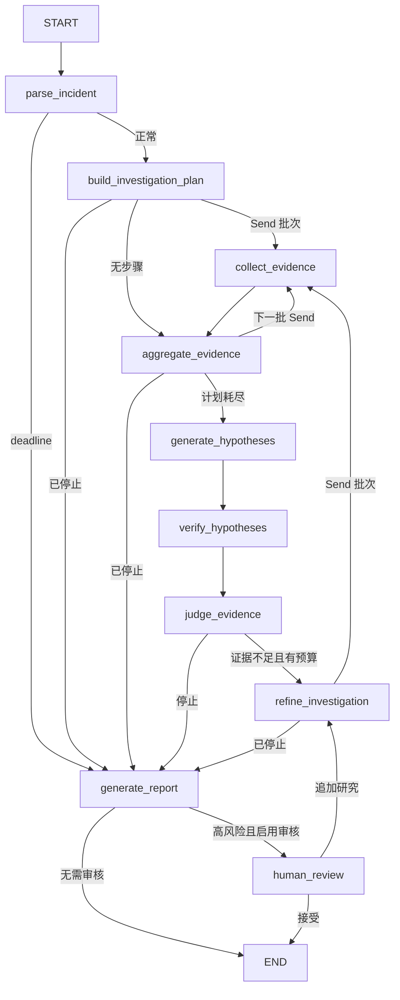

# 06 `builder.py`：真实 Graph、边与并行分发

源码：[src/incident_copilot/graph/builder.py](../../../src/incident_copilot/graph/builder.py)

## 当前源码的完整 Graph



## `create_initial_state`

```python
policy = options or InvestigationOptions()
started_at = clock()
return InvestigationState(
    incident=incident,
    research_round=1,
    max_tool_calls=policy.max_tool_calls,
    max_parallel_tools=policy.max_parallel_tools,
    model_usage=ModelUsage(),
    deadline_at=started_at + timedelta(seconds=policy.timeout_seconds),
    errors=(),
)
```

它把 API 已校验 Incident 和 Options 转成完整初值。时钟可注入使 deadline 测试确定。State 从这里开始存在；下一节点固定是 `parse_incident`。若省略 reducer 字段的零值，后续合并语义更难推理；若使用模型输出覆盖预算，就失去安全边界。

## `dispatch_evidence_collection`、`dispatch_after_aggregate` 与 `_dispatch_batch`

`dispatch_evidence_collection` 是 plan/refine 后的入口：已有 `stop_reason` 时直接去报告，否则调用 `_dispatch_batch(..., empty_target="aggregate_evidence")`。`dispatch_after_aggregate` 是批次 barrier 后的入口：仍有步骤就继续发 Send，计划耗尽时以 `generate_hypotheses` 为 empty target。两者复用下面的预算预留逻辑。

```python
remaining = max(0, state["max_tool_calls"] - state.get("tool_call_count", 0))
limit = min(remaining, state["max_parallel_tools"])
completed_queries = {item.query_key for item in state.get("completed_steps", ())}
```

逐行解释：

1. 剩余工具数不会小于零。
2. 批次大小同时受全局余额和并发上限约束。
3. 已完成 `query_key` 用于过滤 checkpoint 重放和跨轮重复查询。

```python
candidates = sorted(
    (
        step
        for step in state.get("pending_steps", ())
        if step.query_key not in completed_queries
    ),
    key=lambda step: (-step.priority, step.step_id),
)
selected = candidates[:limit]
if not selected:
    return empty_target
```

生成器表达式避免先构造中间列表；负 priority 实现降序，再用 ID 保证稳定顺序。没有候选时返回调用方指定的汇合/推理目标。若把预算检查放入每个分支，分支会同时看到相同余额并越界。

## `Send` 的最小 scoped State

```python
return [
    Send(
        "collect_evidence",
        {
            "incident": state["incident"],
            "current_step": step,
            "deadline_at": state["deadline_at"],
        },
    )
    for step in selected
]
```

每个 Send 都调用同一个通用 Node，但携带不同 `current_step`。输入来自 plan 的 pending steps，输出是运行时分发指令，不直接修改 State。各分支完成后，Reducer 合并 `completed_steps/evidence/errors/counts`，再进入 `aggregate_evidence`。

后端类比是把一个批处理拆成多个带最小消息体的 worker job，然后在 barrier 汇合。复制完整证据历史会放大 checkpoint 和序列化成本。

## `build_investigation_graph`：节点注册与普通边

```python
builder = StateGraph(InvestigationState)
builder.add_node("parse_incident", nodes.parse_incident)
...
builder.add_edge(START, "parse_incident")
builder.add_edge("collect_evidence", "aggregate_evidence")
builder.add_edge("generate_hypotheses", "verify_hypotheses")
```

字符串名称是 streaming、测试和 Mermaid 共用的稳定标识。普通边表示目标固定；conditional edge 表示由纯函数选择。改名必须同时更新 path map、事件消费者、测试和文档。

## Conditional Edge

```python
builder.add_conditional_edges(
    "judge_evidence",
    route_after_judge,
    path_map={
        "refine_investigation": "refine_investigation",
        "generate_report": "generate_report",
    },
)
```

`route_after_judge` 只可能返回白名单中的两个名字。模型没有返回任意节点名的权限。State 在路由函数中不变化；下一节点由充分性、轮次和硬预算决定。

## Checkpoint 与 HITL 编译

```python
if require_human_review:
    builder.add_node(
        "human_review",
        nodes.human_review,
        destinations=("refine_investigation", END),
    )
...
return builder.compile(checkpointer=checkpointer, name=...)
```

`destinations` 声明 `Command.goto` 的合法目标。Checkpointer 在编译时注入，而稳定 `thread_id` 在每次 invoke 配置中传入。只添加 human_review 而不配置 saver，单次内存调用可以暂停，但跨请求可靠恢复没有保障。

## 九问总结

| 问题 | 答案 |
| --- | --- |
| 做什么 | 注册真实 Node、Edge、Send 分发和 saver |
| 为什么 | 控制流集中、可画图、可测试、模型不可越权 |
| 输入 | Registry、ModelProvider、Clock、Checkpointer |
| 输出 | 编译后的 `InvestigationGraph` |
| State | 初始化 State；Send 触发分支增量并由 reducer 汇合 |
| 下一节点 | 普通边、conditional edge 或 Command.goto |
| Python | overload、Literal、list comprehension、泛型别名 |
| 类比 | 有状态 DAG 编排器 + 有界 worker fan-out |
| 修改风险 | 分发前不预留预算会超额；错连边会跳过验证或形成无限循环 |

下一篇：[Graph Nodes](07-graph-nodes.md)。
