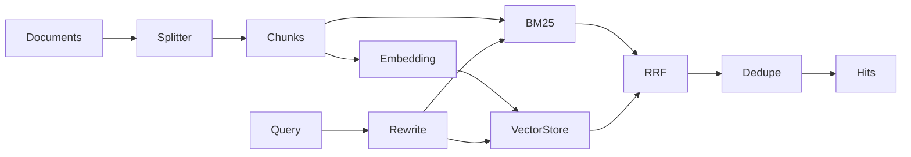

# 11 `retrieval.py`：幂等索引与 Hybrid Search

源码：[src/incident_copilot/rag/retrieval.py](../../../src/incident_copilot/rag/retrieval.py)

## 组件关系



Retriever 不直接修改 Graph State。它返回 `RetrievalResult`，当前用于知识工具和 Evaluation；工具路径再把检索命中转换为 Evidence。

## `ingest`：先准备，后替换

```python
new_chunks = self._splitter.split_documents(tuple(documents))
embeddings = self._embedding.embed_many([chunk.text for chunk in new_chunks])
embedded_records = tuple(
    EmbeddedChunk(...)
    for chunk, vector in zip(new_chunks, embeddings, strict=True)
)
```

文档先切分并全部 embedding。`zip(..., strict=True)` 在长度不等时抛错，防止 chunk 与向量静默错位。FakeEmbedding 默认确定且离线。

```python
updated_chunks = {
    chunk_id: chunk
    for chunk_id, chunk in self._chunks.items()
    if chunk.document_id not in document_ids
}
...
self._vector_store.replace_documents(document_ids, embedded_records)
self._lexical_index.rebuild(all_chunks)
self._documents = updated_documents
self._chunks = updated_chunks
```

同 document ID 的旧 chunks 全部移除，新记录准备完后才替换 store 和内存视图。输入来自 loader 的 `KnowledgeDocument`，输出 `IngestResult`。这是按 document ID 的幂等覆盖，类似数据库“先构造新版本再提交”。若只 upsert 新 chunk 不删旧版本，搜索会返回过期内容。

## `search`：rewrite 和两路召回

```python
rewritten = self._rewriter.rewrite(request.query)
candidate_k = min(200, max(request.top_k * self._candidate_multiplier, 20))
lexical = self._lexical_index.search(
    rewritten,
    top_k=candidate_k,
    metadata_filter=request.metadata_filter,
)
query_embedding = self._embedding.embed(rewritten)
vector = self._vector_store.search(...)
```

原 query 被保留，rewrite 增加规范别名。两路使用同一 rewritten query 和同一 metadata filter。先扩大候选池，融合后仍裁剪到 top_k；上限 200 防止请求放大。

## RRF 逐行解释

```python
for source_name, candidates in (("bm25", lexical), ("vector", vector)):
    for rank, candidate in enumerate(candidates, start=1):
        chunk_id = candidate.chunk.chunk_id
        fused_scores[chunk_id] += 1.0 / (self._rrf_k + rank)
        sources[chunk_id].add(source_name)
        chunks[chunk_id] = candidate.chunk
```

BM25 与 cosine 分数不在同一量纲，所以只使用排名。`defaultdict` 自动提供 0 分和空集合；`enumerate(start=1)` 让第一名贡献 `1/(k+1)`。两路都命中的 chunk 获得两次贡献。

若直接相加原始分数，某一检索器会因量纲而支配结果。修改 `rrf_k` 会改变头部排名权重，应通过 Evaluation 回归验证。

## 稳定排序、内容去重、Citation 保留

```python
ordered_ids = sorted(fused_scores, key=lambda item: (-fused_scores[item], item))
...
content_hash = chunks[chunk_id].content_hash
if content_hash in seen_hashes:
    continue
```

同分以 chunk ID 打破平局，使结果可复现。不同 ID 但相同正文只保留排名更高者。`SearchHit.chunk` 是原始 KnowledgeChunk，因此 metadata、section 和 Citation 原样保留，不由检索器重建。

输出还包含 original/rewritten query、索引规模和检索时间。它没有“下一 Graph 节点”；调用它的 Tool 完成后由 collect → aggregate 推进。

## 九问总结

| 问题 | 答案 |
| --- | --- |
| 做什么 | 索引文档并执行 BM25 + vector + RRF |
| 为什么 | 同时覆盖精确词和语义近似，默认离线可复现 |
| 输入 | KnowledgeDocument 或 SearchQuery |
| 输出 | IngestResult 或 citation-preserving RetrievalResult |
| State | 不直接变；知识 Tool 可把命中转为 Evidence |
| 下一节点 | Retriever 不路由；Tool 所在 collect 分支去 aggregate |
| Python | Sequence、zip strict、defaultdict、comprehension、稳定 sort |
| 类比 | 搜索服务的双索引写入和 federated ranking |
| 修改风险 | 不删除旧 chunk 会污染索引；不统一 filter 会产生越界召回 |

下一篇：[OfflineEvaluationRunner](12-evaluation-runner.md)。
