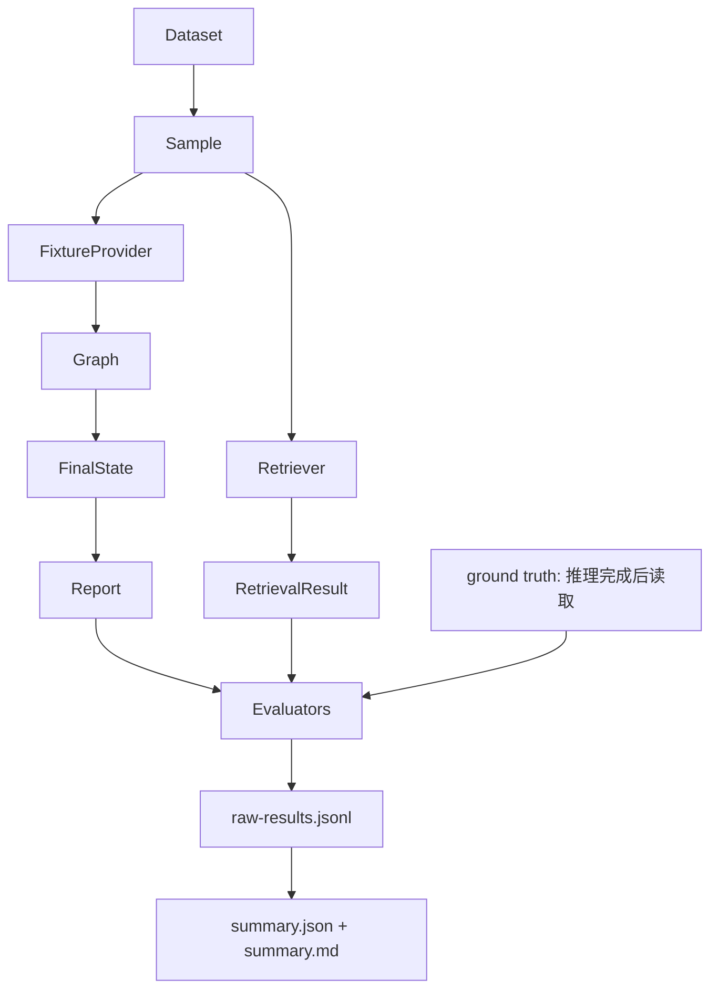

# 12 `runner.py`：离线 Evaluation 编排

源码：[src/incident_copilot/evaluation/runner.py](../../../src/incident_copilot/evaluation/runner.py)

## 真实数据流



## `run`：失败也进入分母

```python
for sample in dataset.samples:
    try:
        result = await self._run_sample(sample, retriever=retriever, run_id=run_id)
    except Exception as exc:
        result = EvaluationSampleResult(
            sample_id=sample.sample_id,
            status=SampleStatus.FAILED,
            error=f"{type(exc).__name__}: {exc}",
        )
    results.append(result)
```

样例顺序执行，便于复现和读取原始轨迹。单样例异常转成 FAILED 数据，不能被静默排除。这里宽捕获是 Evaluation 边界的刻意设计，并保留异常类型/消息；不是业务代码吞异常。

Runner 不直接改变 Graph State；它构造初值、等待 Graph 返回最终 State，再读取计数和报告。Graph 下一节点完全按 Builder 执行。

## 原始结果先落盘

```python
raw_path.write_text(
    "".join(
        json.dumps(result.model_dump(mode="json"), ensure_ascii=False, sort_keys=True) + "\n"
        for result in results
    ),
    encoding="utf-8",
)
```

每行一个完整 JSON 结果，`sort_keys=True` 便于 diff。随后才聚合并写 summary JSON/Markdown。输入是所有完成/失败结果，输出到调用者指定目录。删除 raw 文件会让平均指标无法追溯具体错误样例。

## `_run_sample`：先无标签推理，后评分

```python
incident = fixture_provider.fixture.incident
retrieval = retriever.search(
    SearchQuery(
        query=sample.retrieval_query,
        top_k=sample.retrieval_top_k,
        metadata_filter=MetadataFilter(services=incident.services),
    )
)
```

Filter 来自事故输入，而非 `ground_truth.affected_services`。否则答案服务会泄漏给检索器。

```python
state = cast(
    InvestigationState,
    await graph.ainvoke(
        create_initial_state(incident),
        config={
            "run_name": f"offline-evaluation:{sample.sample_id}",
            "tags": ["offline-evaluation", dataset_tag(run_id)],
            "metadata": {"dataset_ground_truth_exposed": False, ...},
        },
    ),
)
```

输入只有 Fixture Incident、离线 Provider/Fake Model 和运行 metadata。`cast` 不改变运行值，只告诉 mypy 这是最终 State。Graph 从 parse 一直执行到 report/END；Evaluation 不插手下一节点。

```python
report = state["final_report"]
    # 从这里开始才读取 ground truth 计算质量指标
actual_calls = self._actual_tool_calls(state)
root_recall = root_cause_term_recall(
    report.root_cause, sample.ground_truth.root_cause_terms
)
```

标签只在 Graph 完整结束后进入纯 evaluator。这个顺序是防止硬编码好看结果的关键。

## 评价内容

| 结果字段 | 实际来源 |
| --- | --- |
| 服务定位/故障类型 | IncidentReport 与标签比较 |
| Recall@K/MRR | Hybrid retrieval 排名 |
| 工具选择/参数 | `completed_steps` 重建的真实调用 |
| Evidence relevance | 报告 supporting Evidence ID |
| Citation correctness | 报告 Citation 与 EvidenceRef 一致性 |
| 根因准确 | 版本化词项 recall 达阈值 0.75 |
| 轮数/工具/Token | `investigation_stats` |
| 延迟 | 当前进程 `perf_counter` wall-clock |

`_actual_tool_calls` 从所有 `completed_steps` 重建跨轮记录，而不是只看最后 plan。若改看 pending steps，会评估“计划调用”而不是真实执行。

## 可选 LangSmith

```python
if self._enable_langsmith:
    ...
return tracing_context(
    enabled=self._enable_langsmith,
    project_name=self._project_name if self._enable_langsmith else None,
)
```

默认关闭，环境中即使安装 SDK 也不自动联网；显式启用但 SDK 不存在时清晰失败。删除显式开关可能让离线评估意外发送 trace。

## 九问总结

| 问题 | 答案 |
| --- | --- |
| 做什么 | 运行版本化样例，输出逐样例和聚合评估 |
| 为什么 | 让质量、资源与失败都可复现、可审计 |
| 输入 | EvaluationDataset、输出目录、可选 tracing |
| 输出 | raw JSONL、summary JSON/Markdown、EvaluationSummary |
| State | 不写 Node State；读取 Graph 最终 State 做评分 |
| 下一节点 | Evaluation 不控制 Graph 路由 |
| Python | async loop、Path、context manager、generator、cast |
| 类比 | 离线 ML test harness + regression report generator |
| 修改风险 | 标签提前进入 filter/context 会数据泄漏；丢弃失败会选择偏差 |

返回[核心源码阅读索引](../core-reading-index.md)或[学习中心](../README.md)。
